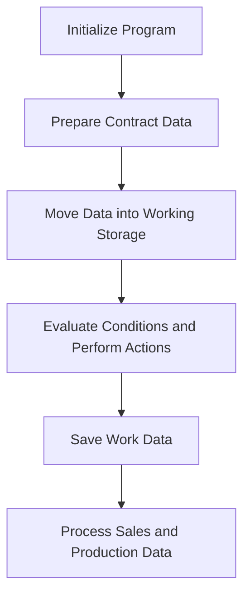

This document will cover the COP104 Program, which includes:

1. Initializing the program
2. Preparing contract data
3. Moving data into working storage
4. Evaluating conditions and performing actions
5. Saving work data
6. Processing sales and production data.

Technical document: <SwmLink doc-title="Overview of COP104 Program">[Overview of COP104 Program](/.swm/overview-of-cop104-program.uhyklu9x.sw.md)</SwmLink>

# Initializing the Program

The COP104 program begins by initializing the system. This involves setting up necessary parameters and configurations to ensure the program runs smoothly. User input is accepted at this stage to customize the program's behavior based on specific needs. This step is crucial as it sets the foundation for all subsequent operations.

# Preparing Contract Data

In the PREV-CONTRATO section, the program prepares contract data. This involves moving date values into working storage and reading records from the COD040 file. The program processes each record until a specific condition is met, ensuring that all contract data is correctly initialized and ready for further processing. This step is essential for accurate contract management.

# Moving Data into Working Storage

The MOVER-DADOS-WORK section handles the movement of data into working storage. This involves initializing the REG-WORK structure and reading various records to populate the working storage with relevant data. This step ensures that all necessary data is available for subsequent operations, which is critical for the program's overall functionality.

# Evaluating Conditions and Performing Actions

In the CORPO-PROGRAMA section, the program evaluates various conditions and performs corresponding actions. It uses the EVALUATE statement to check different flags and execute specific routines such as CENTRALIZAR, VERIFICAR-SENHA-STATUS, and GRAVA-WORK. This section ensures that the appropriate processes are triggered based on the current state of the system, maintaining the program's logical flow.

# Saving Work Data

The GRAVA-WORK section is responsible for preparing and saving work data. It checks the status of the work file, performs necessary file operations, and evaluates the GS-OP-FILTRO to determine which subsequent process to execute, such as DATA-VENDA-PRODUCAO or PREV-CONTRATO. This step is crucial for data integrity and ensuring that all work data is correctly saved.

# Processing Sales and Production Data

The DATA-VENDA-PRODUCAO section processes sales and production data. It initializes records, performs date conversions, and evaluates the GS-OP-DATA to execute specific routines like POR-VENDA or POR-PRODUCAO. This section also handles reading and writing to auxiliary files, calculating various metrics, and updating records based on the processed data. This step is vital for accurate sales and production reporting.

&nbsp;

*This is an auto-generated document by Swimm AI 🌊 and has not yet been verified by a human*

<SwmMeta version="3.0.0" repo-id="Z2l0aHViJTNBJTNBa2VsbG8lM0ElM0Fzd2ltbWlv" repo-name="kello">Powered by [Swimm](/)</SwmMeta>
