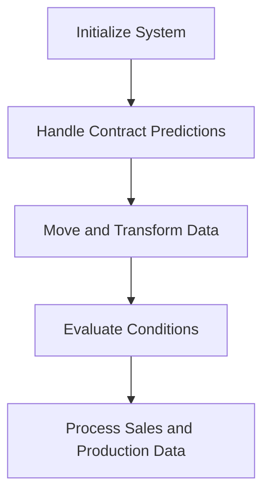

This document will cover the COP104 program, which includes:

1. Initializing the system
2. Handling contract predictions
3. Moving and transforming data
4. Evaluating conditions
5. Processing sales and production data.

Technical document: <SwmLink doc-title="Overview of COP104 Program">[Overview of COP104 Program](/.swm/overview-of-cop104-program.jdy7nxxs.sw.md)</SwmLink>

# Initializing the System

The COP104 program begins by initializing the system. This involves setting up necessary parameters and preparing the environment for subsequent operations. This step ensures that all required configurations are in place before any data processing begins.

# Handling Contract Predictions

The program processes contract data to predict future contract statuses. It updates the status of contracts based on their timelines, ensuring that the system has up-to-date information on all contracts. This step is crucial for accurate forecasting and planning.

# Moving and Transforming Data

Data is moved and transformed into the work register to ensure consistency. This involves various calculations and updates to records. The goal is to prepare the data for further processing by ensuring it is in the correct format and location.

# Evaluating Conditions

The program evaluates several conditions to determine which operations to execute. It checks flags such as GS-CENTRALIZA-TRUE, GS-PRINTER-FLG-TRUE, and GS-GRAVA-WORK-FLG-TRUE. Depending on these flags, the program may centralize data, print reports, or save work data. This step ensures that only relevant operations are performed, optimizing system performance.

# Processing Sales and Production Data

Finally, the program processes sales and production data. This involves initializing records, setting date ranges, and performing various calculations and data movements. The goal is to prepare the sales and production data for further processing, ensuring that all necessary information is accurately captured and ready for use.

&nbsp;

*This is an auto-generated document by Swimm AI 🌊 and has not yet been verified by a human*

<SwmMeta version="3.0.0" repo-id="Z2l0aHViJTNBJTNBa2VsbG8lM0ElM0Fzd2ltbWlv" repo-name="kello">Powered by [Swimm](/)</SwmMeta>
