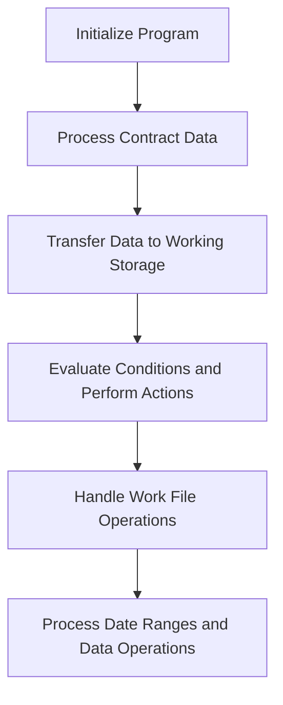

This document will cover the COP104 Program, which includes:

1. Initializing the program
2. Processing contract data
3. Transferring data to working storage
4. Evaluating conditions and performing actions
5. Handling work file operations
6. Processing date ranges and data operations.

Technical document: <SwmLink doc-title="Overview of COP104 Program">[Overview of COP104 Program](/.swm/overview-of-cop104-program.256cr9d0.sw.md)</SwmLink>

# Initializing the Program

The COP104 program begins by setting up the necessary parameters and initializing the program. This is the starting point where the system prepares itself for the subsequent operations. It ensures that all initial settings are correctly configured to avoid any issues during the execution of the program.

# Processing Contract Data

In this step, the program processes contract data by moving initial and final month-year values and iterating through records to update contract information. This ensures that all contract data is correctly prepared for further processing. For example, it updates the contract number and other relevant details to ensure accuracy.

# Transferring Data to Working Storage

The program transfers data to the working storage area. This involves initializing the working storage, searching for status, and moving various pieces of data such as city, region, and representative information. This step is crucial for preparing the data for subsequent operations, ensuring that all necessary information is readily available.

# Evaluating Conditions and Performing Actions

The program evaluates various conditions and performs corresponding actions. For example, if a certain flag is true, it displays a message asking for confirmation to load data. Upon confirmation, it performs the necessary actions such as loading data, resetting variables, and updating lists. This step ensures that the program responds correctly to different scenarios.

# Handling Work File Operations

This step involves handling work file operations. The program checks the status of the work file, performs operations like closing, deleting, and reopening the file, and then evaluates certain conditions to decide the next steps. This ensures that the work file is correctly managed and that data operations are performed efficiently.

# Processing Date Ranges and Data Operations

In this final step, the program processes date ranges and performs various data operations based on specific criteria. It reads and processes records from auxiliary files, calculates values, and writes the results to the work file. This ensures that all data is correctly processed and stored, providing accurate and up-to-date information.

&nbsp;

*This is an auto-generated document by Swimm AI 🌊 and has not yet been verified by a human*

<SwmMeta version="3.0.0" repo-id="Z2l0aHViJTNBJTNBa2VsbG8lM0ElM0Fzd2ltbWlv" repo-name="kello">Powered by [Swimm](/)</SwmMeta>
