This document provides an overview of the <SwmToken path="src/cop/Cópia (2) de cop104.cbl" pos="3:6:6" line-data="       PROGRAM-ID. COP104.">`COP104`</SwmToken> program, which is a COBOL-85 application designed to manage business operations. The program initializes, processes contract data, moves data to working storage, and handles various operations related to contracts and sales.

The <SwmToken path="src/cop/Cópia (2) de cop104.cbl" pos="3:6:6" line-data="       PROGRAM-ID. COP104.">`COP104`</SwmToken> program starts by initializing and setting up the main processing loop. It processes contract data by reading records and performing operations until certain conditions are met. The program then moves data to working storage, performs calculations, and updates fields. Finally, it saves the work data and handles sales and production data by processing date ranges, calculating commissions, and writing the final work record.

Here is a high level diagram of the flow, showing only the most important functions:


# Flow drill down

First, we'll zoom into this section of the flow:


<SwmSnippet path="/src/cop/Cópia (2) de cop104.cbl" line="640">

---

## <SwmToken path="src/cop/Cópia (2) de cop104.cbl" pos="3:6:6" line-data="       PROGRAM-ID. COP104.">`COP104`</SwmToken>

The <SwmToken path="src/cop/Cópia (2) de cop104.cbl" pos="3:6:6" line-data="       PROGRAM-ID. COP104.">`COP104`</SwmToken> function initializes the program and sets up the main processing loop. It starts by performing the <SwmToken path="src/cop/Cópia (2) de cop104.cbl" pos="641:3:5" line-data="           PERFORM INICIALIZA-PROGRAMA.">`INICIALIZA-PROGRAMA`</SwmToken> section, which accepts parameters from the command line.

```cobol
       MAIN-PROCESS SECTION.
           PERFORM INICIALIZA-PROGRAMA.
           PERFORM CORPO-PROGRAMA UNTIL GS-EXIT-FLG-TRUE.
           GO FINALIZAR-PROGRAMA.

       INICIALIZA-PROGRAMA SECTION.
```

---

</SwmSnippet>

<SwmSnippet path="/src/cop/Cópia (2) de cop104.cbl" line="1212">

---

## <SwmToken path="src/cop/Cópia (2) de cop104.cbl" pos="1212:1:3" line-data="       PREV-CONTRATO SECTION.">`PREV-CONTRATO`</SwmToken>

The <SwmToken path="src/cop/Cópia (2) de cop104.cbl" pos="1212:1:3" line-data="       PREV-CONTRATO SECTION.">`PREV-CONTRATO`</SwmToken> function processes contract data. It moves date values into working storage, starts reading records from the <SwmToken path="src/cop/Cópia (2) de cop104.cbl" pos="1225:3:3" line-data="           START COD040 KEY IS NOT &lt; ALT1-CO40 INVALID KEY">`COD040`</SwmToken> file, and performs operations until a specific condition is met. If certain conditions are satisfied, it calls the <SwmToken path="src/cop/Cópia (2) de cop104.cbl" pos="1245:1:5" line-data="       MOVER-DADOS-WORK SECTION.">`MOVER-DADOS-WORK`</SwmToken> function.

```cobol
       PREV-CONTRATO SECTION.
           MOVE GS-MESANO-INI  TO MESANO-W
           MOVE MESANO-W(1: 2) TO MESANO-I(5: 2)
           MOVE MESANO-W(3: 4) TO MESANO-I(1: 4)
           MOVE MESANO-I       TO MESANO-INI
           MOVE GS-MESANO-FIM  TO MESANO-W
           MOVE MESANO-W(1: 2) TO MESANO-I(5: 2)
           MOVE MESANO-W(3: 4) TO MESANO-I(1: 4)
           MOVE MESANO-I       TO MESANO-FIM


           MOVE MESANO-INI     TO MESANO-PREV-CO40
           MOVE ZEROS          TO NR-CONTRATO-CO40
           START COD040 KEY IS NOT < ALT1-CO40 INVALID KEY
                 MOVE "10" TO ST-COD040.

           PERFORM UNTIL ST-COD040 = "10"
                 READ COD040 NEXT RECORD AT END
                      MOVE "10" TO ST-COD040
                 NOT AT END
                      MOVE NR-CONTRATO-CO40 TO GS-EXIBE-CONTRATO
```

---

</SwmSnippet>

<SwmSnippet path="/src/cop/Cópia (2) de cop104.cbl" line="1245">

---

## <SwmToken path="src/cop/Cópia (2) de cop104.cbl" pos="1245:1:5" line-data="       MOVER-DADOS-WORK SECTION.">`MOVER-DADOS-WORK`</SwmToken>

The <SwmToken path="src/cop/Cópia (2) de cop104.cbl" pos="1245:1:5" line-data="       MOVER-DADOS-WORK SECTION.">`MOVER-DADOS-WORK`</SwmToken> function initializes the working storage and performs various data movements and calculations. It reads records from multiple files, updates working storage fields, and performs computations related to commissions, dates, and other contract-related data. Finally, it writes the updated data back to the working storage.

```cobol
       MOVER-DADOS-WORK SECTION.
           INITIALIZE REG-WORK.
      *    IF STATUS-CO40 < 50
      *       CONTINUE
      *    ELSE
              PERFORM PESQUISAR-STATUS
              IF ACHEI = "S"
                 MOVE CIDADE-CO40        TO CIDADE
                 READ CAD010 INVALID KEY
                      MOVE SPACES TO NOME-CID
                      MOVE SPACES TO UF-CID
                      MOVE ZEROS  TO REGIAO-CID
                 END-READ
                 IF GS-UF = SPACES OR UF-CID
                    IF GS-REGIAO = ZEROS OR REGIAO-CID
                       MOVE MESANO-PREV-CO40   TO MESANO-WK
                       MOVE NR-CONTRATO-CO40   TO CONTRATO-WK
                       MOVE NOME-CID           TO CIDADE-WK
                       MOVE REGIAO-CID         TO CODIGO-REG
                       READ CAD012 INVALID KEY
                            MOVE SPACES TO NOME-REG
```

---

</SwmSnippet>

Now, lets zoom into this section of the flow:

```mermaid
graph TD;
      subgraph "src/cop/Cópia (2) de cop104.cbl"
40e71194e7914b708e9fa4011eeb9e3dafddf845ee9f8d5f50285c4c30457e76(CORPO-PROGRAMA):::mainFlowStyle --> b4da2f74738902399af4cee32d56c3ec5996fce0415e727cda7f455a01ead469(GRAVA-WORK):::mainFlowStyle
end

subgraph "src/cop/Cópia (2) de cop104.cbl"
b4da2f74738902399af4cee32d56c3ec5996fce0415e727cda7f455a01ead469(GRAVA-WORK):::mainFlowStyle --> 15c01a7faa66c0ed7d186a37c13020c8b19043540c93c8b75b9ff46c1c976ed4(PREV-CONTRATO)
end

subgraph "src/cop/Cópia (2) de cop104.cbl"
b4da2f74738902399af4cee32d56c3ec5996fce0415e727cda7f455a01ead469(GRAVA-WORK):::mainFlowStyle --> abd682999bc356466c7ac96314342923cdacadef54d551befec061d6d883cc1e(DATA-VENDA-PRODUCAO):::mainFlowStyle
end

subgraph "src/cop/Cópia (2) de cop104.cbl"
15c01a7faa66c0ed7d186a37c13020c8b19043540c93c8b75b9ff46c1c976ed4(PREV-CONTRATO) --> 70d71a96814beee8428844d84bea0d7bef3fe925e3072d0396d1f5f56a504168(MOVER-DADOS-WORK)
end


      classDef mainFlowStyle color:#000000,fill:#7CB9F4
classDef rootsStyle color:#000000,fill:#00FFF4
classDef Style1 color:#000000,fill:#00FFAA
classDef Style2 color:#000000,fill:#FFFF00
classDef Style3 color:#000000,fill:#AA7CB9
```



<SwmSnippet path="/src/cop/Cópia (2) de cop104.cbl" line="763">

---

## <SwmToken path="src/cop/Cópia (2) de cop104.cbl" pos="763:1:3" line-data="       CORPO-PROGRAMA SECTION.">`CORPO-PROGRAMA`</SwmToken>

The <SwmToken path="src/cop/Cópia (2) de cop104.cbl" pos="763:1:3" line-data="       CORPO-PROGRAMA SECTION.">`CORPO-PROGRAMA`</SwmToken> section is a central control structure that evaluates various conditions and performs corresponding actions. It checks flags like <SwmToken path="src/cop/Cópia (2) de cop104.cbl" pos="765:3:7" line-data="               WHEN GS-CENTRALIZA-TRUE">`GS-CENTRALIZA-TRUE`</SwmToken>, <SwmToken path="src/cop/Cópia (2) de cop104.cbl" pos="768:3:9" line-data="               WHEN GS-PRINTER-FLG-TRUE">`GS-PRINTER-FLG-TRUE`</SwmToken>, and <SwmToken path="src/cop/Cópia (2) de cop104.cbl" pos="770:3:11" line-data="               WHEN GS-GRAVA-WORK-FLG-TRUE">`GS-GRAVA-WORK-FLG-TRUE`</SwmToken> to determine which operations to execute, such as <SwmToken path="src/cop/Cópia (2) de cop104.cbl" pos="766:3:3" line-data="                    PERFORM CENTRALIZAR">`CENTRALIZAR`</SwmToken>, <SwmToken path="src/cop/Cópia (2) de cop104.cbl" pos="769:3:5" line-data="                    PERFORM IMPRIME-RELATORIO">`IMPRIME-RELATORIO`</SwmToken>, and <SwmToken path="src/cop/Cópia (2) de cop104.cbl" pos="770:5:7" line-data="               WHEN GS-GRAVA-WORK-FLG-TRUE">`GRAVA-WORK`</SwmToken>. This section orchestrates the flow of the program by invoking different procedures based on the evaluated conditions.

```cobol
       CORPO-PROGRAMA SECTION.
           EVALUATE TRUE
               WHEN GS-CENTRALIZA-TRUE
                    PERFORM CENTRALIZAR
                    PERFORM VERIFICAR-SENHA-STATUS
               WHEN GS-PRINTER-FLG-TRUE
                    PERFORM IMPRIME-RELATORIO
               WHEN GS-GRAVA-WORK-FLG-TRUE
                    MOVE "Deseja Realmente Carregar os Dados ?" TO
                    MENSAGEM
                    MOVE "Q" TO TIPO-MSG
                    PERFORM EXIBIR-MENSAGEM
                    IF RESP-MSG = "S"
                       PERFORM GRAVA-WORK
                       PERFORM ZERA-VARIAVEIS
                       PERFORM CARREGA-LISTA
                    END-IF
               WHEN GS-CARREGA-LISTA-FLG-TRUE
                    PERFORM ZERA-VARIAVEIS
                    PERFORM CARREGA-LISTA
               WHEN GS-LE-REGIAO-TRUE
```

---

</SwmSnippet>

<SwmSnippet path="/src/cop/Cópia (2) de cop104.cbl" line="958">

---

## <SwmToken path="src/cop/Cópia (2) de cop104.cbl" pos="958:1:3" line-data="       GRAVA-WORK SECTION.">`GRAVA-WORK`</SwmToken>

The <SwmToken path="src/cop/Cópia (2) de cop104.cbl" pos="958:1:3" line-data="       GRAVA-WORK SECTION.">`GRAVA-WORK`</SwmToken> section handles the process of saving work data. It first checks if the <SwmToken path="src/cop/Cópia (2) de cop104.cbl" pos="959:3:5" line-data="           IF ST-WORK NOT = &quot;35&quot;">`ST-WORK`</SwmToken> status is not '35', then performs operations like closing and deleting the work file, accepting the current time, and reopening the work file in different modes. It also evaluates the <SwmToken path="src/cop/Cópia (2) de cop104.cbl" pos="971:3:7" line-data="           EVALUATE GS-OP-FILTRO">`GS-OP-FILTRO`</SwmToken> flag to determine whether to perform <SwmToken path="src/cop/Cópia (2) de cop104.cbl" pos="972:7:11" line-data="               WHEN 1 PERFORM DATA-VENDA-PRODUCAO">`DATA-VENDA-PRODUCAO`</SwmToken> or <SwmToken path="src/cop/Cópia (2) de cop104.cbl" pos="973:7:9" line-data="               WHEN 2 PERFORM PREV-CONTRATO">`PREV-CONTRATO`</SwmToken>.

```cobol
       GRAVA-WORK SECTION.
           IF ST-WORK NOT = "35"
              CLOSE       WORK
              DELETE FILE WORK.

           ACCEPT VARIA-W FROM TIME
           OPEN OUTPUT WORK
           CLOSE       WORK
           OPEN I-O    WORK

           MOVE "TELA-AGUARDA" TO DS-PROCEDURE
           PERFORM CALL-DIALOG-SYSTEM

           EVALUATE GS-OP-FILTRO
               WHEN 1 PERFORM DATA-VENDA-PRODUCAO
               WHEN 2 PERFORM PREV-CONTRATO
           END-EVALUATE


           MOVE "TELA-AGUARDA2" TO DS-PROCEDURE.
           PERFORM CALL-DIALOG-SYSTEM.
```

---

</SwmSnippet>

<SwmSnippet path="/src/cop/Cópia (2) de cop104.cbl" line="980">

---

## <SwmToken path="src/cop/Cópia (2) de cop104.cbl" pos="980:1:5" line-data="       DATA-VENDA-PRODUCAO SECTION.">`DATA-VENDA-PRODUCAO`</SwmToken>

The <SwmToken path="src/cop/Cópia (2) de cop104.cbl" pos="980:1:5" line-data="       DATA-VENDA-PRODUCAO SECTION.">`DATA-VENDA-PRODUCAO`</SwmToken> section is responsible for handling sales and production data. It initializes records, processes date ranges, opens auxiliary files, and evaluates the <SwmToken path="src/cop/Cópia (2) de cop104.cbl" pos="994:3:7" line-data="           EVALUATE GS-OP-DATA">`GS-OP-DATA`</SwmToken> flag to perform operations like <SwmToken path="src/cop/Cópia (2) de cop104.cbl" pos="995:7:9" line-data="               WHEN 1 PERFORM POR-VENDA">`POR-VENDA`</SwmToken> or <SwmToken path="src/cop/Cópia (2) de cop104.cbl" pos="996:7:9" line-data="               WHEN 2 PERFORM POR-PRODUCAO">`POR-PRODUCAO`</SwmToken>. It also reads and processes various records, calculates commissions, and writes the final work record.

```cobol
       DATA-VENDA-PRODUCAO SECTION.
           INITIALIZE REG-RCD100

           MOVE GS-DATA-INI TO DATA-INV
           CALL "GRIDAT2" USING DATA-INV
           MOVE DATA-INV    TO VECTO-INI
           MOVE GS-DATA-FIM TO DATA-INV
           CALL "GRIDAT2" USING DATA-INV
           MOVE DATA-INV    TO VECTO-FIM

           OPEN OUTPUT AUXILIAR AUXILIAR2
           CLOSE       AUXILIAR AUXILIAR2
           OPEN I-O    AUXILIAR AUXILIAR2

           EVALUATE GS-OP-DATA
               WHEN 1 PERFORM POR-VENDA
               WHEN 2 PERFORM POR-PRODUCAO
           END-EVALUATE

           CLOSE       AUXILIAR AUXILIAR2
           OPEN INPUT  AUXILIAR AUXILIAR2
```

---

</SwmSnippet>

&nbsp;

*This is an auto-generated document by Swimm AI 🌊 and has not yet been verified by a human*

<SwmMeta version="3.0.0" repo-id="Z2l0aHViJTNBJTNBa2VsbG8lM0ElM0Fzd2ltbWlv" repo-name="kello"><sup>Powered by [Swimm](/)</sup></SwmMeta>
