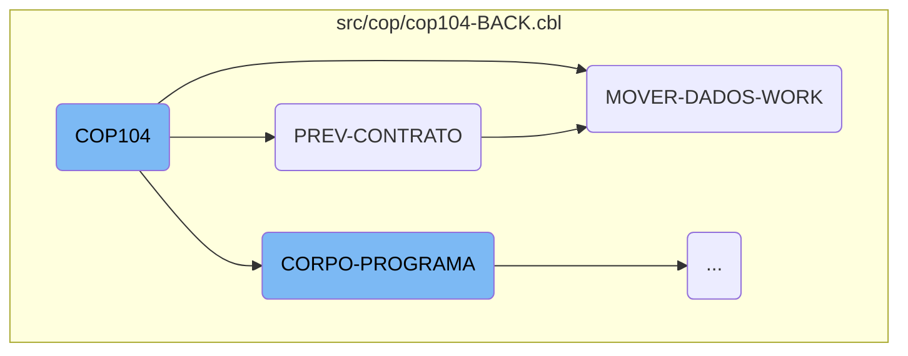

The <SwmToken path="src/cop/cop104-BACK.cbl" pos="3:6:6" line-data="       PROGRAM-ID. COP104.">`COP104`</SwmToken> program is a central component of the Kello Imagens system. It is responsible for initializing the program, handling user input, and coordinating various sections to ensure that data is processed and stored correctly. The main sections include <SwmToken path="src/cop/cop104-BACK.cbl" pos="1269:1:3" line-data="       PREV-CONTRATO SECTION.">`PREV-CONTRATO`</SwmToken>, <SwmToken path="src/cop/cop104-BACK.cbl" pos="1302:1:5" line-data="       MOVER-DADOS-WORK SECTION.">`MOVER-DADOS-WORK`</SwmToken>, <SwmToken path="src/cop/cop104-BACK.cbl" pos="654:3:5" line-data="           PERFORM CORPO-PROGRAMA UNTIL GS-EXIT-FLG-TRUE.">`CORPO-PROGRAMA`</SwmToken>, <SwmToken path="src/cop/cop104-BACK.cbl" pos="785:5:7" line-data="               WHEN GS-GRAVA-WORK-FLG-TRUE">`GRAVA-WORK`</SwmToken>, and <SwmToken path="src/cop/cop104-BACK.cbl" pos="996:7:11" line-data="               WHEN 1 PERFORM DATA-VENDA-PRODUCAO">`DATA-VENDA-PRODUCAO`</SwmToken>.

The <SwmToken path="src/cop/cop104-BACK.cbl" pos="3:6:6" line-data="       PROGRAM-ID. COP104.">`COP104`</SwmToken> program starts by initializing the system and accepting user input. It then moves on to prepare contract data, ensuring that all necessary information is ready for processing. Next, it handles the movement of data into working storage, making sure all relevant data is available for further operations. The program then evaluates various conditions and performs corresponding actions, such as saving work data and processing sales and production data. Throughout this flow, the program ensures that data is correctly processed and stored, coordinating different sections to achieve this goal.

Here is a high level diagram of the flow, showing only the most important functions:

```mermaid
graph TD;
      subgraph src/cop/cop104-BACK.cbl
e6a98966d0ba2cb55711f4a138064d07e3e6ec096a54cc12d7776709f951794e(COP104):::mainFlowStyle --> e56e7e26cf7f252cf0ef973bc5ff4332e35dcdefdc88635ef0296610e96171ab(PREV-CONTRATO)
end

subgraph src/cop/cop104-BACK.cbl
e6a98966d0ba2cb55711f4a138064d07e3e6ec096a54cc12d7776709f951794e(COP104):::mainFlowStyle --> af5ba8ceade5712f7337ac80771e638e006a994526d62961135f5b099bc5a73c(MOVER-DADOS-WORK)
end

subgraph src/cop/cop104-BACK.cbl
e6a98966d0ba2cb55711f4a138064d07e3e6ec096a54cc12d7776709f951794e(COP104):::mainFlowStyle --> 97aeda021fb04a777ff7275e1de516b6b9487f99ec84adc43e128c3325cbb8ab(CORPO-PROGRAMA):::mainFlowStyle
end

subgraph src/cop/cop104-BACK.cbl
97aeda021fb04a777ff7275e1de516b6b9487f99ec84adc43e128c3325cbb8ab(CORPO-PROGRAMA):::mainFlowStyle --> 4260c36396eccd9824e2f2adb41ff81ee50a1fc21d3a9fec87d0b9dcc16c28b5(GRAVA-WORK):::mainFlowStyle
end

subgraph src/cop/cop104-BACK.cbl
4260c36396eccd9824e2f2adb41ff81ee50a1fc21d3a9fec87d0b9dcc16c28b5(GRAVA-WORK):::mainFlowStyle --> e56e7e26cf7f252cf0ef973bc5ff4332e35dcdefdc88635ef0296610e96171ab(PREV-CONTRATO)
end

subgraph src/cop/cop104-BACK.cbl
4260c36396eccd9824e2f2adb41ff81ee50a1fc21d3a9fec87d0b9dcc16c28b5(GRAVA-WORK):::mainFlowStyle --> 0796c5b696c68e6bbd17daca875d5a4c49a1155a8ec123dea99c808c3f00e348(DATA-VENDA-PRODUCAO):::mainFlowStyle
end


      classDef mainFlowStyle color:#000000,fill:#7CB9F4
classDef rootsStyle color:#000000,fill:#00FFF4
classDef Style1 color:#000000,fill:#00FFAA
classDef Style2 color:#000000,fill:#FFFF00
classDef Style3 color:#000000,fill:#AA7CB9

%% Swimm:
%% graph TD;
%%       subgraph <SwmPath>[src/cop/cop104-BACK.cbl](src/cop/cop104-BACK.cbl)</SwmPath>
%% e6a98966d0ba2cb55711f4a138064d07e3e6ec096a54cc12d7776709f951794e(COP104):::mainFlowStyle --> e56e7e26cf7f252cf0ef973bc5ff4332e35dcdefdc88635ef0296610e96171ab(PREV-CONTRATO)
%% end
%% 
%% subgraph <SwmPath>[src/cop/cop104-BACK.cbl](src/cop/cop104-BACK.cbl)</SwmPath>
%% e6a98966d0ba2cb55711f4a138064d07e3e6ec096a54cc12d7776709f951794e(COP104):::mainFlowStyle --> af5ba8ceade5712f7337ac80771e638e006a994526d62961135f5b099bc5a73c(MOVER-DADOS-WORK)
%% end
%% 
%% subgraph <SwmPath>[src/cop/cop104-BACK.cbl](src/cop/cop104-BACK.cbl)</SwmPath>
%% e6a98966d0ba2cb55711f4a138064d07e3e6ec096a54cc12d7776709f951794e(COP104):::mainFlowStyle --> 97aeda021fb04a777ff7275e1de516b6b9487f99ec84adc43e128c3325cbb8ab(CORPO-PROGRAMA):::mainFlowStyle
%% end
%% 
%% subgraph <SwmPath>[src/cop/cop104-BACK.cbl](src/cop/cop104-BACK.cbl)</SwmPath>
%% 97aeda021fb04a777ff7275e1de516b6b9487f99ec84adc43e128c3325cbb8ab(CORPO-PROGRAMA):::mainFlowStyle --> 4260c36396eccd9824e2f2adb41ff81ee50a1fc21d3a9fec87d0b9dcc16c28b5(GRAVA-WORK):::mainFlowStyle
%% end
%% 
%% subgraph <SwmPath>[src/cop/cop104-BACK.cbl](src/cop/cop104-BACK.cbl)</SwmPath>
%% 4260c36396eccd9824e2f2adb41ff81ee50a1fc21d3a9fec87d0b9dcc16c28b5(GRAVA-WORK):::mainFlowStyle --> e56e7e26cf7f252cf0ef973bc5ff4332e35dcdefdc88635ef0296610e96171ab(PREV-CONTRATO)
%% end
%% 
%% subgraph <SwmPath>[src/cop/cop104-BACK.cbl](src/cop/cop104-BACK.cbl)</SwmPath>
%% 4260c36396eccd9824e2f2adb41ff81ee50a1fc21d3a9fec87d0b9dcc16c28b5(GRAVA-WORK):::mainFlowStyle --> 0796c5b696c68e6bbd17daca875d5a4c49a1155a8ec123dea99c808c3f00e348(DATA-VENDA-PRODUCAO):::mainFlowStyle
%% end
%% 
%% 
%%       classDef mainFlowStyle color:#000000,fill:#7CB9F4
%% classDef rootsStyle color:#000000,fill:#00FFF4
%% classDef Style1 color:#000000,fill:#00FFAA
%% classDef Style2 color:#000000,fill:#FFFF00
%% classDef Style3 color:#000000,fill:#AA7CB9
```



# Flow drill down

First, we'll zoom into this section of the flow:



<SwmSnippet path="/src/cop/cop104-BACK.cbl" line="652">

---

## <SwmToken path="src/cop/cop104-BACK.cbl" pos="3:6:6" line-data="       PROGRAM-ID. COP104.">`COP104`</SwmToken>

The <SwmToken path="src/cop/cop104-BACK.cbl" pos="3:6:6" line-data="       PROGRAM-ID. COP104.">`COP104`</SwmToken> function is the main entry point for the flow. It initializes the program, handles user input, and coordinates various sections such as <SwmToken path="src/cop/cop104-BACK.cbl" pos="654:3:5" line-data="           PERFORM CORPO-PROGRAMA UNTIL GS-EXIT-FLG-TRUE.">`CORPO-PROGRAMA`</SwmToken>, <SwmToken path="src/cop/cop104-BACK.cbl" pos="785:5:7" line-data="               WHEN GS-GRAVA-WORK-FLG-TRUE">`GRAVA-WORK`</SwmToken>, and <SwmToken path="src/cop/cop104-BACK.cbl" pos="996:7:11" line-data="               WHEN 1 PERFORM DATA-VENDA-PRODUCAO">`DATA-VENDA-PRODUCAO`</SwmToken>. This function orchestrates the overall business logic, ensuring that data is processed and stored correctly.

```cobol
       MAIN-PROCESS SECTION.
           PERFORM INICIALIZA-PROGRAMA.
           PERFORM CORPO-PROGRAMA UNTIL GS-EXIT-FLG-TRUE.
           GO FINALIZAR-PROGRAMA.

       INICIALIZA-PROGRAMA SECTION.
           ACCEPT PARAMETROS-W FROM COMMAND-LINE.
           COPY "CBDATA1.CPY".
           MOVE DATA-INV TO DATA-MOVTO-W.
           CALL "GRIDAT2" USING DATA-INV.
           MOVE DATA-INV       TO DATA-DIA-I.
           MOVE ZEROS TO ERRO-W.
           INITIALIZE GS-DATA-BLOCK
           INITIALIZE DS-CONTROL-BLOCK
           MOVE GS-DATA-BLOCK-VERSION-NO
                                   TO DS-DATA-BLOCK-VERSION-NO
           MOVE GS-VERSION-NO  TO DS-VERSION-NO
           MOVE EMPRESA-W          TO EMP-REC
           MOVE NOME-EMPRESA-W     TO EMPRESA-REL
           MOVE "CAD004"  TO ARQ-REC. MOVE EMPRESA-REF TO PATH-CAD004.
           MOVE "CGD001"  TO ARQ-REC. MOVE EMPRESA-REF TO PATH-CGD001.
```

---

</SwmSnippet>

<SwmSnippet path="/src/cop/cop104-BACK.cbl" line="1269">

---

## <SwmToken path="src/cop/cop104-BACK.cbl" pos="1269:1:3" line-data="       PREV-CONTRATO SECTION.">`PREV-CONTRATO`</SwmToken>

The <SwmToken path="src/cop/cop104-BACK.cbl" pos="1269:1:3" line-data="       PREV-CONTRATO SECTION.">`PREV-CONTRATO`</SwmToken> function is responsible for preparing contract data. It moves date values into working storage, starts reading records from the <SwmToken path="src/cop/cop104-BACK.cbl" pos="1282:3:3" line-data="           START COD040 KEY IS NOT &lt; ALT1-CO40 INVALID KEY">`COD040`</SwmToken> file, and processes each record until a certain condition is met. This function ensures that contract data is correctly initialized and ready for further processing.

```cobol
       PREV-CONTRATO SECTION.
           MOVE GS-MESANO-INI  TO MESANO-W
           MOVE MESANO-W(1: 2) TO MESANO-I(5: 2)
           MOVE MESANO-W(3: 4) TO MESANO-I(1: 4)
           MOVE MESANO-I       TO MESANO-INI
           MOVE GS-MESANO-FIM  TO MESANO-W
           MOVE MESANO-W(1: 2) TO MESANO-I(5: 2)
           MOVE MESANO-W(3: 4) TO MESANO-I(1: 4)
           MOVE MESANO-I       TO MESANO-FIM


           MOVE MESANO-INI     TO MESANO-PREV-CO40
           MOVE ZEROS          TO NR-CONTRATO-CO40
           START COD040 KEY IS NOT < ALT1-CO40 INVALID KEY
                 MOVE "10" TO ST-COD040.

           PERFORM UNTIL ST-COD040 = "10"
                 READ COD040 NEXT RECORD AT END
                      MOVE "10" TO ST-COD040
                 NOT AT END
                      MOVE NR-CONTRATO-CO40 TO GS-EXIBE-CONTRATO
```

---

</SwmSnippet>

<SwmSnippet path="/src/cop/cop104-BACK.cbl" line="1302">

---

## <SwmToken path="src/cop/cop104-BACK.cbl" pos="1302:1:5" line-data="       MOVER-DADOS-WORK SECTION.">`MOVER-DADOS-WORK`</SwmToken>

The <SwmToken path="src/cop/cop104-BACK.cbl" pos="1302:1:5" line-data="       MOVER-DADOS-WORK SECTION.">`MOVER-DADOS-WORK`</SwmToken> function handles the movement of data into the working storage. It initializes the <SwmToken path="src/cop/cop104-BACK.cbl" pos="1303:3:5" line-data="           INITIALIZE REG-WORK.">`REG-WORK`</SwmToken> structure, searches for status information, and reads various records to populate the working storage with relevant data. This function is crucial for ensuring that all necessary data is available for subsequent operations.

```cobol
       MOVER-DADOS-WORK SECTION.
           INITIALIZE REG-WORK.
      *    IF STATUS-CO40 < 50
      *       CONTINUE
      *    ELSE
              PERFORM PESQUISAR-STATUS
              IF ACHEI = "S"
                 MOVE CIDADE-CO40        TO CIDADE
                 READ CAD010 INVALID KEY
                      MOVE SPACES TO NOME-CID
                      MOVE SPACES TO UF-CID
                      MOVE ZEROS  TO REGIAO-CID
                 END-READ
                 IF GS-UF = SPACES OR UF-CID
                    IF GS-REGIAO = ZEROS OR REGIAO-CID
                       MOVE MESANO-PREV-CO40   TO MESANO-WK
                       MOVE NR-CONTRATO-CO40   TO CONTRATO-WK
                       MOVE NOME-CID           TO CIDADE-WK
                       MOVE REGIAO-CID         TO CODIGO-REG
                       READ CAD012 INVALID KEY
                            MOVE SPACES TO NOME-REG
```

---

</SwmSnippet>

Now, lets zoom into this section of the flow:

```mermaid
graph TD;
      subgraph src/cop/cop104-BACK.cbl
97aeda021fb04a777ff7275e1de516b6b9487f99ec84adc43e128c3325cbb8ab(CORPO-PROGRAMA):::mainFlowStyle --> 4260c36396eccd9824e2f2adb41ff81ee50a1fc21d3a9fec87d0b9dcc16c28b5(GRAVA-WORK):::mainFlowStyle
end

subgraph src/cop/cop104-BACK.cbl
4260c36396eccd9824e2f2adb41ff81ee50a1fc21d3a9fec87d0b9dcc16c28b5(GRAVA-WORK):::mainFlowStyle --> e56e7e26cf7f252cf0ef973bc5ff4332e35dcdefdc88635ef0296610e96171ab(PREV-CONTRATO)
end

subgraph src/cop/cop104-BACK.cbl
4260c36396eccd9824e2f2adb41ff81ee50a1fc21d3a9fec87d0b9dcc16c28b5(GRAVA-WORK):::mainFlowStyle --> 0796c5b696c68e6bbd17daca875d5a4c49a1155a8ec123dea99c808c3f00e348(DATA-VENDA-PRODUCAO):::mainFlowStyle
end

subgraph src/cop/cop104-BACK.cbl
e56e7e26cf7f252cf0ef973bc5ff4332e35dcdefdc88635ef0296610e96171ab(PREV-CONTRATO) --> af5ba8ceade5712f7337ac80771e638e006a994526d62961135f5b099bc5a73c(MOVER-DADOS-WORK)
end


      classDef mainFlowStyle color:#000000,fill:#7CB9F4
classDef rootsStyle color:#000000,fill:#00FFF4
classDef Style1 color:#000000,fill:#00FFAA
classDef Style2 color:#000000,fill:#FFFF00
classDef Style3 color:#000000,fill:#AA7CB9

%% Swimm:
%% graph TD;
%%       subgraph <SwmPath>[src/cop/cop104-BACK.cbl](src/cop/cop104-BACK.cbl)</SwmPath>
%% 97aeda021fb04a777ff7275e1de516b6b9487f99ec84adc43e128c3325cbb8ab(CORPO-PROGRAMA):::mainFlowStyle --> 4260c36396eccd9824e2f2adb41ff81ee50a1fc21d3a9fec87d0b9dcc16c28b5(GRAVA-WORK):::mainFlowStyle
%% end
%% 
%% subgraph <SwmPath>[src/cop/cop104-BACK.cbl](src/cop/cop104-BACK.cbl)</SwmPath>
%% 4260c36396eccd9824e2f2adb41ff81ee50a1fc21d3a9fec87d0b9dcc16c28b5(GRAVA-WORK):::mainFlowStyle --> e56e7e26cf7f252cf0ef973bc5ff4332e35dcdefdc88635ef0296610e96171ab(PREV-CONTRATO)
%% end
%% 
%% subgraph <SwmPath>[src/cop/cop104-BACK.cbl](src/cop/cop104-BACK.cbl)</SwmPath>
%% 4260c36396eccd9824e2f2adb41ff81ee50a1fc21d3a9fec87d0b9dcc16c28b5(GRAVA-WORK):::mainFlowStyle --> 0796c5b696c68e6bbd17daca875d5a4c49a1155a8ec123dea99c808c3f00e348(DATA-VENDA-PRODUCAO):::mainFlowStyle
%% end
%% 
%% subgraph <SwmPath>[src/cop/cop104-BACK.cbl](src/cop/cop104-BACK.cbl)</SwmPath>
%% e56e7e26cf7f252cf0ef973bc5ff4332e35dcdefdc88635ef0296610e96171ab(PREV-CONTRATO) --> af5ba8ceade5712f7337ac80771e638e006a994526d62961135f5b099bc5a73c(MOVER-DADOS-WORK)
%% end
%% 
%% 
%%       classDef mainFlowStyle color:#000000,fill:#7CB9F4
%% classDef rootsStyle color:#000000,fill:#00FFF4
%% classDef Style1 color:#000000,fill:#00FFAA
%% classDef Style2 color:#000000,fill:#FFFF00
%% classDef Style3 color:#000000,fill:#AA7CB9
```



<SwmSnippet path="/src/cop/cop104-BACK.cbl" line="775">

---

## <SwmToken path="src/cop/cop104-BACK.cbl" pos="775:1:3" line-data="       CORPO-PROGRAMA SECTION.">`CORPO-PROGRAMA`</SwmToken>

The <SwmToken path="src/cop/cop104-BACK.cbl" pos="775:1:3" line-data="       CORPO-PROGRAMA SECTION.">`CORPO-PROGRAMA`</SwmToken> section is a central control structure that evaluates various conditions and performs corresponding actions. It uses the <SwmToken path="src/cop/cop104-BACK.cbl" pos="776:1:1" line-data="           EVALUATE TRUE">`EVALUATE`</SwmToken> statement to check different flags and execute specific routines such as <SwmToken path="src/cop/cop104-BACK.cbl" pos="778:3:3" line-data="                    PERFORM CENTRALIZAR">`CENTRALIZAR`</SwmToken>, <SwmToken path="src/cop/cop104-BACK.cbl" pos="779:3:7" line-data="                    PERFORM VERIFICAR-SENHA-STATUS">`VERIFICAR-SENHA-STATUS`</SwmToken>, and <SwmToken path="src/cop/cop104-BACK.cbl" pos="785:5:7" line-data="               WHEN GS-GRAVA-WORK-FLG-TRUE">`GRAVA-WORK`</SwmToken>. This section ensures that the appropriate processes are triggered based on the current state of the system.

```cobol
       CORPO-PROGRAMA SECTION.
           EVALUATE TRUE
               WHEN GS-CENTRALIZA-TRUE
                    PERFORM CENTRALIZAR
                    PERFORM VERIFICAR-SENHA-STATUS
               WHEN GS-PRINTER-FLG-TRUE
                    COPY IMPRESSORA.CHAMA.
                    IF LNK-MAPEAMENTO <> SPACES
                       PERFORM IMPRIME-RELATORIO
                    END-IF
               WHEN GS-GRAVA-WORK-FLG-TRUE
                    MOVE "Deseja Realmente Carregar os Dados ?" TO
                    MENSAGEM
                    MOVE "Q" TO TIPO-MSG
                    PERFORM EXIBIR-MENSAGEM
                    IF RESP-MSG = "S"
                       PERFORM GRAVA-WORK
                       PERFORM ZERA-VARIAVEIS
                       PERFORM CARREGA-LISTA
                    END-IF
               WHEN GS-CARREGA-LISTA-FLG-TRUE
```

---

</SwmSnippet>

<SwmSnippet path="/src/cop/cop104-BACK.cbl" line="976">

---

## <SwmToken path="src/cop/cop104-BACK.cbl" pos="976:1:3" line-data="       GRAVA-WORK SECTION.">`GRAVA-WORK`</SwmToken>

The <SwmToken path="src/cop/cop104-BACK.cbl" pos="976:1:3" line-data="       GRAVA-WORK SECTION.">`GRAVA-WORK`</SwmToken> section handles the preparation and saving of work data. It checks the status of the work file, performs necessary file operations, and then evaluates the <SwmToken path="src/cop/cop104-BACK.cbl" pos="991:4:8" line-data="              DISPLAY &quot;GS-OP-FILTRO = &quot; AT 0101">`GS-OP-FILTRO`</SwmToken> to determine which subsequent process to execute, such as <SwmToken path="src/cop/cop104-BACK.cbl" pos="996:7:11" line-data="               WHEN 1 PERFORM DATA-VENDA-PRODUCAO">`DATA-VENDA-PRODUCAO`</SwmToken> or <SwmToken path="src/cop/cop104-BACK.cbl" pos="1269:1:3" line-data="       PREV-CONTRATO SECTION.">`PREV-CONTRATO`</SwmToken>.

```cobol
       GRAVA-WORK SECTION.
           IF ST-WORK NOT = "35"
              CLOSE       WORK
              DELETE FILE WORK.

           ACCEPT VARIA-W FROM TIME
           OPEN OUTPUT WORK
           CLOSE       WORK
           OPEN I-O    WORK

           MOVE "TELA-AGUARDA" TO DS-PROCEDURE
           PERFORM CALL-DIALOG-SYSTEM

           IF USUARIO-W = "ANDER"
              DISPLAY ERASE AT 0101
              DISPLAY "GS-OP-FILTRO = " AT 0101
              DISPLAY  GS-OP-FILTRO     AT 0125
           END-IF

           EVALUATE GS-OP-FILTRO
               WHEN 1 PERFORM DATA-VENDA-PRODUCAO
```

---

</SwmSnippet>

<SwmSnippet path="/src/cop/cop104-BACK.cbl" line="1004">

---

## <SwmToken path="src/cop/cop104-BACK.cbl" pos="1004:1:5" line-data="       DATA-VENDA-PRODUCAO SECTION.">`DATA-VENDA-PRODUCAO`</SwmToken>

The <SwmToken path="src/cop/cop104-BACK.cbl" pos="1004:1:5" line-data="       DATA-VENDA-PRODUCAO SECTION.">`DATA-VENDA-PRODUCAO`</SwmToken> section processes sales and production data. It initializes records, performs date conversions, and evaluates the <SwmToken path="src/cop/cop104-BACK.cbl" pos="1018:3:7" line-data="           EVALUATE GS-OP-DATA">`GS-OP-DATA`</SwmToken> to execute specific routines like <SwmToken path="src/cop/cop104-BACK.cbl" pos="1019:7:9" line-data="               WHEN 1 PERFORM POR-VENDA">`POR-VENDA`</SwmToken> or <SwmToken path="src/cop/cop104-BACK.cbl" pos="1020:7:9" line-data="               WHEN 2 PERFORM POR-PRODUCAO">`POR-PRODUCAO`</SwmToken>. This section also handles reading and writing to auxiliary files, calculating various metrics, and updating records based on the processed data.

```cobol
       DATA-VENDA-PRODUCAO SECTION.
           INITIALIZE REG-RCD100

           MOVE GS-DATA-INI TO DATA-INV
           CALL "GRIDAT2" USING DATA-INV
           MOVE DATA-INV    TO VECTO-INI
           MOVE GS-DATA-FIM TO DATA-INV
           CALL "GRIDAT2" USING DATA-INV
           MOVE DATA-INV    TO VECTO-FIM

           OPEN OUTPUT AUXILIAR AUXILIAR2
           CLOSE       AUXILIAR AUXILIAR2
           OPEN I-O    AUXILIAR AUXILIAR2

           EVALUATE GS-OP-DATA
               WHEN 1 PERFORM POR-VENDA
               WHEN 2 PERFORM POR-PRODUCAO
           END-EVALUATE

           CLOSE       AUXILIAR AUXILIAR2
           OPEN INPUT  AUXILIAR AUXILIAR2
```

---

</SwmSnippet>

&nbsp;

*This is an auto-generated document by Swimm AI 🌊 and has not yet been verified by a human*

<SwmMeta version="3.0.0" repo-id="Z2l0aHViJTNBJTNBa2VsbG8lM0ElM0Fzd2ltbWlv" repo-name="kello"><sup>Powered by [Swimm](/)</sup></SwmMeta>
