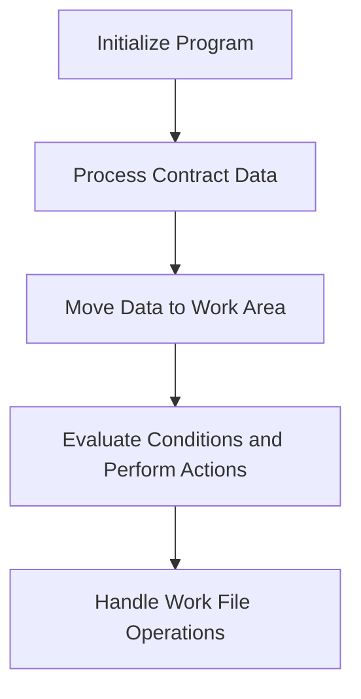

This document will cover the COP104 program, which includes:

1. Initializing the program
2. Processing contract data
3. Moving data to a work area
4. Evaluating conditions and performing actions
5. Handling work file operations.

Technical document: <SwmLink doc-title="Overview of COP104 Program">[Overview of COP104 Program](/.swm/overview-of-cop104-program.scqkqm9m.sw.md)</SwmLink>

# Initializing the Program

The COP104 program begins by initializing and setting up the necessary parameters. This step ensures that all required variables and settings are correctly configured before any data processing begins. This initialization is crucial for the smooth operation of subsequent steps.

# Processing Contract Data

In this step, the program processes contract data by moving date values and performing key-based searches. This involves reading contract records and moving relevant data to a designated work area. The goal is to prepare the contract data for further processing and evaluation.

# Moving Data to Work Area

The program moves various data fields to a work area and performs status checks. This step ensures that all necessary data is available in a centralized location for efficient processing. Status checks are performed to validate the data and ensure its integrity.

# Evaluating Conditions and Performing Actions

The program evaluates different conditions and performs corresponding actions. For example, it may centralize data, verify status, print reports, or load lists based on specific conditions. This step is essential for executing business logic and ensuring that the program responds appropriately to various scenarios.

# Handling Work File Operations

Finally, the program handles work file operations by closing, deleting, and reopening the work file. Additional operations are performed based on filter values. This step ensures that the work file is correctly managed and that any necessary data is processed and stored appropriately.

&nbsp;

*This is an auto-generated document by Swimm AI 🌊 and has not yet been verified by a human*

<SwmMeta version="3.0.0" repo-id="Z2l0aHViJTNBJTNBa2VsbG8lM0ElM0Fzd2ltbWlv" repo-name="kello">Powered by [Swimm](/)</SwmMeta>
