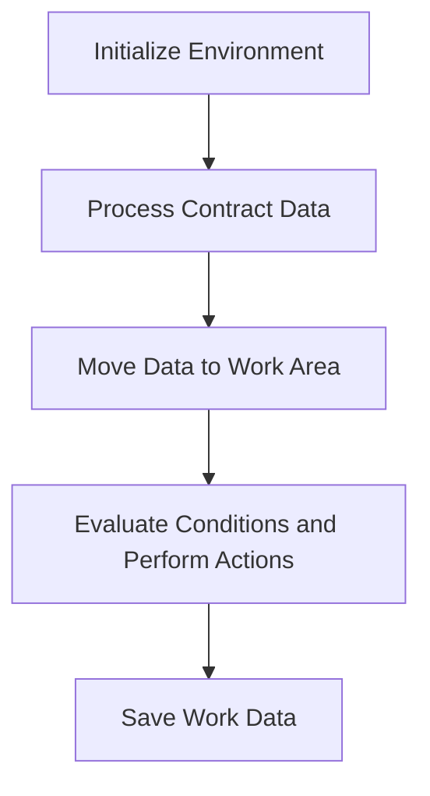

This document will cover the COP104 Section, which includes:

1. Initializing the environment
2. Processing contract data
3. Moving data to the work area
4. Evaluating conditions and performing actions
5. Saving work data

Technical document: <SwmLink doc-title="Overview of COP104 Section">[Overview of COP104 Section](/.swm/overview-of-cop104-section.kb047ry1.sw.md)</SwmLink>

# Initializing the Environment

The COP104 section starts by setting up the environment. This involves accepting parameters from the command line, which are necessary for the subsequent operations. This step ensures that the program has all the required inputs to function correctly.

# Processing Contract Data

In this step, the program processes contract data by moving initial and final month-year values. It starts a key-based search and performs a loop to read records. This ensures that all relevant contract data is gathered and prepared for further processing.

# Moving Data to the Work Area

The program initializes the work area and performs various data movements and calculations. It reads records, updates fields, and computes values to prepare the data for further processing. This step is crucial for organizing the data in a structured manner.

# Evaluating Conditions and Performing Actions

The program evaluates different conditions to decide on the next actions. It checks flags like GS-CENTRALIZA-TRUE, GS-PRINTER-FLG-TRUE, and GS-GRAVA-WORK-FLG-TRUE to determine whether to centralize data, print reports, or save work data. This step ensures that the program performs the correct operations based on the current state.

# Saving Work Data

Finally, the program handles the process of saving work data. It performs operations like closing and deleting the work file, accepting time variables, and opening the work file for input-output operations. This step ensures that all processed data is saved correctly for future use.

&nbsp;

*This is an auto-generated document by Swimm AI 🌊 and has not yet been verified by a human*

<SwmMeta version="3.0.0" repo-id="Z2l0aHViJTNBJTNBa2VsbG8lM0ElM0Fzd2ltbWlv" repo-name="kello">Powered by [Swimm](/)</SwmMeta>
