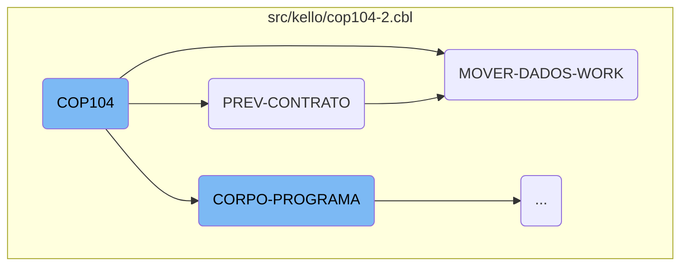

The <SwmToken path="src/kello/cop104-2.cbl" pos="3:6:6" line-data="       PROGRAM-ID. COP104.">`COP104`</SwmToken> section is a crucial part of the COBOL program that initializes the environment and orchestrates the main operations. It starts by accepting parameters from the command line, processes contract data, moves data to the work area, evaluates various conditions, and performs corresponding actions such as centralizing data, printing reports, or saving work data.

The flow begins with setting up the environment by accepting parameters from the command line. It then processes contract data by moving initial and final month-year values and performing a loop to read records. Next, it initializes the work area and performs various data movements and calculations. The program evaluates different conditions to decide whether to centralize data, print reports, or save work data. Finally, it handles the process of saving work data by closing and deleting the work file, accepting time variables, and opening the work file for <SwmToken path="src/kello/cop104-2.cbl" pos="17:1:3" line-data="       INPUT-OUTPUT SECTION.">`INPUT-OUTPUT`</SwmToken> operations.

Here is a high level diagram of the flow, showing only the most important functions:

```mermaid
graph TD;
      subgraph src/kello/cop104-2.cbl
575b4cb8cb505342141c192cba4d1f2b08f7e890286860a5456fce4798b6acc5(COP104):::mainFlowStyle --> 51e5a7b6edbc65e2c87ad25bb6d095b94826644e50c7ec429ab57821c700ec50(PREV-CONTRATO)
end

subgraph src/kello/cop104-2.cbl
575b4cb8cb505342141c192cba4d1f2b08f7e890286860a5456fce4798b6acc5(COP104):::mainFlowStyle --> 0c312fff27d50f4cd3198d98028e10640898e92f9db8fcf1a7e2f38259284321(MOVER-DADOS-WORK)
end

subgraph src/kello/cop104-2.cbl
575b4cb8cb505342141c192cba4d1f2b08f7e890286860a5456fce4798b6acc5(COP104):::mainFlowStyle --> 7d19d21249146e504088f4f92a92eb5ff319629de77b9fa59c3536f02046d94d(CORPO-PROGRAMA):::mainFlowStyle
end

subgraph src/kello/cop104-2.cbl
7d19d21249146e504088f4f92a92eb5ff319629de77b9fa59c3536f02046d94d(CORPO-PROGRAMA):::mainFlowStyle --> fa20d6b64a5ed20ee4210dc03aa7e98805c53da06971cd14bce9be36d4fe7aa0(GRAVA-WORK):::mainFlowStyle
end

subgraph src/kello/cop104-2.cbl
fa20d6b64a5ed20ee4210dc03aa7e98805c53da06971cd14bce9be36d4fe7aa0(GRAVA-WORK):::mainFlowStyle --> 51e5a7b6edbc65e2c87ad25bb6d095b94826644e50c7ec429ab57821c700ec50(PREV-CONTRATO)
end

subgraph src/kello/cop104-2.cbl
fa20d6b64a5ed20ee4210dc03aa7e98805c53da06971cd14bce9be36d4fe7aa0(GRAVA-WORK):::mainFlowStyle --> 6e8ac448b3411306faab21adc0f9383aaaf4e605119ea97471c1cf8804612c27(DATA-VENDA-PRODUCAO):::mainFlowStyle
end


      classDef mainFlowStyle color:#000000,fill:#7CB9F4
classDef rootsStyle color:#000000,fill:#00FFF4
classDef Style1 color:#000000,fill:#00FFAA
classDef Style2 color:#000000,fill:#FFFF00
classDef Style3 color:#000000,fill:#AA7CB9

%% Swimm:
%% graph TD;
%%       subgraph <SwmPath>[src/kello/cop104-2.cbl](src/kello/cop104-2.cbl)</SwmPath>
%% 575b4cb8cb505342141c192cba4d1f2b08f7e890286860a5456fce4798b6acc5(COP104):::mainFlowStyle --> 51e5a7b6edbc65e2c87ad25bb6d095b94826644e50c7ec429ab57821c700ec50(PREV-CONTRATO)
%% end
%% 
%% subgraph <SwmPath>[src/kello/cop104-2.cbl](src/kello/cop104-2.cbl)</SwmPath>
%% 575b4cb8cb505342141c192cba4d1f2b08f7e890286860a5456fce4798b6acc5(COP104):::mainFlowStyle --> 0c312fff27d50f4cd3198d98028e10640898e92f9db8fcf1a7e2f38259284321(MOVER-DADOS-WORK)
%% end
%% 
%% subgraph <SwmPath>[src/kello/cop104-2.cbl](src/kello/cop104-2.cbl)</SwmPath>
%% 575b4cb8cb505342141c192cba4d1f2b08f7e890286860a5456fce4798b6acc5(COP104):::mainFlowStyle --> 7d19d21249146e504088f4f92a92eb5ff319629de77b9fa59c3536f02046d94d(CORPO-PROGRAMA):::mainFlowStyle
%% end
%% 
%% subgraph <SwmPath>[src/kello/cop104-2.cbl](src/kello/cop104-2.cbl)</SwmPath>
%% 7d19d21249146e504088f4f92a92eb5ff319629de77b9fa59c3536f02046d94d(CORPO-PROGRAMA):::mainFlowStyle --> fa20d6b64a5ed20ee4210dc03aa7e98805c53da06971cd14bce9be36d4fe7aa0(GRAVA-WORK):::mainFlowStyle
%% end
%% 
%% subgraph <SwmPath>[src/kello/cop104-2.cbl](src/kello/cop104-2.cbl)</SwmPath>
%% fa20d6b64a5ed20ee4210dc03aa7e98805c53da06971cd14bce9be36d4fe7aa0(GRAVA-WORK):::mainFlowStyle --> 51e5a7b6edbc65e2c87ad25bb6d095b94826644e50c7ec429ab57821c700ec50(PREV-CONTRATO)
%% end
%% 
%% subgraph <SwmPath>[src/kello/cop104-2.cbl](src/kello/cop104-2.cbl)</SwmPath>
%% fa20d6b64a5ed20ee4210dc03aa7e98805c53da06971cd14bce9be36d4fe7aa0(GRAVA-WORK):::mainFlowStyle --> 6e8ac448b3411306faab21adc0f9383aaaf4e605119ea97471c1cf8804612c27(DATA-VENDA-PRODUCAO):::mainFlowStyle
%% end
%% 
%% 
%%       classDef mainFlowStyle color:#000000,fill:#7CB9F4
%% classDef rootsStyle color:#000000,fill:#00FFF4
%% classDef Style1 color:#000000,fill:#00FFAA
%% classDef Style2 color:#000000,fill:#FFFF00
%% classDef Style3 color:#000000,fill:#AA7CB9
```



# Flow drill down

First, we'll zoom into this section of the flow:



<SwmSnippet path="/src/kello/cop104-2.cbl" line="642">

---

## <SwmToken path="src/kello/cop104-2.cbl" pos="3:6:6" line-data="       PROGRAM-ID. COP104.">`COP104`</SwmToken>

The <SwmToken path="src/kello/cop104-2.cbl" pos="3:6:6" line-data="       PROGRAM-ID. COP104.">`COP104`</SwmToken> function initializes the program by accepting parameters from the command line. This sets up the necessary environment for the subsequent operations.

```cobol
       MAIN-PROCESS SECTION.
           PERFORM INICIALIZA-PROGRAMA.
           PERFORM CORPO-PROGRAMA UNTIL GS-EXIT-FLG-TRUE.
           GO FINALIZAR-PROGRAMA.

       INICIALIZA-PROGRAMA SECTION.
           ACCEPT PARAMETROS-W FROM COMMAND-LINE.
```

---

</SwmSnippet>

<SwmSnippet path="/src/kello/cop104-2.cbl" line="1214">

---

## <SwmToken path="src/kello/cop104-2.cbl" pos="1214:1:3" line-data="       PREV-CONTRATO SECTION.">`PREV-CONTRATO`</SwmToken>

The <SwmToken path="src/kello/cop104-2.cbl" pos="1214:1:3" line-data="       PREV-CONTRATO SECTION.">`PREV-CONTRATO`</SwmToken> function processes contract data by moving initial and final month-year values, starting a key-based search, and performing a loop to read records and move data to the work area.

```cobol
       PREV-CONTRATO SECTION.
           MOVE GS-MESANO-INI  TO MESANO-W
           MOVE MESANO-W(1: 2) TO MESANO-I(5: 2)
           MOVE MESANO-W(3: 4) TO MESANO-I(1: 4)
           MOVE MESANO-I       TO MESANO-INI
           MOVE GS-MESANO-FIM  TO MESANO-W
           MOVE MESANO-W(1: 2) TO MESANO-I(5: 2)
           MOVE MESANO-W(3: 4) TO MESANO-I(1: 4)
           MOVE MESANO-I       TO MESANO-FIM


           MOVE MESANO-INI     TO MESANO-PREV-CO40
           MOVE ZEROS          TO NR-CONTRATO-CO40
           START COD040 KEY IS NOT < ALT1-CO40 INVALID KEY
                 MOVE "10" TO ST-COD040.

           PERFORM UNTIL ST-COD040 = "10"
                 READ COD040 NEXT RECORD AT END
                      MOVE "10" TO ST-COD040
                 NOT AT END
                      MOVE NR-CONTRATO-CO40 TO GS-EXIBE-CONTRATO
```

---

</SwmSnippet>

<SwmSnippet path="/src/kello/cop104-2.cbl" line="1247">

---

## <SwmToken path="src/kello/cop104-2.cbl" pos="1247:1:5" line-data="       MOVER-DADOS-WORK SECTION.">`MOVER-DADOS-WORK`</SwmToken>

The <SwmToken path="src/kello/cop104-2.cbl" pos="1247:1:5" line-data="       MOVER-DADOS-WORK SECTION.">`MOVER-DADOS-WORK`</SwmToken> function initializes the work area and performs various data movements and calculations. It reads records, updates fields, and computes values to prepare the data for further processing.

```cobol
       MOVER-DADOS-WORK SECTION.
           INITIALIZE REG-WORK.
      *    IF STATUS-CO40 < 50
      *       CONTINUE
      *    ELSE
              PERFORM PESQUISAR-STATUS
              IF ACHEI = "S"
                 MOVE CIDADE-CO40        TO CIDADE
                 READ CAD010 INVALID KEY
                      MOVE SPACES TO NOME-CID
                      MOVE SPACES TO UF-CID
                      MOVE ZEROS  TO REGIAO-CID
                 END-READ
                 IF GS-UF = SPACES OR UF-CID
                    IF GS-REGIAO = ZEROS OR REGIAO-CID
                       MOVE MESANO-PREV-CO40   TO MESANO-WK
                       MOVE NR-CONTRATO-CO40   TO CONTRATO-WK
                       MOVE NOME-CID           TO CIDADE-WK
                       MOVE REGIAO-CID         TO CODIGO-REG
                       READ CAD012 INVALID KEY
                            MOVE SPACES TO NOME-REG
```

---

</SwmSnippet>

Now, lets zoom into this section of the flow:

```mermaid
graph TD;
      subgraph src/kello/cop104-2.cbl
7d19d21249146e504088f4f92a92eb5ff319629de77b9fa59c3536f02046d94d(CORPO-PROGRAMA):::mainFlowStyle --> fa20d6b64a5ed20ee4210dc03aa7e98805c53da06971cd14bce9be36d4fe7aa0(GRAVA-WORK):::mainFlowStyle
end

subgraph src/kello/cop104-2.cbl
fa20d6b64a5ed20ee4210dc03aa7e98805c53da06971cd14bce9be36d4fe7aa0(GRAVA-WORK):::mainFlowStyle --> 51e5a7b6edbc65e2c87ad25bb6d095b94826644e50c7ec429ab57821c700ec50(PREV-CONTRATO)
end

subgraph src/kello/cop104-2.cbl
fa20d6b64a5ed20ee4210dc03aa7e98805c53da06971cd14bce9be36d4fe7aa0(GRAVA-WORK):::mainFlowStyle --> 6e8ac448b3411306faab21adc0f9383aaaf4e605119ea97471c1cf8804612c27(DATA-VENDA-PRODUCAO):::mainFlowStyle
end

subgraph src/kello/cop104-2.cbl
51e5a7b6edbc65e2c87ad25bb6d095b94826644e50c7ec429ab57821c700ec50(PREV-CONTRATO) --> 0c312fff27d50f4cd3198d98028e10640898e92f9db8fcf1a7e2f38259284321(MOVER-DADOS-WORK)
end


      classDef mainFlowStyle color:#000000,fill:#7CB9F4
classDef rootsStyle color:#000000,fill:#00FFF4
classDef Style1 color:#000000,fill:#00FFAA
classDef Style2 color:#000000,fill:#FFFF00
classDef Style3 color:#000000,fill:#AA7CB9

%% Swimm:
%% graph TD;
%%       subgraph <SwmPath>[src/kello/cop104-2.cbl](src/kello/cop104-2.cbl)</SwmPath>
%% 7d19d21249146e504088f4f92a92eb5ff319629de77b9fa59c3536f02046d94d(CORPO-PROGRAMA):::mainFlowStyle --> fa20d6b64a5ed20ee4210dc03aa7e98805c53da06971cd14bce9be36d4fe7aa0(GRAVA-WORK):::mainFlowStyle
%% end
%% 
%% subgraph <SwmPath>[src/kello/cop104-2.cbl](src/kello/cop104-2.cbl)</SwmPath>
%% fa20d6b64a5ed20ee4210dc03aa7e98805c53da06971cd14bce9be36d4fe7aa0(GRAVA-WORK):::mainFlowStyle --> 51e5a7b6edbc65e2c87ad25bb6d095b94826644e50c7ec429ab57821c700ec50(PREV-CONTRATO)
%% end
%% 
%% subgraph <SwmPath>[src/kello/cop104-2.cbl](src/kello/cop104-2.cbl)</SwmPath>
%% fa20d6b64a5ed20ee4210dc03aa7e98805c53da06971cd14bce9be36d4fe7aa0(GRAVA-WORK):::mainFlowStyle --> 6e8ac448b3411306faab21adc0f9383aaaf4e605119ea97471c1cf8804612c27(DATA-VENDA-PRODUCAO):::mainFlowStyle
%% end
%% 
%% subgraph <SwmPath>[src/kello/cop104-2.cbl](src/kello/cop104-2.cbl)</SwmPath>
%% 51e5a7b6edbc65e2c87ad25bb6d095b94826644e50c7ec429ab57821c700ec50(PREV-CONTRATO) --> 0c312fff27d50f4cd3198d98028e10640898e92f9db8fcf1a7e2f38259284321(MOVER-DADOS-WORK)
%% end
%% 
%% 
%%       classDef mainFlowStyle color:#000000,fill:#7CB9F4
%% classDef rootsStyle color:#000000,fill:#00FFF4
%% classDef Style1 color:#000000,fill:#00FFAA
%% classDef Style2 color:#000000,fill:#FFFF00
%% classDef Style3 color:#000000,fill:#AA7CB9
```



<SwmSnippet path="/src/kello/cop104-2.cbl" line="766">

---

## <SwmToken path="src/kello/cop104-2.cbl" pos="644:3:5" line-data="           PERFORM CORPO-PROGRAMA UNTIL GS-EXIT-FLG-TRUE.">`CORPO-PROGRAMA`</SwmToken>

The <SwmToken path="src/kello/cop104-2.cbl" pos="644:3:5" line-data="           PERFORM CORPO-PROGRAMA UNTIL GS-EXIT-FLG-TRUE.">`CORPO-PROGRAMA`</SwmToken> section evaluates various conditions and performs corresponding actions. It checks flags like <SwmToken path="src/kello/cop104-2.cbl" pos="767:3:7" line-data="               WHEN GS-CENTRALIZA-TRUE">`GS-CENTRALIZA-TRUE`</SwmToken>, <SwmToken path="src/kello/cop104-2.cbl" pos="770:3:9" line-data="               WHEN GS-PRINTER-FLG-TRUE">`GS-PRINTER-FLG-TRUE`</SwmToken>, and <SwmToken path="src/kello/cop104-2.cbl" pos="772:3:11" line-data="               WHEN GS-GRAVA-WORK-FLG-TRUE">`GS-GRAVA-WORK-FLG-TRUE`</SwmToken> to determine which operations to execute, such as centralizing data, printing reports, or saving work data.

```cobol
           EVALUATE TRUE
               WHEN GS-CENTRALIZA-TRUE
                    PERFORM CENTRALIZAR
                    PERFORM VERIFICAR-SENHA-STATUS
               WHEN GS-PRINTER-FLG-TRUE
                    PERFORM IMPRIME-RELATORIO
               WHEN GS-GRAVA-WORK-FLG-TRUE
                    MOVE "Deseja Realmente Carregar os Dados ?" TO
                    MENSAGEM
                    MOVE "Q" TO TIPO-MSG
                    PERFORM EXIBIR-MENSAGEM
                    IF RESP-MSG = "S"
                       PERFORM GRAVA-WORK
                       PERFORM ZERA-VARIAVEIS
                       PERFORM CARREGA-LISTA
                    END-IF
               WHEN GS-CARREGA-LISTA-FLG-TRUE
                    PERFORM ZERA-VARIAVEIS
                    PERFORM CARREGA-LISTA
               WHEN GS-LE-REGIAO-TRUE
                    PERFORM LE-REGIAO
```

---

</SwmSnippet>

<SwmSnippet path="/src/kello/cop104-2.cbl" line="961">

---

## <SwmToken path="src/kello/cop104-2.cbl" pos="772:5:7" line-data="               WHEN GS-GRAVA-WORK-FLG-TRUE">`GRAVA-WORK`</SwmToken>

The <SwmToken path="src/kello/cop104-2.cbl" pos="772:5:7" line-data="               WHEN GS-GRAVA-WORK-FLG-TRUE">`GRAVA-WORK`</SwmToken> section handles the process of saving work data. It performs operations like closing and deleting the work file, accepting time variables, and opening the work file for <SwmToken path="src/kello/cop104-2.cbl" pos="17:1:3" line-data="       INPUT-OUTPUT SECTION.">`INPUT-OUTPUT`</SwmToken> operations. It then evaluates the <SwmToken path="src/kello/cop104-2.cbl" pos="973:3:7" line-data="           EVALUATE GS-OP-FILTRO">`GS-OP-FILTRO`</SwmToken> flag to determine whether to perform <SwmToken path="src/kello/cop104-2.cbl" pos="974:7:11" line-data="               WHEN 1 PERFORM DATA-VENDA-PRODUCAO">`DATA-VENDA-PRODUCAO`</SwmToken> or <SwmToken path="src/kello/cop104-2.cbl" pos="975:7:9" line-data="               WHEN 2 PERFORM PREV-CONTRATO">`PREV-CONTRATO`</SwmToken>.

```cobol
           IF ST-WORK NOT = "35"
              CLOSE       WORK
              DELETE FILE WORK.

           ACCEPT VARIA-W FROM TIME
           OPEN OUTPUT WORK
           CLOSE       WORK
           OPEN I-O    WORK

           MOVE "TELA-AGUARDA" TO DS-PROCEDURE
           PERFORM CALL-DIALOG-SYSTEM

           EVALUATE GS-OP-FILTRO
               WHEN 1 PERFORM DATA-VENDA-PRODUCAO
               WHEN 2 PERFORM PREV-CONTRATO
           END-EVALUATE
```

---

</SwmSnippet>

<SwmSnippet path="/src/kello/cop104-2.cbl" line="983">

---

## <SwmToken path="src/kello/cop104-2.cbl" pos="974:7:11" line-data="               WHEN 1 PERFORM DATA-VENDA-PRODUCAO">`DATA-VENDA-PRODUCAO`</SwmToken>

The <SwmToken path="src/kello/cop104-2.cbl" pos="974:7:11" line-data="               WHEN 1 PERFORM DATA-VENDA-PRODUCAO">`DATA-VENDA-PRODUCAO`</SwmToken> section processes sales and production data. It initializes records, moves date values, and calls external programs like <SwmToken path="src/kello/cop104-2.cbl" pos="986:4:4" line-data="           CALL &quot;GRIDAT2&quot; USING DATA-INV">`GRIDAT2`</SwmToken>. It opens auxiliary files for <SwmToken path="src/kello/cop104-2.cbl" pos="17:1:3" line-data="       INPUT-OUTPUT SECTION.">`INPUT-OUTPUT`</SwmToken> operations and evaluates the <SwmToken path="src/kello/cop104-2.cbl" pos="996:3:7" line-data="           EVALUATE GS-OP-DATA">`GS-OP-DATA`</SwmToken> flag to perform either <SwmToken path="src/kello/cop104-2.cbl" pos="997:7:9" line-data="               WHEN 1 PERFORM POR-VENDA">`POR-VENDA`</SwmToken> or <SwmToken path="src/kello/cop104-2.cbl" pos="998:7:9" line-data="               WHEN 2 PERFORM POR-PRODUCAO">`POR-PRODUCAO`</SwmToken>. The section also reads and processes data from various files, calculates commissions, and writes the final work record.

```cobol
           INITIALIZE REG-RCD100

           MOVE GS-DATA-INI TO DATA-INV
           CALL "GRIDAT2" USING DATA-INV
           MOVE DATA-INV    TO VECTO-INI
           MOVE GS-DATA-FIM TO DATA-INV
           CALL "GRIDAT2" USING DATA-INV
           MOVE DATA-INV    TO VECTO-FIM

           OPEN OUTPUT AUXILIAR AUXILIAR2
           CLOSE       AUXILIAR AUXILIAR2
           OPEN I-O    AUXILIAR AUXILIAR2

           EVALUATE GS-OP-DATA
               WHEN 1 PERFORM POR-VENDA
               WHEN 2 PERFORM POR-PRODUCAO
           END-EVALUATE

           CLOSE       AUXILIAR AUXILIAR2
           OPEN INPUT  AUXILIAR AUXILIAR2

```

---

</SwmSnippet>

&nbsp;

*This is an auto-generated document by Swimm AI 🌊 and has not yet been verified by a human*

<SwmMeta version="3.0.0" repo-id="Z2l0aHViJTNBJTNBa2VsbG8lM0ElM0Fzd2ltbWlv" repo-name="kello"><sup>Powered by [Swimm](/)</sup></SwmMeta>
