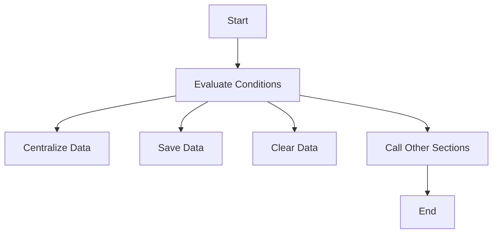

This document will cover the CORPO-PROGRAMA flow, which includes:

1. Evaluating conditions and performing actions
2. Calling other sections based on conditions
3. Ensuring structured execution of program logic.

Technical document: <SwmLink doc-title="Overview of CORPO-PROGRAMA">[Overview of CORPO-PROGRAMA](/.swm/overview-of-corpo-programa.t1j6kj2v.sw.md)</SwmLink>

# Evaluating Conditions and Performing Actions

The CORPO-PROGRAMA section acts as the main driver of the application's flow. It evaluates various conditions and performs corresponding actions such as centralizing data, saving data, and clearing data. This ensures that the program's logic is executed in a structured manner based on the conditions evaluated.

# Calling Other Sections Based on Conditions

The CORPO-PROGRAMA section also calls other sections to perform specific tasks. For example, it might call the VERIFICAR-ASSUNTO section to evaluate the subject and perform different actions based on its value. This ensures that the right tasks are performed under the right conditions.

# Ensuring Structured Execution of Program Logic

By evaluating conditions and calling other sections, the CORPO-PROGRAMA section ensures that the program's logic is executed in a structured and orderly manner. This is crucial for maintaining the integrity and reliability of the application's flow.

&nbsp;

*This is an auto-generated document by Swimm AI 🌊 and has not yet been verified by a human*

<SwmMeta version="3.0.0" repo-id="Z2l0aHViJTNBJTNBa2VsbG8lM0ElM0Fzd2ltbWlv" repo-name="kello">Powered by [Swimm](/)</SwmMeta>
