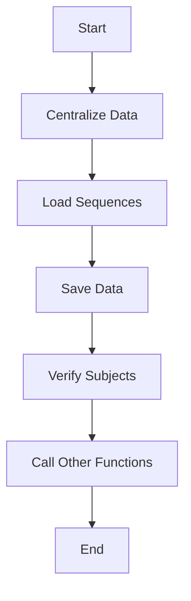

This document will cover the CORPO-PROGRAMA feature, which includes:

1. Centralizing data
2. Loading sequences
3. Saving data
4. Verifying subjects
5. Calling other functions based on conditions.

Technical document: <SwmLink doc-title="Overview of CORPO-PROGRAMA">[Overview of CORPO-PROGRAMA](/.swm/overview-of-corpo-programa.q1qoh4iu.sw.md)</SwmLink>

# Centralizing Data

The CORPO-PROGRAMA function begins by centralizing data. This step ensures that all relevant data is gathered and organized in a central location. This is crucial for maintaining data integrity and consistency across the system. For the end user, this means that all their data is up-to-date and accurately reflected in the system.

# Loading Sequences

Next, the function loads various sequences. This involves retrieving and preparing data sequences that are necessary for subsequent operations. For the end user, this step ensures that the system has all the necessary data ready for processing, which improves efficiency and reduces wait times.

# Saving Data

The function then saves data. This step involves writing the gathered and processed data to the database. It ensures that all changes and updates are securely stored. For the end user, this means that their data is safely saved and can be retrieved accurately in the future.

# Verifying Subjects

The function verifies subjects by evaluating specific conditions related to the data. This step ensures that the data meets certain criteria before proceeding. For the end user, this means that the system performs checks to ensure data accuracy and validity, reducing errors and improving data quality.

# Calling Other Functions Based on Conditions

Finally, the function calls other functions based on specific conditions. This involves delegating tasks to other parts of the system to perform specialized operations. For the end user, this means that the system can handle complex workflows efficiently by breaking them down into smaller, manageable tasks.

&nbsp;

*This is an auto-generated document by Swimm AI 🌊 and has not yet been verified by a human*

<SwmMeta version="3.0.0" repo-id="Z2l0aHViJTNBJTNBa2VsbG8lM0ElM0Fzd2ltbWlv" repo-name="kello">Powered by [Swimm](/)</SwmMeta>
