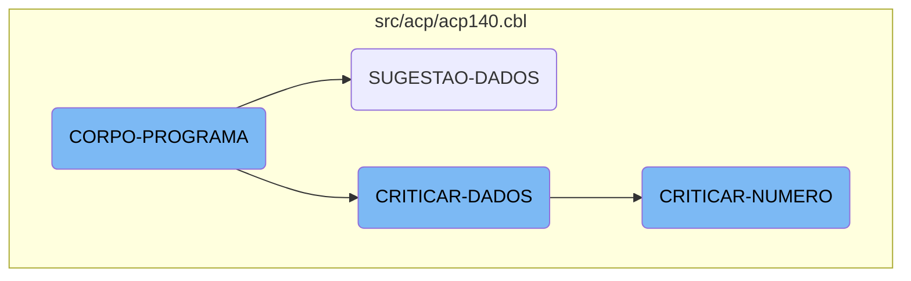
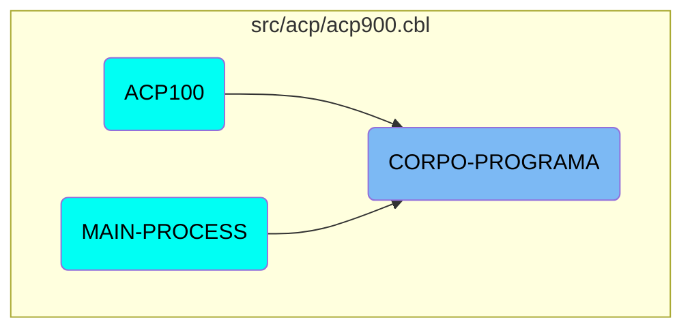

The <SwmToken path="src/acp/acp900.cbl" pos="342:1:3" line-data="       CORPO-PROGRAMA SECTION.">`CORPO-PROGRAMA`</SwmToken> function is a central control structure that evaluates various conditions and performs corresponding actions. It handles tasks such as centralizing data, loading sequences, saving data, and verifying subjects. This function orchestrates the flow by calling other functions like <SwmToken path="src/acp/acp900.cbl" pos="361:3:5" line-data="                    PERFORM VERIFICAR-ASSUNTO">`VERIFICAR-ASSUNTO`</SwmToken> and <SwmToken path="src/acp/acp900.cbl" pos="404:7:9" line-data="               WHEN 4  PERFORM CHAMAR-DPT">`CHAMAR-DPT`</SwmToken> based on specific conditions.

The <SwmToken path="src/acp/acp900.cbl" pos="342:1:3" line-data="       CORPO-PROGRAMA SECTION.">`CORPO-PROGRAMA`</SwmToken> function is like the main conductor of an orchestra. It checks different conditions and decides what actions to take next. For example, it can centralize data, load sequences, save data, or verify subjects. Depending on what it finds, it calls other functions to do specific tasks. Think of it as a manager who delegates tasks to different team members based on the situation.

Here is a high level diagram of the flow, showing only the most important functions:

```mermaid
graph TD;
      subgraph src/acp
11ae7c33bf40efa150a62a66e2f0a78dc415eb5b0e9a591602cd4e3b9011ea32(CORPO-PROGRAMA):::mainFlowStyle --> fbf43d7ff59c1d09ba719960ebc572d5f94e9e6331a7c4c4cec19ed0607bd7dc(VERIFICAR-ASSUNTO):::mainFlowStyle
end

subgraph src/acp
fbf43d7ff59c1d09ba719960ebc572d5f94e9e6331a7c4c4cec19ed0607bd7dc(VERIFICAR-ASSUNTO):::mainFlowStyle --> 74304efbdb49bbfd59c4e0d40b36bfce6bce9c90734702a91fc88f6a79106b8b(CHAMAR-DPT):::mainFlowStyle
end

subgraph src/acp
74304efbdb49bbfd59c4e0d40b36bfce6bce9c90734702a91fc88f6a79106b8b(CHAMAR-DPT):::mainFlowStyle --> 9536b31af5cff0cc75c58a78dd91e556df07434c89bdc7506a653c9d00a3dd44(ACP140):::mainFlowStyle
end

subgraph src/acp
9536b31af5cff0cc75c58a78dd91e556df07434c89bdc7506a653c9d00a3dd44(ACP140):::mainFlowStyle --> 9955a54a89dea1b45c1540fa1b922541515a3a241a33faea6bcb1a0a1d001e5c(SUGESTAO-DADOS)
end

subgraph src/acp
9536b31af5cff0cc75c58a78dd91e556df07434c89bdc7506a653c9d00a3dd44(ACP140):::mainFlowStyle --> cc64e43afe48061e6d78c9b89c7534688ccbac799af9c4bfab75e9d233a5aa65(CORPO-PROGRAMA):::mainFlowStyle
end

subgraph src/acp
cc64e43afe48061e6d78c9b89c7534688ccbac799af9c4bfab75e9d233a5aa65(CORPO-PROGRAMA):::mainFlowStyle --> 9955a54a89dea1b45c1540fa1b922541515a3a241a33faea6bcb1a0a1d001e5c(SUGESTAO-DADOS)
end

subgraph src/acp
cc64e43afe48061e6d78c9b89c7534688ccbac799af9c4bfab75e9d233a5aa65(CORPO-PROGRAMA):::mainFlowStyle --> a05f16221fad2dac1e3c7505ea18ad4c22fa6bee2237a5769420d256d079c043(CRITICAR-DADOS):::mainFlowStyle
end

subgraph src/acp
a05f16221fad2dac1e3c7505ea18ad4c22fa6bee2237a5769420d256d079c043(CRITICAR-DADOS):::mainFlowStyle --> 3a00c1ca30cf8eed4824de6e61ceab220ba318fcf83879d7ee90c0a17f49fb17(CRITICAR-NUMERO):::mainFlowStyle
end


      classDef mainFlowStyle color:#000000,fill:#7CB9F4
classDef rootsStyle color:#000000,fill:#00FFF4
classDef Style1 color:#000000,fill:#00FFAA
classDef Style2 color:#000000,fill:#FFFF00
classDef Style3 color:#000000,fill:#AA7CB9

%% Swimm:
%% graph TD;
%%       subgraph <SwmPath>[src/acp/](src/acp/)</SwmPath>
%% 11ae7c33bf40efa150a62a66e2f0a78dc415eb5b0e9a591602cd4e3b9011ea32(CORPO-PROGRAMA):::mainFlowStyle --> fbf43d7ff59c1d09ba719960ebc572d5f94e9e6331a7c4c4cec19ed0607bd7dc(VERIFICAR-ASSUNTO):::mainFlowStyle
%% end
%% 
%% subgraph <SwmPath>[src/acp/](src/acp/)</SwmPath>
%% fbf43d7ff59c1d09ba719960ebc572d5f94e9e6331a7c4c4cec19ed0607bd7dc(VERIFICAR-ASSUNTO):::mainFlowStyle --> 74304efbdb49bbfd59c4e0d40b36bfce6bce9c90734702a91fc88f6a79106b8b(CHAMAR-DPT):::mainFlowStyle
%% end
%% 
%% subgraph <SwmPath>[src/acp/](src/acp/)</SwmPath>
%% 74304efbdb49bbfd59c4e0d40b36bfce6bce9c90734702a91fc88f6a79106b8b(CHAMAR-DPT):::mainFlowStyle --> 9536b31af5cff0cc75c58a78dd91e556df07434c89bdc7506a653c9d00a3dd44(ACP140):::mainFlowStyle
%% end
%% 
%% subgraph <SwmPath>[src/acp/](src/acp/)</SwmPath>
%% 9536b31af5cff0cc75c58a78dd91e556df07434c89bdc7506a653c9d00a3dd44(ACP140):::mainFlowStyle --> 9955a54a89dea1b45c1540fa1b922541515a3a241a33faea6bcb1a0a1d001e5c(SUGESTAO-DADOS)
%% end
%% 
%% subgraph <SwmPath>[src/acp/](src/acp/)</SwmPath>
%% 9536b31af5cff0cc75c58a78dd91e556df07434c89bdc7506a653c9d00a3dd44(ACP140):::mainFlowStyle --> cc64e43afe48061e6d78c9b89c7534688ccbac799af9c4bfab75e9d233a5aa65(CORPO-PROGRAMA):::mainFlowStyle
%% end
%% 
%% subgraph <SwmPath>[src/acp/](src/acp/)</SwmPath>
%% cc64e43afe48061e6d78c9b89c7534688ccbac799af9c4bfab75e9d233a5aa65(CORPO-PROGRAMA):::mainFlowStyle --> 9955a54a89dea1b45c1540fa1b922541515a3a241a33faea6bcb1a0a1d001e5c(SUGESTAO-DADOS)
%% end
%% 
%% subgraph <SwmPath>[src/acp/](src/acp/)</SwmPath>
%% cc64e43afe48061e6d78c9b89c7534688ccbac799af9c4bfab75e9d233a5aa65(CORPO-PROGRAMA):::mainFlowStyle --> a05f16221fad2dac1e3c7505ea18ad4c22fa6bee2237a5769420d256d079c043(CRITICAR-DADOS):::mainFlowStyle
%% end
%% 
%% subgraph <SwmPath>[src/acp/](src/acp/)</SwmPath>
%% a05f16221fad2dac1e3c7505ea18ad4c22fa6bee2237a5769420d256d079c043(CRITICAR-DADOS):::mainFlowStyle --> 3a00c1ca30cf8eed4824de6e61ceab220ba318fcf83879d7ee90c0a17f49fb17(CRITICAR-NUMERO):::mainFlowStyle
%% end
%% 
%% 
%%       classDef mainFlowStyle color:#000000,fill:#7CB9F4
%% classDef rootsStyle color:#000000,fill:#00FFF4
%% classDef Style1 color:#000000,fill:#00FFAA
%% classDef Style2 color:#000000,fill:#FFFF00
%% classDef Style3 color:#000000,fill:#AA7CB9
```



# Flow drill down

First, we'll zoom into this section of the flow:

```mermaid
graph TD;
      subgraph src/acp
11ae7c33bf40efa150a62a66e2f0a78dc415eb5b0e9a591602cd4e3b9011ea32(CORPO-PROGRAMA):::mainFlowStyle --> fbf43d7ff59c1d09ba719960ebc572d5f94e9e6331a7c4c4cec19ed0607bd7dc(VERIFICAR-ASSUNTO):::mainFlowStyle
end

subgraph src/acp
fbf43d7ff59c1d09ba719960ebc572d5f94e9e6331a7c4c4cec19ed0607bd7dc(VERIFICAR-ASSUNTO):::mainFlowStyle --> 74304efbdb49bbfd59c4e0d40b36bfce6bce9c90734702a91fc88f6a79106b8b(CHAMAR-DPT):::mainFlowStyle
end

subgraph src/acp
74304efbdb49bbfd59c4e0d40b36bfce6bce9c90734702a91fc88f6a79106b8b(CHAMAR-DPT):::mainFlowStyle --> 9536b31af5cff0cc75c58a78dd91e556df07434c89bdc7506a653c9d00a3dd44(ACP140):::mainFlowStyle
end

subgraph src/acp
9536b31af5cff0cc75c58a78dd91e556df07434c89bdc7506a653c9d00a3dd44(ACP140):::mainFlowStyle --> 9955a54a89dea1b45c1540fa1b922541515a3a241a33faea6bcb1a0a1d001e5c(SUGESTAO-DADOS)
end

subgraph src/acp
9536b31af5cff0cc75c58a78dd91e556df07434c89bdc7506a653c9d00a3dd44(ACP140):::mainFlowStyle --> cc64e43afe48061e6d78c9b89c7534688ccbac799af9c4bfab75e9d233a5aa65(CORPO-PROGRAMA):::mainFlowStyle
end

subgraph src/acp
cc64e43afe48061e6d78c9b89c7534688ccbac799af9c4bfab75e9d233a5aa65(CORPO-PROGRAMA):::mainFlowStyle --> 8mhjg(...)
end


      classDef mainFlowStyle color:#000000,fill:#7CB9F4
classDef rootsStyle color:#000000,fill:#00FFF4
classDef Style1 color:#000000,fill:#00FFAA
classDef Style2 color:#000000,fill:#FFFF00
classDef Style3 color:#000000,fill:#AA7CB9

%% Swimm:
%% graph TD;
%%       subgraph <SwmPath>[src/acp/](src/acp/)</SwmPath>
%% 11ae7c33bf40efa150a62a66e2f0a78dc415eb5b0e9a591602cd4e3b9011ea32(CORPO-PROGRAMA):::mainFlowStyle --> fbf43d7ff59c1d09ba719960ebc572d5f94e9e6331a7c4c4cec19ed0607bd7dc(VERIFICAR-ASSUNTO):::mainFlowStyle
%% end
%% 
%% subgraph <SwmPath>[src/acp/](src/acp/)</SwmPath>
%% fbf43d7ff59c1d09ba719960ebc572d5f94e9e6331a7c4c4cec19ed0607bd7dc(VERIFICAR-ASSUNTO):::mainFlowStyle --> 74304efbdb49bbfd59c4e0d40b36bfce6bce9c90734702a91fc88f6a79106b8b(CHAMAR-DPT):::mainFlowStyle
%% end
%% 
%% subgraph <SwmPath>[src/acp/](src/acp/)</SwmPath>
%% 74304efbdb49bbfd59c4e0d40b36bfce6bce9c90734702a91fc88f6a79106b8b(CHAMAR-DPT):::mainFlowStyle --> 9536b31af5cff0cc75c58a78dd91e556df07434c89bdc7506a653c9d00a3dd44(ACP140):::mainFlowStyle
%% end
%% 
%% subgraph <SwmPath>[src/acp/](src/acp/)</SwmPath>
%% 9536b31af5cff0cc75c58a78dd91e556df07434c89bdc7506a653c9d00a3dd44(ACP140):::mainFlowStyle --> 9955a54a89dea1b45c1540fa1b922541515a3a241a33faea6bcb1a0a1d001e5c(SUGESTAO-DADOS)
%% end
%% 
%% subgraph <SwmPath>[src/acp/](src/acp/)</SwmPath>
%% 9536b31af5cff0cc75c58a78dd91e556df07434c89bdc7506a653c9d00a3dd44(ACP140):::mainFlowStyle --> cc64e43afe48061e6d78c9b89c7534688ccbac799af9c4bfab75e9d233a5aa65(CORPO-PROGRAMA):::mainFlowStyle
%% end
%% 
%% subgraph <SwmPath>[src/acp/](src/acp/)</SwmPath>
%% cc64e43afe48061e6d78c9b89c7534688ccbac799af9c4bfab75e9d233a5aa65(CORPO-PROGRAMA):::mainFlowStyle --> 8mhjg(...)
%% end
%% 
%% 
%%       classDef mainFlowStyle color:#000000,fill:#7CB9F4
%% classDef rootsStyle color:#000000,fill:#00FFF4
%% classDef Style1 color:#000000,fill:#00FFAA
%% classDef Style2 color:#000000,fill:#FFFF00
%% classDef Style3 color:#000000,fill:#AA7CB9
```



<SwmSnippet path="/src/acp/acp900.cbl" line="342">

---

## <SwmToken path="src/acp/acp900.cbl" pos="342:1:3" line-data="       CORPO-PROGRAMA SECTION.">`CORPO-PROGRAMA`</SwmToken>

The <SwmToken path="src/acp/acp900.cbl" pos="342:1:3" line-data="       CORPO-PROGRAMA SECTION.">`CORPO-PROGRAMA`</SwmToken> function is a central control structure that evaluates various conditions and performs corresponding actions. It handles tasks such as centralizing data, loading sequences, saving data, and verifying subjects. This function orchestrates the flow by calling other functions like <SwmToken path="src/acp/acp900.cbl" pos="361:3:5" line-data="                    PERFORM VERIFICAR-ASSUNTO">`VERIFICAR-ASSUNTO`</SwmToken> and <SwmToken path="src/acp/acp900.cbl" pos="404:7:9" line-data="               WHEN 4  PERFORM CHAMAR-DPT">`CHAMAR-DPT`</SwmToken> based on specific conditions.

```cobol
       CORPO-PROGRAMA SECTION.
           EVALUATE TRUE
               WHEN CENTRALIZA-TRUE
                    PERFORM CENTRALIZAR
               WHEN GS-CARREGA-SB-TRUE
                    PERFORM CARREGAR-SB
               WHEN GS-CARREGA-SEQ-TRUE
                    PERFORM LIMPAR-DADOS
                    PERFORM CARREGA-ULT-SEQ
               WHEN GS-CARREGA-DISPLAY-TRUE
                    PERFORM CARREGAR-DISPLAY
               WHEN GS-CARREGA-HISTORICO-TRUE
                    PERFORM CARREGAR-HISTORICO
               WHEN GS-SAVE-FLG-TRUE
                    PERFORM SALVAR-DADOS
                    IF GS-TIPO-GRAVACAO = 1 PERFORM REGRAVA-DADOS
                    ELSE PERFORM GRAVA-DADOS
                    END-IF
                    PERFORM LIMPAR-DADOS
                    PERFORM VERIFICAR-ASSUNTO
               WHEN GS-EXCLUI-FLG-TRUE
```

---

</SwmSnippet>

<SwmSnippet path="/src/acp/acp900.cbl" line="399">

---

## <SwmToken path="src/acp/acp900.cbl" pos="399:1:3" line-data="       VERIFICAR-ASSUNTO SECTION.">`VERIFICAR-ASSUNTO`</SwmToken>

The <SwmToken path="src/acp/acp900.cbl" pos="399:1:3" line-data="       VERIFICAR-ASSUNTO SECTION.">`VERIFICAR-ASSUNTO`</SwmToken> function evaluates the subject (<SwmToken path="src/acp/acp900.cbl" pos="400:3:5" line-data="           EVALUATE AUX-ASSUNTO">`AUX-ASSUNTO`</SwmToken>) and performs different actions based on its value. It can call various functions like <SwmToken path="src/acp/acp900.cbl" pos="401:7:9" line-data="               WHEN 1  PERFORM CHAMAR-MIN">`CHAMAR-MIN`</SwmToken>, <SwmToken path="src/acp/acp900.cbl" pos="402:7:9" line-data="               WHEN 2  PERFORM CHAMAR-DCR">`CHAMAR-DCR`</SwmToken>, <SwmToken path="src/acp/acp900.cbl" pos="403:7:9" line-data="               WHEN 3  PERFORM CHAMAR-OS">`CHAMAR-OS`</SwmToken>, <SwmToken path="src/acp/acp900.cbl" pos="404:7:9" line-data="               WHEN 4  PERFORM CHAMAR-DPT">`CHAMAR-DPT`</SwmToken>, and <SwmToken path="src/acp/acp900.cbl" pos="405:7:9" line-data="               WHEN 5  PERFORM CHAMAR-MEMO">`CHAMAR-MEMO`</SwmToken>. If the subject does not match any predefined values, it sets an error message.

```cobol
       VERIFICAR-ASSUNTO SECTION.
           EVALUATE AUX-ASSUNTO
               WHEN 1  PERFORM CHAMAR-MIN
               WHEN 2  PERFORM CHAMAR-DCR
               WHEN 3  PERFORM CHAMAR-OS
               WHEN 4  PERFORM CHAMAR-DPT
               WHEN 5  PERFORM CHAMAR-MEMO
               WHEN OTHER MOVE "Problema com relação ao Assunto" TO
                          MENSAGEM
                          MOVE "C" TO TIPO-MSG
                          PERFORM EXIBIR-MENSAGEM.
```

---

</SwmSnippet>

<SwmSnippet path="/src/acp/acp900.cbl" line="432">

---

## <SwmToken path="src/acp/acp900.cbl" pos="432:1:3" line-data="       CHAMAR-DPT SECTION.">`CHAMAR-DPT`</SwmToken>

The <SwmToken path="src/acp/acp900.cbl" pos="432:1:3" line-data="       CHAMAR-DPT SECTION.">`CHAMAR-DPT`</SwmToken> function prepares a string (<SwmToken path="src/acp/acp900.cbl" pos="434:7:11" line-data="           MOVE SPACES TO PASSAR-STRING-1">`PASSAR-STRING-1`</SwmToken>) with specific data and calls the <SwmToken path="src/acp/acp900.cbl" pos="436:4:4" line-data="           CALL &quot;ACP140&quot; USING PASSAR-STRING-1">`ACP140`</SwmToken> program using this string. This function is responsible for initiating the <SwmToken path="src/acp/acp900.cbl" pos="436:4:4" line-data="           CALL &quot;ACP140&quot; USING PASSAR-STRING-1">`ACP140`</SwmToken> process.

```cobol
       CHAMAR-DPT SECTION.
           MOVE FUNCTION CURRENT-DATE TO WS-DATA-SYS
           MOVE SPACES TO PASSAR-STRING-1
           STRING TIPO-CADASTRO WS-DATA-CPU AUX-SEQ INTO PASSAR-STRING-1
           CALL "ACP140" USING PASSAR-STRING-1
           CANCEL "ACP140".
```

---

</SwmSnippet>

<SwmSnippet path="/src/acp/acp140.cbl" line="140">

---

## <SwmToken path="src/acp/acp900.cbl" pos="436:4:4" line-data="           CALL &quot;ACP140&quot; USING PASSAR-STRING-1">`ACP140`</SwmToken>

The <SwmToken path="src/acp/acp900.cbl" pos="436:4:4" line-data="           CALL &quot;ACP140&quot; USING PASSAR-STRING-1">`ACP140`</SwmToken> function is a comprehensive process that includes multiple sections for initializing the program, processing data, and performing various data validations (<SwmToken path="src/acp/acp140.cbl" pos="272:1:3" line-data="       CRITICAR-DADOS SECTION.">`CRITICAR-DADOS`</SwmToken>, <SwmToken path="src/acp/acp140.cbl" pos="275:11:13" line-data="               WHEN &quot;EF-NUMERO&quot;          PERFORM CRITICAR-NUMERO">`CRITICAR-NUMERO`</SwmToken>, etc.). It also includes sections for suggesting data (<SwmToken path="src/acp/acp140.cbl" pos="704:1:3" line-data="       SUGESTAO-DADOS SECTION.">`SUGESTAO-DADOS`</SwmToken>) and handling different types of data operations.

```cobol
       MAIN-PROCESS SECTION.
           PERFORM INICIALIZA-PROGRAMA.
           PERFORM CORPO-PROGRAMA UNTIL EXIT-FLG-TRUE.
           GO FINALIZAR-PROGRAMA.

       INICIALIZA-PROGRAMA SECTION.
           ACCEPT PARAMETROS-W FROM COMMAND-LINE.
           ACCEPT DATA6-W FROM DATE.
           ACCEPT HORA-BRA FROM TIME.

           MOVE ZEROS TO PAGE-COUNT ERRO-W.
           INITIALIZE DATA-BLOCK
           INITIALIZE DS-CONTROL-BLOCK
           MOVE DATA-BLOCK-VERSION-NO
                                   TO DS-DATA-BLOCK-VERSION-NO
           MOVE VERSION-NO  TO DS-VERSION-NO
           MOVE EMPRESA-W          TO EMP-REC
           MOVE "ACD140" TO ARQ-REC.   MOVE EMPRESA-REF TO PATH-ACD140.
           MOVE "ACD141" TO ARQ-REC.   MOVE EMPRESA-REF TO PATH-ACD141.
           MOVE "CGD010" TO ARQ-REC.   MOVE EMPRESA-REF TO PATH-CGD010.
           MOVE "CAD010" TO ARQ-REC.   MOVE EMPRESA-REF TO PATH-CAD010.
```

---

</SwmSnippet>

<SwmSnippet path="/src/acp/acp140.cbl" line="704">

---

### <SwmToken path="src/acp/acp140.cbl" pos="704:1:3" line-data="       SUGESTAO-DADOS SECTION.">`SUGESTAO-DADOS`</SwmToken>

The <SwmToken path="src/acp/acp140.cbl" pos="704:1:3" line-data="       SUGESTAO-DADOS SECTION.">`SUGESTAO-DADOS`</SwmToken> function evaluates the field to be critiqued (<SwmToken path="src/acp/acp140.cbl" pos="705:3:5" line-data="           EVALUATE CAMPO-CRITICA">`CAMPO-CRITICA`</SwmToken>) and performs corresponding suggestion functions like <SwmToken path="src/acp/acp140.cbl" pos="706:11:13" line-data="               WHEN &quot;EF-CONTRATO&quot;    PERFORM SUGESTAO-CONTRATO">`SUGESTAO-CONTRATO`</SwmToken>, <SwmToken path="src/acp/acp140.cbl" pos="707:11:13" line-data="               WHEN &quot;EF-CIDADE&quot;      PERFORM SUGESTAO-CIDADE">`SUGESTAO-CIDADE`</SwmToken>, etc. If no matching suggestion is found, it sets a default message indicating that no suggestion is available.

```cobol
       SUGESTAO-DADOS SECTION.
           EVALUATE CAMPO-CRITICA
               WHEN "EF-CONTRATO"    PERFORM SUGESTAO-CONTRATO
               WHEN "EF-CIDADE"      PERFORM SUGESTAO-CIDADE
               WHEN "EF-PORT-ORIG"   PERFORM SUGESTAO-PORT-ORIG
               WHEN "EF-CIDADE-ORIG" PERFORM SUGESTAO-CIDADE-ORIG
               WHEN "EF-PORT-NOVO"   PERFORM SUGESTAO-PORT-NOVO
               WHEN "EF-CIDADE-NOVO" PERFORM SUGESTAO-CIDADE-NOVO
               WHEN OTHER    MOVE "Sugestão Inexistente" TO MENSAGEM
                             MOVE "C" TO TIPO-MSG
                             PERFORM EXIBIR-MENSAGEM.
```

---

</SwmSnippet>

Now, lets zoom into this section of the flow:



<SwmSnippet path="/src/acp/acp140.cbl" line="231">

---

## <SwmToken path="src/acp/acp140.cbl" pos="231:1:3" line-data="       CORPO-PROGRAMA SECTION.">`CORPO-PROGRAMA`</SwmToken>

The <SwmToken path="src/acp/acp140.cbl" pos="231:1:3" line-data="       CORPO-PROGRAMA SECTION.">`CORPO-PROGRAMA`</SwmToken> function is the main driver of the flow. It evaluates various conditions and performs corresponding actions such as centralizing data, saving data, clearing data, and calling other sections like <SwmToken path="src/acp/acp140.cbl" pos="272:1:3" line-data="       CRITICAR-DADOS SECTION.">`CRITICAR-DADOS`</SwmToken> and <SwmToken path="src/acp/acp140.cbl" pos="704:1:3" line-data="       SUGESTAO-DADOS SECTION.">`SUGESTAO-DADOS`</SwmToken>. This function orchestrates the overall process by determining the next steps based on the current state and flags.

```cobol
       CORPO-PROGRAMA SECTION.
           EVALUATE TRUE
               WHEN CENTRALIZA-TRUE
                    PERFORM CENTRALIZAR
               WHEN SAVE-FLG-TRUE
                    PERFORM SALVAR-DADOS
                    PERFORM LIMPAR-DADOS
                    MOVE ACP-NUMERO TO NUMERO-AC140
                    READ ACD140 INVALID KEY
                         PERFORM LIMPAR-DADOS
                         PERFORM PROCURAR-PROXIMO
                         MOVE "LIMPAR-LB" TO DS-PROCEDURE
                         PERFORM CALL-DIALOG-SYSTEM
                         PERFORM SET-UP-FOR-REFRESH-SCREEN
                         MOVE 1 TO GRAVA-W
                    NOT INVALID KEY
                         PERFORM MONTAR-DATA-BLOCK
                         PERFORM SET-UP-FOR-REFRESH-SCREEN
                    END-READ
                    PERFORM LIMPAR-DADOS
                    PERFORM PROCURAR-PROXIMO
```

---

</SwmSnippet>

<SwmSnippet path="/src/acp/acp140.cbl" line="272">

---

## <SwmToken path="src/acp/acp140.cbl" pos="272:1:3" line-data="       CRITICAR-DADOS SECTION.">`CRITICAR-DADOS`</SwmToken>

The <SwmToken path="src/acp/acp140.cbl" pos="272:1:3" line-data="       CRITICAR-DADOS SECTION.">`CRITICAR-DADOS`</SwmToken> function is responsible for validating different fields. It uses an <SwmToken path="src/acp/acp140.cbl" pos="274:1:1" line-data="           EVALUATE CAMPO-CRITICA">`EVALUATE`</SwmToken> statement to check the value of <SwmToken path="src/acp/acp140.cbl" pos="274:3:5" line-data="           EVALUATE CAMPO-CRITICA">`CAMPO-CRITICA`</SwmToken> and performs the corresponding validation routine, such as <SwmToken path="src/acp/acp140.cbl" pos="275:11:13" line-data="               WHEN &quot;EF-NUMERO&quot;          PERFORM CRITICAR-NUMERO">`CRITICAR-NUMERO`</SwmToken>, <SwmToken path="src/acp/acp140.cbl" pos="276:11:13" line-data="               WHEN &quot;EF-ASSUNTO&quot;         PERFORM CRITICAR-ASSUNTO">`CRITICAR-ASSUNTO`</SwmToken>, and others. This function ensures that the data meets the required criteria before proceeding further in the flow.

```cobol
       CRITICAR-DADOS SECTION.
           MOVE 0 TO FLAG-CRITICA
           EVALUATE CAMPO-CRITICA
               WHEN "EF-NUMERO"          PERFORM CRITICAR-NUMERO
               WHEN "EF-ASSUNTO"         PERFORM CRITICAR-ASSUNTO
               WHEN "EF-CONTRATO"        PERFORM CRITICAR-CONTRATO
               WHEN "EF-EMITENTE"        PERFORM CRITICAR-EMITENTE
               WHEN "EF-CIDADE"          PERFORM CRITICAR-CIDADE
               WHEN "EF-DOC-ORIG"        PERFORM CRITICAR-DOC-ORIG
               WHEN "EF-PARCELA-ORIG"    PERFORM CRITICAR-PARCELA-ORIG
               WHEN "SB-TIPO-ORIG"       PERFORM CRITICAR-TIPO-ORIG
               WHEN "EF-BANCO-ORIG"      PERFORM CRITICAR-BANCO-ORIG
               WHEN "EF-VALOR-ORIG"      PERFORM CRITICAR-VALOR-ORIG
               WHEN "EF-VENCTO-ORIG"     PERFORM CRITICAR-VENCTO-ORIG
               WHEN "EF-PORT-ORIG"       PERFORM CRITICAR-POR-ORIG
               WHEN "EF-CIDADE-ORIG"     PERFORM CRITICAR-CIDADE-ORIG
               WHEN "EF-IDENTIF"         PERFORM CRITICAR-IDENTIF
               WHEN "EF-DATA-PROPOSTA"   PERFORM CRITICAR-DATA-PROPOSTA
               WHEN "EF-BANCO-AGENCIA"   PERFORM CRITICAR-BANCO-AGENCIA
               WHEN "EF-VALOR"           PERFORM CRITICAR-VALOR-PROPOSTA
               WHEN "EF-EMITENTE-NOVO"   PERFORM CRITICAR-EMITENTE-NOVO
```

---

</SwmSnippet>

<SwmSnippet path="/src/acp/acp140.cbl" line="313">

---

## <SwmToken path="src/acp/acp140.cbl" pos="313:1:3" line-data="       CRITICAR-NUMERO SECTION.">`CRITICAR-NUMERO`</SwmToken>

The <SwmToken path="src/acp/acp140.cbl" pos="313:1:3" line-data="       CRITICAR-NUMERO SECTION.">`CRITICAR-NUMERO`</SwmToken> function specifically handles the validation of the <SwmToken path="src/acp/acp140.cbl" pos="313:3:3" line-data="       CRITICAR-NUMERO SECTION.">`NUMERO`</SwmToken> field. It checks if the <SwmToken path="src/acp/acp140.cbl" pos="314:3:3" line-data="           IF MENSAGEM EQUAL SPACES">`MENSAGEM`</SwmToken> is empty and if <SwmToken path="src/acp/acp140.cbl" pos="315:3:5" line-data="               IF ACP-NUMERO EQUAL ZEROS">`ACP-NUMERO`</SwmToken> is zero, then moves <SwmToken path="src/acp/acp140.cbl" pos="316:3:5" line-data="                  MOVE NUMERO-W TO ACP-NUMERO">`NUMERO-W`</SwmToken> to <SwmToken path="src/acp/acp140.cbl" pos="315:3:5" line-data="               IF ACP-NUMERO EQUAL ZEROS">`ACP-NUMERO`</SwmToken>. It also reads the <SwmToken path="src/acp/acp140.cbl" pos="320:3:3" line-data="                  READ ACD140 INVALID KEY">`ACD140`</SwmToken> file and performs additional steps like clearing data and refreshing the screen based on the validation results. This function ensures that the <SwmToken path="src/acp/acp140.cbl" pos="313:3:3" line-data="       CRITICAR-NUMERO SECTION.">`NUMERO`</SwmToken> field is correctly validated and updated.

```cobol
       CRITICAR-NUMERO SECTION.
           IF MENSAGEM EQUAL SPACES
               IF ACP-NUMERO EQUAL ZEROS
                  MOVE NUMERO-W TO ACP-NUMERO
                  PERFORM SET-UP-FOR-REFRESH-SCREEN
               ELSE
                  MOVE ACP-NUMERO TO NUMERO-AC140
                  READ ACD140 INVALID KEY
                      IF CAMPO-CRITICA = "EF-NUMERO"
                         PERFORM LIMPAR-DADOS
                         MOVE "LIMPAR-LB" TO DS-PROCEDURE
                         PERFORM CALL-DIALOG-SYSTEM
                      END-IF
                      PERFORM PROCURAR-PROXIMO
                      PERFORM SET-UP-FOR-REFRESH-SCREEN
                      MOVE 1 TO GRAVA-W
                  NOT INVALID KEY
                      IF CAMPO-CRITICA = "EF-NUMERO"
                         PERFORM MONTAR-DATA-BLOCK
                         PERFORM SET-UP-FOR-REFRESH-SCREEN.
```

---

</SwmSnippet>

# Where is this flow used?

This flow is used multiple times in the codebase as represented in the following diagram:



&nbsp;

*This is an auto-generated document by Swimm AI 🌊 and has not yet been verified by a human*

<SwmMeta version="3.0.0" repo-id="Z2l0aHViJTNBJTNBa2VsbG8lM0ElM0Fzd2ltbWlv" repo-name="kello"><sup>Powered by [Swimm](/)</sup></SwmMeta>
