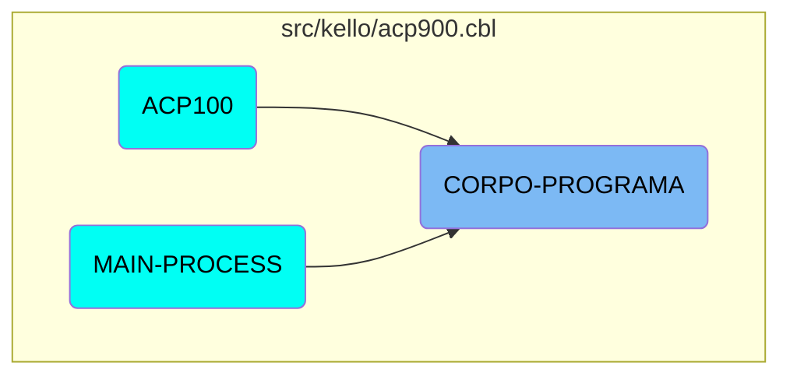

The <SwmToken path="src/kello/acp900.cbl" pos="342:1:3" line-data="       CORPO-PROGRAMA SECTION.">`CORPO-PROGRAMA`</SwmToken> section is a crucial part of the application's flow. It evaluates various conditions and performs corresponding actions such as centralizing data, saving data, clearing data, and calling other sections. This section ensures that the program's logic is executed in a structured manner based on the conditions evaluated.

The <SwmToken path="src/kello/acp900.cbl" pos="342:1:3" line-data="       CORPO-PROGRAMA SECTION.">`CORPO-PROGRAMA`</SwmToken> section acts like a traffic controller. It checks different conditions and decides what actions to take next. For example, it might centralize data, save it, or clear it. It also calls other sections to perform specific tasks. This way, it ensures that everything happens in the right order and under the right conditions.

Here is a high level diagram of the flow, showing only the most important functions:

```mermaid
graph TD;
      subgraph src/kello
b38a8f47259b2aa0c93b92bcaa9b45d9dc82a371a01162e87752352ffe96e634(CORPO-PROGRAMA):::mainFlowStyle --> e97d201b7bf01ba28ef7c1dbf3e0f8ade013759455e0276445e7379205c0f025(VERIFICAR-ASSUNTO):::mainFlowStyle
end

subgraph src/kello
e97d201b7bf01ba28ef7c1dbf3e0f8ade013759455e0276445e7379205c0f025(VERIFICAR-ASSUNTO):::mainFlowStyle --> f89cc48ea56c089d2e67512b1c66b7ff6981ad20f8746456e783537e4c4b8ebb(CHAMAR-DPT):::mainFlowStyle
end

subgraph src/kello
f89cc48ea56c089d2e67512b1c66b7ff6981ad20f8746456e783537e4c4b8ebb(CHAMAR-DPT):::mainFlowStyle --> 56954448ebfe20e73242e51df58bba1b7dfac8126ef3764e5f86e444ff3cdc0c(ACP140):::mainFlowStyle
end

subgraph src/kello
56954448ebfe20e73242e51df58bba1b7dfac8126ef3764e5f86e444ff3cdc0c(ACP140):::mainFlowStyle --> 7a4f88bde776eda2e42319afef819f65d1f3516ac6adf6fdc5e3274d5a56f328(SUGESTAO-DADOS)
end

subgraph src/kello
56954448ebfe20e73242e51df58bba1b7dfac8126ef3764e5f86e444ff3cdc0c(ACP140):::mainFlowStyle --> fe52a44c43e62f0e0f324fb05e66a820c3ee8e073b7ad5c4d534758b20ae82f6(CORPO-PROGRAMA):::mainFlowStyle
end

subgraph src/kello
fe52a44c43e62f0e0f324fb05e66a820c3ee8e073b7ad5c4d534758b20ae82f6(CORPO-PROGRAMA):::mainFlowStyle --> 7a4f88bde776eda2e42319afef819f65d1f3516ac6adf6fdc5e3274d5a56f328(SUGESTAO-DADOS)
end

subgraph src/kello
fe52a44c43e62f0e0f324fb05e66a820c3ee8e073b7ad5c4d534758b20ae82f6(CORPO-PROGRAMA):::mainFlowStyle --> 851f89e70e7d86d3c6397ffad956702abe196a347c2c484753050fff19c82f94(CRITICAR-DADOS):::mainFlowStyle
end

subgraph src/kello
851f89e70e7d86d3c6397ffad956702abe196a347c2c484753050fff19c82f94(CRITICAR-DADOS):::mainFlowStyle --> 15f7a901d4c2466cd76f54a17a4333fc0b894cb35c2bcc0073c9c35561b11c2d(CRITICAR-NUMERO):::mainFlowStyle
end

subgraph src/kello
15f7a901d4c2466cd76f54a17a4333fc0b894cb35c2bcc0073c9c35561b11c2d(CRITICAR-NUMERO):::mainFlowStyle --> afd29e6d4e5e157e0a4eb72d3dfcaed2f83e4c2bc9d87930c2c68113eec3ca46(MONTAR-DATA-BLOCK):::mainFlowStyle
end


      classDef mainFlowStyle color:#000000,fill:#7CB9F4
classDef rootsStyle color:#000000,fill:#00FFF4
classDef Style1 color:#000000,fill:#00FFAA
classDef Style2 color:#000000,fill:#FFFF00
classDef Style3 color:#000000,fill:#AA7CB9

%% Swimm:
%% graph TD;
%%       subgraph <SwmPath>[src/kello/](src/kello/)</SwmPath>
%% b38a8f47259b2aa0c93b92bcaa9b45d9dc82a371a01162e87752352ffe96e634(CORPO-PROGRAMA):::mainFlowStyle --> e97d201b7bf01ba28ef7c1dbf3e0f8ade013759455e0276445e7379205c0f025(VERIFICAR-ASSUNTO):::mainFlowStyle
%% end
%% 
%% subgraph <SwmPath>[src/kello/](src/kello/)</SwmPath>
%% e97d201b7bf01ba28ef7c1dbf3e0f8ade013759455e0276445e7379205c0f025(VERIFICAR-ASSUNTO):::mainFlowStyle --> f89cc48ea56c089d2e67512b1c66b7ff6981ad20f8746456e783537e4c4b8ebb(CHAMAR-DPT):::mainFlowStyle
%% end
%% 
%% subgraph <SwmPath>[src/kello/](src/kello/)</SwmPath>
%% f89cc48ea56c089d2e67512b1c66b7ff6981ad20f8746456e783537e4c4b8ebb(CHAMAR-DPT):::mainFlowStyle --> 56954448ebfe20e73242e51df58bba1b7dfac8126ef3764e5f86e444ff3cdc0c(ACP140):::mainFlowStyle
%% end
%% 
%% subgraph <SwmPath>[src/kello/](src/kello/)</SwmPath>
%% 56954448ebfe20e73242e51df58bba1b7dfac8126ef3764e5f86e444ff3cdc0c(ACP140):::mainFlowStyle --> 7a4f88bde776eda2e42319afef819f65d1f3516ac6adf6fdc5e3274d5a56f328(SUGESTAO-DADOS)
%% end
%% 
%% subgraph <SwmPath>[src/kello/](src/kello/)</SwmPath>
%% 56954448ebfe20e73242e51df58bba1b7dfac8126ef3764e5f86e444ff3cdc0c(ACP140):::mainFlowStyle --> fe52a44c43e62f0e0f324fb05e66a820c3ee8e073b7ad5c4d534758b20ae82f6(CORPO-PROGRAMA):::mainFlowStyle
%% end
%% 
%% subgraph <SwmPath>[src/kello/](src/kello/)</SwmPath>
%% fe52a44c43e62f0e0f324fb05e66a820c3ee8e073b7ad5c4d534758b20ae82f6(CORPO-PROGRAMA):::mainFlowStyle --> 7a4f88bde776eda2e42319afef819f65d1f3516ac6adf6fdc5e3274d5a56f328(SUGESTAO-DADOS)
%% end
%% 
%% subgraph <SwmPath>[src/kello/](src/kello/)</SwmPath>
%% fe52a44c43e62f0e0f324fb05e66a820c3ee8e073b7ad5c4d534758b20ae82f6(CORPO-PROGRAMA):::mainFlowStyle --> 851f89e70e7d86d3c6397ffad956702abe196a347c2c484753050fff19c82f94(CRITICAR-DADOS):::mainFlowStyle
%% end
%% 
%% subgraph <SwmPath>[src/kello/](src/kello/)</SwmPath>
%% 851f89e70e7d86d3c6397ffad956702abe196a347c2c484753050fff19c82f94(CRITICAR-DADOS):::mainFlowStyle --> 15f7a901d4c2466cd76f54a17a4333fc0b894cb35c2bcc0073c9c35561b11c2d(CRITICAR-NUMERO):::mainFlowStyle
%% end
%% 
%% subgraph <SwmPath>[src/kello/](src/kello/)</SwmPath>
%% 15f7a901d4c2466cd76f54a17a4333fc0b894cb35c2bcc0073c9c35561b11c2d(CRITICAR-NUMERO):::mainFlowStyle --> afd29e6d4e5e157e0a4eb72d3dfcaed2f83e4c2bc9d87930c2c68113eec3ca46(MONTAR-DATA-BLOCK):::mainFlowStyle
%% end
%% 
%% 
%%       classDef mainFlowStyle color:#000000,fill:#7CB9F4
%% classDef rootsStyle color:#000000,fill:#00FFF4
%% classDef Style1 color:#000000,fill:#00FFAA
%% classDef Style2 color:#000000,fill:#FFFF00
%% classDef Style3 color:#000000,fill:#AA7CB9
```



# Flow drill down

First, we'll zoom into this section of the flow:

```mermaid
graph TD;
      subgraph src/kello
b38a8f47259b2aa0c93b92bcaa9b45d9dc82a371a01162e87752352ffe96e634(CORPO-PROGRAMA):::mainFlowStyle --> e97d201b7bf01ba28ef7c1dbf3e0f8ade013759455e0276445e7379205c0f025(VERIFICAR-ASSUNTO):::mainFlowStyle
end

subgraph src/kello
e97d201b7bf01ba28ef7c1dbf3e0f8ade013759455e0276445e7379205c0f025(VERIFICAR-ASSUNTO):::mainFlowStyle --> f89cc48ea56c089d2e67512b1c66b7ff6981ad20f8746456e783537e4c4b8ebb(CHAMAR-DPT):::mainFlowStyle
end

subgraph src/kello
f89cc48ea56c089d2e67512b1c66b7ff6981ad20f8746456e783537e4c4b8ebb(CHAMAR-DPT):::mainFlowStyle --> 56954448ebfe20e73242e51df58bba1b7dfac8126ef3764e5f86e444ff3cdc0c(ACP140):::mainFlowStyle
end

subgraph src/kello
56954448ebfe20e73242e51df58bba1b7dfac8126ef3764e5f86e444ff3cdc0c(ACP140):::mainFlowStyle --> 7a4f88bde776eda2e42319afef819f65d1f3516ac6adf6fdc5e3274d5a56f328(SUGESTAO-DADOS)
end

subgraph src/kello
56954448ebfe20e73242e51df58bba1b7dfac8126ef3764e5f86e444ff3cdc0c(ACP140):::mainFlowStyle --> fe52a44c43e62f0e0f324fb05e66a820c3ee8e073b7ad5c4d534758b20ae82f6(CORPO-PROGRAMA):::mainFlowStyle
end

subgraph src/kello
fe52a44c43e62f0e0f324fb05e66a820c3ee8e073b7ad5c4d534758b20ae82f6(CORPO-PROGRAMA):::mainFlowStyle --> v8xst(...)
end


      classDef mainFlowStyle color:#000000,fill:#7CB9F4
classDef rootsStyle color:#000000,fill:#00FFF4
classDef Style1 color:#000000,fill:#00FFAA
classDef Style2 color:#000000,fill:#FFFF00
classDef Style3 color:#000000,fill:#AA7CB9

%% Swimm:
%% graph TD;
%%       subgraph <SwmPath>[src/kello/](src/kello/)</SwmPath>
%% b38a8f47259b2aa0c93b92bcaa9b45d9dc82a371a01162e87752352ffe96e634(CORPO-PROGRAMA):::mainFlowStyle --> e97d201b7bf01ba28ef7c1dbf3e0f8ade013759455e0276445e7379205c0f025(VERIFICAR-ASSUNTO):::mainFlowStyle
%% end
%% 
%% subgraph <SwmPath>[src/kello/](src/kello/)</SwmPath>
%% e97d201b7bf01ba28ef7c1dbf3e0f8ade013759455e0276445e7379205c0f025(VERIFICAR-ASSUNTO):::mainFlowStyle --> f89cc48ea56c089d2e67512b1c66b7ff6981ad20f8746456e783537e4c4b8ebb(CHAMAR-DPT):::mainFlowStyle
%% end
%% 
%% subgraph <SwmPath>[src/kello/](src/kello/)</SwmPath>
%% f89cc48ea56c089d2e67512b1c66b7ff6981ad20f8746456e783537e4c4b8ebb(CHAMAR-DPT):::mainFlowStyle --> 56954448ebfe20e73242e51df58bba1b7dfac8126ef3764e5f86e444ff3cdc0c(ACP140):::mainFlowStyle
%% end
%% 
%% subgraph <SwmPath>[src/kello/](src/kello/)</SwmPath>
%% 56954448ebfe20e73242e51df58bba1b7dfac8126ef3764e5f86e444ff3cdc0c(ACP140):::mainFlowStyle --> 7a4f88bde776eda2e42319afef819f65d1f3516ac6adf6fdc5e3274d5a56f328(SUGESTAO-DADOS)
%% end
%% 
%% subgraph <SwmPath>[src/kello/](src/kello/)</SwmPath>
%% 56954448ebfe20e73242e51df58bba1b7dfac8126ef3764e5f86e444ff3cdc0c(ACP140):::mainFlowStyle --> fe52a44c43e62f0e0f324fb05e66a820c3ee8e073b7ad5c4d534758b20ae82f6(CORPO-PROGRAMA):::mainFlowStyle
%% end
%% 
%% subgraph <SwmPath>[src/kello/](src/kello/)</SwmPath>
%% fe52a44c43e62f0e0f324fb05e66a820c3ee8e073b7ad5c4d534758b20ae82f6(CORPO-PROGRAMA):::mainFlowStyle --> v8xst(...)
%% end
%% 
%% 
%%       classDef mainFlowStyle color:#000000,fill:#7CB9F4
%% classDef rootsStyle color:#000000,fill:#00FFF4
%% classDef Style1 color:#000000,fill:#00FFAA
%% classDef Style2 color:#000000,fill:#FFFF00
%% classDef Style3 color:#000000,fill:#AA7CB9
```



<SwmSnippet path="/src/kello/acp900.cbl" line="342">

---

## <SwmToken path="src/kello/acp900.cbl" pos="342:1:3" line-data="       CORPO-PROGRAMA SECTION.">`CORPO-PROGRAMA`</SwmToken>

The <SwmToken path="src/kello/acp900.cbl" pos="342:1:3" line-data="       CORPO-PROGRAMA SECTION.">`CORPO-PROGRAMA`</SwmToken> function is the main driver of the flow. It evaluates various conditions and performs corresponding actions such as centralizing data, loading sequences, saving data, and verifying subjects. This function orchestrates the overall process by calling other functions based on specific conditions.

```cobol
       CORPO-PROGRAMA SECTION.
           EVALUATE TRUE
               WHEN CENTRALIZA-TRUE
                    PERFORM CENTRALIZAR
               WHEN GS-CARREGA-SB-TRUE
                    PERFORM CARREGAR-SB
               WHEN GS-CARREGA-SEQ-TRUE
                    PERFORM LIMPAR-DADOS
                    PERFORM CARREGA-ULT-SEQ
               WHEN GS-CARREGA-DISPLAY-TRUE
                    PERFORM CARREGAR-DISPLAY
               WHEN GS-CARREGA-HISTORICO-TRUE
                    PERFORM CARREGAR-HISTORICO
               WHEN GS-SAVE-FLG-TRUE
                    PERFORM SALVAR-DADOS
                    IF GS-TIPO-GRAVACAO = 1 PERFORM REGRAVA-DADOS
                    ELSE PERFORM GRAVA-DADOS
                    END-IF
                    PERFORM LIMPAR-DADOS
                    PERFORM VERIFICAR-ASSUNTO
               WHEN GS-EXCLUI-FLG-TRUE
```

---

</SwmSnippet>

<SwmSnippet path="/src/kello/acp900.cbl" line="399">

---

## <SwmToken path="src/kello/acp900.cbl" pos="399:1:3" line-data="       VERIFICAR-ASSUNTO SECTION.">`VERIFICAR-ASSUNTO`</SwmToken>

The <SwmToken path="src/kello/acp900.cbl" pos="399:1:3" line-data="       VERIFICAR-ASSUNTO SECTION.">`VERIFICAR-ASSUNTO`</SwmToken> function evaluates the subject (<SwmToken path="src/kello/acp900.cbl" pos="400:3:5" line-data="           EVALUATE AUX-ASSUNTO">`AUX-ASSUNTO`</SwmToken>) and performs different actions based on its value. It can call other functions like <SwmToken path="src/kello/acp900.cbl" pos="401:7:9" line-data="               WHEN 1  PERFORM CHAMAR-MIN">`CHAMAR-MIN`</SwmToken>, <SwmToken path="src/kello/acp900.cbl" pos="402:7:9" line-data="               WHEN 2  PERFORM CHAMAR-DCR">`CHAMAR-DCR`</SwmToken>, <SwmToken path="src/kello/acp900.cbl" pos="403:7:9" line-data="               WHEN 3  PERFORM CHAMAR-OS">`CHAMAR-OS`</SwmToken>, <SwmToken path="src/kello/acp900.cbl" pos="404:7:9" line-data="               WHEN 4  PERFORM CHAMAR-DPT">`CHAMAR-DPT`</SwmToken>, and <SwmToken path="src/kello/acp900.cbl" pos="405:7:9" line-data="               WHEN 5  PERFORM CHAMAR-MEMO">`CHAMAR-MEMO`</SwmToken>. If the subject does not match any predefined values, it sets an error message.

```cobol
       VERIFICAR-ASSUNTO SECTION.
           EVALUATE AUX-ASSUNTO
               WHEN 1  PERFORM CHAMAR-MIN
               WHEN 2  PERFORM CHAMAR-DCR
               WHEN 3  PERFORM CHAMAR-OS
               WHEN 4  PERFORM CHAMAR-DPT
               WHEN 5  PERFORM CHAMAR-MEMO
               WHEN OTHER MOVE "Problema com relação ao Assunto" TO
                          MENSAGEM
                          MOVE "C" TO TIPO-MSG
                          PERFORM EXIBIR-MENSAGEM.
```

---

</SwmSnippet>

<SwmSnippet path="/src/kello/acp900.cbl" line="432">

---

## <SwmToken path="src/kello/acp900.cbl" pos="432:1:3" line-data="       CHAMAR-DPT SECTION.">`CHAMAR-DPT`</SwmToken>

The <SwmToken path="src/kello/acp900.cbl" pos="432:1:3" line-data="       CHAMAR-DPT SECTION.">`CHAMAR-DPT`</SwmToken> function prepares a string with various data elements and calls the <SwmToken path="src/kello/acp900.cbl" pos="436:4:4" line-data="           CALL &quot;ACP140&quot; USING PASSAR-STRING-1">`ACP140`</SwmToken> program using this string. This function is responsible for delegating tasks to the <SwmToken path="src/kello/acp900.cbl" pos="436:4:4" line-data="           CALL &quot;ACP140&quot; USING PASSAR-STRING-1">`ACP140`</SwmToken> program.

```cobol
       CHAMAR-DPT SECTION.
           MOVE FUNCTION CURRENT-DATE TO WS-DATA-SYS
           MOVE SPACES TO PASSAR-STRING-1
           STRING TIPO-CADASTRO WS-DATA-CPU AUX-SEQ INTO PASSAR-STRING-1
           CALL "ACP140" USING PASSAR-STRING-1
           CANCEL "ACP140".
```

---

</SwmSnippet>

<SwmSnippet path="/src/kello/acp140.cbl" line="140">

---

## <SwmToken path="src/kello/acp900.cbl" pos="436:4:4" line-data="           CALL &quot;ACP140&quot; USING PASSAR-STRING-1">`ACP140`</SwmToken>

The <SwmToken path="src/kello/acp900.cbl" pos="436:4:4" line-data="           CALL &quot;ACP140&quot; USING PASSAR-STRING-1">`ACP140`</SwmToken> program contains multiple sections that handle different aspects of data processing and validation. It includes sections for initializing the program, processing data, and suggesting data. The <SwmToken path="src/kello/acp140.cbl" pos="704:1:3" line-data="       SUGESTAO-DADOS SECTION.">`SUGESTAO-DADOS`</SwmToken> section is particularly important for providing suggestions based on specific criteria.

```cobol
       MAIN-PROCESS SECTION.
           PERFORM INICIALIZA-PROGRAMA.
           PERFORM CORPO-PROGRAMA UNTIL EXIT-FLG-TRUE.
           GO FINALIZAR-PROGRAMA.

       INICIALIZA-PROGRAMA SECTION.
           ACCEPT PARAMETROS-W FROM COMMAND-LINE.
           ACCEPT DATA6-W FROM DATE.
           ACCEPT HORA-BRA FROM TIME.

           MOVE ZEROS TO PAGE-COUNT ERRO-W.
           INITIALIZE DATA-BLOCK
           INITIALIZE DS-CONTROL-BLOCK
           MOVE DATA-BLOCK-VERSION-NO
                                   TO DS-DATA-BLOCK-VERSION-NO
           MOVE VERSION-NO  TO DS-VERSION-NO
           MOVE EMPRESA-W          TO EMP-REC
           MOVE "ACD140" TO ARQ-REC.   MOVE EMPRESA-REF TO PATH-ACD140.
           MOVE "ACD141" TO ARQ-REC.   MOVE EMPRESA-REF TO PATH-ACD141.
           MOVE "CGD010" TO ARQ-REC.   MOVE EMPRESA-REF TO PATH-CGD010.
           MOVE "CAD010" TO ARQ-REC.   MOVE EMPRESA-REF TO PATH-CAD010.
```

---

</SwmSnippet>

<SwmSnippet path="/src/kello/acp140.cbl" line="704">

---

### <SwmToken path="src/kello/acp140.cbl" pos="704:1:3" line-data="       SUGESTAO-DADOS SECTION.">`SUGESTAO-DADOS`</SwmToken>

The <SwmToken path="src/kello/acp140.cbl" pos="704:1:3" line-data="       SUGESTAO-DADOS SECTION.">`SUGESTAO-DADOS`</SwmToken> section evaluates the <SwmToken path="src/kello/acp140.cbl" pos="705:3:5" line-data="           EVALUATE CAMPO-CRITICA">`CAMPO-CRITICA`</SwmToken> and performs corresponding suggestion actions. If no matching suggestion is found, it sets an error message. This section is crucial for providing data suggestions based on predefined criteria.

```cobol
       SUGESTAO-DADOS SECTION.
           EVALUATE CAMPO-CRITICA
               WHEN "EF-CONTRATO"    PERFORM SUGESTAO-CONTRATO
               WHEN "EF-CIDADE"      PERFORM SUGESTAO-CIDADE
               WHEN "EF-PORT-ORIG"   PERFORM SUGESTAO-PORT-ORIG
               WHEN "EF-CIDADE-ORIG" PERFORM SUGESTAO-CIDADE-ORIG
               WHEN "EF-PORT-NOVO"   PERFORM SUGESTAO-PORT-NOVO
               WHEN "EF-CIDADE-NOVO" PERFORM SUGESTAO-CIDADE-NOVO
               WHEN OTHER    MOVE "Sugestão Inexistente" TO MENSAGEM
                             MOVE "C" TO TIPO-MSG
                             PERFORM EXIBIR-MENSAGEM.
```

---

</SwmSnippet>

Now, lets zoom into this section of the flow:

```mermaid
graph TD;
      subgraph src/kello/acp140.cbl
fe52a44c43e62f0e0f324fb05e66a820c3ee8e073b7ad5c4d534758b20ae82f6(CORPO-PROGRAMA):::mainFlowStyle --> 7a4f88bde776eda2e42319afef819f65d1f3516ac6adf6fdc5e3274d5a56f328(SUGESTAO-DADOS)
end

subgraph src/kello/acp140.cbl
fe52a44c43e62f0e0f324fb05e66a820c3ee8e073b7ad5c4d534758b20ae82f6(CORPO-PROGRAMA):::mainFlowStyle --> 851f89e70e7d86d3c6397ffad956702abe196a347c2c484753050fff19c82f94(CRITICAR-DADOS):::mainFlowStyle
end

subgraph src/kello/acp140.cbl
851f89e70e7d86d3c6397ffad956702abe196a347c2c484753050fff19c82f94(CRITICAR-DADOS):::mainFlowStyle --> 15f7a901d4c2466cd76f54a17a4333fc0b894cb35c2bcc0073c9c35561b11c2d(CRITICAR-NUMERO):::mainFlowStyle
end

subgraph src/kello/acp140.cbl
15f7a901d4c2466cd76f54a17a4333fc0b894cb35c2bcc0073c9c35561b11c2d(CRITICAR-NUMERO):::mainFlowStyle --> afd29e6d4e5e157e0a4eb72d3dfcaed2f83e4c2bc9d87930c2c68113eec3ca46(MONTAR-DATA-BLOCK):::mainFlowStyle
end


      classDef mainFlowStyle color:#000000,fill:#7CB9F4
classDef rootsStyle color:#000000,fill:#00FFF4
classDef Style1 color:#000000,fill:#00FFAA
classDef Style2 color:#000000,fill:#FFFF00
classDef Style3 color:#000000,fill:#AA7CB9

%% Swimm:
%% graph TD;
%%       subgraph <SwmPath>[src/kello/acp140.cbl](src/kello/acp140.cbl)</SwmPath>
%% fe52a44c43e62f0e0f324fb05e66a820c3ee8e073b7ad5c4d534758b20ae82f6(CORPO-PROGRAMA):::mainFlowStyle --> 7a4f88bde776eda2e42319afef819f65d1f3516ac6adf6fdc5e3274d5a56f328(SUGESTAO-DADOS)
%% end
%% 
%% subgraph <SwmPath>[src/kello/acp140.cbl](src/kello/acp140.cbl)</SwmPath>
%% fe52a44c43e62f0e0f324fb05e66a820c3ee8e073b7ad5c4d534758b20ae82f6(CORPO-PROGRAMA):::mainFlowStyle --> 851f89e70e7d86d3c6397ffad956702abe196a347c2c484753050fff19c82f94(CRITICAR-DADOS):::mainFlowStyle
%% end
%% 
%% subgraph <SwmPath>[src/kello/acp140.cbl](src/kello/acp140.cbl)</SwmPath>
%% 851f89e70e7d86d3c6397ffad956702abe196a347c2c484753050fff19c82f94(CRITICAR-DADOS):::mainFlowStyle --> 15f7a901d4c2466cd76f54a17a4333fc0b894cb35c2bcc0073c9c35561b11c2d(CRITICAR-NUMERO):::mainFlowStyle
%% end
%% 
%% subgraph <SwmPath>[src/kello/acp140.cbl](src/kello/acp140.cbl)</SwmPath>
%% 15f7a901d4c2466cd76f54a17a4333fc0b894cb35c2bcc0073c9c35561b11c2d(CRITICAR-NUMERO):::mainFlowStyle --> afd29e6d4e5e157e0a4eb72d3dfcaed2f83e4c2bc9d87930c2c68113eec3ca46(MONTAR-DATA-BLOCK):::mainFlowStyle
%% end
%% 
%% 
%%       classDef mainFlowStyle color:#000000,fill:#7CB9F4
%% classDef rootsStyle color:#000000,fill:#00FFF4
%% classDef Style1 color:#000000,fill:#00FFAA
%% classDef Style2 color:#000000,fill:#FFFF00
%% classDef Style3 color:#000000,fill:#AA7CB9
```



<SwmSnippet path="/src/kello/acp140.cbl" line="231">

---

## <SwmToken path="src/kello/acp140.cbl" pos="231:1:3" line-data="       CORPO-PROGRAMA SECTION.">`CORPO-PROGRAMA`</SwmToken>

The <SwmToken path="src/kello/acp140.cbl" pos="231:1:3" line-data="       CORPO-PROGRAMA SECTION.">`CORPO-PROGRAMA`</SwmToken> section is the main driver of the program's flow. It evaluates various conditions and performs corresponding actions such as centralizing data, saving data, clearing data, and calling other sections like <SwmToken path="src/kello/acp140.cbl" pos="272:1:3" line-data="       CRITICAR-DADOS SECTION.">`CRITICAR-DADOS`</SwmToken> and <SwmToken path="src/kello/acp140.cbl" pos="247:3:7" line-data="                         PERFORM MONTAR-DATA-BLOCK">`MONTAR-DATA-BLOCK`</SwmToken>. This section ensures that the program's logic is executed in a structured manner based on the conditions evaluated.

```cobol
       CORPO-PROGRAMA SECTION.
           EVALUATE TRUE
               WHEN CENTRALIZA-TRUE
                    PERFORM CENTRALIZAR
               WHEN SAVE-FLG-TRUE
                    PERFORM SALVAR-DADOS
                    PERFORM LIMPAR-DADOS
                    MOVE ACP-NUMERO TO NUMERO-AC140
                    READ ACD140 INVALID KEY
                         PERFORM LIMPAR-DADOS
                         PERFORM PROCURAR-PROXIMO
                         MOVE "LIMPAR-LB" TO DS-PROCEDURE
                         PERFORM CALL-DIALOG-SYSTEM
                         PERFORM SET-UP-FOR-REFRESH-SCREEN
                         MOVE 1 TO GRAVA-W
                    NOT INVALID KEY
                         PERFORM MONTAR-DATA-BLOCK
                         PERFORM SET-UP-FOR-REFRESH-SCREEN
                    END-READ
                    PERFORM LIMPAR-DADOS
                    PERFORM PROCURAR-PROXIMO
```

---

</SwmSnippet>

<SwmSnippet path="/src/kello/acp140.cbl" line="272">

---

## <SwmToken path="src/kello/acp140.cbl" pos="272:1:3" line-data="       CRITICAR-DADOS SECTION.">`CRITICAR-DADOS`</SwmToken>

The <SwmToken path="src/kello/acp140.cbl" pos="272:1:3" line-data="       CRITICAR-DADOS SECTION.">`CRITICAR-DADOS`</SwmToken> section is responsible for validating various fields. It uses an <SwmToken path="src/kello/acp140.cbl" pos="274:1:1" line-data="           EVALUATE CAMPO-CRITICA">`EVALUATE`</SwmToken> statement to check the value of <SwmToken path="src/kello/acp140.cbl" pos="274:3:5" line-data="           EVALUATE CAMPO-CRITICA">`CAMPO-CRITICA`</SwmToken> and performs the corresponding validation routine. This ensures that the data being processed meets the required criteria before proceeding further.

```cobol
       CRITICAR-DADOS SECTION.
           MOVE 0 TO FLAG-CRITICA
           EVALUATE CAMPO-CRITICA
               WHEN "EF-NUMERO"          PERFORM CRITICAR-NUMERO
               WHEN "EF-ASSUNTO"         PERFORM CRITICAR-ASSUNTO
               WHEN "EF-CONTRATO"        PERFORM CRITICAR-CONTRATO
               WHEN "EF-EMITENTE"        PERFORM CRITICAR-EMITENTE
               WHEN "EF-CIDADE"          PERFORM CRITICAR-CIDADE
               WHEN "EF-DOC-ORIG"        PERFORM CRITICAR-DOC-ORIG
               WHEN "EF-PARCELA-ORIG"    PERFORM CRITICAR-PARCELA-ORIG
               WHEN "SB-TIPO-ORIG"       PERFORM CRITICAR-TIPO-ORIG
               WHEN "EF-BANCO-ORIG"      PERFORM CRITICAR-BANCO-ORIG
               WHEN "EF-VALOR-ORIG"      PERFORM CRITICAR-VALOR-ORIG
               WHEN "EF-VENCTO-ORIG"     PERFORM CRITICAR-VENCTO-ORIG
               WHEN "EF-PORT-ORIG"       PERFORM CRITICAR-POR-ORIG
               WHEN "EF-CIDADE-ORIG"     PERFORM CRITICAR-CIDADE-ORIG
               WHEN "EF-IDENTIF"         PERFORM CRITICAR-IDENTIF
               WHEN "EF-DATA-PROPOSTA"   PERFORM CRITICAR-DATA-PROPOSTA
               WHEN "EF-BANCO-AGENCIA"   PERFORM CRITICAR-BANCO-AGENCIA
               WHEN "EF-VALOR"           PERFORM CRITICAR-VALOR-PROPOSTA
               WHEN "EF-EMITENTE-NOVO"   PERFORM CRITICAR-EMITENTE-NOVO
```

---

</SwmSnippet>

<SwmSnippet path="/src/kello/acp140.cbl" line="313">

---

### <SwmToken path="src/kello/acp140.cbl" pos="313:1:3" line-data="       CRITICAR-NUMERO SECTION.">`CRITICAR-NUMERO`</SwmToken>

The <SwmToken path="src/kello/acp140.cbl" pos="313:1:3" line-data="       CRITICAR-NUMERO SECTION.">`CRITICAR-NUMERO`</SwmToken> section specifically handles the validation of numerical fields. It checks if the <SwmToken path="src/kello/acp140.cbl" pos="315:3:5" line-data="               IF ACP-NUMERO EQUAL ZEROS">`ACP-NUMERO`</SwmToken> is zero and assigns a new value if necessary. It also reads from the <SwmToken path="src/kello/acp140.cbl" pos="320:3:3" line-data="                  READ ACD140 INVALID KEY">`ACD140`</SwmToken> file and performs additional actions based on the validity of the key.

```cobol
       CRITICAR-NUMERO SECTION.
           IF MENSAGEM EQUAL SPACES
               IF ACP-NUMERO EQUAL ZEROS
                  MOVE NUMERO-W TO ACP-NUMERO
                  PERFORM SET-UP-FOR-REFRESH-SCREEN
               ELSE
                  MOVE ACP-NUMERO TO NUMERO-AC140
                  READ ACD140 INVALID KEY
                      IF CAMPO-CRITICA = "EF-NUMERO"
                         PERFORM LIMPAR-DADOS
                         MOVE "LIMPAR-LB" TO DS-PROCEDURE
                         PERFORM CALL-DIALOG-SYSTEM
                      END-IF
                      PERFORM PROCURAR-PROXIMO
                      PERFORM SET-UP-FOR-REFRESH-SCREEN
                      MOVE 1 TO GRAVA-W
                  NOT INVALID KEY
                      IF CAMPO-CRITICA = "EF-NUMERO"
                         PERFORM MONTAR-DATA-BLOCK
                         PERFORM SET-UP-FOR-REFRESH-SCREEN.
```

---

</SwmSnippet>

<SwmSnippet path="/src/kello/acp140.cbl" line="961">

---

## <SwmToken path="src/kello/acp140.cbl" pos="961:1:5" line-data="       MONTAR-DATA-BLOCK SECTION.">`MONTAR-DATA-BLOCK`</SwmToken>

The <SwmToken path="src/kello/acp140.cbl" pos="961:1:5" line-data="       MONTAR-DATA-BLOCK SECTION.">`MONTAR-DATA-BLOCK`</SwmToken> section is responsible for assembling the data block that will be used for further processing or reporting. It initializes various fields, reads data from files, and formats the data as required. This section ensures that all necessary data is correctly prepared and formatted before being used in subsequent operations.

```cobol
       MONTAR-DATA-BLOCK SECTION.
           perform 800-limpar-campos-detalhes
           perform 520-abrir-impressora

           MOVE 2                                 TO GRAVA-W

           MOVE TIPO-PROPOSTA-AC140               TO ACP-TIPO-PROPOSTA
           EVALUATE ACP-TIPO-PROPOSTA
               WHEN 1 MOVE "PROPOSTA-OP"              TO DS-PROCEDURE
                      PERFORM CALL-DIALOG-SYSTEM

                      MOVE "X"                   TO DET-OP
                      MOVE SPACES                TO DET-RDB

               WHEN 2 MOVE "PROPOSTA-RDB"             TO DS-PROCEDURE
                      PERFORM CALL-DIALOG-SYSTEM

                      MOVE SPACES                TO DET-OP
                      MOVE "X"                   TO DET-RDB

           END-EVALUATE
```

---

</SwmSnippet>

# Where is this flow used?

This flow is used multiple times in the codebase as represented in the following diagram:



&nbsp;

*This is an auto-generated document by Swimm AI 🌊 and has not yet been verified by a human*

<SwmMeta version="3.0.0" repo-id="Z2l0aHViJTNBJTNBa2VsbG8lM0ElM0Fzd2ltbWlv" repo-name="kello"><sup>Powered by [Swimm](/)</sup></SwmMeta>
