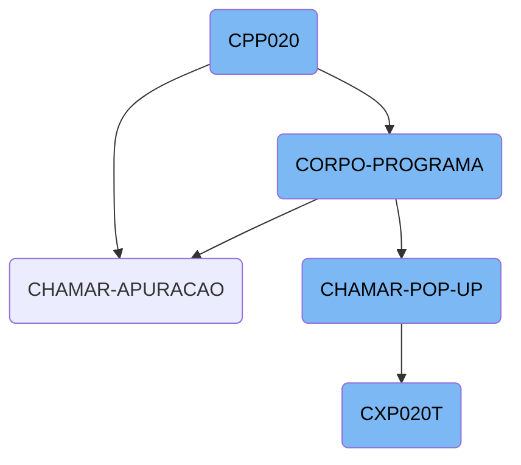
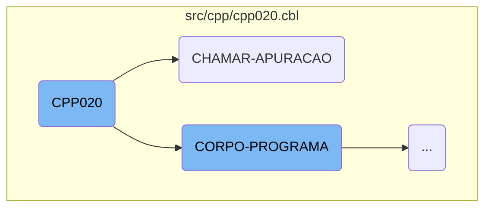
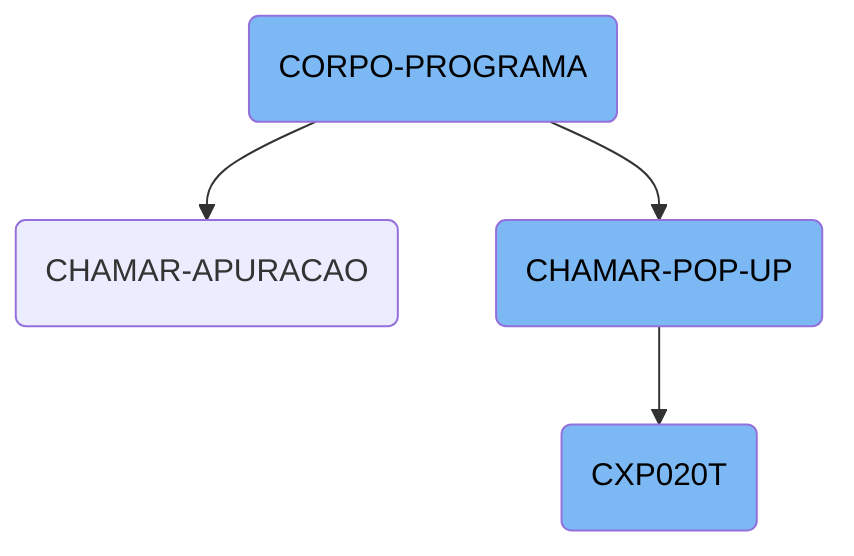

<SwmToken path="src/cpp/cpp020.cbl" pos="522:3:3" line-data="               WHEN CPP020-CENTRALIZA-TRUE">`CPP020`</SwmToken> is a core component of the Kello Imagens system, responsible for orchestrating various business operations. It initializes the program, evaluates conditions, performs actions, and manages user interactions through pop-ups.

The flow starts with initializing the program, setting up initial parameters. Then, it moves to the main logic section where different conditions are evaluated, and corresponding actions are performed. For example, if a certain flag is set, it might save data or load data based on other conditions. Additionally, it handles user interactions through pop-ups, calling other programs and moving data as needed. Finally, it ensures all necessary steps are performed in sequence to complete the operations.

Here is a high level diagram of the flow, showing only the most important functions:



# Flow drill down

First, we'll zoom into this section of the flow:



<SwmSnippet path="/src/cpp/cpp020.cbl" line="314">

---

## Main Process

The <SwmToken path="src/cpp/cpp020.cbl" pos="314:1:3" line-data="       MAIN-PROCESS SECTION.">`MAIN-PROCESS`</SwmToken> section initiates the program by performing the <SwmToken path="src/cpp/cpp020.cbl" pos="315:3:5" line-data="           PERFORM INICIALIZA-PROGRAMA.">`INICIALIZA-PROGRAMA`</SwmToken> section, which sets up initial parameters and configurations.

```cobol
       MAIN-PROCESS SECTION.
           PERFORM INICIALIZA-PROGRAMA.
```

---

</SwmSnippet>

<SwmSnippet path="/src/cpp/cpp020.cbl" line="520">

---

## Corpo Programa

The <SwmToken path="src/cpp/cpp020.cbl" pos="520:1:3" line-data="       CORPO-PROGRAMA SECTION.">`CORPO-PROGRAMA`</SwmToken> section evaluates the main logic of the program, handling various operations based on the conditions defined.

```cobol
       CORPO-PROGRAMA SECTION.
           EVALUATE TRUE
```

---

</SwmSnippet>

<SwmSnippet path="/src/cpp/cpp020.cbl" line="722">

---

## Chamar Apuracao

The <SwmToken path="src/cpp/cpp020.cbl" pos="722:1:3" line-data="       CHAMAR-APURACAO SECTION.">`CHAMAR-APURACAO`</SwmToken> section calls the <SwmToken path="src/cpp/cpp020.cbl" pos="723:4:4" line-data="           CALL   &quot;CXP020T&quot; USING PARAMETROS-W PASSAR-PARAMETROS">`CXP020T`</SwmToken> program using specific parameters, then moves a substring to <SwmToken path="src/cpp/cpp020.cbl" pos="725:17:21" line-data="           MOVE PASSAR-STRING-1(52: 5) TO CPP020-COD-APURACAO">`CPP020-COD-APURACAO`</SwmToken> and performs the <SwmToken path="src/cpp/cpp020.cbl" pos="726:3:7" line-data="           PERFORM LE-COD-APURACAO.">`LE-COD-APURACAO`</SwmToken> section.

```cobol
       CHAMAR-APURACAO SECTION.
           CALL   "CXP020T" USING PARAMETROS-W PASSAR-PARAMETROS
           CANCEL "CXP020T"
           MOVE PASSAR-STRING-1(52: 5) TO CPP020-COD-APURACAO
           PERFORM LE-COD-APURACAO.
```

---

</SwmSnippet>

Now, lets zoom into this section of the flow:



<SwmSnippet path="/src/cpp/cpp020.cbl" line="520">

---

## <SwmToken path="src/cpp/cpp020.cbl" pos="520:1:3" line-data="       CORPO-PROGRAMA SECTION.">`CORPO-PROGRAMA`</SwmToken>

The <SwmToken path="src/cpp/cpp020.cbl" pos="520:1:3" line-data="       CORPO-PROGRAMA SECTION.">`CORPO-PROGRAMA`</SwmToken> function is the main control structure that evaluates various conditions and performs corresponding actions. It handles different flags such as <SwmToken path="src/cpp/cpp020.cbl" pos="522:3:7" line-data="               WHEN CPP020-CENTRALIZA-TRUE">`CPP020-CENTRALIZA-TRUE`</SwmToken>, <SwmToken path="src/cpp/cpp020.cbl" pos="524:3:9" line-data="               WHEN CPP020-SAVE-FLG-TRUE">`CPP020-SAVE-FLG-TRUE`</SwmToken>, and many others to determine the flow of operations. For instance, if <SwmToken path="src/cpp/cpp020.cbl" pos="524:3:9" line-data="               WHEN CPP020-SAVE-FLG-TRUE">`CPP020-SAVE-FLG-TRUE`</SwmToken> is set, it checks the value of <SwmToken path="src/cpp/cpp020.cbl" pos="525:3:5" line-data="                   IF CPP020-PARCELA = 1">`CPP020-PARCELA`</SwmToken> and performs either <SwmToken path="src/cpp/cpp020.cbl" pos="526:3:5" line-data="                      PERFORM GRAVA-PARCELAS">`GRAVA-PARCELAS`</SwmToken> or <SwmToken path="src/cpp/cpp020.cbl" pos="528:3:5" line-data="                      PERFORM SALVAR-DADOS">`SALVAR-DADOS`</SwmToken>. This function is crucial for orchestrating the business logic based on the state of various flags.

```cobol
       CORPO-PROGRAMA SECTION.
           EVALUATE TRUE
               WHEN CPP020-CENTRALIZA-TRUE
                   PERFORM CENTRALIZAR
               WHEN CPP020-SAVE-FLG-TRUE
                   IF CPP020-PARCELA = 1
                      PERFORM GRAVA-PARCELAS
                   ELSE
                      PERFORM SALVAR-DADOS
                      IF CPP020-TIPO-GRAVACAO = 1
                         PERFORM REGRAVA-DADOS
                      ELSE
                         PERFORM GRAVA-DADOS
                      END-IF
                   END-IF
                   PERFORM LIMPAR-DADOS
                   MOVE "SET-POSICAO-CURSOR1" TO DS-PROCEDURE
               WHEN CPP020-LOAD-FLG-TRUE
                   PERFORM CARREGAR-DADOS
                   MOVE "SET-POSICAO-CURSOR1" TO DS-PROCEDURE
               WHEN CPP020-EXCLUI-FLG-TRUE
```

---

</SwmSnippet>

<SwmSnippet path="/src/cpp/cpp020.cbl" line="773">

---

## <SwmToken path="src/cpp/cpp020.cbl" pos="773:1:5" line-data="       CHAMAR-POP-UP SECTION.">`CHAMAR-POP-UP`</SwmToken>

The <SwmToken path="src/cpp/cpp020.cbl" pos="773:1:5" line-data="       CHAMAR-POP-UP SECTION.">`CHAMAR-POP-UP`</SwmToken> function is responsible for handling different <SwmToken path="src/cpp/cpp020.cbl" pos="773:3:5" line-data="       CHAMAR-POP-UP SECTION.">`POP-UP`</SwmToken> options based on the value of <SwmToken path="src/cpp/cpp020.cbl" pos="774:3:9" line-data="           EVALUATE CPP020-OPCAO-POP-UP">`CPP020-OPCAO-POP-UP`</SwmToken>. It performs specific actions such as calling other programs (<SwmToken path="src/cpp/cpp020.cbl" pos="779:8:8" line-data="             WHEN 2 CALL   &quot;CAP019T&quot; USING PARAMETROS-W">`CAP019T`</SwmToken>, <SwmToken path="src/cpp/cpp020.cbl" pos="785:8:8" line-data="             WHEN 3 CALL   &quot;CAP018T&quot; USING PARAMETROS-W">`CAP018T`</SwmToken>, etc.) and moving data to appropriate fields. This function is essential for managing user interactions through pop-ups and ensuring the correct data is displayed or modified.

```cobol
       CHAMAR-POP-UP SECTION.
           EVALUATE CPP020-OPCAO-POP-UP
             WHEN 1 PERFORM CARREGA-POP-UP-FORNEC
      *             CALL "CGP001T" USING PASSAR-PARAMETROS
      *             CANCEL "CGP001T"
      *             MOVE PASSAR-STRING-1(33: 6) TO CPP020-COD-FORN
             WHEN 2 CALL   "CAP019T" USING PARAMETROS-W
                                           PASSAR-PARAMETROS
                    CANCEL "CAP019T"
                    MOVE PASSAR-STRING-1(1: 30) TO
                         CPP020-DESCR-TIPO-FORN
                    MOVE PASSAR-STRING-1(33: 2) TO CPP020-TIPO-FORN
             WHEN 3 CALL   "CAP018T" USING PARAMETROS-W
                                           PASSAR-PARAMETROS
                    CANCEL "CAP018T"
                    MOVE PASSAR-STRING-1(1: 30) TO CPP020-DESCR-PORTADOR
                    MOVE PASSAR-STRING-1(33: 4) TO CPP020-PORTADOR
             WHEN 4
      *             PERFORM CARREGA-POP-UP-APURACAO
                    CALL "CXP020T" USING PARAMETROS-W PASSAR-PARAMETROS
                    CANCEL "CXP020T"
```

---

</SwmSnippet>

<SwmSnippet path="/src/cxp/cxp020t.cbl" line="2">

---

## <SwmToken path="src/cxp/cxp020t.cbl" pos="3:6:6" line-data="       PROGRAM-ID. CXP020T.">`CXP020T`</SwmToken>

The <SwmToken path="src/cxp/cxp020t.cbl" pos="3:6:6" line-data="       PROGRAM-ID. CXP020T.">`CXP020T`</SwmToken> function is a comprehensive section that includes various sub-sections like <SwmToken path="src/cpp/cpp020.cbl" pos="315:3:5" line-data="           PERFORM INICIALIZA-PROGRAMA.">`INICIALIZA-PROGRAMA`</SwmToken>, <SwmToken path="src/cpp/cpp020.cbl" pos="520:1:3" line-data="       CORPO-PROGRAMA SECTION.">`CORPO-PROGRAMA`</SwmToken>, and <SwmToken path="src/cpp/cpp020.cbl" pos="317:3:5" line-data="           GO FINALIZAR-PROGRAMA.">`FINALIZAR-PROGRAMA`</SwmToken>. It initializes the program, processes the main logic, and finalizes the program. The <SwmToken path="src/cpp/cpp020.cbl" pos="520:1:3" line-data="       CORPO-PROGRAMA SECTION.">`CORPO-PROGRAMA`</SwmToken> within <SwmToken path="src/cxp/cxp020t.cbl" pos="3:6:6" line-data="       PROGRAM-ID. CXP020T.">`CXP020T`</SwmToken> evaluates conditions and performs actions similar to the main <SwmToken path="src/cpp/cpp020.cbl" pos="520:1:3" line-data="       CORPO-PROGRAMA SECTION.">`CORPO-PROGRAMA`</SwmToken> function in <SwmPath>[src/cpp/cpp020.cbl](src/cpp/cpp020.cbl)</SwmPath>. This function is vital for the overall flow and execution of the program, ensuring that all necessary steps are performed in sequence.

```cobol
       IDENTIFICATION DIVISION.
       PROGRAM-ID. CXP020T.
      * AUTORA: MARELI AMÂNCIO VOLPATO
      * DATA: 28/08/1998
      * FUNCAO: CONSULTA POP-UP CONTAS APURACAO DE RESULTADOS
       ENVIRONMENT DIVISION.
       SPECIAL-NAMES.
       DECIMAL-POINT IS COMMA.
       class-control.
           Window             is class "wclass".

       INPUT-OUTPUT SECTION.
       FILE-CONTROL.
           COPY CXPX020.

       DATA DIVISION.
       FILE SECTION.
       COPY CXPW020.
       WORKING-STORAGE SECTION.
           COPY "CXP020T.CPB".
           COPY "CXP020T.CPY".
```

---

</SwmSnippet>

&nbsp;

*This is an auto-generated document by Swimm AI 🌊 and has not yet been verified by a human*

<SwmMeta version="3.0.0" repo-id="Z2l0aHViJTNBJTNBa2VsbG8lM0ElM0Fzd2ltbWlv" repo-name="kello"><sup>Powered by [Swimm](/)</sup></SwmMeta>
