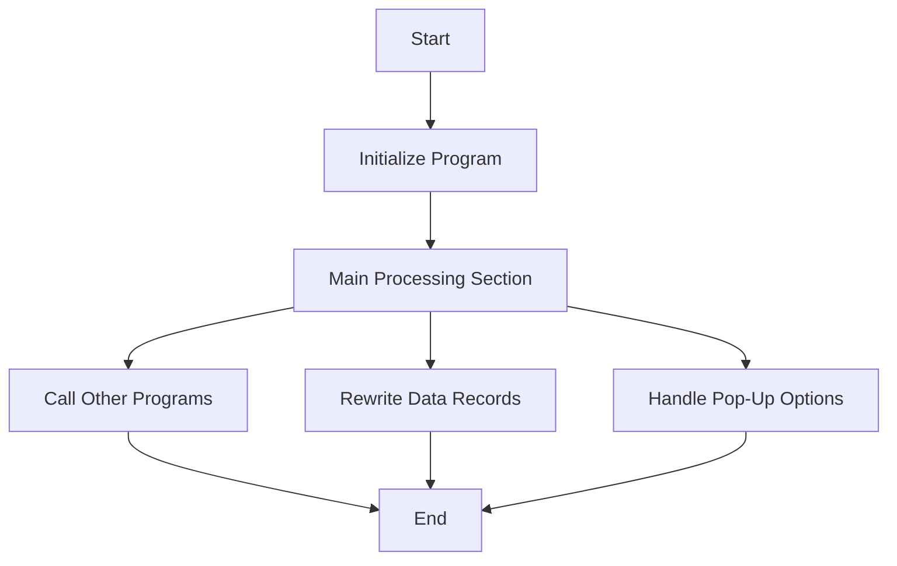

This document will cover the CPP020 program, which includes:

1. Initializing the program
2. Main processing section
3. Calling other programs
4. Rewriting data records
5. Handling pop-up options.

Technical document: <SwmLink doc-title="Overview of CPP020 Program">[Overview of CPP020 Program](/.swm/overview-of-cpp020-program.mvdqkxso.sw.md)</SwmLink>

# Initializing the program

The CPP020 program starts by accepting input parameters from the command line. It then sets up necessary data blocks and variables. This initialization step ensures that the program has all the required information and resources to proceed with its operations. For example, it moves company-related data to specific variables and initializes control blocks to manage the program's state.

# Main processing section

The main processing section, called CORPO-PROGRAMA, evaluates various conditions and performs corresponding actions. This section is crucial as it orchestrates the overall business logic by invoking various subroutines based on the evaluated conditions. For instance, it checks flags like CPP020-CENTRALIZA-TRUE and CPP020-SAVE-FLG-TRUE to determine whether to centralize data or save records.

# Calling other programs

The CHAMAR-APURACAO section is responsible for calling another program, CXP020T, with specific parameters. This allows the CPP020 program to delegate certain tasks to specialized subroutines, ensuring modularity and reusability. After the call, it moves a substring of the parameter to a local variable and performs a read operation on it.

# Rewriting data records

The REGRAVA-DADOS section handles the rewriting of data records. It validates the date limit, rewrites the record, logs the operation, and updates the list. If certain conditions are met, it performs additional operations like verifying and altering permanent records. This ensures data integrity and accurate record-keeping.

# Handling pop-up options

The CHAMAR-POP-UP section is responsible for handling different pop-up options. It evaluates the CPP020-OPCAO-POP-UP variable and performs actions such as loading supplier data, calling different subprograms like CAP019T, CAP018T, and CXP020T, and moving data between variables. This section is essential for managing user interactions through pop-ups and ensuring the correct data is displayed or processed.

&nbsp;

*This is an auto-generated document by Swimm AI 🌊 and has not yet been verified by a human*

<SwmMeta version="3.0.0" repo-id="Z2l0aHViJTNBJTNBa2VsbG8lM0ElM0Fzd2ltbWlv" repo-name="kello">Powered by [Swimm](/)</SwmMeta>
