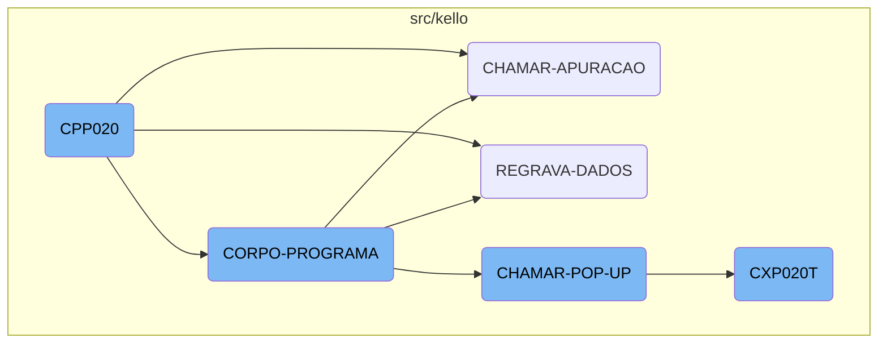
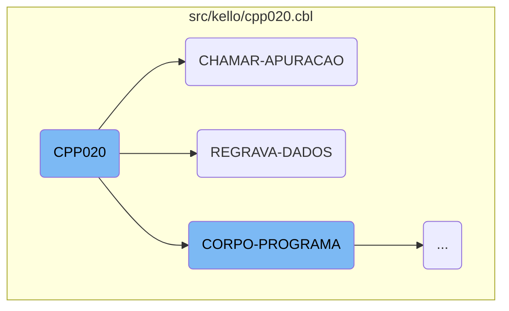
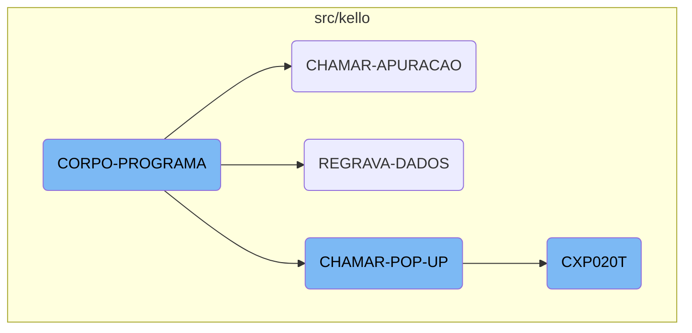

This document explains the <SwmToken path="src/kello/cpp020.cbl" pos="316:9:9" line-data="           PERFORM CORPO-PROGRAMA UNTIL CPP020-EXIT-FLG-TRUE.">`CPP020`</SwmToken> program, which is the main entry point of the Kello Imagens business operations management system. The program initializes by accepting parameters from the command line and then proceeds to the main processing section, where it evaluates various conditions and performs different operations based on the program's logic.

The <SwmToken path="src/kello/cpp020.cbl" pos="316:9:9" line-data="           PERFORM CORPO-PROGRAMA UNTIL CPP020-EXIT-FLG-TRUE.">`CPP020`</SwmToken> program starts by accepting input parameters from the command line. It then initializes the program by setting up necessary data blocks and variables. The main processing section, called <SwmToken path="src/kello/cpp020.cbl" pos="316:3:5" line-data="           PERFORM CORPO-PROGRAMA UNTIL CPP020-EXIT-FLG-TRUE.">`CORPO-PROGRAMA`</SwmToken>, evaluates different conditions and performs corresponding actions. For example, it can call other programs, rewrite data records, or handle user interactions through pop-ups. Each of these actions is performed by specific sections within the program, such as <SwmToken path="src/kello/cpp020.cbl" pos="722:1:3" line-data="       CHAMAR-APURACAO SECTION.">`CHAMAR-APURACAO`</SwmToken> for calling another program, <SwmToken path="src/kello/cpp020.cbl" pos="530:3:5" line-data="                         PERFORM REGRAVA-DADOS">`REGRAVA-DADOS`</SwmToken> for rewriting data records, and <SwmToken path="src/kello/cpp020.cbl" pos="773:1:5" line-data="       CHAMAR-POP-UP SECTION.">`CHAMAR-POP-UP`</SwmToken> for handling <SwmToken path="src/kello/cpp020.cbl" pos="773:3:5" line-data="       CHAMAR-POP-UP SECTION.">`POP-UP`</SwmToken> options.

Here is a high level diagram of the flow, showing only the most important functions:



# Flow drill down

First, we'll zoom into this section of the flow:



<SwmSnippet path="/src/kello/cpp020.cbl" line="314">

---

## <SwmToken path="src/kello/cpp020.cbl" pos="316:9:9" line-data="           PERFORM CORPO-PROGRAMA UNTIL CPP020-EXIT-FLG-TRUE.">`CPP020`</SwmToken>

The <SwmToken path="src/kello/cpp020.cbl" pos="316:9:9" line-data="           PERFORM CORPO-PROGRAMA UNTIL CPP020-EXIT-FLG-TRUE.">`CPP020`</SwmToken> function is the main entry point of the program. It initializes the program by accepting parameters from the command line and then proceeds to the main processing section. This section evaluates various conditions and performs different operations based on the program's logic.

```cobol
       MAIN-PROCESS SECTION.
           PERFORM INICIALIZA-PROGRAMA.
           PERFORM CORPO-PROGRAMA UNTIL CPP020-EXIT-FLG-TRUE.
           GO FINALIZAR-PROGRAMA.

       INICIALIZA-PROGRAMA SECTION.
           ACCEPT PARAMETROS-W FROM COMMAND-LINE.
           COPY "CBDATA1.CPY".
           MOVE DATA-INV TO DATA-MOVTO-W DATA-MOVTO-REL.
           MOVE ZEROS TO PAG-W ERRO-W.
           INITIALIZE CPP020-DATA-BLOCK
           INITIALIZE DS-CONTROL-BLOCK
           MOVE CPP020-DATA-BLOCK-VERSION-NO
                                   TO DS-DATA-BLOCK-VERSION-NO
           MOVE CPP020-VERSION-NO  TO DS-VERSION-NO
           MOVE EMPRESA-W          TO EMP-REC
           MOVE NOME-EMPRESA-W     TO EMPRESA-REL
           MOVE "CAD004"  TO ARQ-REC. MOVE EMPRESA-REF TO PATH-CAD004.
           MOVE "CGD001" TO ARQ-REC.  MOVE EMPRESA-REF TO PATH-CGD001.
           MOVE "CXD020" TO ARQ-REC.  MOVE EMPRESA-REF TO PATH-CXD020.
           MOVE "CAD018" TO ARQ-REC.  MOVE EMPRESA-REF TO PATH-CAD018.
```

---

</SwmSnippet>

<SwmSnippet path="/src/kello/cpp020.cbl" line="722">

---

## <SwmToken path="src/kello/cpp020.cbl" pos="722:1:3" line-data="       CHAMAR-APURACAO SECTION.">`CHAMAR-APURACAO`</SwmToken>

The <SwmToken path="src/kello/cpp020.cbl" pos="722:1:3" line-data="       CHAMAR-APURACAO SECTION.">`CHAMAR-APURACAO`</SwmToken> function is responsible for calling another program <SwmToken path="src/kello/cpp020.cbl" pos="723:4:4" line-data="           CALL   &quot;CXP020T&quot; USING PARAMETROS-W PASSAR-PARAMETROS">`CXP020T`</SwmToken> with specific parameters. After the call, it moves a substring of the parameter to a local variable and performs a read operation on it.

```cobol
       CHAMAR-APURACAO SECTION.
           CALL   "CXP020T" USING PARAMETROS-W PASSAR-PARAMETROS
           CANCEL "CXP020T"
           MOVE PASSAR-STRING-1(52: 5) TO CPP020-COD-APURACAO
           PERFORM LE-COD-APURACAO.
```

---

</SwmSnippet>

<SwmSnippet path="/src/kello/cpp020.cbl" line="1919">

---

## <SwmToken path="src/kello/cpp020.cbl" pos="1919:1:3" line-data="       REGRAVA-DADOS SECTION.">`REGRAVA-DADOS`</SwmToken>

The <SwmToken path="src/kello/cpp020.cbl" pos="1919:1:3" line-data="       REGRAVA-DADOS SECTION.">`REGRAVA-DADOS`</SwmToken> function handles the rewriting of data records. It validates the date limit, rewrites the record, logs the operation, and updates the list. If certain conditions are met, it performs additional operations like verifying and altering permanent records.

```cobol
       REGRAVA-DADOS SECTION.
           PERFORM VALIDA-DATA-LIMITE

           REWRITE REG-CPD020 INVALID KEY
               move "REWRITE"   TO CPP020-MENSAGEM-ERRO(15:7)
               PERFORM ERRO-GRAVACAO
           NOT INVALID KEY
               MOVE USUARIO-W   TO LOG3-USUARIO
               MOVE FUNCTION CURRENT-DATE TO WS-DATA-SYS
               MOVE WS-DATA-CPU TO LOG3-DATA
               ACCEPT WS-HORA-SYS FROM TIME
               MOVE WS-HORA-SYS TO LOG3-HORAS
               MOVE "A"         TO LOG3-OPERACAO
               MOVE "CPD020"    TO LOG3-ARQUIVO
               MOVE "CPP020"    TO LOG3-PROGRAMA
               MOVE REG-CPD020  TO LOG3-REGISTRO
               WRITE REG-LOG003
               END-WRITE
               CONTINUE.

      *    IF PORTADOR-CP20 = 12
```

---

</SwmSnippet>

Now, lets zoom into this section of the flow:



<SwmSnippet path="/src/kello/cpp020.cbl" line="520">

---

## <SwmToken path="src/kello/cpp020.cbl" pos="520:1:3" line-data="       CORPO-PROGRAMA SECTION.">`CORPO-PROGRAMA`</SwmToken>

The <SwmToken path="src/kello/cpp020.cbl" pos="520:1:3" line-data="       CORPO-PROGRAMA SECTION.">`CORPO-PROGRAMA`</SwmToken> section is the main control structure that evaluates various conditions and performs corresponding actions. It handles different flags such as <SwmToken path="src/kello/cpp020.cbl" pos="522:3:7" line-data="               WHEN CPP020-CENTRALIZA-TRUE">`CPP020-CENTRALIZA-TRUE`</SwmToken>, <SwmToken path="src/kello/cpp020.cbl" pos="524:3:9" line-data="               WHEN CPP020-SAVE-FLG-TRUE">`CPP020-SAVE-FLG-TRUE`</SwmToken>, and many others to determine the flow of operations. For instance, when <SwmToken path="src/kello/cpp020.cbl" pos="524:3:9" line-data="               WHEN CPP020-SAVE-FLG-TRUE">`CPP020-SAVE-FLG-TRUE`</SwmToken> is true, it decides whether to perform <SwmToken path="src/kello/cpp020.cbl" pos="526:3:5" line-data="                      PERFORM GRAVA-PARCELAS">`GRAVA-PARCELAS`</SwmToken> or <SwmToken path="src/kello/cpp020.cbl" pos="528:3:5" line-data="                      PERFORM SALVAR-DADOS">`SALVAR-DADOS`</SwmToken> based on the value of <SwmToken path="src/kello/cpp020.cbl" pos="525:3:5" line-data="                   IF CPP020-PARCELA = 1">`CPP020-PARCELA`</SwmToken>. This section is crucial as it orchestrates the overall business logic by invoking various subroutines based on the evaluated conditions.

```cobol
       CORPO-PROGRAMA SECTION.
           EVALUATE TRUE
               WHEN CPP020-CENTRALIZA-TRUE
                   PERFORM CENTRALIZAR
               WHEN CPP020-SAVE-FLG-TRUE
                   IF CPP020-PARCELA = 1
                      PERFORM GRAVA-PARCELAS
                   ELSE
                      PERFORM SALVAR-DADOS
                      IF CPP020-TIPO-GRAVACAO = 1
                         PERFORM REGRAVA-DADOS
                      ELSE
                         PERFORM GRAVA-DADOS
                      END-IF
                   END-IF
                   PERFORM LIMPAR-DADOS
                   MOVE "SET-POSICAO-CURSOR1" TO DS-PROCEDURE
               WHEN CPP020-LOAD-FLG-TRUE
                   PERFORM CARREGAR-DADOS
                   MOVE "SET-POSICAO-CURSOR1" TO DS-PROCEDURE
               WHEN CPP020-EXCLUI-FLG-TRUE
```

---

</SwmSnippet>

<SwmSnippet path="/src/kello/cpp020.cbl" line="773">

---

## <SwmToken path="src/kello/cpp020.cbl" pos="773:1:5" line-data="       CHAMAR-POP-UP SECTION.">`CHAMAR-POP-UP`</SwmToken>

The <SwmToken path="src/kello/cpp020.cbl" pos="773:1:5" line-data="       CHAMAR-POP-UP SECTION.">`CHAMAR-POP-UP`</SwmToken> section is responsible for handling different <SwmToken path="src/kello/cpp020.cbl" pos="773:3:5" line-data="       CHAMAR-POP-UP SECTION.">`POP-UP`</SwmToken> options. It evaluates the <SwmToken path="src/kello/cpp020.cbl" pos="774:3:9" line-data="           EVALUATE CPP020-OPCAO-POP-UP">`CPP020-OPCAO-POP-UP`</SwmToken> variable and performs actions such as loading supplier data, calling different subprograms like <SwmToken path="src/kello/cpp020.cbl" pos="779:8:8" line-data="             WHEN 2 CALL   &quot;CAP019T&quot; USING PARAMETROS-W">`CAP019T`</SwmToken>, <SwmToken path="src/kello/cpp020.cbl" pos="785:8:8" line-data="             WHEN 3 CALL   &quot;CAP018T&quot; USING PARAMETROS-W">`CAP018T`</SwmToken>, and <SwmToken path="src/kello/cpp020.cbl" pos="792:4:4" line-data="                    CALL &quot;CXP020T&quot; USING PARAMETROS-W PASSAR-PARAMETROS">`CXP020T`</SwmToken>, and moving data between variables. This section is essential for managing user interactions through pop-ups and ensuring the correct data is displayed or processed.

```cobol
       CHAMAR-POP-UP SECTION.
           EVALUATE CPP020-OPCAO-POP-UP
             WHEN 1 PERFORM CARREGA-POP-UP-FORNEC
      *             CALL "CGP001T" USING PASSAR-PARAMETROS
      *             CANCEL "CGP001T"
      *             MOVE PASSAR-STRING-1(33: 6) TO CPP020-COD-FORN
             WHEN 2 CALL   "CAP019T" USING PARAMETROS-W
                                           PASSAR-PARAMETROS
                    CANCEL "CAP019T"
                    MOVE PASSAR-STRING-1(1: 30) TO
                         CPP020-DESCR-TIPO-FORN
                    MOVE PASSAR-STRING-1(33: 2) TO CPP020-TIPO-FORN
             WHEN 3 CALL   "CAP018T" USING PARAMETROS-W
                                           PASSAR-PARAMETROS
                    CANCEL "CAP018T"
                    MOVE PASSAR-STRING-1(1: 30) TO CPP020-DESCR-PORTADOR
                    MOVE PASSAR-STRING-1(33: 4) TO CPP020-PORTADOR
             WHEN 4
      *             PERFORM CARREGA-POP-UP-APURACAO
                    CALL "CXP020T" USING PARAMETROS-W PASSAR-PARAMETROS
                    CANCEL "CXP020T"
```

---

</SwmSnippet>

<SwmSnippet path="/src/kello/cxp020t.cbl" line="72">

---

## <SwmToken path="src/kello/cxp020t.cbl" pos="74:9:9" line-data="           PERFORM CORPO-PROGRAMA UNTIL CXP020T-EXIT-FLG-TRUE.">`CXP020T`</SwmToken>

The <SwmToken path="src/kello/cxp020t.cbl" pos="74:9:9" line-data="           PERFORM CORPO-PROGRAMA UNTIL CXP020T-EXIT-FLG-TRUE.">`CXP020T`</SwmToken> program is a subroutine that is called within the <SwmToken path="src/kello/cpp020.cbl" pos="773:1:5" line-data="       CHAMAR-POP-UP SECTION.">`CHAMAR-POP-UP`</SwmToken> section. It initializes the program, performs the main processing loop, and finalizes the program. The <SwmToken path="src/kello/cxp020t.cbl" pos="74:3:5" line-data="           PERFORM CORPO-PROGRAMA UNTIL CXP020T-EXIT-FLG-TRUE.">`CORPO-PROGRAMA`</SwmToken> section within <SwmToken path="src/kello/cxp020t.cbl" pos="74:9:9" line-data="           PERFORM CORPO-PROGRAMA UNTIL CXP020T-EXIT-FLG-TRUE.">`CXP020T`</SwmToken> evaluates conditions and performs actions similar to the main <SwmToken path="src/kello/cxp020t.cbl" pos="74:3:5" line-data="           PERFORM CORPO-PROGRAMA UNTIL CXP020T-EXIT-FLG-TRUE.">`CORPO-PROGRAMA`</SwmToken> in <SwmPath>[src/kello/cpp020.cbl](src/kello/cpp020.cbl)</SwmPath>. This subroutine is crucial for handling specific tasks related to accounts payable movements, such as loading data, processing user inputs, and managing the state of the application.

```cobol
       MAIN-PROCESS SECTION.
           PERFORM INICIALIZA-PROGRAMA.
           PERFORM CORPO-PROGRAMA UNTIL CXP020T-EXIT-FLG-TRUE.
           GO FINALIZAR-PROGRAMA.

       INICIALIZA-PROGRAMA SECTION.
           MOVE "00000" TO STRING-1(52: 5).
           INITIALIZE CXP020T-DATA-BLOCK
           INITIALIZE DS-CONTROL-BLOCK
           MOVE CXP020T-DATA-BLOCK-VERSION-NO
                                   TO DS-DATA-BLOCK-VERSION-NO
           MOVE CXP020T-VERSION-NO  TO DS-VERSION-NO
           MOVE EMPRESA-W          TO EMP-REC
           MOVE "CXD020"  TO ARQ-REC. MOVE EMPRESA-REF TO PATH-CXD020.
           OPEN INPUT CXD020
           IF ST-CXD020 <> "00"
              MOVE "ERRO ABERTURA CXD020: "  TO CXP020T-MENSAGEM-ERRO
              MOVE ST-CXD020 TO CXP020T-MENSAGEM-ERRO(23: 02)
              PERFORM LOAD-SCREENSET
              PERFORM CARREGA-MENSAGEM-ERRO
           ELSE PERFORM LOAD-SCREENSET.
```

---

</SwmSnippet>

&nbsp;

*This is an auto-generated document by Swimm AI 🌊 and has not yet been verified by a human*

<SwmMeta version="3.0.0" repo-id="Z2l0aHViJTNBJTNBa2VsbG8lM0ElM0Fzd2ltbWlv" repo-name="kello"><sup>Powered by [Swimm](/)</sup></SwmMeta>
