This document explains the purpose and flow of the COBOL program <SwmToken path="src/kello/cpp020a.cbl" pos="3:6:6" line-data="       PROGRAM-ID. CPP020A.">`CPP020A`</SwmToken>. The program is designed to manage accounts payable, including operations such as adding, modifying, suspending, and canceling entries. It initializes the program, sets up parameters, and handles various conditions and actions through different subprograms.

The flow starts with the initialization of the program, where various parameters and variables are set up. The main logic evaluates different conditions and performs corresponding actions, such as centralizing data, saving data, loading data, and handling exclusions or suspensions. Additionally, the program can call different <SwmToken path="src/kello/cpp020a.cbl" pos="486:7:9" line-data="           EVALUATE CPP020A-OPCAO-POP-UP">`POP-UP`</SwmToken> options to load specific data and update the main program variables. The detailed processing of data is handled by another program, <SwmToken path="src/kello/cpp020a.cbl" pos="504:4:4" line-data="                    CALL &quot;CXP020T&quot; USING PARAMETROS-W PASSAR-PARAMETROS">`CXP020T`</SwmToken>, which performs various sections like locating words, searching for words, and loading error messages.

# Flow drill down

```mermaid
graph TD;
      subgraph src/kello
cf81ba3f408e019a8096210dcbf167113b8f4b78aa6dd4d8acb265c621e8794b(CPP020A):::mainFlowStyle --> 5cdc12af10dac4251c3f594f9ca23eca17d0a99932b1a59a6d46f0a6c9749380(CORPO-PROGRAMA):::mainFlowStyle
end

subgraph src/kello
5cdc12af10dac4251c3f594f9ca23eca17d0a99932b1a59a6d46f0a6c9749380(CORPO-PROGRAMA):::mainFlowStyle --> 06a6c6736dfa19cfeaf0d63ba0216f05f5d7251881fa8f5456404d5a5c70c2b8(CHAMAR-POP-UP):::mainFlowStyle
end

subgraph src/kello
06a6c6736dfa19cfeaf0d63ba0216f05f5d7251881fa8f5456404d5a5c70c2b8(CHAMAR-POP-UP):::mainFlowStyle --> 50518e3031fd1bb8e53d707aa6046d787959e6027e111759e97ca65df1080b6b(CXP020T):::mainFlowStyle
end


      classDef mainFlowStyle color:#000000,fill:#7CB9F4
classDef rootsStyle color:#000000,fill:#00FFF4
classDef Style1 color:#000000,fill:#00FFAA
classDef Style2 color:#000000,fill:#FFFF00
classDef Style3 color:#000000,fill:#AA7CB9

%% Swimm:
%% graph TD;
%%       subgraph <SwmPath>[src/kello/](src/kello/)</SwmPath>
%% cf81ba3f408e019a8096210dcbf167113b8f4b78aa6dd4d8acb265c621e8794b(CPP020A):::mainFlowStyle --> 5cdc12af10dac4251c3f594f9ca23eca17d0a99932b1a59a6d46f0a6c9749380(CORPO-PROGRAMA):::mainFlowStyle
%% end
%% 
%% subgraph <SwmPath>[src/kello/](src/kello/)</SwmPath>
%% 5cdc12af10dac4251c3f594f9ca23eca17d0a99932b1a59a6d46f0a6c9749380(CORPO-PROGRAMA):::mainFlowStyle --> 06a6c6736dfa19cfeaf0d63ba0216f05f5d7251881fa8f5456404d5a5c70c2b8(CHAMAR-POP-UP):::mainFlowStyle
%% end
%% 
%% subgraph <SwmPath>[src/kello/](src/kello/)</SwmPath>
%% 06a6c6736dfa19cfeaf0d63ba0216f05f5d7251881fa8f5456404d5a5c70c2b8(CHAMAR-POP-UP):::mainFlowStyle --> 50518e3031fd1bb8e53d707aa6046d787959e6027e111759e97ca65df1080b6b(CXP020T):::mainFlowStyle
%% end
%% 
%% 
%%       classDef mainFlowStyle color:#000000,fill:#7CB9F4
%% classDef rootsStyle color:#000000,fill:#00FFF4
%% classDef Style1 color:#000000,fill:#00FFAA
%% classDef Style2 color:#000000,fill:#FFFF00
%% classDef Style3 color:#000000,fill:#AA7CB9
```



<SwmSnippet path="/src/kello/cpp020a.cbl" line="2">

---

## <SwmToken path="src/kello/cpp020a.cbl" pos="3:6:6" line-data="       PROGRAM-ID. CPP020A.">`CPP020A`</SwmToken>

The function <SwmToken path="src/kello/cpp020a.cbl" pos="3:6:6" line-data="       PROGRAM-ID. CPP020A.">`CPP020A`</SwmToken> initializes the program and sets up various parameters and variables. It performs the initial setup by calling <SwmToken path="src/kello/cpp020a.cbl" pos="209:3:5" line-data="           PERFORM INICIALIZA-PROGRAMA.">`INICIALIZA-PROGRAMA`</SwmToken> and handles <SwmToken path="src/kello/cpp020a.cbl" pos="214:11:13" line-data="      *    ACCEPT PARAMETROS-W FROM COMMAND-LINE.">`COMMAND-LINE`</SwmToken> parameters.

```cobol
       IDENTIFICATION DIVISION.
       PROGRAM-ID. CPP020A.
      *AUTORA: MARELI AMANCIO VOLPATO
      *DATA: 13/07/1998
      *FUNÇÃO: Movimento de contas a pagar

      *-Para lançamento de contas permanentes - Caso seja inclusão -
      * incluir 13 meses(sendo o 1o.mês definitivo os demais previsto),
      * e verificar se existe a chave=fornecedor/docto e situação = 0 ou
      * = 1, caso afirmativo
      * não permitir a inclusão(solicitar mudança no nr.docto)
      * caso Alteração - alterar os 12 lançamentos c/ os novos dados
      * caso exclusão/suspensão- excluir/suspender os 12 lançamentos
      * Em caso de alteração de previsto p/ definitivo incluir uma
      * parcela(tendo assim sempre 12 prevista). E em caso de alteraçao
      * perguntar se a alteração é em uma parcela ou em todas)
      * Caso cancelamento - não permitir

      *-Um lançamento será considerado suspenso, aquelas contas que não
      * tem previsão p/ pagto, podendo mais tarde, voltar a ser conside-
      * rada uma conta normal
```

---

</SwmSnippet>

<SwmSnippet path="/src/kello/cpp020a.cbl" line="406">

---

## <SwmToken path="src/kello/cpp020a.cbl" pos="210:3:5" line-data="           PERFORM CORPO-PROGRAMA UNTIL CPP020A-EXIT-FLG-TRUE.">`CORPO-PROGRAMA`</SwmToken>

The function <SwmToken path="src/kello/cpp020a.cbl" pos="210:3:5" line-data="           PERFORM CORPO-PROGRAMA UNTIL CPP020A-EXIT-FLG-TRUE.">`CORPO-PROGRAMA`</SwmToken> evaluates different conditions and performs corresponding actions. It handles various flags such as <SwmToken path="src/kello/cpp020a.cbl" pos="407:3:7" line-data="               WHEN CPP020A-CENTRALIZA-TRUE">`CPP020A-CENTRALIZA-TRUE`</SwmToken>, <SwmToken path="src/kello/cpp020a.cbl" pos="409:3:9" line-data="               WHEN CPP020A-SAVE-FLG-TRUE">`CPP020A-SAVE-FLG-TRUE`</SwmToken>, and others to centralize, save, load data, and more.

```cobol
           EVALUATE TRUE
               WHEN CPP020A-CENTRALIZA-TRUE
                   PERFORM CENTRALIZAR
               WHEN CPP020A-SAVE-FLG-TRUE
                   PERFORM REGRAVA-DADOS
               WHEN CPP020A-LOAD-FLG-TRUE
                   PERFORM CARREGAR-DADOS
                   MOVE "SET-POSICAO-CURSOR1" TO DS-PROCEDURE
               WHEN CPP020A-EXCLUI-FLG-TRUE
                   MOVE FORNEC-CP20 TO FORNEC-W
                   MOVE NR-DOCTO-CP20 TO DOCTO-W
                   MOVE 3 TO SITUACAO-CP20
                   PERFORM EXCLUI
               WHEN CPP020A-SUSPENDE-FLG-TRUE
                   IF CPP020A-SITUACAO = 0 MOVE 1 TO SITUACAO-CP20
                   ELSE MOVE 0 TO SITUACAO-CP20
                   END-IF
                   MOVE FORNEC-CP20 TO FORNEC-W
                   MOVE NR-DOCTO-CP20 TO DOCTO-W
                   PERFORM SUSPENDE-CANCELA
               WHEN CPP020A-CANCELA-FLG-TRUE
```

---

</SwmSnippet>

<SwmSnippet path="/src/kello/cpp020a.cbl" line="486">

---

## <SwmToken path="src/kello/cpp020a.cbl" pos="462:5:9" line-data="               WHEN CPP020A-CHAMAR-POP-UP-TRUE">`CHAMAR-POP-UP`</SwmToken>

The function <SwmToken path="src/kello/cpp020a.cbl" pos="462:5:9" line-data="               WHEN CPP020A-CHAMAR-POP-UP-TRUE">`CHAMAR-POP-UP`</SwmToken> handles different <SwmToken path="src/kello/cpp020a.cbl" pos="486:7:9" line-data="           EVALUATE CPP020A-OPCAO-POP-UP">`POP-UP`</SwmToken> options based on the value of <SwmToken path="src/kello/cpp020a.cbl" pos="486:3:9" line-data="           EVALUATE CPP020A-OPCAO-POP-UP">`CPP020A-OPCAO-POP-UP`</SwmToken>. It calls various subprograms like <SwmToken path="src/kello/cpp020a.cbl" pos="491:8:8" line-data="             WHEN 2 CALL   &quot;CAP019T&quot; USING PARAMETROS-W">`CAP019T`</SwmToken>, <SwmToken path="src/kello/cpp020a.cbl" pos="497:8:8" line-data="             WHEN 3 CALL &quot;CAP018T&quot; USING PARAMETROS-W">`CAP018T`</SwmToken>, and <SwmToken path="src/kello/cpp020a.cbl" pos="504:4:4" line-data="                    CALL &quot;CXP020T&quot; USING PARAMETROS-W PASSAR-PARAMETROS">`CXP020T`</SwmToken> to load specific data and update the main program variables.

```cobol
           EVALUATE CPP020A-OPCAO-POP-UP
             WHEN 1 PERFORM CARREGA-POP-UP-FORNEC
      *             CALL "CGP001T" USING PASSAR-PARAMETROS
      *             CANCEL "CGP001T"
      *             MOVE PASSAR-STRING-1(33: 6) TO CPP020A-COD-FORN
             WHEN 2 CALL   "CAP019T" USING PARAMETROS-W
                                           PASSAR-PARAMETROS
                    CANCEL "CAP019T"
                    MOVE PASSAR-STRING-1(1: 30) TO
                         CPP020A-DESCR-TIPO-FORN
                    MOVE PASSAR-STRING-1(33: 2) TO CPP020A-TIPO-FORN
             WHEN 3 CALL "CAP018T" USING PARAMETROS-W
                                         PASSAR-PARAMETROS
                    CANCEL "CAP018T"
                   MOVE PASSAR-STRING-1(1: 30) TO CPP020A-DESCR-PORTADOR
                   MOVE PASSAR-STRING-1(33: 4) TO CPP020A-PORTADOR
             WHEN 4
      *             PERFORM CARREGA-POP-UP-APURACAO
                    CALL "CXP020T" USING PARAMETROS-W PASSAR-PARAMETROS
                    CANCEL "CXP020T"
                    MOVE PASSAR-PARAMETROS(52: 5)TO CPP020A-COD-APURACAO
```

---

</SwmSnippet>

<SwmSnippet path="/src/kello/cxp020t.cbl" line="2">

---

## <SwmToken path="src/kello/cxp020t.cbl" pos="3:6:6" line-data="       PROGRAM-ID. CXP020T.">`CXP020T`</SwmToken>

The function <SwmToken path="src/kello/cxp020t.cbl" pos="3:6:6" line-data="       PROGRAM-ID. CXP020T.">`CXP020T`</SwmToken> is responsible for handling the detailed processing of data. It initializes the program, processes the main logic in <SwmToken path="src/kello/cpp020a.cbl" pos="210:3:5" line-data="           PERFORM CORPO-PROGRAMA UNTIL CPP020A-EXIT-FLG-TRUE.">`CORPO-PROGRAMA`</SwmToken>, and performs various sections like <SwmToken path="src/kello/cxp020t.cbl" pos="103:3:5" line-data="                    PERFORM LOCALIZA-PALAVRA">`LOCALIZA-PALAVRA`</SwmToken>, <SwmToken path="src/kello/cxp020t.cbl" pos="145:3:5" line-data="                  PERFORM PROCURAR-PALAVRA">`PROCURAR-PALAVRA`</SwmToken>, and <SwmToken path="src/kello/cpp020a.cbl" pos="277:3:7" line-data="              PERFORM CARREGA-MENSAGEM-ERRO.">`CARREGA-MENSAGEM-ERRO`</SwmToken>.

```cobol
       IDENTIFICATION DIVISION.
       PROGRAM-ID. CXP020T.
      * AUTORA: MARELI AMÂNCIO VOLPATO
      * DATA: 28/08/1998
      * FUNCAO: CONSULTA POP-UP CONTAS APURACAO DE RESULTADOS
       ENVIRONMENT DIVISION.
       SPECIAL-NAMES.
       DECIMAL-POINT IS COMMA.
       class-control.
           Window             is class "wclass".

       INPUT-OUTPUT SECTION.
       FILE-CONTROL.
           COPY CXPX020.

       DATA DIVISION.
       FILE SECTION.
       COPY CXPW020.
       WORKING-STORAGE SECTION.
           COPY "CXP020T.CPB".
           COPY "CXP020T.CPY".
```

---

</SwmSnippet>

# Where is this flow used?

This flow is used multiple times in the codebase as represented in the following diagram:

```mermaid
graph TD;
      subgraph src/kello
caa5cc7fa8abc7644454196259f856f22c774a0f2de16d19a44a13e57a0671b1(CPP061):::rootsStyle --> d187dba99cb64cab139bc30487ae22126566eb608246471b36b0ac5dbc73e21b(CORPO-PROGRAMA)
end

subgraph src/kello
d187dba99cb64cab139bc30487ae22126566eb608246471b36b0ac5dbc73e21b(CORPO-PROGRAMA) --> 76d6cecd6a2bd326f9abb11e3f5676eeaf2bda0dcb55e6fdb622ec6348e4e540(CHAMA-ALTERACAO)
end

subgraph src/kello
76d6cecd6a2bd326f9abb11e3f5676eeaf2bda0dcb55e6fdb622ec6348e4e540(CHAMA-ALTERACAO) --> cf81ba3f408e019a8096210dcbf167113b8f4b78aa6dd4d8acb265c621e8794b(CPP020A):::mainFlowStyle
end

subgraph src/kello
4e92fe020d94f5d022510589951b66df78fa336a3d76b1b9284f6ef506893a2c(CPP056):::rootsStyle --> f3e2d43d2fbd56859bb96e7fe6ec8a77824ee4d62a6b46670800a5098895215f(CORPO-PROGRAMA)
end

subgraph src/kello
f3e2d43d2fbd56859bb96e7fe6ec8a77824ee4d62a6b46670800a5098895215f(CORPO-PROGRAMA) --> 695967ce8edb67dbfb7db6f1af5cfe76c3c25adeca338ad7b4451ff9e7f4ad94(CHAMA-ALTERACAO)
end

subgraph src/kello
695967ce8edb67dbfb7db6f1af5cfe76c3c25adeca338ad7b4451ff9e7f4ad94(CHAMA-ALTERACAO) --> cf81ba3f408e019a8096210dcbf167113b8f4b78aa6dd4d8acb265c621e8794b(CPP020A):::mainFlowStyle
end

subgraph src/kello
60c76edec5b4ba2eaaf536b18e76e087083929a753f4f4d18b4a67e5fd30100c(MAIN-PROCESS):::rootsStyle --> d187dba99cb64cab139bc30487ae22126566eb608246471b36b0ac5dbc73e21b(CORPO-PROGRAMA)
end

subgraph src/kello
60c76edec5b4ba2eaaf536b18e76e087083929a753f4f4d18b4a67e5fd30100c(MAIN-PROCESS):::rootsStyle --> f3e2d43d2fbd56859bb96e7fe6ec8a77824ee4d62a6b46670800a5098895215f(CORPO-PROGRAMA)
end


      classDef mainFlowStyle color:#000000,fill:#7CB9F4
classDef rootsStyle color:#000000,fill:#00FFF4
classDef Style1 color:#000000,fill:#00FFAA
classDef Style2 color:#000000,fill:#FFFF00
classDef Style3 color:#000000,fill:#AA7CB9

%% Swimm:
%% graph TD;
%%       subgraph <SwmPath>[src/kello/](src/kello/)</SwmPath>
%% caa5cc7fa8abc7644454196259f856f22c774a0f2de16d19a44a13e57a0671b1(CPP061):::rootsStyle --> d187dba99cb64cab139bc30487ae22126566eb608246471b36b0ac5dbc73e21b(CORPO-PROGRAMA)
%% end
%% 
%% subgraph <SwmPath>[src/kello/](src/kello/)</SwmPath>
%% d187dba99cb64cab139bc30487ae22126566eb608246471b36b0ac5dbc73e21b(CORPO-PROGRAMA) --> 76d6cecd6a2bd326f9abb11e3f5676eeaf2bda0dcb55e6fdb622ec6348e4e540(CHAMA-ALTERACAO)
%% end
%% 
%% subgraph <SwmPath>[src/kello/](src/kello/)</SwmPath>
%% 76d6cecd6a2bd326f9abb11e3f5676eeaf2bda0dcb55e6fdb622ec6348e4e540(CHAMA-ALTERACAO) --> cf81ba3f408e019a8096210dcbf167113b8f4b78aa6dd4d8acb265c621e8794b(CPP020A):::mainFlowStyle
%% end
%% 
%% subgraph <SwmPath>[src/kello/](src/kello/)</SwmPath>
%% 4e92fe020d94f5d022510589951b66df78fa336a3d76b1b9284f6ef506893a2c(CPP056):::rootsStyle --> f3e2d43d2fbd56859bb96e7fe6ec8a77824ee4d62a6b46670800a5098895215f(CORPO-PROGRAMA)
%% end
%% 
%% subgraph <SwmPath>[src/kello/](src/kello/)</SwmPath>
%% f3e2d43d2fbd56859bb96e7fe6ec8a77824ee4d62a6b46670800a5098895215f(CORPO-PROGRAMA) --> 695967ce8edb67dbfb7db6f1af5cfe76c3c25adeca338ad7b4451ff9e7f4ad94(CHAMA-ALTERACAO)
%% end
%% 
%% subgraph <SwmPath>[src/kello/](src/kello/)</SwmPath>
%% 695967ce8edb67dbfb7db6f1af5cfe76c3c25adeca338ad7b4451ff9e7f4ad94(CHAMA-ALTERACAO) --> cf81ba3f408e019a8096210dcbf167113b8f4b78aa6dd4d8acb265c621e8794b(CPP020A):::mainFlowStyle
%% end
%% 
%% subgraph <SwmPath>[src/kello/](src/kello/)</SwmPath>
%% 60c76edec5b4ba2eaaf536b18e76e087083929a753f4f4d18b4a67e5fd30100c(MAIN-PROCESS):::rootsStyle --> d187dba99cb64cab139bc30487ae22126566eb608246471b36b0ac5dbc73e21b(CORPO-PROGRAMA)
%% end
%% 
%% subgraph <SwmPath>[src/kello/](src/kello/)</SwmPath>
%% 60c76edec5b4ba2eaaf536b18e76e087083929a753f4f4d18b4a67e5fd30100c(MAIN-PROCESS):::rootsStyle --> f3e2d43d2fbd56859bb96e7fe6ec8a77824ee4d62a6b46670800a5098895215f(CORPO-PROGRAMA)
%% end
%% 
%% 
%%       classDef mainFlowStyle color:#000000,fill:#7CB9F4
%% classDef rootsStyle color:#000000,fill:#00FFF4
%% classDef Style1 color:#000000,fill:#00FFAA
%% classDef Style2 color:#000000,fill:#FFFF00
%% classDef Style3 color:#000000,fill:#AA7CB9
```



&nbsp;

*This is an auto-generated document by Swimm AI 🌊 and has not yet been verified by a human*

<SwmMeta version="3.0.0" repo-id="Z2l0aHViJTNBJTNBa2VsbG8lM0ElM0Fzd2ltbWlv" repo-name="kello"><sup>Powered by [Swimm](/)</sup></SwmMeta>
