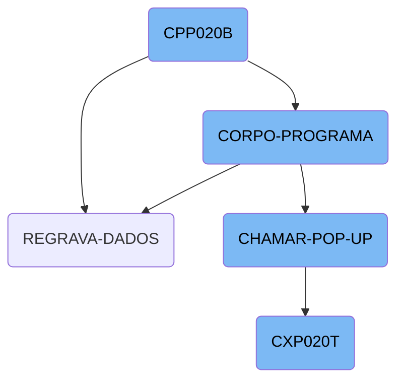
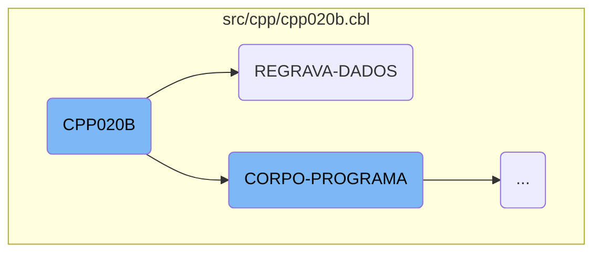
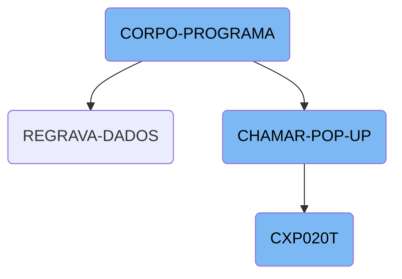

This document provides an overview of the <SwmToken path="src/cpp/cpp020b.cbl" pos="417:3:3" line-data="               WHEN CPP020B-CENTRALIZA-TRUE">`CPP020B`</SwmToken> program, detailing its main sections and their roles in the overall flow. The program is responsible for various operations such as initializing parameters, evaluating conditions, handling data re-recording, and interacting with external modules.

The <SwmToken path="src/cpp/cpp020b.cbl" pos="417:3:3" line-data="               WHEN CPP020B-CENTRALIZA-TRUE">`CPP020B`</SwmToken> program starts by setting up necessary parameters and initial states. It then evaluates different conditions to determine the appropriate actions, such as saving or loading data. The program also handles data re-recording by saving data, validating date limits, and logging operation details. Additionally, it interacts with external modules to update the main program's state with retrieved data.

Here is a high level diagram of the flow, showing only the most important functions:



# Flow drill down

First, we'll zoom into this section of the flow:



<SwmSnippet path="/src/cpp/cpp020b.cbl" line="212">

---

## Main Program Flow

The <SwmToken path="src/cpp/cpp020b.cbl" pos="212:1:3" line-data="       MAIN-PROCESS SECTION.">`MAIN-PROCESS`</SwmToken> section initializes the program by performing the <SwmToken path="src/cpp/cpp020b.cbl" pos="213:3:5" line-data="           PERFORM INICIALIZA-PROGRAMA.">`INICIALIZA-PROGRAMA`</SwmToken> section, setting up necessary parameters and initial states.

```cobol
       MAIN-PROCESS SECTION.
           PERFORM INICIALIZA-PROGRAMA.
```

---

</SwmSnippet>

<SwmSnippet path="/src/cpp/cpp020b.cbl" line="415">

---

## Core Program Logic

The <SwmToken path="src/cpp/cpp020b.cbl" pos="415:1:3" line-data="       CORPO-PROGRAMA SECTION.">`CORPO-PROGRAMA`</SwmToken> section contains the core logic of the program, evaluating various conditions and executing corresponding sections.

```cobol
       CORPO-PROGRAMA SECTION.
           EVALUATE TRUE
```

---

</SwmSnippet>

<SwmSnippet path="/src/cpp/cpp020b.cbl" line="1393">

---

## Data Re-recording

The <SwmToken path="src/cpp/cpp020b.cbl" pos="1393:1:3" line-data="       REGRAVA-DADOS SECTION.">`REGRAVA-DADOS`</SwmToken> section handles the re-recording of data. It performs the <SwmToken path="src/cpp/cpp020b.cbl" pos="1394:3:5" line-data="           PERFORM SALVAR-DADOS.">`SALVAR-DADOS`</SwmToken> section, validates date limits, and rewrites records. If the rewrite is successful, it logs the operation details.

```cobol
       REGRAVA-DADOS SECTION.
           PERFORM SALVAR-DADOS.

           PERFORM VALIDA-DATA-LIMITE

           REWRITE REG-CPD020 INVALID KEY
                   PERFORM ERRO-GRAVACAO
           NOT INVALID KEY
                 MOVE USUARIO-W   TO LOG3-USUARIO
                 MOVE FUNCTION CURRENT-DATE TO WS-DATA-SYS
                 MOVE WS-DATA-CPU TO LOG3-DATA
                 ACCEPT WS-HORA-SYS FROM TIME
                 MOVE WS-HORA-SYS TO LOG3-HORAS
                 MOVE "I"         TO LOG3-OPERACAO
                 MOVE "CPD020"    TO LOG3-ARQUIVO
                 MOVE "CPP020B"    TO LOG3-PROGRAMA
                 MOVE REG-CPD020  TO LOG3-REGISTRO
                 WRITE REG-LOG003
                 END-WRITE
                 CONTINUE.
```

---

</SwmSnippet>

<SwmSnippet path="/src/cpp/cpp020b.cbl" line="1401">

---

### Logging Operation Details

This part of the <SwmToken path="src/cpp/cpp020b.cbl" pos="420:3:5" line-data="                    PERFORM REGRAVA-DADOS">`REGRAVA-DADOS`</SwmToken> section logs the operation details such as user, date, time, operation type, and the program name.

```cobol
                 MOVE USUARIO-W   TO LOG3-USUARIO
                 MOVE FUNCTION CURRENT-DATE TO WS-DATA-SYS
                 MOVE WS-DATA-CPU TO LOG3-DATA
                 ACCEPT WS-HORA-SYS FROM TIME
                 MOVE WS-HORA-SYS TO LOG3-HORAS
                 MOVE "I"         TO LOG3-OPERACAO
                 MOVE "CPD020"    TO LOG3-ARQUIVO
                 MOVE "CPP020B"    TO LOG3-PROGRAMA
                 MOVE REG-CPD020  TO LOG3-REGISTRO
                 WRITE REG-LOG003
```

---

</SwmSnippet>

Now, lets zoom into this section of the flow:



<SwmSnippet path="/src/cpp/cpp020b.cbl" line="415">

---

## <SwmToken path="src/cpp/cpp020b.cbl" pos="415:1:3" line-data="       CORPO-PROGRAMA SECTION.">`CORPO-PROGRAMA`</SwmToken>

The <SwmToken path="src/cpp/cpp020b.cbl" pos="415:1:3" line-data="       CORPO-PROGRAMA SECTION.">`CORPO-PROGRAMA`</SwmToken> section is responsible for evaluating various conditions and performing corresponding actions. It handles different flags such as <SwmToken path="src/cpp/cpp020b.cbl" pos="419:3:9" line-data="               WHEN CPP020B-SAVE-FLG-TRUE">`CPP020B-SAVE-FLG-TRUE`</SwmToken>, <SwmToken path="src/cpp/cpp020b.cbl" pos="421:3:9" line-data="               WHEN CPP020B-LOAD-FLG-TRUE">`CPP020B-LOAD-FLG-TRUE`</SwmToken>, and <SwmToken path="src/cpp/cpp020b.cbl" pos="425:3:9" line-data="               WHEN CPP020B-EXCLUI-FLG-TRUE">`CPP020B-EXCLUI-FLG-TRUE`</SwmToken>, among others. Each condition triggers a specific operation, like saving data, loading data, or excluding records. This section is crucial for managing the main workflow and ensuring that the appropriate actions are taken based on the current state.

```cobol
       CORPO-PROGRAMA SECTION.
           EVALUATE TRUE
               WHEN CPP020B-CENTRALIZA-TRUE
                    PERFORM CENTRALIZAR
               WHEN CPP020B-SAVE-FLG-TRUE
                    PERFORM REGRAVA-DADOS
               WHEN CPP020B-LOAD-FLG-TRUE
                    PERFORM CARREGAR-DADOS
                    refresh-object principal
                    MOVE "SET-POSICAO-CURSOR1" TO DS-PROCEDURE
               WHEN CPP020B-EXCLUI-FLG-TRUE
                    MOVE FORNEC-CP20   TO FORNEC-W
                    MOVE NR-DOCTO-CP20 TO DOCTO-W
                    MOVE 3 TO SITUACAO-CP20
                    PERFORM EXCLUI
               WHEN CPP020B-SUSPENDE-FLG-TRUE
                    IF CPP020B-SITUACAO = 0
                       MOVE 1 TO SITUACAO-CP20
                    ELSE
                       MOVE 0 TO SITUACAO-CP20
                    END-IF
```

---

</SwmSnippet>

<SwmSnippet path="/src/cpp/cpp020b.cbl" line="494">

---

## <SwmToken path="src/cpp/cpp020b.cbl" pos="499:1:5" line-data="       CHAMAR-POP-UP SECTION.">`CHAMAR-POP-UP`</SwmToken>

The <SwmToken path="src/cpp/cpp020b.cbl" pos="499:1:5" line-data="       CHAMAR-POP-UP SECTION.">`CHAMAR-POP-UP`</SwmToken> section is responsible for handling <SwmToken path="src/cpp/cpp020b.cbl" pos="499:3:5" line-data="       CHAMAR-POP-UP SECTION.">`POP-UP`</SwmToken> operations based on the value of <SwmToken path="src/cpp/cpp020b.cbl" pos="500:3:9" line-data="           EVALUATE CPP020B-OPCAO-POP-UP">`CPP020B-OPCAO-POP-UP`</SwmToken>. It performs different actions such as loading supplier data, calling various external programs (<SwmToken path="src/cpp/cpp020b.cbl" pos="505:8:8" line-data="             WHEN 2 CALL &quot;CAP019T&quot; USING PARAMETROS-W PASSAR-PARAMETROS">`CAP019T`</SwmToken>, <SwmToken path="src/cpp/cpp020b.cbl" pos="510:8:8" line-data="             WHEN 3 CALL &quot;CAP018T&quot; USING PARAMETROS-W PASSAR-PARAMETROS">`CAP018T`</SwmToken>, <SwmToken path="src/cpp/cpp020b.cbl" pos="495:6:6" line-data="      *    CALL &quot;CXP020T&quot; USING PASSAR-PARAMETROS">`CXP020T`</SwmToken>, etc.), and updating fields with the returned data. This section is essential for interacting with external modules and updating the main program's state with the data retrieved from these modules.

```cobol
      *CHAMAR-APURACAO SECTION.
      *    CALL "CXP020T" USING PASSAR-PARAMETROS
      *    CANCEL "CXP020T"
      *    MOVE PASSAR-STRING-1(52: 3) TO CPP020B-COD-APURACAO
      *    PERFORM LE-COD-APURACAO.
       CHAMAR-POP-UP SECTION.
           EVALUATE CPP020B-OPCAO-POP-UP
             WHEN 1 PERFORM CARREGA-POP-UP-FORNEC
      *             CALL "CGP001T" USING PASSAR-PARAMETROS
      *             CANCEL "CGP001T"
      *             MOVE PASSAR-STRING-1(33: 6) TO CPP020B-COD-FORN
             WHEN 2 CALL "CAP019T" USING PARAMETROS-W PASSAR-PARAMETROS
                    CANCEL "CAP019T"
                    MOVE PASSAR-STRING-1(1: 30) TO
                         CPP020B-DESCR-TIPO-FORN
                    MOVE PASSAR-STRING-1(33: 2) TO CPP020B-TIPO-FORN
             WHEN 3 CALL "CAP018T" USING PARAMETROS-W PASSAR-PARAMETROS
                   CANCEL "CAP018T"
                   MOVE PASSAR-STRING-1(1: 30) TO CPP020B-DESCR-PORTADOR
                   MOVE PASSAR-STRING-1(33: 4) TO CPP020B-PORTADOR
             WHEN 4
```

---

</SwmSnippet>

<SwmSnippet path="/src/cxp/cxp020t.cbl" line="72">

---

## <SwmToken path="src/cxp/cxp020t.cbl" pos="74:9:9" line-data="           PERFORM CORPO-PROGRAMA UNTIL CXP020T-EXIT-FLG-TRUE.">`CXP020T`</SwmToken>

The <SwmToken path="src/cxp/cxp020t.cbl" pos="74:9:9" line-data="           PERFORM CORPO-PROGRAMA UNTIL CXP020T-EXIT-FLG-TRUE.">`CXP020T`</SwmToken> program is called from the <SwmToken path="src/cpp/cpp020b.cbl" pos="499:1:5" line-data="       CHAMAR-POP-UP SECTION.">`CHAMAR-POP-UP`</SwmToken> section and is responsible for various operations such as initializing the program, processing the main logic, and finalizing the program. It includes sections for centralizing data, locating words, handling errors, and refreshing the screen. This program plays a critical role in processing and managing data that is used by the main program.

```cobol
       MAIN-PROCESS SECTION.
           PERFORM INICIALIZA-PROGRAMA.
           PERFORM CORPO-PROGRAMA UNTIL CXP020T-EXIT-FLG-TRUE.
           GO FINALIZAR-PROGRAMA.

       INICIALIZA-PROGRAMA SECTION.
           MOVE "00000" TO STRING-1(52: 5).
           INITIALIZE CXP020T-DATA-BLOCK
           INITIALIZE DS-CONTROL-BLOCK
           MOVE CXP020T-DATA-BLOCK-VERSION-NO
                                   TO DS-DATA-BLOCK-VERSION-NO
           MOVE CXP020T-VERSION-NO  TO DS-VERSION-NO
           MOVE EMPRESA-W          TO EMP-REC
           MOVE "CXD020"  TO ARQ-REC. MOVE EMPRESA-REF TO PATH-CXD020.
           OPEN INPUT CXD020
           IF ST-CXD020 <> "00"
              MOVE "ERRO ABERTURA CXD020: "  TO CXP020T-MENSAGEM-ERRO
              MOVE ST-CXD020 TO CXP020T-MENSAGEM-ERRO(23: 02)
              PERFORM LOAD-SCREENSET
              PERFORM CARREGA-MENSAGEM-ERRO
           ELSE PERFORM LOAD-SCREENSET.
```

---

</SwmSnippet>

# Where is this flow used?

This flow is used multiple times in the codebase as represented in the following diagram:

```mermaid
graph TD;
      subgraph src/cpp
56bf80eb7919117d550d062bd598dc93e5f3a15ddf95def6aa421a4d087635b3(CPP051):::rootsStyle --> 94fc785d5608e0c452e58ad627b9eaf2c8d1d2f5037c4f454418830fe742ac0f(CORPO-PROGRAMA)
end

subgraph src/cpp
94fc785d5608e0c452e58ad627b9eaf2c8d1d2f5037c4f454418830fe742ac0f(CORPO-PROGRAMA) --> 1c4698b6475668b69c3423ec3796f442c61e3cede0ac811328f6973443b1d6ef(CHAMA-ALTERACAO)
end

subgraph src/cpp
1c4698b6475668b69c3423ec3796f442c61e3cede0ac811328f6973443b1d6ef(CHAMA-ALTERACAO) --> 785fe4cf1ffdc7c4b757db48d58fcdfa9b5dcd5bd0438a68bdc915391cf9e6df(CPP020B):::mainFlowStyle
end

subgraph src/cpp
df317370c27b47d5b49053a5d655227f726711fb9cff6bb077d3c93ab77f2d0f(CPP052):::rootsStyle --> f91b2182a8f021c56bcbd919a9ce6a1e2e13e81eba0a927b28d60f1f26966009(CORPO-PROGRAMA)
end

subgraph src/cpp
f91b2182a8f021c56bcbd919a9ce6a1e2e13e81eba0a927b28d60f1f26966009(CORPO-PROGRAMA) --> 6b902e3c16a377c8c1052d3d7ac2f0b8f81dff0128e33a8325381cd4a585db5e(CHAMA-ALTERACAO)
end

subgraph src/cpp
6b902e3c16a377c8c1052d3d7ac2f0b8f81dff0128e33a8325381cd4a585db5e(CHAMA-ALTERACAO) --> 785fe4cf1ffdc7c4b757db48d58fcdfa9b5dcd5bd0438a68bdc915391cf9e6df(CPP020B):::mainFlowStyle
end

subgraph src/cpp
60c76edec5b4ba2eaaf536b18e76e087083929a753f4f4d18b4a67e5fd30100c(MAIN-PROCESS):::rootsStyle --> 94fc785d5608e0c452e58ad627b9eaf2c8d1d2f5037c4f454418830fe742ac0f(CORPO-PROGRAMA)
end

subgraph src/cpp
60c76edec5b4ba2eaaf536b18e76e087083929a753f4f4d18b4a67e5fd30100c(MAIN-PROCESS):::rootsStyle --> f91b2182a8f021c56bcbd919a9ce6a1e2e13e81eba0a927b28d60f1f26966009(CORPO-PROGRAMA)
end


      classDef mainFlowStyle color:#000000,fill:#7CB9F4
classDef rootsStyle color:#000000,fill:#00FFF4
classDef Style1 color:#000000,fill:#00FFAA
classDef Style2 color:#000000,fill:#FFFF00
classDef Style3 color:#000000,fill:#AA7CB9

%% Swimm:
%% graph TD;
%%       subgraph <SwmPath>[src/cpp/](src/cpp/)</SwmPath>
%% 56bf80eb7919117d550d062bd598dc93e5f3a15ddf95def6aa421a4d087635b3(CPP051):::rootsStyle --> 94fc785d5608e0c452e58ad627b9eaf2c8d1d2f5037c4f454418830fe742ac0f(CORPO-PROGRAMA)
%% end
%% 
%% subgraph <SwmPath>[src/cpp/](src/cpp/)</SwmPath>
%% 94fc785d5608e0c452e58ad627b9eaf2c8d1d2f5037c4f454418830fe742ac0f(CORPO-PROGRAMA) --> 1c4698b6475668b69c3423ec3796f442c61e3cede0ac811328f6973443b1d6ef(CHAMA-ALTERACAO)
%% end
%% 
%% subgraph <SwmPath>[src/cpp/](src/cpp/)</SwmPath>
%% 1c4698b6475668b69c3423ec3796f442c61e3cede0ac811328f6973443b1d6ef(CHAMA-ALTERACAO) --> 785fe4cf1ffdc7c4b757db48d58fcdfa9b5dcd5bd0438a68bdc915391cf9e6df(CPP020B):::mainFlowStyle
%% end
%% 
%% subgraph <SwmPath>[src/cpp/](src/cpp/)</SwmPath>
%% df317370c27b47d5b49053a5d655227f726711fb9cff6bb077d3c93ab77f2d0f(CPP052):::rootsStyle --> f91b2182a8f021c56bcbd919a9ce6a1e2e13e81eba0a927b28d60f1f26966009(CORPO-PROGRAMA)
%% end
%% 
%% subgraph <SwmPath>[src/cpp/](src/cpp/)</SwmPath>
%% f91b2182a8f021c56bcbd919a9ce6a1e2e13e81eba0a927b28d60f1f26966009(CORPO-PROGRAMA) --> 6b902e3c16a377c8c1052d3d7ac2f0b8f81dff0128e33a8325381cd4a585db5e(CHAMA-ALTERACAO)
%% end
%% 
%% subgraph <SwmPath>[src/cpp/](src/cpp/)</SwmPath>
%% 6b902e3c16a377c8c1052d3d7ac2f0b8f81dff0128e33a8325381cd4a585db5e(CHAMA-ALTERACAO) --> 785fe4cf1ffdc7c4b757db48d58fcdfa9b5dcd5bd0438a68bdc915391cf9e6df(CPP020B):::mainFlowStyle
%% end
%% 
%% subgraph <SwmPath>[src/cpp/](src/cpp/)</SwmPath>
%% 60c76edec5b4ba2eaaf536b18e76e087083929a753f4f4d18b4a67e5fd30100c(MAIN-PROCESS):::rootsStyle --> 94fc785d5608e0c452e58ad627b9eaf2c8d1d2f5037c4f454418830fe742ac0f(CORPO-PROGRAMA)
%% end
%% 
%% subgraph <SwmPath>[src/cpp/](src/cpp/)</SwmPath>
%% 60c76edec5b4ba2eaaf536b18e76e087083929a753f4f4d18b4a67e5fd30100c(MAIN-PROCESS):::rootsStyle --> f91b2182a8f021c56bcbd919a9ce6a1e2e13e81eba0a927b28d60f1f26966009(CORPO-PROGRAMA)
%% end
%% 
%% 
%%       classDef mainFlowStyle color:#000000,fill:#7CB9F4
%% classDef rootsStyle color:#000000,fill:#00FFF4
%% classDef Style1 color:#000000,fill:#00FFAA
%% classDef Style2 color:#000000,fill:#FFFF00
%% classDef Style3 color:#000000,fill:#AA7CB9
```



&nbsp;

*This is an auto-generated document by Swimm AI 🌊 and has not yet been verified by a human*

<SwmMeta version="3.0.0" repo-id="Z2l0aHViJTNBJTNBa2VsbG8lM0ElM0Fzd2ltbWlv" repo-name="kello"><sup>Powered by [Swimm](/)</sup></SwmMeta>
