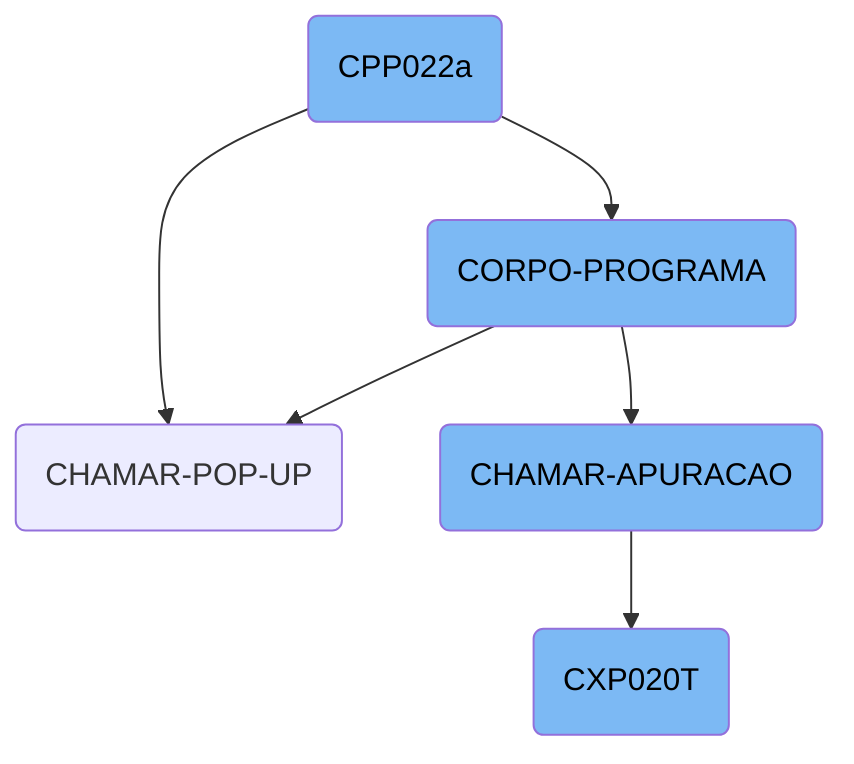
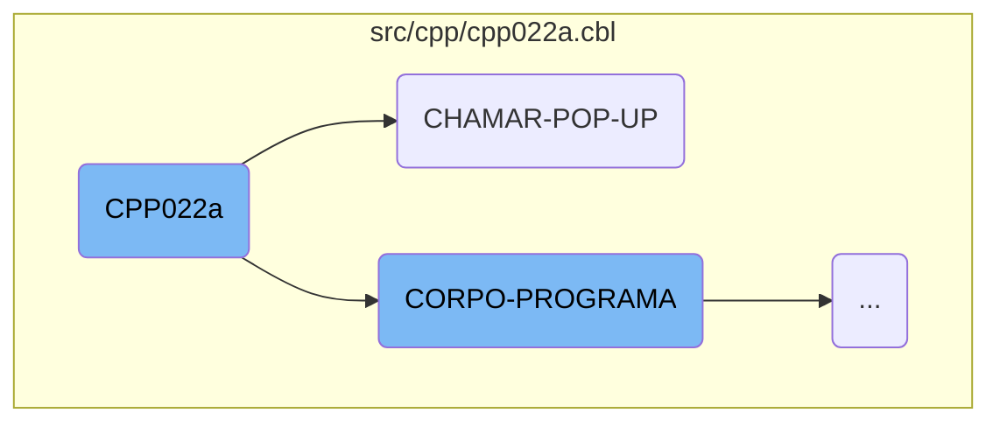
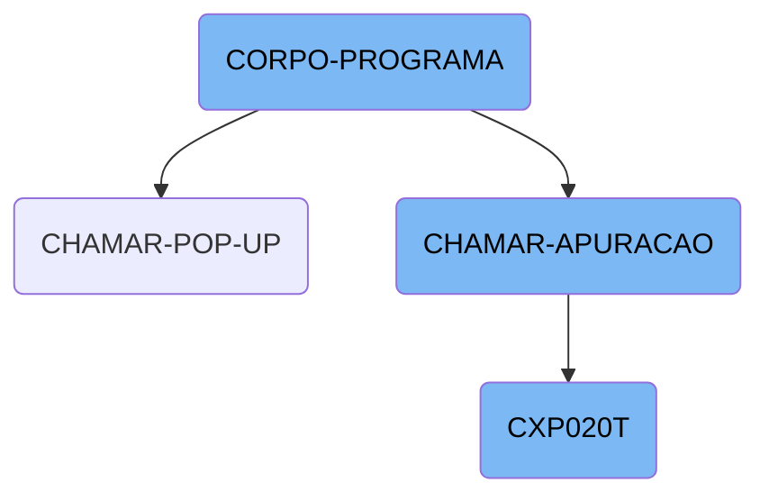

The <SwmToken path="src/cpp/cpp022a.cbl" pos="3:6:6" line-data="       PROGRAM-ID. CPP022a.">`CPP022a`</SwmToken> program is designed for financial scheduling and accounts payable management. It initializes various working storage variables, sets up the environment, and handles different user interactions through pop-ups and data processing routines.

The <SwmToken path="src/cpp/cpp022a.cbl" pos="3:6:6" line-data="       PROGRAM-ID. CPP022a.">`CPP022a`</SwmToken> program starts by setting up the necessary environment and variables. It then evaluates different conditions to perform actions like centralizing data, saving records, and handling bank transactions. User interactions are managed through pop-ups, which call different subprograms based on user input. The program also calls other modules to process specific tasks and update data fields accordingly.

Here is a high level diagram of the flow, showing only the most important functions:



# Flow drill down

First, we'll zoom into this section of the flow:



<SwmSnippet path="/src/cpp/cpp022a.cbl" line="2">

---

## <SwmToken path="src/cpp/cpp022a.cbl" pos="3:6:6" line-data="       PROGRAM-ID. CPP022a.">`CPP022a`</SwmToken> Function

The <SwmToken path="src/cpp/cpp022a.cbl" pos="3:6:6" line-data="       PROGRAM-ID. CPP022a.">`CPP022a`</SwmToken> function is responsible for initializing various working storage variables and setting up the environment for the program. It includes copying necessary modules, defining variables for error handling, and setting up data structures for processing. This function sets the stage for subsequent operations by ensuring that all required parameters and variables are correctly initialized.

```cobol
       IDENTIFICATION DIVISION.
       PROGRAM-ID. CPP022a.
      *AUTOR: ALFREDO SAVIOLLI NETO
      *DATA: 26-03-2006
      *FUNÇÃO: Programação Financeira contas a pagar

      *-Para lançamento de contas permanentes - Caso seja inclusão -
      * incluir 13 meses(sendo o 1o.mês definitivo os demais previsto),
      * e verificar se existe a chave=fornecedor/docto e situação = 0 ou
      * = 1, caso afirmativo
      * não permitir a inclusão(solicitar mudança no nr.docto)
      * caso Alteração - alterar os 12 lançamentos c/ os novos dados
      * caso exclusão/suspensão- excluir/suspender os 12 lançamentos
      * Em caso de alteração de previsto p/ definitivo incluir uma
      * parcela(tendo assim sempre 12 prevista). E em caso de alteraçao
      * perguntar se a alteração é em uma parcela ou em todas)
      * Caso cancelamento - não permitir

      *-Um lançamento será considerado suspenso, aquelas contas que não
      * tem previsão p/ pagto, podendo mais tarde, voltar a ser conside-
      * rada uma conta normal
```

---

</SwmSnippet>

<SwmSnippet path="/src/cpp/cpp022a.cbl" line="1203">

---

## <SwmToken path="src/cpp/cpp022a.cbl" pos="1046:5:9" line-data="               WHEN CPP020-CHAMAR-POP-UP-TRUE">`CHAMAR-POP-UP`</SwmToken> Function

The <SwmToken path="src/cpp/cpp022a.cbl" pos="1046:5:9" line-data="               WHEN CPP020-CHAMAR-POP-UP-TRUE">`CHAMAR-POP-UP`</SwmToken> function handles different <SwmToken path="src/cpp/cpp022a.cbl" pos="1203:7:9" line-data="           EVALUATE CPP020-OPCAO-POP-UP">`POP-UP`</SwmToken> options based on the value of <SwmToken path="src/cpp/cpp022a.cbl" pos="1203:3:9" line-data="           EVALUATE CPP020-OPCAO-POP-UP">`CPP020-OPCAO-POP-UP`</SwmToken>. It uses an <SwmToken path="src/cpp/cpp022a.cbl" pos="1203:1:1" line-data="           EVALUATE CPP020-OPCAO-POP-UP">`EVALUATE`</SwmToken> statement to determine which operation to perform, such as loading supplier data, calling various subprograms, and moving data between variables. This function is crucial for managing user interactions and dynamically calling other modules based on user input.

```cobol
           EVALUATE CPP020-OPCAO-POP-UP
             WHEN 1 PERFORM CARREGA-POP-UP-FORNEC
      *             CALL "CGP001T" USING PASSAR-PARAMETROS
      *             CANCEL "CGP001T"
      *             MOVE PASSAR-STRING-1(33: 6) TO CPP020-COD-FORN
             WHEN 2 CALL "CAP019T" USING PASSAR-PARAMETROS
                    CANCEL "CAP019T"
                    MOVE PASSAR-STRING-1(1: 30) TO
                         CPP020-DESCR-TIPO-FORN
                    MOVE PASSAR-STRING-1(33: 2) TO CPP020-TIPO-FORN
             WHEN 3 CALL "CAP018T" USING PASSAR-PARAMETROS
                    CANCEL "CAP018T"
                    MOVE PASSAR-STRING-1(1: 30) TO CPP020-DESCR-PORTADOR
                    MOVE PASSAR-STRING-1(33: 4) TO CPP020-PORTADOR
             WHEN 4 PERFORM CARREGA-POP-UP-APURACAO
      *             CALL "CXP020T" USING PASSAR-PARAMETROS
      *             CANCEL "CXP020T"
      *             MOVE PASSAR-STRING-1(52: 3) TO CPP020-COD-APURACAO
             WHEN 5 CALL "CBP001T" USING PASSAR-PARAMETROS
                    CANCEL "CBP001T"
                    MOVE PASSAR-STRING-1(17: 15) TO CPP020-DESC-BANCO-CH
```

---

</SwmSnippet>

Now, lets zoom into this section of the flow:



<SwmSnippet path="/src/cpp/cpp022a.cbl" line="853">

---

## <SwmToken path="src/cpp/cpp022a.cbl" pos="606:3:5" line-data="           PERFORM CORPO-PROGRAMA UNTIL CPP020-EXIT-FLG-TRUE.">`CORPO-PROGRAMA`</SwmToken>

The <SwmToken path="src/cpp/cpp022a.cbl" pos="606:3:5" line-data="           PERFORM CORPO-PROGRAMA UNTIL CPP020-EXIT-FLG-TRUE.">`CORPO-PROGRAMA`</SwmToken> function is the main driver of the flow. It evaluates various conditions and performs corresponding actions such as centralizing data, saving records, handling bank transactions, and managing different flags. This function orchestrates the overall business logic by calling other subroutines based on the evaluated conditions.

```cobol
           EVALUATE TRUE
               WHEN CPP020-CENTRALIZA-TRUE
                   PERFORM CENTRALIZAR
               WHEN CPP020-SAVE-FLG-TRUE
                   CLOSE    CPD020 CPD021 CPD022 PFD010 CBD100 CPD023
                            LOG003 LOG001 LOG002 CPD024
                   OPEN I-O CPD020 CPD021 CPD022 PFD010 CBD100 CPD023
                            LOG003 LOG001 LOG002 CPD024
                   IF CPP020-PARCELA = 1
                      PERFORM GRAVA-PARCELAS
                   ELSE
                    PERFORM SALVAR-DADOS
                    IF CPP020-TIPO-GRAVACAO = 1
                       PERFORM REGRAVA-DADOS
                    ELSE
                       PERFORM GRAVA-DADOS
                    END-IF
                    IF CPP020-ACP-BANCO > 0
                       MOVE CPP020-COD-FORN    TO FORNEC-CP22
                       MOVE SEQ-CP21           TO SEQ-CP22
                       READ CPD022 INVALID KEY
```

---

</SwmSnippet>

<SwmSnippet path="/src/cpp/cpp022a.cbl" line="1158">

---

## <SwmToken path="src/cpp/cpp022a.cbl" pos="1036:5:7" line-data="               WHEN CPP020-CHAMAR-APURACAO-TRUE">`CHAMAR-APURACAO`</SwmToken>

The <SwmToken path="src/cpp/cpp022a.cbl" pos="1036:5:7" line-data="               WHEN CPP020-CHAMAR-APURACAO-TRUE">`CHAMAR-APURACAO`</SwmToken> function is responsible for calling the <SwmToken path="src/cpp/cpp022a.cbl" pos="1158:4:4" line-data="           CALL &quot;CXP020T&quot; USING PASSAR-PARAMETROS">`CXP020T`</SwmToken> program and passing parameters to it. After the call, it updates the <SwmToken path="src/cpp/cpp022a.cbl" pos="1160:17:21" line-data="           MOVE PASSAR-STRING-1(52: 5) TO CPP020-COD-APURACAO">`CPP020-COD-APURACAO`</SwmToken> field and performs the <SwmToken path="src/cpp/cpp022a.cbl" pos="1161:3:7" line-data="           PERFORM LE-COD-APURACAO.">`LE-COD-APURACAO`</SwmToken> routine. This function acts as a bridge to the <SwmToken path="src/cpp/cpp022a.cbl" pos="1158:4:4" line-data="           CALL &quot;CXP020T&quot; USING PASSAR-PARAMETROS">`CXP020T`</SwmToken> program, ensuring that necessary data is passed and processed.

```cobol
           CALL "CXP020T" USING PASSAR-PARAMETROS
           CANCEL "CXP020T"
           MOVE PASSAR-STRING-1(52: 5) TO CPP020-COD-APURACAO
           PERFORM LE-COD-APURACAO.
```

---

</SwmSnippet>

<SwmSnippet path="/src/cxp/cxp020t.cbl" line="2">

---

## <SwmToken path="src/cxp/cxp020t.cbl" pos="3:6:6" line-data="       PROGRAM-ID. CXP020T.">`CXP020T`</SwmToken>

The <SwmToken path="src/cxp/cxp020t.cbl" pos="3:6:6" line-data="       PROGRAM-ID. CXP020T.">`CXP020T`</SwmToken> program handles various operations related to data processing and user interactions. It initializes the program, processes the main logic in the <SwmToken path="src/cpp/cpp022a.cbl" pos="606:3:5" line-data="           PERFORM CORPO-PROGRAMA UNTIL CPP020-EXIT-FLG-TRUE.">`CORPO-PROGRAMA`</SwmToken> section, and performs specific tasks like centralizing data, locating words, and handling errors. This program is called by <SwmToken path="src/cpp/cpp022a.cbl" pos="1036:5:7" line-data="               WHEN CPP020-CHAMAR-APURACAO-TRUE">`CHAMAR-APURACAO`</SwmToken> and plays a crucial role in the overall flow by executing detailed business logic.

```cobol
       IDENTIFICATION DIVISION.
       PROGRAM-ID. CXP020T.
      * AUTORA: MARELI AMÂNCIO VOLPATO
      * DATA: 28/08/1998
      * FUNCAO: CONSULTA POP-UP CONTAS APURACAO DE RESULTADOS
       ENVIRONMENT DIVISION.
       SPECIAL-NAMES.
       DECIMAL-POINT IS COMMA.
       class-control.
           Window             is class "wclass".

       INPUT-OUTPUT SECTION.
       FILE-CONTROL.
           COPY CXPX020.

       DATA DIVISION.
       FILE SECTION.
       COPY CXPW020.
       WORKING-STORAGE SECTION.
           COPY "CXP020T.CPB".
           COPY "CXP020T.CPY".
```

---

</SwmSnippet>

&nbsp;

*This is an auto-generated document by Swimm AI 🌊 and has not yet been verified by a human*

<SwmMeta version="3.0.0" repo-id="Z2l0aHViJTNBJTNBa2VsbG8lM0ElM0Fzd2ltbWlv" repo-name="kello"><sup>Powered by [Swimm](/)</sup></SwmMeta>
