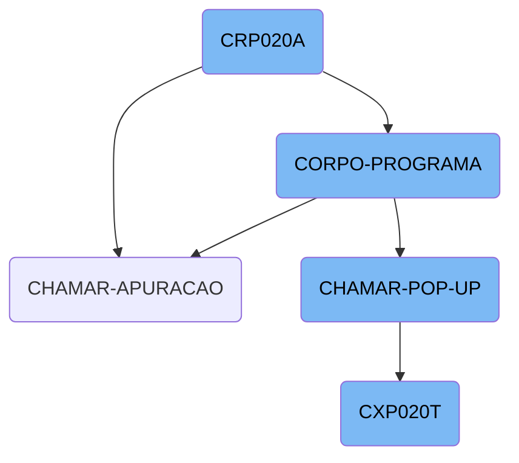
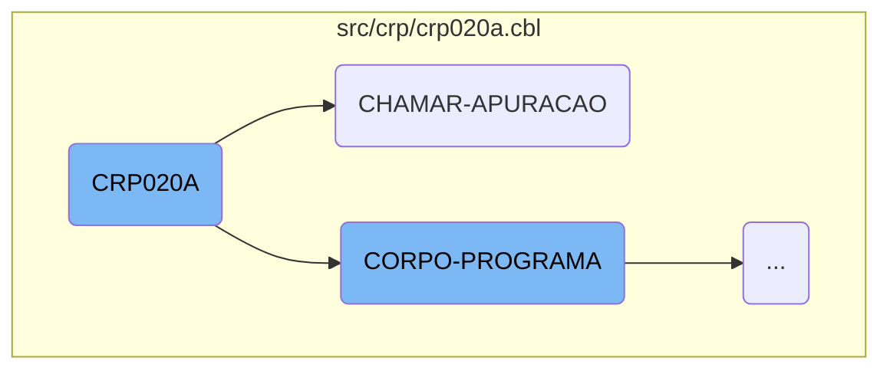
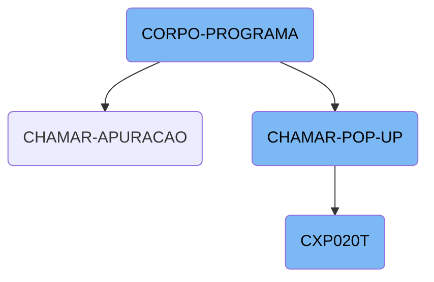

This document provides an overview of the <SwmToken path="src/crp/crp020a.cbl" pos="3:6:6" line-data="       PROGRAM-ID. CRP020A.">`CRP020A`</SwmToken> function, which is a central component in the business operations management system. It initializes the program, handles various business logic conditions, and interacts with other programs to perform specific tasks.

The <SwmToken path="src/crp/crp020a.cbl" pos="3:6:6" line-data="       PROGRAM-ID. CRP020A.">`CRP020A`</SwmToken> function starts by setting up the necessary environment and variables. It then evaluates different conditions and performs corresponding actions based on the current state and user inputs. For example, it can centralize data, save information, or exclude records. The function also interacts with other programs to delegate specific tasks and ensures that resources are properly released after operations are completed. Additionally, it handles user interactions by displaying <SwmToken path="src/crp/crp020a.cbl" pos="689:3:5" line-data="       CHAMAR-POP-UP SECTION.">`POP-UP`</SwmToken> windows and processing their inputs.

Here is a high level diagram of the flow, showing only the most important functions:



# Flow drill down

First, we'll zoom into this section of the flow:



<SwmSnippet path="/src/crp/crp020a.cbl" line="160">

---

## <SwmToken path="src/crp/crp020a.cbl" pos="3:6:6" line-data="       PROGRAM-ID. CRP020A.">`CRP020A`</SwmToken> Function

The <SwmToken path="src/crp/crp020a.cbl" pos="3:6:6" line-data="       PROGRAM-ID. CRP020A.">`CRP020A`</SwmToken> function initializes the program by performing the <SwmToken path="src/crp/crp020a.cbl" pos="163:3:5" line-data="           PERFORM INICIALIZA-PROGRAMA.">`INICIALIZA-PROGRAMA`</SwmToken> routine. This sets up necessary variables and prepares the environment for subsequent operations.

```cobol
       PROCEDURE DIVISION USING PARAMETROS-W STRING-1.

       MAIN-PROCESS SECTION.
           PERFORM INICIALIZA-PROGRAMA.
```

---

</SwmSnippet>

<SwmSnippet path="/src/crp/crp020a.cbl" line="374">

---

The function moves the object handle to <SwmToken path="src/crp/crp020a.cbl" pos="375:7:7" line-data="          move handle8 to wHandle">`wHandle`</SwmToken>, which is likely used for further processing or interaction with other components.

```cobol
          move-object-handle principal handle8
          move handle8 to wHandle
```

---

</SwmSnippet>

<SwmSnippet path="/src/crp/crp020a.cbl" line="404">

---

The <SwmToken path="src/crp/crp020a.cbl" pos="3:6:6" line-data="       PROGRAM-ID. CRP020A.">`CRP020A`</SwmToken> function calls another program <SwmToken path="src/crp/crp020a.cbl" pos="404:4:4" line-data="           CALL &quot;CGP020T&quot; USING PARAMETROS-W PASSAR-PARAMETROS.">`CGP020T`</SwmToken> using parameters, indicating a modular approach where specific tasks are delegated to other programs.

```cobol
           CALL "CGP020T" USING PARAMETROS-W PASSAR-PARAMETROS.
```

---

</SwmSnippet>

<SwmSnippet path="/src/crp/crp020a.cbl" line="486">

---

The function closes the file <SwmToken path="src/crp/crp020a.cbl" pos="486:3:3" line-data="           CLOSE    CRD020">`CRD020`</SwmToken>, ensuring that resources are properly released after operations are completed.

```cobol
           CLOSE    CRD020
```

---

</SwmSnippet>

<SwmSnippet path="/src/crp/crp020a.cbl" line="685">

---

## <SwmToken path="src/crp/crp020a.cbl" pos="349:5:7" line-data="               WHEN GS-CHAMAR-APURACAO-TRUE">`CHAMAR-APURACAO`</SwmToken> Function

The <SwmToken path="src/crp/crp020a.cbl" pos="349:5:7" line-data="               WHEN GS-CHAMAR-APURACAO-TRUE">`CHAMAR-APURACAO`</SwmToken> function calls the <SwmToken path="src/crp/crp020a.cbl" pos="685:4:4" line-data="           CALL &quot;CXP020T&quot; USING PARAMETROS-W PASSAR-PARAMETROS">`CXP020T`</SwmToken> program using parameters and then cancels it. This indicates that <SwmToken path="src/crp/crp020a.cbl" pos="685:4:4" line-data="           CALL &quot;CXP020T&quot; USING PARAMETROS-W PASSAR-PARAMETROS">`CXP020T`</SwmToken> performs a specific task and is no longer needed afterward.

```cobol
           CALL "CXP020T" USING PARAMETROS-W PASSAR-PARAMETROS
           CANCEL "CXP020T"
```

---

</SwmSnippet>

<SwmSnippet path="/src/crp/crp020a.cbl" line="688">

---

The function performs the <SwmToken path="src/crp/crp020a.cbl" pos="688:3:7" line-data="           PERFORM LE-COD-APURACAO.">`LE-COD-APURACAO`</SwmToken> routine, which likely reads or processes a specific code related to the operation. It then calls the <SwmToken path="src/crp/crp020a.cbl" pos="689:1:5" line-data="       CHAMAR-POP-UP SECTION.">`CHAMAR-POP-UP`</SwmToken> section, indicating a user interaction or display of information.

```cobol
           PERFORM LE-COD-APURACAO.
       CHAMAR-POP-UP SECTION.
```

---

</SwmSnippet>

Now, lets zoom into this section of the flow:



<SwmSnippet path="/src/crp/crp020a.cbl" line="309">

---

## <SwmToken path="src/cxp/cxp020t.cbl" pos="74:3:5" line-data="           PERFORM CORPO-PROGRAMA UNTIL CXP020T-EXIT-FLG-TRUE.">`CORPO-PROGRAMA`</SwmToken>

The <SwmToken path="src/cxp/cxp020t.cbl" pos="74:3:5" line-data="           PERFORM CORPO-PROGRAMA UNTIL CXP020T-EXIT-FLG-TRUE.">`CORPO-PROGRAMA`</SwmToken> function is a central control structure that evaluates various conditions and performs corresponding actions. It handles different flags such as <SwmToken path="src/crp/crp020a.cbl" pos="310:3:7" line-data="               WHEN GS-CENTRALIZA-TRUE">`GS-CENTRALIZA-TRUE`</SwmToken>, <SwmToken path="src/crp/crp020a.cbl" pos="312:3:9" line-data="               WHEN GS-SAVE-FLG-TRUE">`GS-SAVE-FLG-TRUE`</SwmToken>, and <SwmToken path="src/crp/crp020a.cbl" pos="315:3:9" line-data="               WHEN GS-EXCLUI-FLG-TRUE">`GS-EXCLUI-FLG-TRUE`</SwmToken>, among others, to execute specific subroutines like <SwmToken path="src/crp/crp020a.cbl" pos="311:3:3" line-data="                   PERFORM CENTRALIZAR">`CENTRALIZAR`</SwmToken>, <SwmToken path="src/crp/crp020a.cbl" pos="313:3:5" line-data="                   PERFORM SALVAR-DADOS">`SALVAR-DADOS`</SwmToken>, and <SwmToken path="src/crp/crp020a.cbl" pos="315:5:5" line-data="               WHEN GS-EXCLUI-FLG-TRUE">`EXCLUI`</SwmToken>. This function ensures that the appropriate business logic is executed based on the current state and user actions.

```cobol
           EVALUATE TRUE
               WHEN GS-CENTRALIZA-TRUE
                   PERFORM CENTRALIZAR
               WHEN GS-SAVE-FLG-TRUE
                   PERFORM SALVAR-DADOS
                   PERFORM GRAVA-ANOTACAO
               WHEN GS-EXCLUI-FLG-TRUE
                   MOVE 3 TO SITUACAO-CR20
                   PERFORM EXCLUI
               WHEN GS-CANCELA-FLG-TRUE
                    IF SITUACAO-CR20 = 4
                       MOVE "Título Cancelado, Deseja Reverter o Cancela
      -                     "mento ? " TO MENSAGEM
                       MOVE "Q" TO TIPO-MSG
                       PERFORM EXIBIR-MENSAGEM
                       IF RESP-MSG = "S"
                          MOVE 0 TO SITUACAO-CR20
                          PERFORM CANCELA
                       END-IF
                    ELSE
                       MOVE "Deseja Cancelar esse Título? " TO MENSAGEM
```

---

</SwmSnippet>

<SwmSnippet path="/src/crp/crp020a.cbl" line="690">

---

## <SwmToken path="src/crp/crp020a.cbl" pos="689:1:5" line-data="       CHAMAR-POP-UP SECTION.">`CHAMAR-POP-UP`</SwmToken>

The <SwmToken path="src/crp/crp020a.cbl" pos="689:1:5" line-data="       CHAMAR-POP-UP SECTION.">`CHAMAR-POP-UP`</SwmToken> function is responsible for handling different <SwmToken path="src/crp/crp020a.cbl" pos="690:7:9" line-data="           EVALUATE GS-OPCAO-POP-UP">`POP-UP`</SwmToken> options based on the value of <SwmToken path="src/crp/crp020a.cbl" pos="690:3:9" line-data="           EVALUATE GS-OPCAO-POP-UP">`GS-OPCAO-POP-UP`</SwmToken>. It performs actions such as loading client or vendor pop-ups, calling external programs like <SwmToken path="src/crp/crp020a.cbl" pos="693:8:8" line-data="             WHEN 3 CALL &quot;CAP018T&quot; USING PARAMETROS-W PASSAR-PARAMETROS">`CAP018T`</SwmToken> and <SwmToken path="src/crp/crp020a.cbl" pos="697:8:8" line-data="             WHEN 4 CALL   &quot;CXP020T&quot; USING PARAMETROS-W PASSAR-STRING-1">`CXP020T`</SwmToken>, and processing the returned data. This function facilitates user interactions by displaying relevant <SwmToken path="src/crp/crp020a.cbl" pos="690:7:9" line-data="           EVALUATE GS-OPCAO-POP-UP">`POP-UP`</SwmToken> windows and processing their inputs.

```cobol
           EVALUATE GS-OPCAO-POP-UP
             WHEN 1 PERFORM CARREGA-POP-UP-CLIENTE
             WHEN 2 PERFORM CARREGA-POP-UP-VENDEDOR
             WHEN 3 CALL "CAP018T" USING PARAMETROS-W PASSAR-PARAMETROS
                    CANCEL "CAP018T"
                    MOVE PASSAR-STRING-1(1: 30) TO GS-DESCR-PORTADOR
                    MOVE PASSAR-STRING-1(33: 4) TO GS-PORTADOR
             WHEN 4 CALL   "CXP020T" USING PARAMETROS-W PASSAR-STRING-1
                    CANCEL "CXP020T"
                    MOVE PASSAR-STRING-1(52: 5) TO GS-COD-APURACAO
                    PERFORM LE-COD-APURACAO
                    MOVE DESCRICAO-CX20 TO GS-DESCR-APURACAO
             WHEN 5 CALL "CRP001T" USING PARAMETROS-W PASSAR-PARAMETROS
                    CANCEL "CRP001T"
                    MOVE PASSAR-STRING-1(1: 30) TO GS-DESCR-SITUACAO-TIT
                    MOVE PASSAR-STRING-1(33: 2) TO GS-SITUACAO-TIT
           END-EVALUATE.
```

---

</SwmSnippet>

<SwmSnippet path="/src/cxp/cxp020t.cbl" line="72">

---

## <SwmToken path="src/cxp/cxp020t.cbl" pos="74:9:9" line-data="           PERFORM CORPO-PROGRAMA UNTIL CXP020T-EXIT-FLG-TRUE.">`CXP020T`</SwmToken>

The <SwmToken path="src/cxp/cxp020t.cbl" pos="74:9:9" line-data="           PERFORM CORPO-PROGRAMA UNTIL CXP020T-EXIT-FLG-TRUE.">`CXP020T`</SwmToken> function is a comprehensive routine that initializes the program, processes the main logic, and finalizes the program. It includes sections for centralizing data, locating words, handling errors, and refreshing the screen. This function is crucial for managing the detailed operations and ensuring the correct execution of the program's core functionalities.

```cobol
       MAIN-PROCESS SECTION.
           PERFORM INICIALIZA-PROGRAMA.
           PERFORM CORPO-PROGRAMA UNTIL CXP020T-EXIT-FLG-TRUE.
           GO FINALIZAR-PROGRAMA.

       INICIALIZA-PROGRAMA SECTION.
           MOVE "00000" TO STRING-1(52: 5).
           INITIALIZE CXP020T-DATA-BLOCK
           INITIALIZE DS-CONTROL-BLOCK
           MOVE CXP020T-DATA-BLOCK-VERSION-NO
                                   TO DS-DATA-BLOCK-VERSION-NO
           MOVE CXP020T-VERSION-NO  TO DS-VERSION-NO
           MOVE EMPRESA-W          TO EMP-REC
           MOVE "CXD020"  TO ARQ-REC. MOVE EMPRESA-REF TO PATH-CXD020.
           OPEN INPUT CXD020
           IF ST-CXD020 <> "00"
              MOVE "ERRO ABERTURA CXD020: "  TO CXP020T-MENSAGEM-ERRO
              MOVE ST-CXD020 TO CXP020T-MENSAGEM-ERRO(23: 02)
              PERFORM LOAD-SCREENSET
              PERFORM CARREGA-MENSAGEM-ERRO
           ELSE PERFORM LOAD-SCREENSET.
```

---

</SwmSnippet>

&nbsp;

*This is an auto-generated document by Swimm AI 🌊 and has not yet been verified by a human*

<SwmMeta version="3.0.0" repo-id="Z2l0aHViJTNBJTNBa2VsbG8lM0ElM0Fzd2ltbWlv" repo-name="kello"><sup>Powered by [Swimm](/)</sup></SwmMeta>
