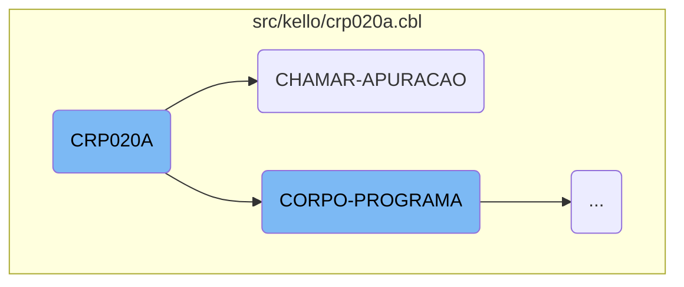
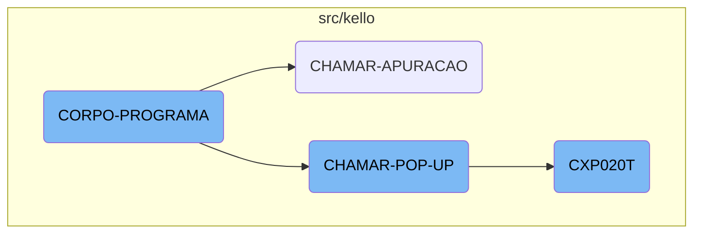

The <SwmToken path="src/kello/crp020a.cbl" pos="3:6:6" line-data="       PROGRAM-ID. CRP020A.">`CRP020A`</SwmToken> function is a crucial component responsible for initializing the program and managing various data operations. It sets up the environment by copying necessary files and defining variables, processes <SwmToken path="src/kello/crp020a.cbl" pos="168:11:13" line-data="      *    ACCEPT PARAMETROS-W FROM COMMAND-LINE.">`COMMAND-LINE`</SwmToken> parameters, and handles data operations such as moving and closing data handles. Additionally, it calls other functions to perform specific tasks using the parameters passed.

The <SwmToken path="src/kello/crp020a.cbl" pos="3:6:6" line-data="       PROGRAM-ID. CRP020A.">`CRP020A`</SwmToken> function starts by setting up the environment, which includes copying necessary files and defining variables. It then processes any <SwmToken path="src/kello/crp020a.cbl" pos="168:11:13" line-data="      *    ACCEPT PARAMETROS-W FROM COMMAND-LINE.">`COMMAND-LINE`</SwmToken> parameters provided. After the initial setup, it handles various data operations, such as moving and closing data handles. Throughout its execution, <SwmToken path="src/kello/crp020a.cbl" pos="3:6:6" line-data="       PROGRAM-ID. CRP020A.">`CRP020A`</SwmToken> calls other functions to perform specific tasks, ensuring that all necessary operations are completed efficiently.

Here is a high level diagram of the flow, showing only the most important functions:

```mermaid
graph TD;
      subgraph src/kello
002ce64606eb180ee2198cf029fb7f45b87fc0ba274a1e23f4a465052d9412eb(CRP020A):::mainFlowStyle --> 88a50218339ba1bc872f6c43a6f928ae6b85ed19b9cb80f9adb6bc8c3e43dfdb(CHAMAR-APURACAO)
end

subgraph src/kello
002ce64606eb180ee2198cf029fb7f45b87fc0ba274a1e23f4a465052d9412eb(CRP020A):::mainFlowStyle --> 9f8321cbf38a27aa25081fd87b60d115b1590eccd68add7282274e7f801ebed2(CORPO-PROGRAMA):::mainFlowStyle
end

subgraph src/kello
9f8321cbf38a27aa25081fd87b60d115b1590eccd68add7282274e7f801ebed2(CORPO-PROGRAMA):::mainFlowStyle --> 88a50218339ba1bc872f6c43a6f928ae6b85ed19b9cb80f9adb6bc8c3e43dfdb(CHAMAR-APURACAO)
end

subgraph src/kello
9f8321cbf38a27aa25081fd87b60d115b1590eccd68add7282274e7f801ebed2(CORPO-PROGRAMA):::mainFlowStyle --> 1f7e29925c733f223ecf5877cc6edec9278da4c5dbf98f8bdac2a7cd0ab67647(CHAMAR-POP-UP):::mainFlowStyle
end

subgraph src/kello
1f7e29925c733f223ecf5877cc6edec9278da4c5dbf98f8bdac2a7cd0ab67647(CHAMAR-POP-UP):::mainFlowStyle --> 50518e3031fd1bb8e53d707aa6046d787959e6027e111759e97ca65df1080b6b(CXP020T):::mainFlowStyle
end


      classDef mainFlowStyle color:#000000,fill:#7CB9F4
classDef rootsStyle color:#000000,fill:#00FFF4
classDef Style1 color:#000000,fill:#00FFAA
classDef Style2 color:#000000,fill:#FFFF00
classDef Style3 color:#000000,fill:#AA7CB9

%% Swimm:
%% graph TD;
%%       subgraph <SwmPath>[src/kello/](src/kello/)</SwmPath>
%% 002ce64606eb180ee2198cf029fb7f45b87fc0ba274a1e23f4a465052d9412eb(CRP020A):::mainFlowStyle --> 88a50218339ba1bc872f6c43a6f928ae6b85ed19b9cb80f9adb6bc8c3e43dfdb(CHAMAR-APURACAO)
%% end
%% 
%% subgraph <SwmPath>[src/kello/](src/kello/)</SwmPath>
%% 002ce64606eb180ee2198cf029fb7f45b87fc0ba274a1e23f4a465052d9412eb(CRP020A):::mainFlowStyle --> 9f8321cbf38a27aa25081fd87b60d115b1590eccd68add7282274e7f801ebed2(CORPO-PROGRAMA):::mainFlowStyle
%% end
%% 
%% subgraph <SwmPath>[src/kello/](src/kello/)</SwmPath>
%% 9f8321cbf38a27aa25081fd87b60d115b1590eccd68add7282274e7f801ebed2(CORPO-PROGRAMA):::mainFlowStyle --> 88a50218339ba1bc872f6c43a6f928ae6b85ed19b9cb80f9adb6bc8c3e43dfdb(CHAMAR-APURACAO)
%% end
%% 
%% subgraph <SwmPath>[src/kello/](src/kello/)</SwmPath>
%% 9f8321cbf38a27aa25081fd87b60d115b1590eccd68add7282274e7f801ebed2(CORPO-PROGRAMA):::mainFlowStyle --> 1f7e29925c733f223ecf5877cc6edec9278da4c5dbf98f8bdac2a7cd0ab67647(CHAMAR-POP-UP):::mainFlowStyle
%% end
%% 
%% subgraph <SwmPath>[src/kello/](src/kello/)</SwmPath>
%% 1f7e29925c733f223ecf5877cc6edec9278da4c5dbf98f8bdac2a7cd0ab67647(CHAMAR-POP-UP):::mainFlowStyle --> 50518e3031fd1bb8e53d707aa6046d787959e6027e111759e97ca65df1080b6b(CXP020T):::mainFlowStyle
%% end
%% 
%% 
%%       classDef mainFlowStyle color:#000000,fill:#7CB9F4
%% classDef rootsStyle color:#000000,fill:#00FFF4
%% classDef Style1 color:#000000,fill:#00FFAA
%% classDef Style2 color:#000000,fill:#FFFF00
%% classDef Style3 color:#000000,fill:#AA7CB9
```



# Flow drill down

First, we'll zoom into this section of the flow:



<SwmSnippet path="/src/kello/crp020a.cbl" line="2">

---

## <SwmToken path="src/kello/crp020a.cbl" pos="3:6:6" line-data="       PROGRAM-ID. CRP020A.">`CRP020A`</SwmToken>

The <SwmToken path="src/kello/crp020a.cbl" pos="3:6:6" line-data="       PROGRAM-ID. CRP020A.">`CRP020A`</SwmToken> function is responsible for initializing the program and handling various data manipulations. It sets up the environment by copying necessary files and defining variables. The function performs initializations, processes <SwmToken path="src/kello/crp020a.cbl" pos="168:11:13" line-data="      *    ACCEPT PARAMETROS-W FROM COMMAND-LINE.">`COMMAND-LINE`</SwmToken> parameters, and handles data operations such as moving and closing data handles. It also calls other functions like <SwmToken path="src/kello/crp020a.cbl" pos="404:4:4" line-data="           CALL &quot;CGP020T&quot; USING PARAMETROS-W PASSAR-PARAMETROS.">`CGP020T`</SwmToken> to perform specific tasks using the parameters passed.

```cobol
       IDENTIFICATION DIVISION.
       PROGRAM-ID. CRP020A.
      *AUTORA: MARELI AMANCIO VOLPATO
      *DATA: 22/04/1999
      *FUNÇÃO: MANUTENÇÃO de contas a receber

       ENVIRONMENT DIVISION.
       SPECIAL-NAMES.
         DECIMAL-POINT IS COMMA
         PRINTER IS LPRINTER.

       class-control.
           Window             is class "wclass".

       INPUT-OUTPUT SECTION.
       FILE-CONTROL.
           COPY CAPX004.
           COPY CAPX002.
           COPY CGPX001.
           COPY CGPX010.
           COPY CGPX020.
```

---

</SwmSnippet>

<SwmSnippet path="/src/kello/crp020a.cbl" line="685">

---

## <SwmToken path="src/kello/crp020a.cbl" pos="349:5:7" line-data="               WHEN GS-CHAMAR-APURACAO-TRUE">`CHAMAR-APURACAO`</SwmToken>

The <SwmToken path="src/kello/crp020a.cbl" pos="349:5:7" line-data="               WHEN GS-CHAMAR-APURACAO-TRUE">`CHAMAR-APURACAO`</SwmToken> function is responsible for calling the <SwmToken path="src/kello/crp020a.cbl" pos="685:4:4" line-data="           CALL &quot;CXP020T&quot; USING PARAMETROS-W PASSAR-PARAMETROS">`CXP020T`</SwmToken> function using the parameters passed. It then cancels the <SwmToken path="src/kello/crp020a.cbl" pos="685:4:4" line-data="           CALL &quot;CXP020T&quot; USING PARAMETROS-W PASSAR-PARAMETROS">`CXP020T`</SwmToken> function and moves specific string values to a global variable. Finally, it performs the <SwmToken path="src/kello/crp020a.cbl" pos="688:3:7" line-data="           PERFORM LE-COD-APURACAO.">`LE-COD-APURACAO`</SwmToken> operation to complete the data processing.

```cobol
           CALL "CXP020T" USING PARAMETROS-W PASSAR-PARAMETROS
           CANCEL "CXP020T"
           MOVE PASSAR-STRING-1(52: 5) TO GS-COD-APURACAO
           PERFORM LE-COD-APURACAO.
       CHAMAR-POP-UP SECTION.
```

---

</SwmSnippet>

Now, lets zoom into this section of the flow:



<SwmSnippet path="/src/kello/crp020a.cbl" line="309">

---

## <SwmToken path="src/kello/cxp020t.cbl" pos="74:3:5" line-data="           PERFORM CORPO-PROGRAMA UNTIL CXP020T-EXIT-FLG-TRUE.">`CORPO-PROGRAMA`</SwmToken>

The <SwmToken path="src/kello/cxp020t.cbl" pos="74:3:5" line-data="           PERFORM CORPO-PROGRAMA UNTIL CXP020T-EXIT-FLG-TRUE.">`CORPO-PROGRAMA`</SwmToken> function is a central control structure that evaluates various conditions and performs corresponding actions. It handles different flags such as <SwmToken path="src/kello/crp020a.cbl" pos="310:3:7" line-data="               WHEN GS-CENTRALIZA-TRUE">`GS-CENTRALIZA-TRUE`</SwmToken>, <SwmToken path="src/kello/crp020a.cbl" pos="312:3:9" line-data="               WHEN GS-SAVE-FLG-TRUE">`GS-SAVE-FLG-TRUE`</SwmToken>, and <SwmToken path="src/kello/crp020a.cbl" pos="315:3:9" line-data="               WHEN GS-EXCLUI-FLG-TRUE">`GS-EXCLUI-FLG-TRUE`</SwmToken>, among others, to execute specific subroutines like <SwmToken path="src/kello/crp020a.cbl" pos="311:3:3" line-data="                   PERFORM CENTRALIZAR">`CENTRALIZAR`</SwmToken>, <SwmToken path="src/kello/crp020a.cbl" pos="313:3:5" line-data="                   PERFORM SALVAR-DADOS">`SALVAR-DADOS`</SwmToken>, and <SwmToken path="src/kello/crp020a.cbl" pos="315:5:5" line-data="               WHEN GS-EXCLUI-FLG-TRUE">`EXCLUI`</SwmToken>. This function is crucial for managing the flow of operations based on the state of various flags, ensuring that the appropriate actions are taken in response to user inputs or system states.

```cobol
           EVALUATE TRUE
               WHEN GS-CENTRALIZA-TRUE
                   PERFORM CENTRALIZAR
               WHEN GS-SAVE-FLG-TRUE
                   PERFORM SALVAR-DADOS
                   PERFORM GRAVA-ANOTACAO
               WHEN GS-EXCLUI-FLG-TRUE
                   MOVE 3 TO SITUACAO-CR20
                   PERFORM EXCLUI
               WHEN GS-CANCELA-FLG-TRUE
                    IF SITUACAO-CR20 = 4
                       MOVE "Título Cancelado, Deseja Reverter o Cancela
      -                     "mento ? " TO MENSAGEM
                       MOVE "Q" TO TIPO-MSG
                       PERFORM EXIBIR-MENSAGEM
                       IF RESP-MSG = "S"
                          MOVE 0 TO SITUACAO-CR20
                          PERFORM CANCELA
                       END-IF
                    ELSE
                       MOVE "Deseja Cancelar esse Título? " TO MENSAGEM
```

---

</SwmSnippet>

<SwmSnippet path="/src/kello/crp020a.cbl" line="690">

---

## <SwmToken path="src/kello/crp020a.cbl" pos="689:1:5" line-data="       CHAMAR-POP-UP SECTION.">`CHAMAR-POP-UP`</SwmToken>

The <SwmToken path="src/kello/crp020a.cbl" pos="689:1:5" line-data="       CHAMAR-POP-UP SECTION.">`CHAMAR-POP-UP`</SwmToken> function is responsible for handling different <SwmToken path="src/kello/crp020a.cbl" pos="690:7:9" line-data="           EVALUATE GS-OPCAO-POP-UP">`POP-UP`</SwmToken> options based on the value of <SwmToken path="src/kello/crp020a.cbl" pos="690:3:9" line-data="           EVALUATE GS-OPCAO-POP-UP">`GS-OPCAO-POP-UP`</SwmToken>. It performs actions such as loading client or vendor pop-ups, calling external programs like <SwmToken path="src/kello/crp020a.cbl" pos="693:8:8" line-data="             WHEN 3 CALL &quot;CAP018T&quot; USING PARAMETROS-W PASSAR-PARAMETROS">`CAP018T`</SwmToken> and <SwmToken path="src/kello/crp020a.cbl" pos="697:8:8" line-data="             WHEN 4 CALL   &quot;CXP020T&quot; USING PARAMETROS-W PASSAR-STRING-1">`CXP020T`</SwmToken>, and moving data between variables. This function is essential for managing user interactions through pop-ups, allowing for dynamic data retrieval and display.

```cobol
           EVALUATE GS-OPCAO-POP-UP
             WHEN 1 PERFORM CARREGA-POP-UP-CLIENTE
             WHEN 2 PERFORM CARREGA-POP-UP-VENDEDOR
             WHEN 3 CALL "CAP018T" USING PARAMETROS-W PASSAR-PARAMETROS
                    CANCEL "CAP018T"
                    MOVE PASSAR-STRING-1(1: 30) TO GS-DESCR-PORTADOR
                    MOVE PASSAR-STRING-1(33: 4) TO GS-PORTADOR
             WHEN 4 CALL   "CXP020T" USING PARAMETROS-W PASSAR-STRING-1
                    CANCEL "CXP020T"
                    MOVE PASSAR-STRING-1(52: 5) TO GS-COD-APURACAO
                    PERFORM LE-COD-APURACAO
                    MOVE DESCRICAO-CX20 TO GS-DESCR-APURACAO
             WHEN 5 CALL "CRP001T" USING PARAMETROS-W PASSAR-PARAMETROS
                    CANCEL "CRP001T"
                    MOVE PASSAR-STRING-1(1: 30) TO GS-DESCR-SITUACAO-TIT
                    MOVE PASSAR-STRING-1(33: 2) TO GS-SITUACAO-TIT
           END-EVALUATE.
       CARREGA-POP-UP-CLIENTE SECTION.
```

---

</SwmSnippet>

<SwmSnippet path="/src/kello/cxp020t.cbl" line="72">

---

## <SwmToken path="src/kello/cxp020t.cbl" pos="74:9:9" line-data="           PERFORM CORPO-PROGRAMA UNTIL CXP020T-EXIT-FLG-TRUE.">`CXP020T`</SwmToken>

The <SwmToken path="src/kello/cxp020t.cbl" pos="74:9:9" line-data="           PERFORM CORPO-PROGRAMA UNTIL CXP020T-EXIT-FLG-TRUE.">`CXP020T`</SwmToken> function is a comprehensive routine that initializes the program, processes the main logic, and finalizes the program. It includes sections for centralizing data, locating words, handling errors, and refreshing the screen. This function is integral to the overall operation, ensuring that data is processed correctly and the user interface is updated accordingly.

```cobol
       MAIN-PROCESS SECTION.
           PERFORM INICIALIZA-PROGRAMA.
           PERFORM CORPO-PROGRAMA UNTIL CXP020T-EXIT-FLG-TRUE.
           GO FINALIZAR-PROGRAMA.

       INICIALIZA-PROGRAMA SECTION.
           MOVE "00000" TO STRING-1(52: 5).
           INITIALIZE CXP020T-DATA-BLOCK
           INITIALIZE DS-CONTROL-BLOCK
           MOVE CXP020T-DATA-BLOCK-VERSION-NO
                                   TO DS-DATA-BLOCK-VERSION-NO
           MOVE CXP020T-VERSION-NO  TO DS-VERSION-NO
           MOVE EMPRESA-W          TO EMP-REC
           MOVE "CXD020"  TO ARQ-REC. MOVE EMPRESA-REF TO PATH-CXD020.
           OPEN INPUT CXD020
           IF ST-CXD020 <> "00"
              MOVE "ERRO ABERTURA CXD020: "  TO CXP020T-MENSAGEM-ERRO
              MOVE ST-CXD020 TO CXP020T-MENSAGEM-ERRO(23: 02)
              PERFORM LOAD-SCREENSET
              PERFORM CARREGA-MENSAGEM-ERRO
           ELSE PERFORM LOAD-SCREENSET.
```

---

</SwmSnippet>

&nbsp;

*This is an auto-generated document by Swimm AI 🌊 and has not yet been verified by a human*

<SwmMeta version="3.0.0" repo-id="Z2l0aHViJTNBJTNBa2VsbG8lM0ElM0Fzd2ltbWlv" repo-name="kello"><sup>Powered by [Swimm](/)</sup></SwmMeta>
