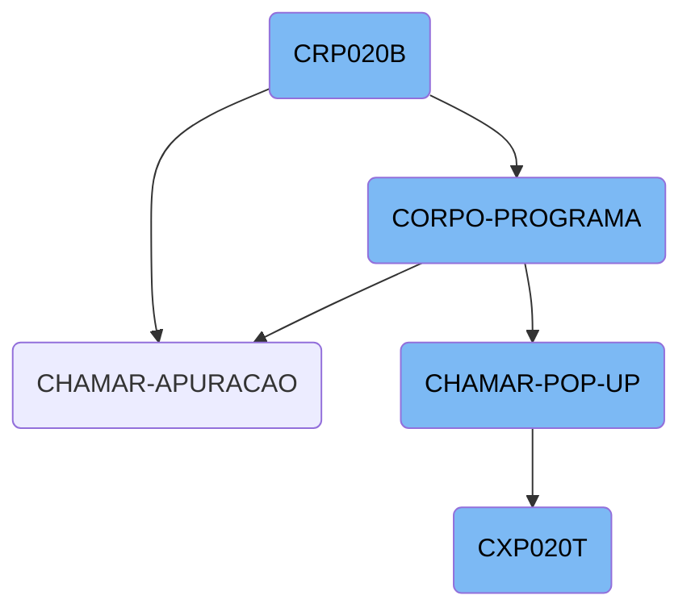
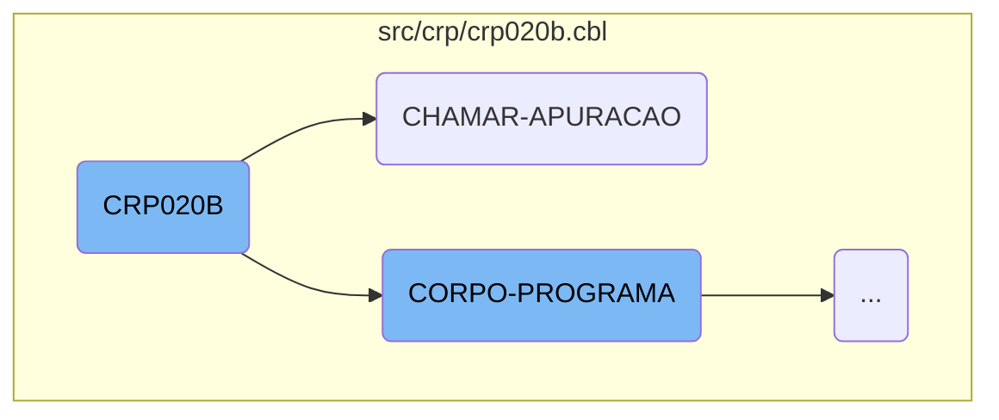
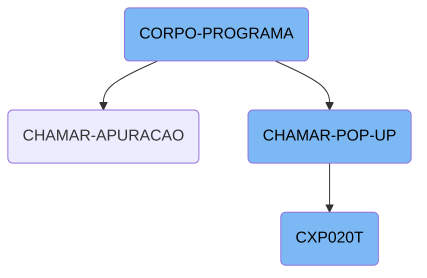

<SwmToken path="src/crp/crp020b.cbl" pos="3:6:6" line-data="       PROGRAM-ID. CRP020B.">`CRP020B`</SwmToken> is a COBOL program responsible for managing accounts receivable. It initializes the program, sets up necessary parameters and variables, and performs various operations to handle accounts receivable data. The program includes copying necessary modules, defining data structures, and performing initial setup routines. It also interacts with other modules to process data and manage user interactions through pop-ups.

<SwmToken path="src/crp/crp020b.cbl" pos="3:6:6" line-data="       PROGRAM-ID. CRP020B.">`CRP020B`</SwmToken> starts by setting up the environment and necessary data structures. It then enters the main processing phase, where it evaluates different conditions and performs corresponding actions based on the current state and user inputs. The program calls other modules to process data and handle specific tasks, such as loading client or vendor pop-ups. Finally, it manages the results of these interactions and ensures that the data is correctly processed and displayed.

Here is a high level diagram of the flow, showing only the most important functions:



# Flow drill down

First, we'll zoom into this section of the flow:



<SwmSnippet path="/src/crp/crp020b.cbl" line="2">

---

## <SwmToken path="src/crp/crp020b.cbl" pos="3:6:6" line-data="       PROGRAM-ID. CRP020B.">`CRP020B`</SwmToken>

The <SwmToken path="src/crp/crp020b.cbl" pos="3:6:6" line-data="       PROGRAM-ID. CRP020B.">`CRP020B`</SwmToken> function initializes the program and sets up various parameters and variables. It includes copying necessary modules, defining data structures, and performing initial setup routines. This function is crucial for preparing the environment and data needed for subsequent operations.

```cobol
       IDENTIFICATION DIVISION.
       PROGRAM-ID. CRP020B.
      *AUTORA: MARELI AMANCIO VOLPATO
      *DATA: 22/04/1999
      *FUNÇÃO: MANUTENÇÃO de contas a receber

       ENVIRONMENT DIVISION.
       SPECIAL-NAMES.
         DECIMAL-POINT IS COMMA
         PRINTER IS LPRINTER.
       class-control.
           Window             is class "wclass".

       INPUT-OUTPUT SECTION.
       FILE-CONTROL.
           COPY CAPX004.
           COPY CAPX002.
           COPY CGPX001.
           COPY CGPX010.
           COPY CGPX020.
           COPY CXPX020.
```

---

</SwmSnippet>

<SwmSnippet path="/src/crp/crp020b.cbl" line="667">

---

## <SwmToken path="src/crp/crp020b.cbl" pos="344:5:7" line-data="               WHEN GS-CHAMAR-APURACAO-TRUE">`CHAMAR-APURACAO`</SwmToken>

The <SwmToken path="src/crp/crp020b.cbl" pos="344:5:7" line-data="               WHEN GS-CHAMAR-APURACAO-TRUE">`CHAMAR-APURACAO`</SwmToken> function calls the <SwmToken path="src/crp/crp020b.cbl" pos="667:4:4" line-data="           CALL &quot;CXP020T&quot; USING PARAMETROS-W PASSAR-PARAMETROS">`CXP020T`</SwmToken> module using specific parameters and then performs additional operations such as moving data and executing further procedures. This function is essential for invoking the <SwmToken path="src/crp/crp020b.cbl" pos="667:4:4" line-data="           CALL &quot;CXP020T&quot; USING PARAMETROS-W PASSAR-PARAMETROS">`CXP020T`</SwmToken> module and handling the results of that invocation.

```cobol
           CALL "CXP020T" USING PARAMETROS-W PASSAR-PARAMETROS
           CANCEL "CXP020T"
           MOVE PASSAR-STRING-1(52: 5) TO GS-COD-APURACAO
           PERFORM LE-COD-APURACAO.
       CHAMAR-POP-UP SECTION.
```

---

</SwmSnippet>

Now, lets zoom into this section of the flow:



<SwmSnippet path="/src/crp/crp020b.cbl" line="304">

---

## <SwmToken path="src/cxp/cxp020t.cbl" pos="74:3:5" line-data="           PERFORM CORPO-PROGRAMA UNTIL CXP020T-EXIT-FLG-TRUE.">`CORPO-PROGRAMA`</SwmToken>

The <SwmToken path="src/cxp/cxp020t.cbl" pos="74:3:5" line-data="           PERFORM CORPO-PROGRAMA UNTIL CXP020T-EXIT-FLG-TRUE.">`CORPO-PROGRAMA`</SwmToken> function is a central control structure that evaluates various conditions and performs corresponding actions. It handles different flags such as <SwmToken path="src/crp/crp020b.cbl" pos="305:3:7" line-data="               WHEN GS-CENTRALIZA-TRUE">`GS-CENTRALIZA-TRUE`</SwmToken>, <SwmToken path="src/crp/crp020b.cbl" pos="307:3:9" line-data="               WHEN GS-SAVE-FLG-TRUE">`GS-SAVE-FLG-TRUE`</SwmToken>, and <SwmToken path="src/crp/crp020b.cbl" pos="310:3:9" line-data="               WHEN GS-EXCLUI-FLG-TRUE">`GS-EXCLUI-FLG-TRUE`</SwmToken>, among others, to determine the flow of operations. For example, when <SwmToken path="src/crp/crp020b.cbl" pos="305:3:7" line-data="               WHEN GS-CENTRALIZA-TRUE">`GS-CENTRALIZA-TRUE`</SwmToken> is true, it performs the <SwmToken path="src/crp/crp020b.cbl" pos="306:3:3" line-data="                    PERFORM CENTRALIZAR">`CENTRALIZAR`</SwmToken> operation. This function is crucial for managing the business logic and ensuring that the appropriate actions are taken based on the current state and user inputs.

```cobol
           EVALUATE TRUE
               WHEN GS-CENTRALIZA-TRUE
                    PERFORM CENTRALIZAR
               WHEN GS-SAVE-FLG-TRUE
                    PERFORM SALVAR-DADOS
                    PERFORM GRAVA-ANOTACAO
               WHEN GS-EXCLUI-FLG-TRUE
                    MOVE 3 TO SITUACAO-CR20
                    PERFORM EXCLUI
               WHEN GS-CANCELA-FLG-TRUE
                    IF SITUACAO-CR20 = 4
                       MOVE "Título Cancelado, Deseja Reverter o Cancela
      -                     "mento ? " TO MENSAGEM
                       MOVE "Q" TO TIPO-MSG
                       PERFORM EXIBIR-MENSAGEM
                       IF RESP-MSG = "S"
                          MOVE 0 TO SITUACAO-CR20
                          PERFORM CANCELA
                       END-IF
                    ELSE
                       MOVE "Deseja Cancelar esse Título? " TO MENSAGEM
```

---

</SwmSnippet>

<SwmSnippet path="/src/crp/crp020b.cbl" line="672">

---

## <SwmToken path="src/crp/crp020b.cbl" pos="671:1:5" line-data="       CHAMAR-POP-UP SECTION.">`CHAMAR-POP-UP`</SwmToken>

The <SwmToken path="src/crp/crp020b.cbl" pos="671:1:5" line-data="       CHAMAR-POP-UP SECTION.">`CHAMAR-POP-UP`</SwmToken> function is responsible for handling different <SwmToken path="src/crp/crp020b.cbl" pos="672:7:9" line-data="           EVALUATE GS-OPCAO-POP-UP">`POP-UP`</SwmToken> options based on the value of <SwmToken path="src/crp/crp020b.cbl" pos="672:3:9" line-data="           EVALUATE GS-OPCAO-POP-UP">`GS-OPCAO-POP-UP`</SwmToken>. It performs specific actions such as loading client or vendor pop-ups, calling external programs like <SwmToken path="src/crp/crp020b.cbl" pos="675:8:8" line-data="             WHEN 3 CALL &quot;CAP018T&quot; USING PARAMETROS-W PASSAR-PARAMETROS">`CAP018T`</SwmToken> and <SwmToken path="src/crp/crp020b.cbl" pos="679:8:8" line-data="             WHEN 4 CALL   &quot;CXP020T&quot; USING PARAMETROS-W PASSAR-STRING-1">`CXP020T`</SwmToken>, and processing the returned data. This function is essential for managing user interactions through pop-ups and integrating external program calls within the application.

```cobol
           EVALUATE GS-OPCAO-POP-UP
             WHEN 1 PERFORM CARREGA-POP-UP-CLIENTE
             WHEN 2 PERFORM CARREGA-POP-UP-VENDEDOR
             WHEN 3 CALL "CAP018T" USING PARAMETROS-W PASSAR-PARAMETROS
                    CANCEL "CAP018T"
                    MOVE PASSAR-STRING-1(1: 30) TO GS-DESCR-PORTADOR
                    MOVE PASSAR-STRING-1(33: 4) TO GS-PORTADOR
             WHEN 4 CALL   "CXP020T" USING PARAMETROS-W PASSAR-STRING-1
                    CANCEL "CXP020T"
                    MOVE PASSAR-STRING-1(52: 5) TO GS-COD-APURACAO
                    PERFORM LE-COD-APURACAO
                    MOVE DESCRICAO-CX20 TO GS-DESCR-APURACAO
             WHEN 5 CALL "CRP001T" USING PARAMETROS-W PASSAR-PARAMETROS
                    CANCEL "CRP001T"
                    MOVE PASSAR-STRING-1(1: 30) TO GS-DESCR-SITUACAO-TIT
                    MOVE PASSAR-STRING-1(33: 2) TO GS-SITUACAO-TIT
           END-EVALUATE.
```

---

</SwmSnippet>

<SwmSnippet path="/src/cxp/cxp020t.cbl" line="72">

---

## <SwmToken path="src/cxp/cxp020t.cbl" pos="74:9:9" line-data="           PERFORM CORPO-PROGRAMA UNTIL CXP020T-EXIT-FLG-TRUE.">`CXP020T`</SwmToken>

The <SwmToken path="src/cxp/cxp020t.cbl" pos="74:9:9" line-data="           PERFORM CORPO-PROGRAMA UNTIL CXP020T-EXIT-FLG-TRUE.">`CXP020T`</SwmToken> function is a comprehensive program that includes initialization, main processing, and finalization sections. It performs various operations such as centralizing data, locating words, and handling different levels of detail (<SwmToken path="src/crp/crp020b.cbl" pos="769:7:9" line-data="                        WHEN 1 PERFORM GRAU-1">`GRAU-1`</SwmToken> to <SwmToken path="src/crp/crp020b.cbl" pos="772:7:9" line-data="                        WHEN 4 PERFORM GRAU-4">`GRAU-4`</SwmToken>). This function is integral to the application's data processing and user interaction logic, ensuring that data is correctly managed and displayed.

```cobol
       MAIN-PROCESS SECTION.
           PERFORM INICIALIZA-PROGRAMA.
           PERFORM CORPO-PROGRAMA UNTIL CXP020T-EXIT-FLG-TRUE.
           GO FINALIZAR-PROGRAMA.

       INICIALIZA-PROGRAMA SECTION.
           MOVE "00000" TO STRING-1(52: 5).
           INITIALIZE CXP020T-DATA-BLOCK
           INITIALIZE DS-CONTROL-BLOCK
           MOVE CXP020T-DATA-BLOCK-VERSION-NO
                                   TO DS-DATA-BLOCK-VERSION-NO
           MOVE CXP020T-VERSION-NO  TO DS-VERSION-NO
           MOVE EMPRESA-W          TO EMP-REC
           MOVE "CXD020"  TO ARQ-REC. MOVE EMPRESA-REF TO PATH-CXD020.
           OPEN INPUT CXD020
           IF ST-CXD020 <> "00"
              MOVE "ERRO ABERTURA CXD020: "  TO CXP020T-MENSAGEM-ERRO
              MOVE ST-CXD020 TO CXP020T-MENSAGEM-ERRO(23: 02)
              PERFORM LOAD-SCREENSET
              PERFORM CARREGA-MENSAGEM-ERRO
           ELSE PERFORM LOAD-SCREENSET.
```

---

</SwmSnippet>

# Where is this flow used?

This flow is used multiple times in the codebase as represented in the following diagram:

```mermaid
graph TD;
      subgraph src/crp
4e103c6a4c17d485535f50b30a89f03d86ae5a493e3a9f3c38afdfe4af2130c4(CRP051):::rootsStyle --> 9d9b6f67910d642cdc88b7f6071ff2776325700f1684bf6c7c7eff2c9cb384cd(CORPO-PROGRAMA)
end

subgraph src/crp
9d9b6f67910d642cdc88b7f6071ff2776325700f1684bf6c7c7eff2c9cb384cd(CORPO-PROGRAMA) --> 1076119b12efaba6d95264f5ce54a53671de6124b9122c79e7e99068f76bf54b(CHAMA-ALTERACAO)
end

subgraph src/crp
1076119b12efaba6d95264f5ce54a53671de6124b9122c79e7e99068f76bf54b(CHAMA-ALTERACAO) --> 78557e4803b5dad74b0b036b944c8cf023f7ec9126bc344f132fa7b0551903f4(CRP020B):::mainFlowStyle
end

subgraph src/crp
fef4eafc900e50e4d09635087b314ac3e3a92c1ee81015cdfe73b4d39038a6d9(CRP052):::rootsStyle --> c95df0fdb822b7221cf22f74412a72c0cb39c60d928c0a8f4d0019adba528278(CORPO-PROGRAMA)
end

subgraph src/crp
c95df0fdb822b7221cf22f74412a72c0cb39c60d928c0a8f4d0019adba528278(CORPO-PROGRAMA) --> 554cf4409df0524a0dae8c60ff73ba00219210408c77f796f0f67a82d3176666(CHAMA-ALTERACAO)
end

subgraph src/crp
554cf4409df0524a0dae8c60ff73ba00219210408c77f796f0f67a82d3176666(CHAMA-ALTERACAO) --> 78557e4803b5dad74b0b036b944c8cf023f7ec9126bc344f132fa7b0551903f4(CRP020B):::mainFlowStyle
end

subgraph src/crp
60c76edec5b4ba2eaaf536b18e76e087083929a753f4f4d18b4a67e5fd30100c(MAIN-PROCESS):::rootsStyle --> 9d9b6f67910d642cdc88b7f6071ff2776325700f1684bf6c7c7eff2c9cb384cd(CORPO-PROGRAMA)
end

subgraph src/crp
60c76edec5b4ba2eaaf536b18e76e087083929a753f4f4d18b4a67e5fd30100c(MAIN-PROCESS):::rootsStyle --> c95df0fdb822b7221cf22f74412a72c0cb39c60d928c0a8f4d0019adba528278(CORPO-PROGRAMA)
end


      classDef mainFlowStyle color:#000000,fill:#7CB9F4
classDef rootsStyle color:#000000,fill:#00FFF4
classDef Style1 color:#000000,fill:#00FFAA
classDef Style2 color:#000000,fill:#FFFF00
classDef Style3 color:#000000,fill:#AA7CB9

%% Swimm:
%% graph TD;
%%       subgraph <SwmPath>[src/crp/](src/crp/)</SwmPath>
%% 4e103c6a4c17d485535f50b30a89f03d86ae5a493e3a9f3c38afdfe4af2130c4(CRP051):::rootsStyle --> 9d9b6f67910d642cdc88b7f6071ff2776325700f1684bf6c7c7eff2c9cb384cd(CORPO-PROGRAMA)
%% end
%% 
%% subgraph <SwmPath>[src/crp/](src/crp/)</SwmPath>
%% 9d9b6f67910d642cdc88b7f6071ff2776325700f1684bf6c7c7eff2c9cb384cd(CORPO-PROGRAMA) --> 1076119b12efaba6d95264f5ce54a53671de6124b9122c79e7e99068f76bf54b(CHAMA-ALTERACAO)
%% end
%% 
%% subgraph <SwmPath>[src/crp/](src/crp/)</SwmPath>
%% 1076119b12efaba6d95264f5ce54a53671de6124b9122c79e7e99068f76bf54b(CHAMA-ALTERACAO) --> 78557e4803b5dad74b0b036b944c8cf023f7ec9126bc344f132fa7b0551903f4(CRP020B):::mainFlowStyle
%% end
%% 
%% subgraph <SwmPath>[src/crp/](src/crp/)</SwmPath>
%% fef4eafc900e50e4d09635087b314ac3e3a92c1ee81015cdfe73b4d39038a6d9(CRP052):::rootsStyle --> c95df0fdb822b7221cf22f74412a72c0cb39c60d928c0a8f4d0019adba528278(CORPO-PROGRAMA)
%% end
%% 
%% subgraph <SwmPath>[src/crp/](src/crp/)</SwmPath>
%% c95df0fdb822b7221cf22f74412a72c0cb39c60d928c0a8f4d0019adba528278(CORPO-PROGRAMA) --> 554cf4409df0524a0dae8c60ff73ba00219210408c77f796f0f67a82d3176666(CHAMA-ALTERACAO)
%% end
%% 
%% subgraph <SwmPath>[src/crp/](src/crp/)</SwmPath>
%% 554cf4409df0524a0dae8c60ff73ba00219210408c77f796f0f67a82d3176666(CHAMA-ALTERACAO) --> 78557e4803b5dad74b0b036b944c8cf023f7ec9126bc344f132fa7b0551903f4(CRP020B):::mainFlowStyle
%% end
%% 
%% subgraph <SwmPath>[src/crp/](src/crp/)</SwmPath>
%% 60c76edec5b4ba2eaaf536b18e76e087083929a753f4f4d18b4a67e5fd30100c(MAIN-PROCESS):::rootsStyle --> 9d9b6f67910d642cdc88b7f6071ff2776325700f1684bf6c7c7eff2c9cb384cd(CORPO-PROGRAMA)
%% end
%% 
%% subgraph <SwmPath>[src/crp/](src/crp/)</SwmPath>
%% 60c76edec5b4ba2eaaf536b18e76e087083929a753f4f4d18b4a67e5fd30100c(MAIN-PROCESS):::rootsStyle --> c95df0fdb822b7221cf22f74412a72c0cb39c60d928c0a8f4d0019adba528278(CORPO-PROGRAMA)
%% end
%% 
%% 
%%       classDef mainFlowStyle color:#000000,fill:#7CB9F4
%% classDef rootsStyle color:#000000,fill:#00FFF4
%% classDef Style1 color:#000000,fill:#00FFAA
%% classDef Style2 color:#000000,fill:#FFFF00
%% classDef Style3 color:#000000,fill:#AA7CB9
```



&nbsp;

*This is an auto-generated document by Swimm AI 🌊 and has not yet been verified by a human*

<SwmMeta version="3.0.0" repo-id="Z2l0aHViJTNBJTNBa2VsbG8lM0ElM0Fzd2ltbWlv" repo-name="kello"><sup>Powered by [Swimm](/)</sup></SwmMeta>
