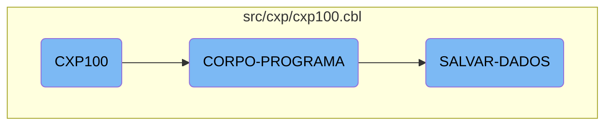

This document explains the <SwmToken path="src/cxp/cxp100.cbl" pos="323:9:9" line-data="           PERFORM CORPO-PROGRAMA UNTIL CXP100-EXIT-FLG-TRUE.">`CXP100`</SwmToken> program, which is a core component of the Kello Imagens business operations management system. The program is responsible for initializing the environment, processing various business logic tasks, and saving data.

The <SwmToken path="src/cxp/cxp100.cbl" pos="323:9:9" line-data="           PERFORM CORPO-PROGRAMA UNTIL CXP100-EXIT-FLG-TRUE.">`CXP100`</SwmToken> program starts by setting up the environment and then enters the main processing section. In this section, it evaluates different conditions and performs actions like creating list views, verifying loans, and saving or loading data. The program continues to process these tasks until a specific exit condition is met. Finally, it saves any changes made during the processing to ensure data integrity.

# Flow drill down



<SwmSnippet path="/src/cxp/cxp100.cbl" line="321">

---

## <SwmToken path="src/cxp/cxp100.cbl" pos="323:9:9" line-data="           PERFORM CORPO-PROGRAMA UNTIL CXP100-EXIT-FLG-TRUE.">`CXP100`</SwmToken>

The <SwmToken path="src/cxp/cxp100.cbl" pos="323:9:9" line-data="           PERFORM CORPO-PROGRAMA UNTIL CXP100-EXIT-FLG-TRUE.">`CXP100`</SwmToken> function initializes the program and sets up the main processing sections. It prepares the environment for subsequent operations.

```cobol
       MAIN-PROCESS SECTION.
           PERFORM INICIALIZA-PROGRAMA.
           PERFORM CORPO-PROGRAMA UNTIL CXP100-EXIT-FLG-TRUE.
           GO FINALIZAR-PROGRAMA.

       INICIALIZA-PROGRAMA SECTION.
```

---

</SwmSnippet>

<SwmSnippet path="/src/cxp/cxp100.cbl" line="577">

---

## <SwmToken path="src/cxp/cxp100.cbl" pos="577:1:3" line-data="       CORPO-PROGRAMA SECTION.">`CORPO-PROGRAMA`</SwmToken>

The <SwmToken path="src/cxp/cxp100.cbl" pos="577:1:3" line-data="       CORPO-PROGRAMA SECTION.">`CORPO-PROGRAMA`</SwmToken> function evaluates various conditions and performs corresponding actions. It handles tasks such as creating list views, verifying loans, saving data, and loading data. This function is central to the business logic, as it determines the flow of operations based on different flags.

```cobol
       CORPO-PROGRAMA SECTION.
           EVALUATE TRUE
               WHEN CXP100-CENTRALIZA-TRUE
                   PERFORM CRIAR-LISTVIEW-CHEQUE
                   PERFORM CRIAR-LISTVIEW-RECEBER
                   PERFORM CENTRALIZAR
               WHEN CXP100-VERIF-EMPRESTIMO-TRUE
      *             PERFORM VERIFICA-EMPRESTIMO
                    PERFORM VERIFICA-PRE-DATADO
               WHEN CXP100-SAVE-FLG-TRUE
                    PERFORM SALVAR-DADOS
                    PERFORM LIMPAR-DADOS
                    PERFORM CARREGA-ULTIMOS
                    PERFORM ACHAR-SEQUENCIA
                    PERFORM MOSTRA-ULT-SEQUENCIA
                    ENABLE-OBJECT D-CONTAPART
                    ENABLE-OBJECT D-TIPO-LCTO
               WHEN CXP100-LOAD-FLG-TRUE
                    PERFORM CARREGAR-DADOS
                    MOVE "SET-POSICAO-CURSOR" TO DS-PROCEDURE
               WHEN CXP100-EXCLUI-FLG-TRUE
```

---

</SwmSnippet>

<SwmSnippet path="/src/cxp/cxp100.cbl" line="2165">

---

### Saving Data

The <SwmToken path="src/cxp/cxp100.cbl" pos="2165:1:3" line-data="       SALVAR-DADOS SECTION.">`SALVAR-DADOS`</SwmToken> function is responsible for saving data. It checks if there are any alterations, initializes necessary variables, and performs various operations to save the data correctly. This includes handling different types of transactions and ensuring data integrity.

```cobol
       SALVAR-DADOS SECTION.
           IF CXP100-ALTERACAO = "S"
              MOVE ZEROS TO I
              PERFORM VARYING I FROM 1 BY 1 UNTIL I > 50
                   MOVE ZEROS TO SEQ-SELECIONADA(I)
              END-PERFORM
              MOVE ZEROS TO I
              PERFORM VARYING I FROM 1 BY 1 UNTIL I > 200
                   INITIALIZE CXP100-DOCTO-GR(I)
                              CXP100-VALOR-PGTO-GR(I)
                              CXP100-PARCIAL-GR(I)
                              CXP100-JUROS-GR(I)
                              CXP100-MULTA-GR(I)
                              CXP100-DESCONTO-GR(I)
                              CXP100-VALOR-TOTAL-GR(I)
              END-PERFORM

              MOVE ZEROS TO I CXP100-TOT-VALOR-SELECIONADO

              IF CXP100-TIPO-LCTO = 2 OR 3 OR 6 OR 31
                 MOVE CXP100-VALOR        TO AUX-VALOR
```

---

</SwmSnippet>

&nbsp;

*This is an auto-generated document by Swimm AI 🌊 and has not yet been verified by a human*

<SwmMeta version="3.0.0" repo-id="Z2l0aHViJTNBJTNBa2VsbG8lM0ElM0Fzd2ltbWlv" repo-name="kello"><sup>Powered by [Swimm](/)</sup></SwmMeta>
