The <SwmToken path="src/kello/cop040.cbl" pos="190:1:3" line-data="       MAIN-PROCESS SECTION.">`MAIN-PROCESS`</SwmToken> section is a crucial part of the COBOL program, responsible for initializing, executing, and finalizing the main operations. It ensures that the program runs its core logic repeatedly until a specific exit condition is met.

The <SwmToken path="src/kello/cop040.cbl" pos="190:1:3" line-data="       MAIN-PROCESS SECTION.">`MAIN-PROCESS`</SwmToken> starts by setting up the program. It then enters a loop where it keeps running the main part of the program over and over until it's told to stop. Once it gets the signal to stop, it wraps things up and finishes the program.

# Flow drill down

```mermaid
graph TD;
      subgraph src/kello
17cf6579bb7cb42084533ce0eb6e4db7d53ee58a42b781a3f0331a6512f59360(MAIN-PROCESS):::mainFlowStyle --> 503a3764f1b6ac5447f6b6e43bbde1ed090db228f60f583ce0ae43b4a698f777(CORPO-PROGRAMA):::mainFlowStyle
end

subgraph src/kello
503a3764f1b6ac5447f6b6e43bbde1ed090db228f60f583ce0ae43b4a698f777(CORPO-PROGRAMA):::mainFlowStyle --> c573f5cbf675cda62f997ca1bb3fbdbac8ec7b77f85a9227aa2673dcda5e3288(CHAMAR-PRODUTO)
end

subgraph src/kello
503a3764f1b6ac5447f6b6e43bbde1ed090db228f60f583ce0ae43b4a698f777(CORPO-PROGRAMA):::mainFlowStyle --> 42da133402d551508339798f1ee6ab8553eb25fe1fb3049ec5ff6132b24f20b9(CHAMAR-BRINDE)
end

subgraph src/kello
503a3764f1b6ac5447f6b6e43bbde1ed090db228f60f583ce0ae43b4a698f777(CORPO-PROGRAMA):::mainFlowStyle --> 6fc049818223509e98e18d4c76d7b759d608641c5178cf8dfa2a365080110111(CHAMAR-POP-UP)
end

subgraph src/kello
503a3764f1b6ac5447f6b6e43bbde1ed090db228f60f583ce0ae43b4a698f777(CORPO-PROGRAMA):::mainFlowStyle --> 351b83c0bc3ef5cc4472edf89f2c939ea0ef6ca27d52ad95943e2f0dd4b5a359(CHAMAR-EVENTO)
end

subgraph src/kello
503a3764f1b6ac5447f6b6e43bbde1ed090db228f60f583ce0ae43b4a698f777(CORPO-PROGRAMA):::mainFlowStyle --> fe6191908bde6aee4d58254306c1cc00430035eddf06b6cf143e908cb3a96a95(CHAMAR-COMISSAO):::mainFlowStyle
end

subgraph src/kello
fe6191908bde6aee4d58254306c1cc00430035eddf06b6cf143e908cb3a96a95(CHAMAR-COMISSAO):::mainFlowStyle --> f5fd1686ffc2f451a3b5737736397a29bb8ea62a4cf48954c4a69c935eb5c09c(CGP010X):::mainFlowStyle
end

subgraph src/kello
351b83c0bc3ef5cc4472edf89f2c939ea0ef6ca27d52ad95943e2f0dd4b5a359(CHAMAR-EVENTO) --> 5e44287494b71ea8454b147cd9b80f20cb702d268002acf8eba417102be0f680(COP060X)
end

subgraph src/kello
42da133402d551508339798f1ee6ab8553eb25fe1fb3049ec5ff6132b24f20b9(CHAMAR-BRINDE) --> 7d301c0c6261388804c3988b7789e823d568dc18a46323e93ab5f2775f0c171f(COP050X)
end

subgraph src/kello
c573f5cbf675cda62f997ca1bb3fbdbac8ec7b77f85a9227aa2673dcda5e3288(CHAMAR-PRODUTO) --> a1d64866e029db3ee9184cd50a3cfed3a1056f71ba6603305bcc8deae69be0f7(COP045)
end

subgraph src/kello
f5fd1686ffc2f451a3b5737736397a29bb8ea62a4cf48954c4a69c935eb5c09c(CGP010X):::mainFlowStyle --> 2830a47db971b1fe878e56a4c8f73226bbc1a74d99af414be46c3ab703cbf450(CORPO-PROGRAMA):::mainFlowStyle
end


      classDef mainFlowStyle color:#000000,fill:#7CB9F4
classDef rootsStyle color:#000000,fill:#00FFF4
classDef Style1 color:#000000,fill:#00FFAA
classDef Style2 color:#000000,fill:#FFFF00
classDef Style3 color:#000000,fill:#AA7CB9

%% Swimm:
%% graph TD;
%%       subgraph <SwmPath>[src/kello/](src/kello/)</SwmPath>
%% 17cf6579bb7cb42084533ce0eb6e4db7d53ee58a42b781a3f0331a6512f59360(MAIN-PROCESS):::mainFlowStyle --> 503a3764f1b6ac5447f6b6e43bbde1ed090db228f60f583ce0ae43b4a698f777(CORPO-PROGRAMA):::mainFlowStyle
%% end
%% 
%% subgraph <SwmPath>[src/kello/](src/kello/)</SwmPath>
%% 503a3764f1b6ac5447f6b6e43bbde1ed090db228f60f583ce0ae43b4a698f777(CORPO-PROGRAMA):::mainFlowStyle --> c573f5cbf675cda62f997ca1bb3fbdbac8ec7b77f85a9227aa2673dcda5e3288(CHAMAR-PRODUTO)
%% end
%% 
%% subgraph <SwmPath>[src/kello/](src/kello/)</SwmPath>
%% 503a3764f1b6ac5447f6b6e43bbde1ed090db228f60f583ce0ae43b4a698f777(CORPO-PROGRAMA):::mainFlowStyle --> 42da133402d551508339798f1ee6ab8553eb25fe1fb3049ec5ff6132b24f20b9(CHAMAR-BRINDE)
%% end
%% 
%% subgraph <SwmPath>[src/kello/](src/kello/)</SwmPath>
%% 503a3764f1b6ac5447f6b6e43bbde1ed090db228f60f583ce0ae43b4a698f777(CORPO-PROGRAMA):::mainFlowStyle --> 6fc049818223509e98e18d4c76d7b759d608641c5178cf8dfa2a365080110111(CHAMAR-POP-UP)
%% end
%% 
%% subgraph <SwmPath>[src/kello/](src/kello/)</SwmPath>
%% 503a3764f1b6ac5447f6b6e43bbde1ed090db228f60f583ce0ae43b4a698f777(CORPO-PROGRAMA):::mainFlowStyle --> 351b83c0bc3ef5cc4472edf89f2c939ea0ef6ca27d52ad95943e2f0dd4b5a359(CHAMAR-EVENTO)
%% end
%% 
%% subgraph <SwmPath>[src/kello/](src/kello/)</SwmPath>
%% 503a3764f1b6ac5447f6b6e43bbde1ed090db228f60f583ce0ae43b4a698f777(CORPO-PROGRAMA):::mainFlowStyle --> fe6191908bde6aee4d58254306c1cc00430035eddf06b6cf143e908cb3a96a95(CHAMAR-COMISSAO):::mainFlowStyle
%% end
%% 
%% subgraph <SwmPath>[src/kello/](src/kello/)</SwmPath>
%% fe6191908bde6aee4d58254306c1cc00430035eddf06b6cf143e908cb3a96a95(CHAMAR-COMISSAO):::mainFlowStyle --> f5fd1686ffc2f451a3b5737736397a29bb8ea62a4cf48954c4a69c935eb5c09c(CGP010X):::mainFlowStyle
%% end
%% 
%% subgraph <SwmPath>[src/kello/](src/kello/)</SwmPath>
%% 351b83c0bc3ef5cc4472edf89f2c939ea0ef6ca27d52ad95943e2f0dd4b5a359(CHAMAR-EVENTO) --> 5e44287494b71ea8454b147cd9b80f20cb702d268002acf8eba417102be0f680(COP060X)
%% end
%% 
%% subgraph <SwmPath>[src/kello/](src/kello/)</SwmPath>
%% 42da133402d551508339798f1ee6ab8553eb25fe1fb3049ec5ff6132b24f20b9(CHAMAR-BRINDE) --> 7d301c0c6261388804c3988b7789e823d568dc18a46323e93ab5f2775f0c171f(COP050X)
%% end
%% 
%% subgraph <SwmPath>[src/kello/](src/kello/)</SwmPath>
%% c573f5cbf675cda62f997ca1bb3fbdbac8ec7b77f85a9227aa2673dcda5e3288(CHAMAR-PRODUTO) --> a1d64866e029db3ee9184cd50a3cfed3a1056f71ba6603305bcc8deae69be0f7(COP045)
%% end
%% 
%% subgraph <SwmPath>[src/kello/](src/kello/)</SwmPath>
%% f5fd1686ffc2f451a3b5737736397a29bb8ea62a4cf48954c4a69c935eb5c09c(CGP010X):::mainFlowStyle --> 2830a47db971b1fe878e56a4c8f73226bbc1a74d99af414be46c3ab703cbf450(CORPO-PROGRAMA):::mainFlowStyle
%% end
%% 
%% 
%%       classDef mainFlowStyle color:#000000,fill:#7CB9F4
%% classDef rootsStyle color:#000000,fill:#00FFF4
%% classDef Style1 color:#000000,fill:#00FFAA
%% classDef Style2 color:#000000,fill:#FFFF00
%% classDef Style3 color:#000000,fill:#AA7CB9
```



<SwmSnippet path="/src/kello/cop040.cbl" line="190">

---

## <SwmToken path="src/kello/cop040.cbl" pos="190:1:3" line-data="       MAIN-PROCESS SECTION.">`MAIN-PROCESS`</SwmToken>

The <SwmToken path="src/kello/cop040.cbl" pos="190:1:3" line-data="       MAIN-PROCESS SECTION.">`MAIN-PROCESS`</SwmToken> section initializes the program and repeatedly performs the <SwmToken path="src/kello/cop040.cbl" pos="192:3:5" line-data="           PERFORM CORPO-PROGRAMA UNTIL GS-EXIT-FLG-TRUE.">`CORPO-PROGRAMA`</SwmToken> section until the exit flag is set. It then proceeds to finalize the program.

```cobol
       MAIN-PROCESS SECTION.
           PERFORM INICIALIZA-PROGRAMA.
           PERFORM CORPO-PROGRAMA UNTIL GS-EXIT-FLG-TRUE.
           GO FINALIZAR-PROGRAMA.
```

---

</SwmSnippet>

<SwmSnippet path="/src/kello/cop040.cbl" line="285">

---

## <SwmToken path="src/kello/cop040.cbl" pos="285:1:3" line-data="       CORPO-PROGRAMA SECTION.">`CORPO-PROGRAMA`</SwmToken>

The <SwmToken path="src/kello/cop040.cbl" pos="285:1:3" line-data="       CORPO-PROGRAMA SECTION.">`CORPO-PROGRAMA`</SwmToken> section handles the main logic of the program. It evaluates various conditions and performs corresponding actions such as centralizing data, saving data, loading data, and calling other sections like <SwmToken path="src/kello/cop040.cbl" pos="519:1:3" line-data="       CHAMAR-PRODUTO SECTION.">`CHAMAR-PRODUTO`</SwmToken>, <SwmToken path="src/kello/cop040.cbl" pos="498:1:3" line-data="       CHAMAR-BRINDE SECTION.">`CHAMAR-BRINDE`</SwmToken>, <SwmToken path="src/kello/cop040.cbl" pos="525:1:5" line-data="       CHAMAR-POP-UP SECTION.">`CHAMAR-POP-UP`</SwmToken>, <SwmToken path="src/kello/cop040.cbl" pos="505:1:3" line-data="       CHAMAR-EVENTO SECTION.">`CHAMAR-EVENTO`</SwmToken>, and <SwmToken path="src/kello/cop040.cbl" pos="512:1:3" line-data="       CHAMAR-COMISSAO SECTION.">`CHAMAR-COMISSAO`</SwmToken>.

```cobol
       CORPO-PROGRAMA SECTION.
           EVALUATE TRUE
               WHEN GS-CENTRALIZA-TRUE
                   PERFORM CENTRALIZAR
                   PERFORM PREENCHER-SELECTION-BOX
               WHEN GS-SAVE-FLG-TRUE
                    PERFORM SALVAR-DADOS
                    IF GS-TIPO-GRAVACAO = 1
                       PERFORM REGRAVA-DADOS
                    ELSE
                       PERFORM GRAVA-DADOS
                    END-IF
                    CLOSE    COD049
                    OPEN I-O COD049
                    MOVE GS-CONTRATO TO NR-CONTRATO-CO49
                    READ COD049 INVALID KEY
                         MOVE GS-CONTRATO  TO NR-CONTRATO-CO49
                         MOVE GS-ENCERRADO TO CANCELADO-CO49
                         MOVE GS-USUARIO-CADASTRO TO
                                              USUARIO-CADASTRO-CO49
                         MOVE GS-DATA-CADASTRO TO DATA-CADASTRO-CO49
```

---

</SwmSnippet>

<SwmSnippet path="/src/kello/cop040.cbl" line="519">

---

### <SwmToken path="src/kello/cop040.cbl" pos="519:1:3" line-data="       CHAMAR-PRODUTO SECTION.">`CHAMAR-PRODUTO`</SwmToken>

The <SwmToken path="src/kello/cop040.cbl" pos="519:1:3" line-data="       CHAMAR-PRODUTO SECTION.">`CHAMAR-PRODUTO`</SwmToken> section prepares a string with contract information and calls the <SwmToken path="src/kello/cop040.cbl" pos="522:4:4" line-data="           CALL   &quot;COP045&quot; USING PARAMETROS-W PASSAR-PARAMETROS">`COP045`</SwmToken> program to handle product-related operations.

```cobol
       CHAMAR-PRODUTO SECTION.
           MOVE SPACES         TO PASSAR-STRING-1
           MOVE GS-CONTRATO    TO PASSAR-STRING-1(1: 4)
           CALL   "COP045" USING PARAMETROS-W PASSAR-PARAMETROS
           CANCEL "COP045".
```

---

</SwmSnippet>

<SwmSnippet path="/src/kello/cop040.cbl" line="498">

---

### <SwmToken path="src/kello/cop040.cbl" pos="498:1:3" line-data="       CHAMAR-BRINDE SECTION.">`CHAMAR-BRINDE`</SwmToken>

The <SwmToken path="src/kello/cop040.cbl" pos="498:1:3" line-data="       CHAMAR-BRINDE SECTION.">`CHAMAR-BRINDE`</SwmToken> section prepares a string with contract and user information and calls the <SwmToken path="src/kello/cop040.cbl" pos="503:4:4" line-data="           CALL   &quot;COP050X&quot; USING PARAMETROS-W PASSAR-PARAMETROS">`COP050X`</SwmToken> program to handle gift-related operations.

```cobol
       CHAMAR-BRINDE SECTION.
           MOVE GS-CONTRATO    TO PASSAR-STRING-1(1: 4)
           MOVE 0000           TO PASSAR-STRING-1(5: 4)
           MOVE IMPRESSORA-W   TO PASSAR-STRING-1(9: 2)
           MOVE COD-USUARIO-W  TO PASSAR-STRING-1(11: 3)
           CALL   "COP050X" USING PARAMETROS-W PASSAR-PARAMETROS
           CANCEL "COP050X".
```

---

</SwmSnippet>

<SwmSnippet path="/src/kello/cop040.cbl" line="525">

---

### <SwmToken path="src/kello/cop040.cbl" pos="525:1:5" line-data="       CHAMAR-POP-UP SECTION.">`CHAMAR-POP-UP`</SwmToken>

The <SwmToken path="src/kello/cop040.cbl" pos="525:1:5" line-data="       CHAMAR-POP-UP SECTION.">`CHAMAR-POP-UP`</SwmToken> section evaluates the <SwmToken path="src/kello/cop040.cbl" pos="525:3:5" line-data="       CHAMAR-POP-UP SECTION.">`POP-UP`</SwmToken> option and performs corresponding actions such as loading institution, representative, city, status, type of photography, campaign, and preposto data.

```cobol
       CHAMAR-POP-UP SECTION.
           EVALUATE GS-OPCAO-POP-UP
             WHEN 1 MOVE GS-LINDET3 TO LINDET-W
                    PERFORM CARREGA-POP-UP-INSTITUICAO
             WHEN 2 MOVE GS-LINDET4 TO LINDET-W
                    PERFORM CARREGA-POP-UP-REPRES
             WHEN 3 CALL   "COP001T" USING PARAMETROS-W
                                           PASSAR-PARAMETROS
                    CANCEL "COP001T"
                    MOVE PASSAR-STRING-1(1: 30) TO GS-NOME-STATUS
                    MOVE PASSAR-STRING-1(33: 2) TO GS-STATUS
             WHEN 4 MOVE GS-LINDET1 TO LINDET-W
                    PERFORM CARREGA-POP-UP-CIDADE
             WHEN 5 CALL   "COP004T" USING PARAMETROS-W
                                           PASSAR-PARAMETROS
                    CANCEL "COP004T"
                    MOVE PASSAR-STRING-1(33: 2) TO GS-CAMPANHA
                    MOVE PASSAR-STRING-1(1: 30) TO GS-NOME-CAMPANHA
             WHEN 6 CALL   "LBP027T" USING PARAMETROS-W
                                           PASSAR-PARAMETROS
                    CANCEL "LBP027T"
```

---

</SwmSnippet>

<SwmSnippet path="/src/kello/cop040.cbl" line="505">

---

### <SwmToken path="src/kello/cop040.cbl" pos="505:1:3" line-data="       CHAMAR-EVENTO SECTION.">`CHAMAR-EVENTO`</SwmToken>

The <SwmToken path="src/kello/cop040.cbl" pos="505:1:3" line-data="       CHAMAR-EVENTO SECTION.">`CHAMAR-EVENTO`</SwmToken> section prepares a string with contract and user information and calls the <SwmToken path="src/kello/cop040.cbl" pos="510:4:4" line-data="           CALL   &quot;COP060X&quot; USING PARAMETROS-W PASSAR-PARAMETROS">`COP060X`</SwmToken> program to handle event-related operations.

```cobol
       CHAMAR-EVENTO SECTION.
           MOVE GS-CONTRATO    TO PASSAR-STRING-1(1: 4)
           MOVE 000            TO PASSAR-STRING-1(5: 3)
           MOVE IMPRESSORA-W   TO PASSAR-STRING-1(9: 2)
           MOVE COD-USUARIO-W  TO PASSAR-STRING-1(11:3).
           CALL   "COP060X" USING PARAMETROS-W PASSAR-PARAMETROS
           CANCEL "COP060X".
```

---

</SwmSnippet>

<SwmSnippet path="/src/kello/cop040.cbl" line="512">

---

### <SwmToken path="src/kello/cop040.cbl" pos="512:1:3" line-data="       CHAMAR-COMISSAO SECTION.">`CHAMAR-COMISSAO`</SwmToken>

The <SwmToken path="src/kello/cop040.cbl" pos="512:1:3" line-data="       CHAMAR-COMISSAO SECTION.">`CHAMAR-COMISSAO`</SwmToken> section calls the <SwmToken path="src/kello/cop040.cbl" pos="513:4:4" line-data="           CALL   &quot;CGP010X&quot; USING PARAMETROS-W PASSAR-PARAMETROS">`CGP010X`</SwmToken> program to handle commission-related operations.

```cobol
       CHAMAR-COMISSAO SECTION.
           CALL   "CGP010X" USING PARAMETROS-W PASSAR-PARAMETROS
           CANCEL "CGP010X".
       CHAMAR-TURMA SECTION.
```

---

</SwmSnippet>

<SwmSnippet path="/src/kello/cgp010x.cbl" line="185">

---

### <SwmToken path="src/kello/cop040.cbl" pos="513:4:4" line-data="           CALL   &quot;CGP010X&quot; USING PARAMETROS-W PASSAR-PARAMETROS">`CGP010X`</SwmToken>

The <SwmToken path="src/kello/cop040.cbl" pos="513:4:4" line-data="           CALL   &quot;CGP010X&quot; USING PARAMETROS-W PASSAR-PARAMETROS">`CGP010X`</SwmToken> program handles various operations related to commissions. It evaluates different conditions and performs actions such as centralizing data, saving data, loading data, excluding records, and printing reports.

```cobol
               EVALUATE TRUE
               WHEN GS-CENTRALIZA-TRUE
                    PERFORM CENTRALIZAR
               WHEN GS-SAVE-FLG-TRUE
                    PERFORM SALVAR-DADOS
                    PERFORM INSERE-ITEM
                    PERFORM LIMPAR-DADOS
      *             PERFORM INCREMENTA-CODIGO
                    MOVE "SET-POSICAO-CURSOR" TO DS-PROCEDURE
               WHEN GS-ACHAR-CODIGO-TRUE
                    IF GS-CLASSIFICACAO = SPACES
                       MOVE 0 TO GS-CLASSIFICACAO(1: 1)
                    END-IF
                    MOVE GS-CLASSIFICACAO(1: 1) TO CLASSIF-W
                    IF CLASSIF-W = 1 or 9
                       PERFORM ACHAR-CODIGO
                    ELSE
                       MOVE ZEROS TO GS-CODIGO
                    END-IF
               WHEN GS-LOAD-FLG-TRUE
                    PERFORM CARREGAR-DADOS
```

---

</SwmSnippet>

&nbsp;

*This is an auto-generated document by Swimm AI 🌊 and has not yet been verified by a human*

<SwmMeta version="3.0.0" repo-id="Z2l0aHViJTNBJTNBa2VsbG8lM0ElM0Fzd2ltbWlv" repo-name="kello"><sup>Powered by [Swimm](/)</sup></SwmMeta>
