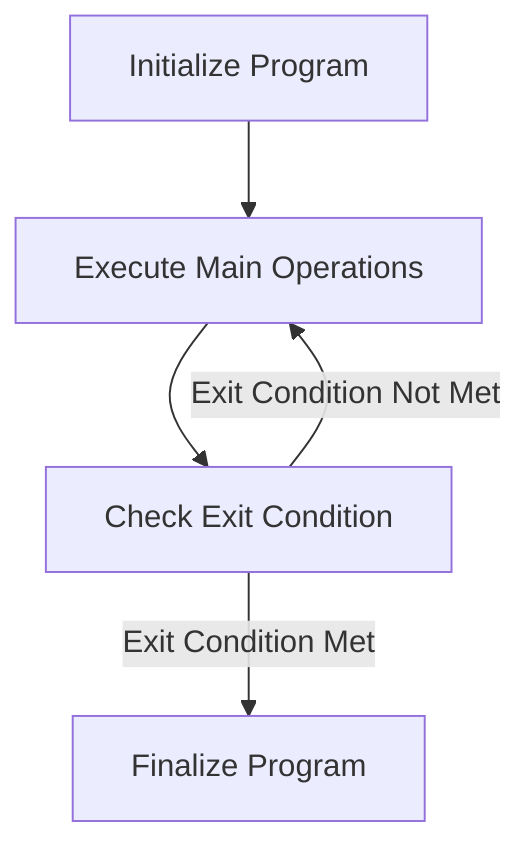

This document will cover the MAIN-PROCESS feature, which includes:

1. Initializing the program
2. Executing the main operations
3. Finalizing the program.

Technical document: <SwmLink doc-title="Overview of MAIN-PROCESS">[Overview of MAIN-PROCESS](/.swm/overview-of-main-process.5q3zunrc.sw.md)</SwmLink>

# Initializing the Program

The initialization step sets up the necessary environment and variables for the program to run. This includes loading initial data, setting default values, and preparing any required resources. This step ensures that the program starts in a consistent state, which is crucial for reliable operation.

# Executing Main Operations

The main operations are executed in a loop, where the program repeatedly performs its core logic. This includes evaluating various conditions and performing corresponding actions such as centralizing data, saving data, loading data, and calling other sections like handling products, gifts, pop-ups, events, and commissions. Each of these actions is crucial for the program's functionality, ensuring that all necessary tasks are performed continuously until an exit condition is met.

# Finalizing the Program

Once the exit condition is met, the program proceeds to finalize its operations. This involves wrapping up any ongoing processes, saving final data, and releasing resources. The finalization step ensures that the program ends gracefully, maintaining data integrity and leaving the system in a stable state.

&nbsp;

*This is an auto-generated document by Swimm AI 🌊 and has not yet been verified by a human*

<SwmMeta version="3.0.0" repo-id="Z2l0aHViJTNBJTNBa2VsbG8lM0ElM0Fzd2ltbWlv" repo-name="kello">Powered by [Swimm](/)</SwmMeta>
