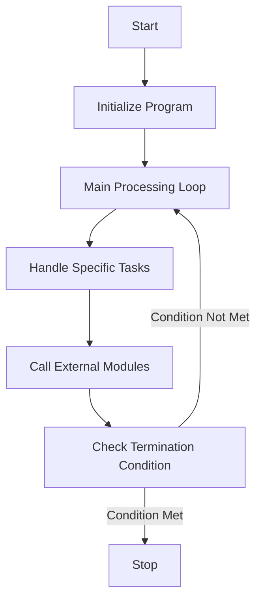

This document will cover the MTP001 Program, which includes:

1. Initializing the program
2. Main processing loop
3. Handling specific tasks
4. Calling external modules.

Technical document: <SwmLink doc-title="Overview of MTP001 Program">[Overview of MTP001 Program](/.swm/overview-of-mtp001-program.i1vc8xor.sw.md)</SwmLink>

# Initializing the Program

The MTP001 program begins by setting up initial parameters. This step is crucial as it prepares the system for the main processing tasks. The initialization includes setting up necessary variables, preparing data structures, and ensuring that all required resources are available. This step ensures that the program can run smoothly without interruptions.

# Main Processing Loop

After initialization, the program enters the main processing loop. This loop is the core of the MTP001 program, where it repeatedly performs the main tasks until a termination condition is met. The loop ensures continuous processing and handling of tasks, making the program efficient and responsive.

# Handling Specific Tasks

Within the main processing loop, the program handles various specific tasks. These tasks include centralizing data, validating records, and saving data. For example, when the program needs to centralize data, it performs operations to organize and consolidate information from different sources. Similarly, when saving records, the program validates the data to ensure accuracy and consistency before saving it to the database.

# Calling External Modules

The MTP001 program also calls external modules to handle specific operations. For instance, it may call the MTP020 module for product costing or sales scaling. These external calls are essential for modularizing the program's functionality, allowing specialized tasks to be handled by dedicated modules. This approach enhances the program's maintainability and scalability.

&nbsp;

*This is an auto-generated document by Swimm AI 🌊 and has not yet been verified by a human*

<SwmMeta version="3.0.0" repo-id="Z2l0aHViJTNBJTNBa2VsbG8lM0ElM0Fzd2ltbWlv" repo-name="kello">Powered by [Swimm](/)</SwmMeta>
