<SwmToken path="src/mtp/mtp001.cbl" pos="3:6:6" line-data="       PROGRAM-ID. MTP001.">`MTP001`</SwmToken> is a core program responsible for initializing and managing the main processing loop. It sets up initial parameters and repeatedly performs the main program body until a termination condition is met. The main program body handles various tasks such as centralizing data, validating and saving records, and calling external modules for specific operations.

The <SwmToken path="src/mtp/mtp001.cbl" pos="3:6:6" line-data="       PROGRAM-ID. MTP001.">`MTP001`</SwmToken> program starts by setting up initial parameters. It then enters a loop where it performs the main tasks of the program, like organizing data and saving records. If certain conditions are met, it calls other programs to handle specific tasks. This loop continues until a condition tells the program to stop.

# Flow drill down

```mermaid
graph TD;
      subgraph src/mtp
18ba1fb17b42522346ff095976a93ca0d0e56da0e2b13dedd0b13174deb24294(MTP001):::mainFlowStyle --> 22b0a25aad13e1f231be7bf2ef3997faa7a9baf429c0ba94df8718b930b747e0(CORPO-PROGRAMA):::mainFlowStyle
end

subgraph src/mtp
22b0a25aad13e1f231be7bf2ef3997faa7a9baf429c0ba94df8718b930b747e0(CORPO-PROGRAMA):::mainFlowStyle --> a631f25e7682c383a36b2984684086704a7ca644a452a39d51b4dec5423ef54f(MTP020):::mainFlowStyle
end

subgraph src/mtp
a631f25e7682c383a36b2984684086704a7ca644a452a39d51b4dec5423ef54f(MTP020):::mainFlowStyle --> 00096c7457f1233bc581f78e04c763cb19ec5c39b89a389cf7b80bfa212404b7(CORPO-PROGRAMA):::mainFlowStyle
end


      classDef mainFlowStyle color:#000000,fill:#7CB9F4
classDef rootsStyle color:#000000,fill:#00FFF4
classDef Style1 color:#000000,fill:#00FFAA
classDef Style2 color:#000000,fill:#FFFF00
classDef Style3 color:#000000,fill:#AA7CB9

%% Swimm:
%% graph TD;
%%       subgraph <SwmPath>[src/mtp/](src/mtp/)</SwmPath>
%% 18ba1fb17b42522346ff095976a93ca0d0e56da0e2b13dedd0b13174deb24294(MTP001):::mainFlowStyle --> 22b0a25aad13e1f231be7bf2ef3997faa7a9baf429c0ba94df8718b930b747e0(CORPO-PROGRAMA):::mainFlowStyle
%% end
%% 
%% subgraph <SwmPath>[src/mtp/](src/mtp/)</SwmPath>
%% 22b0a25aad13e1f231be7bf2ef3997faa7a9baf429c0ba94df8718b930b747e0(CORPO-PROGRAMA):::mainFlowStyle --> a631f25e7682c383a36b2984684086704a7ca644a452a39d51b4dec5423ef54f(MTP020):::mainFlowStyle
%% end
%% 
%% subgraph <SwmPath>[src/mtp/](src/mtp/)</SwmPath>
%% a631f25e7682c383a36b2984684086704a7ca644a452a39d51b4dec5423ef54f(MTP020):::mainFlowStyle --> 00096c7457f1233bc581f78e04c763cb19ec5c39b89a389cf7b80bfa212404b7(CORPO-PROGRAMA):::mainFlowStyle
%% end
%% 
%% 
%%       classDef mainFlowStyle color:#000000,fill:#7CB9F4
%% classDef rootsStyle color:#000000,fill:#00FFF4
%% classDef Style1 color:#000000,fill:#00FFAA
%% classDef Style2 color:#000000,fill:#FFFF00
%% classDef Style3 color:#000000,fill:#AA7CB9
```



<SwmSnippet path="/src/mtp/mtp001.cbl" line="151">

---

## Initialization and Main Processing

The <SwmToken path="src/mtp/mtp001.cbl" pos="3:6:6" line-data="       PROGRAM-ID. MTP001.">`MTP001`</SwmToken> function initializes the program and then enters the main processing loop. It performs the <SwmToken path="src/mtp/mtp001.cbl" pos="152:3:5" line-data="           PERFORM INICIALIZA-PROGRAMA.">`INICIALIZA-PROGRAMA`</SwmToken> section to set up initial parameters and then repeatedly performs the <SwmToken path="src/mtp/mtp001.cbl" pos="153:3:5" line-data="           PERFORM CORPO-PROGRAMA UNTIL GS-EXIT-FLG-TRUE.">`CORPO-PROGRAMA`</SwmToken> section until a termination condition is met.

```cobol
       MAIN-PROCESS SECTION.
           PERFORM INICIALIZA-PROGRAMA.
           PERFORM CORPO-PROGRAMA UNTIL GS-EXIT-FLG-TRUE.
           GO FINALIZAR-PROGRAMA.
```

---

</SwmSnippet>

<SwmSnippet path="/src/mtp/mtp001.cbl" line="280">

---

## Main Program Body

The <SwmToken path="src/mtp/mtp001.cbl" pos="280:1:3" line-data="       CORPO-PROGRAMA SECTION.">`CORPO-PROGRAMA`</SwmToken> section in <SwmToken path="src/mtp/mtp001.cbl" pos="3:6:6" line-data="       PROGRAM-ID. MTP001.">`MTP001`</SwmToken> handles the core logic of the program. It evaluates various conditions and performs corresponding actions such as centralizing data, validating and saving records, and handling different flags for specific operations.

```cobol
       CORPO-PROGRAMA SECTION.
           EVALUATE TRUE
               WHEN GS-CENTRALIZA-TRUE
                   PERFORM CENTRALIZAR
                   PERFORM CRIAR-LISTVIEW
               WHEN GS-SAVE-FLG-TRUE
                    PERFORM VALIDAR-PRODUZIDAS
                    IF GS-FLAG-CRITICA = 0
                       PERFORM SALVAR-DADOS
                       IF GS-TIPO-GRAVACAO = 1
                          PERFORM REGRAVA-DADOS
                       ELSE
                          PERFORM GRAVA-DADOS
                       END-IF
                    END-IF
                    IF GS-INDIVIDUAL = "S"
                       CALL   "MTP020" USING PARAMETROS-W GS-CONTRATO
                       CANCEL "MTP020"
                    END-IF
                    MOVE 0 TO GS-FLAG-CRITICA
                    PERFORM CARREGAR-DADOS
```

---

</SwmSnippet>

<SwmSnippet path="/src/mtp/mtp001.cbl" line="338">

---

## Calling External Programs

Within the <SwmToken path="src/mtp/mtp001.cbl" pos="153:3:5" line-data="           PERFORM CORPO-PROGRAMA UNTIL GS-EXIT-FLG-TRUE.">`CORPO-PROGRAMA`</SwmToken> section, the program calls external modules like <SwmToken path="src/mtp/mtp001.cbl" pos="339:4:4" line-data="           CALL   &quot;MTP020C&quot; USING PARAMETROS-W GS-CONTRATO">`MTP020C`</SwmToken> and <SwmToken path="src/mtp/mtp001.cbl" pos="345:4:4" line-data="           CALL   &quot;MTP020E&quot; USING PARAMETROS-W GS-CONTRATO">`MTP020E`</SwmToken> to handle specific tasks such as product costing and sales scaling. These calls are crucial for modularizing the program's functionality.

```cobol
       CUSTO-PRODUTOS SECTION.
           CALL   "MTP020C" USING PARAMETROS-W GS-CONTRATO
           CANCEL "MTP020C".
       CUSTO-PRODUTOS-FIM.
           EXIT.

       ESCALA-VENDA SECTION.
           CALL   "MTP020E" USING PARAMETROS-W GS-CONTRATO
           CANCEL "MTP020E".
```

---

</SwmSnippet>

<SwmSnippet path="/src/mtp/mtp020novo.cbl" line="192">

---

## <SwmToken path="src/mtp/mtp001.cbl" pos="296:4:4" line-data="                       CALL   &quot;MTP020&quot; USING PARAMETROS-W GS-CONTRATO">`MTP020`</SwmToken> Initialization and Main Processing

The <SwmToken path="src/mtp/mtp001.cbl" pos="296:4:4" line-data="                       CALL   &quot;MTP020&quot; USING PARAMETROS-W GS-CONTRATO">`MTP020`</SwmToken> function follows a similar structure to <SwmToken path="src/mtp/mtp001.cbl" pos="3:6:6" line-data="       PROGRAM-ID. MTP001.">`MTP001`</SwmToken>. It initializes the program and then enters a loop where it repeatedly performs the <SwmToken path="src/mtp/mtp020novo.cbl" pos="194:3:5" line-data="           PERFORM CORPO-PROGRAMA UNTIL GS-EXIT-FLG-TRUE.">`CORPO-PROGRAMA`</SwmToken> section until a termination condition is met.

```cobol
       MAIN-PROCESS SECTION.
           PERFORM INICIALIZA-PROGRAMA.
           PERFORM CORPO-PROGRAMA UNTIL GS-EXIT-FLG-TRUE.
           GO FINALIZAR-PROGRAMA.
```

---

</SwmSnippet>

<SwmSnippet path="/src/mtp/mtp020novo.cbl" line="340">

---

## <SwmToken path="src/mtp/mtp001.cbl" pos="296:4:4" line-data="                       CALL   &quot;MTP020&quot; USING PARAMETROS-W GS-CONTRATO">`MTP020`</SwmToken> Main Program Body

The <SwmToken path="src/mtp/mtp020novo.cbl" pos="340:1:3" line-data="       CORPO-PROGRAMA SECTION.">`CORPO-PROGRAMA`</SwmToken> section in <SwmToken path="src/mtp/mtp001.cbl" pos="296:4:4" line-data="                       CALL   &quot;MTP020&quot; USING PARAMETROS-W GS-CONTRATO">`MTP020`</SwmToken> handles the main logic for this module. It includes operations like centralizing data, saving records, updating specific tables, and handling various flags for different tasks. This section is essential for the detailed processing required by <SwmToken path="src/mtp/mtp001.cbl" pos="296:4:4" line-data="                       CALL   &quot;MTP020&quot; USING PARAMETROS-W GS-CONTRATO">`MTP020`</SwmToken>.

```cobol
       CORPO-PROGRAMA SECTION.
           EVALUATE TRUE
               WHEN GS-CENTRALIZA-TRUE
                   PERFORM CENTRALIZAR
                   PERFORM CRIAR-LISTVIEW-PRODUTOS
                   PERFORM CRIAR-LISTVIEW-CONTRATOS
               WHEN GS-SAVE-FLG-TRUE
                   PERFORM SALVAR-DADOS
                   IF GS-TIPO-GRAVACAO = 1
                      PERFORM REGRAVA-DADOS
                      MOVE ZEROS TO GS-VISITA
                      PERFORM SET-UP-FOR-REFRESH-SCREEN
                      PERFORM CALL-DIALOG-SYSTEM
                   ELSE
                      PERFORM GRAVA-DADOS
                   END-IF
                   PERFORM ATUALIZAR-MTD020P
                   PERFORM CARREGA-ULTIMOS

                   PERFORM ATUALIZAR-MTD001
                   PERFORM LIMPAR-DADOS
```

---

</SwmSnippet>

&nbsp;

*This is an auto-generated document by Swimm AI 🌊 and has not yet been verified by a human*

<SwmMeta version="3.0.0" repo-id="Z2l0aHViJTNBJTNBa2VsbG8lM0ElM0Fzd2ltbWlv" repo-name="kello"><sup>Powered by [Swimm](/)</sup></SwmMeta>
