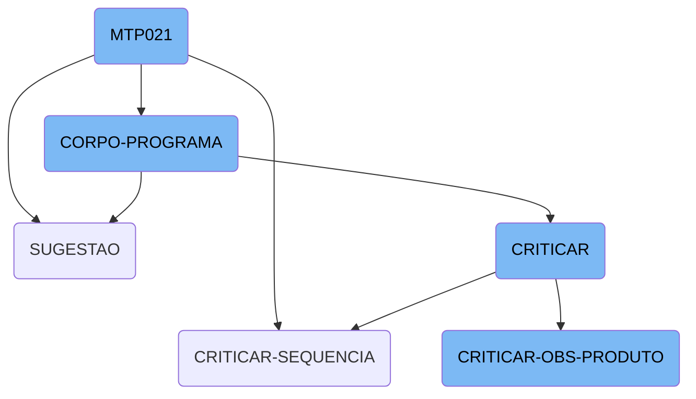
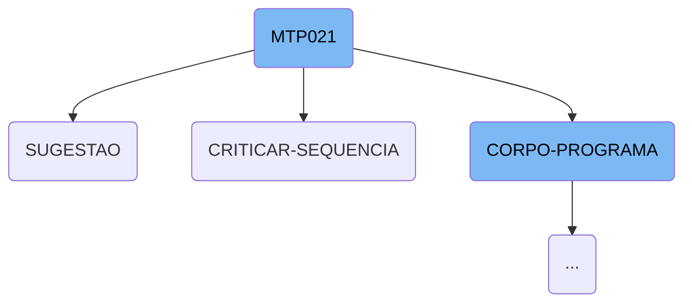
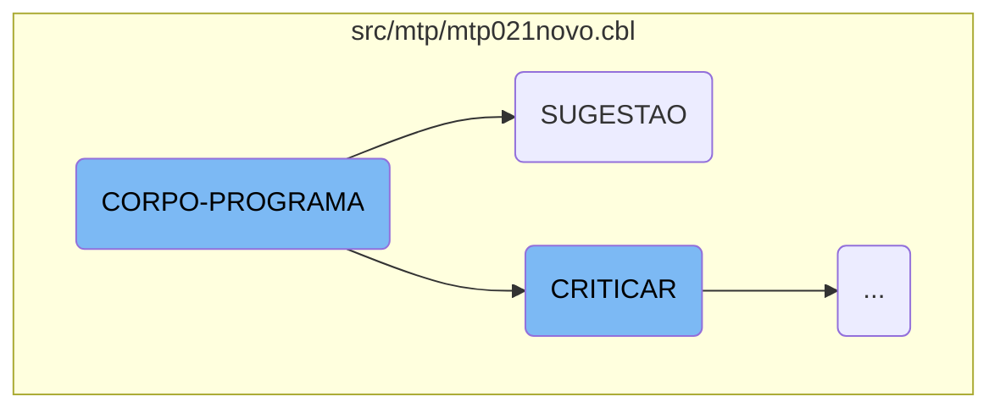
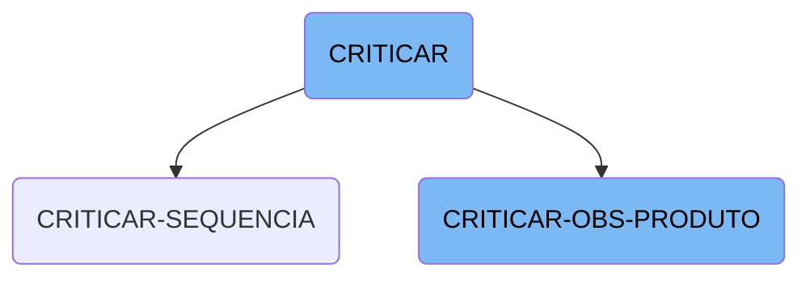

<SwmToken path="src/mtp/mtp021novo.cbl" pos="3:6:6" line-data="       PROGRAM-ID. MTP021.">`MTP021`</SwmToken> is a central component of the Kello Imagens business operations management system.&nbsp;

This document will cover the MTP021 flow, which deals with suggestions for various entities such as albums, contracts and products.&nbsp;

The <SwmToken path="src/mtp/mtp021novo.cbl" pos="3:6:6" line-data="       PROGRAM-ID. MTP021.">`MTP021`</SwmToken> flow starts by initializing the program and setting up necessary parameters. It then enters the main program body, where it evaluates different conditions and performs corresponding actions. These actions include centralizing data, saving and rewriting records, clearing data, verifying permissions, printing reports, and handling annotations. The flow also includes sections for making suggestions and performing validations.

Here is a high level diagram of the flow, showing only the most important functions:



# Flow drill down

First, we'll zoom into this section of the flow:



<SwmSnippet path="/src/mtp/mtp021novo.cbl" line="208">

---

## <SwmToken path="src/mtp/mtp021novo.cbl" pos="3:6:6" line-data="       PROGRAM-ID. MTP021.">`MTP021`</SwmToken>

The <SwmToken path="src/mtp/mtp021novo.cbl" pos="3:6:6" line-data="       PROGRAM-ID. MTP021.">`MTP021`</SwmToken> function is the main entry point for the flow. It initializes the program, processes the main logic, and handles various sections such as <SwmToken path="src/mtp/mtp021novo.cbl" pos="402:5:5" line-data="               WHEN GS-CRITICAR-FLG-TRUE">`CRITICAR`</SwmToken>, <SwmToken path="src/mtp/mtp021novo.cbl" pos="404:5:5" line-data="               WHEN GS-SUGESTAO-FLG-TRUE">`SUGESTAO`</SwmToken>, and <SwmToken path="src/mtp/mtp021novo.cbl" pos="547:7:9" line-data="               WHEN 2 PERFORM REGRAVACAO-PRODUTO">`REGRAVACAO-PRODUTO`</SwmToken>. This function orchestrates the overall flow and ensures that each section is executed in the correct order.

We will now focus on <SwmToken path="/src/mtp/mtp021novo.cbl" pos="903:1:1" line-data="       SUGESTAO SECTION.">`SUGESTAO`</SwmToken> and <SwmToken path="/src/rcp/rcp100prod.cbl" pos="999:1:3" line-data="       CRITICAR-SEQUENCIA SECTION.">`CRITICAR-SEQUENCIA`</SwmToken>, and later dive deeper into <SwmToken path="/src/mtp/mtp021novo.cbl" pos="210:3:5" line-data="           PERFORM CORPO-PROGRAMA UNTIL GS-EXIT-FLG-TRUE.">`CORPO-PROGRAMA`</SwmToken>.

```cobol
       MAIN-PROCESS SECTION.
           PERFORM INICIALIZA-PROGRAMA.
           PERFORM CORPO-PROGRAMA UNTIL GS-EXIT-FLG-TRUE.
           GO FINALIZAR-PROGRAMA.
       INICIALIZA-PROGRAMA SECTION.
           ACCEPT PARAMETROS-W FROM COMMAND-LINE.
           COPY "CBDATA1.CPY".
           MOVE DATA-INV TO DATA-MOVTO-W DATA-MOVTO-REL.
           CALL "GRIDAT2"  USING DATA-INV.
           MOVE DATA-INV       TO DATA-DIA-I.
           MOVE ZEROS TO PAGE-COUNT ERRO-W.
           INITIALIZE GS-DATA-BLOCK
           INITIALIZE DS-CONTROL-BLOCK
           MOVE GS-DATA-BLOCK-VERSION-NO TO DS-DATA-BLOCK-VERSION-NO.
           MOVE GS-VERSION-NO            TO DS-VERSION-NO
           MOVE EMPRESA-W                TO EMP-REC
           MOVE NOME-EMPRESA-W           TO EMPRESA-REL
           MOVE "\PROGRAMA\KELLO\*"      TO LNK-PATH-SIS
           MOVE EMPRESA-W                TO LNK-EMPRESA
           MOVE USUARIO-W                TO LNK-USUARIO
           MOVE "CAD004"  TO ARQ-REC.  MOVE EMPRESA-REF TO PATH-CAD004
```

---

</SwmSnippet>

<SwmSnippet path="/src/mtp/mtp021novo.cbl" line="903">

---

### SUGESTAO

The <SwmToken path="src/mtp/mtp021novo.cbl" pos="903:1:1" line-data="       SUGESTAO SECTION.">`SUGESTAO`</SwmToken> function evaluates the field <SwmToken path="src/mtp/mtp021novo.cbl" pos="904:3:7" line-data="           EVALUATE GS-CAMPO-CRITICA">`GS-CAMPO-CRITICA`</SwmToken> and performs the corresponding suggestion logic based on the field value. It calls specific sections like <SwmToken path="src/mtp/mtp021novo.cbl" pos="905:11:13" line-data="               WHEN &quot;EF-CONTRATO&quot;      PERFORM SUGESTAO-CONTRATO">`SUGESTAO-CONTRATO`</SwmToken>, <SwmToken path="src/mtp/mtp021novo.cbl" pos="906:11:13" line-data="               WHEN &quot;EF-ALBUM&quot;         PERFORM SUGESTAO-ALBUM">`SUGESTAO-ALBUM`</SwmToken>, <SwmToken path="src/mtp/mtp021novo.cbl" pos="907:11:13" line-data="               WHEN &quot;EF-PRODUTO&quot;       PERFORM SUGESTAO-PRODUTO">`SUGESTAO-PRODUTO`</SwmToken>, and <SwmToken path="src/mtp/mtp021novo.cbl" pos="909:11:13" line-data="               WHEN &quot;EF-FORNECEDOR&quot;    PERFORM SUGESTAO-FORNECEDOR">`SUGESTAO-FORNECEDOR`</SwmToken> to handle different types of suggestions.

```cobol
       SUGESTAO SECTION.
           EVALUATE GS-CAMPO-CRITICA
               WHEN "EF-CONTRATO"      PERFORM SUGESTAO-CONTRATO
               WHEN "EF-ALBUM"         PERFORM SUGESTAO-ALBUM
               WHEN "EF-PRODUTO"       PERFORM SUGESTAO-PRODUTO
               WHEN "EF-MODELO"        PERFORM SUGESTAO-PRODUTO
               WHEN "EF-FORNECEDOR"    PERFORM SUGESTAO-FORNECEDOR
           END-EVALUATE.
```

---

</SwmSnippet>

<SwmSnippet path="/src/rcp/rcp100prod.cbl" line="999">

---

### <SwmToken path="src/rcp/rcp100prod.cbl" pos="999:1:3" line-data="       CRITICAR-SEQUENCIA SECTION.">`CRITICAR-SEQUENCIA`</SwmToken>

The <SwmToken path="src/rcp/rcp100prod.cbl" pos="999:1:3" line-data="       CRITICAR-SEQUENCIA SECTION.">`CRITICAR-SEQUENCIA`</SwmToken> function performs the <SwmToken path="src/rcp/rcp100prod.cbl" pos="1000:3:5" line-data="           PERFORM VERIFICA-ALBUM.">`VERIFICA-ALBUM`</SwmToken> operation. This function is part of the validation sequence and ensures that the album data is correctly verified before proceeding.

```cobol
       CRITICAR-SEQUENCIA SECTION.
           PERFORM VERIFICA-ALBUM.
```

---

</SwmSnippet>

Now, lets zoom into this section of the flow:



<SwmSnippet path="/src/mtp/mtp021novo.cbl" line="355">

---

## <SwmToken path="src/mtp/mtp021novo.cbl" pos="355:1:3" line-data="       CORPO-PROGRAMA SECTION.">`CORPO-PROGRAMA`</SwmToken>

The <SwmToken path="src/mtp/mtp021novo.cbl" pos="355:1:3" line-data="       CORPO-PROGRAMA SECTION.">`CORPO-PROGRAMA`</SwmToken> section is a central part of the <SwmToken path="src/mtp/mtp021novo.cbl" pos="3:6:6" line-data="       PROGRAM-ID. MTP021.">`MTP021`</SwmToken> flow. It evaluates various conditions and performs corresponding actions based on the state of different flags. This section handles tasks such as centralizing data, saving and rewriting records, clearing data, verifying permissions, printing reports, and handling annotations. Each condition within the <SwmToken path="src/mtp/mtp021novo.cbl" pos="356:1:3" line-data="           EVALUATE TRUE">`EVALUATE TRUE`</SwmToken> statement triggers specific operations that contribute to the overall business logic of the application.

```cobol
       CORPO-PROGRAMA SECTION.
           EVALUATE TRUE
               WHEN GS-CENTRALIZA-TRUE
                   PERFORM CENTRALIZAR
                   PERFORM CRIAR-LISTVIEW
                   PERFORM DESABILITAR-CAMPOS
               WHEN GS-SAVE-FLG-TRUE
                   PERFORM SALVAR-DADOS
                   IF GS-TIPO-GRAVACAO = 1
                      PERFORM REGRAVA-DADOS
                   ELSE
                      PERFORM GRAVA-DADOS
                      MOVE CAMPANHA-CO40 TO CAMPANHA-MT24
                      READ MTD024 INVALID KEY
                          MOVE GS-ORDEM TO PRIORIDADE-MT24
                          WRITE REG-MTD024
                          END-WRITE
                      NOT INVALID KEY
                          MOVE GS-ORDEM TO PRIORIDADE-MT24
                          REWRITE REG-MTD024
                          END-REWRITE
```

---

</SwmSnippet>

<SwmSnippet path="/src/mtp/mtp021novo.cbl" line="357">

---

### Centralizing Data

When the <SwmToken path="src/mtp/mtp021novo.cbl" pos="357:3:7" line-data="               WHEN GS-CENTRALIZA-TRUE">`GS-CENTRALIZA-TRUE`</SwmToken> flag is set, the program performs the <SwmToken path="src/mtp/mtp021novo.cbl" pos="358:3:3" line-data="                   PERFORM CENTRALIZAR">`CENTRALIZAR`</SwmToken>, <SwmToken path="src/mtp/mtp021novo.cbl" pos="359:3:5" line-data="                   PERFORM CRIAR-LISTVIEW">`CRIAR-LISTVIEW`</SwmToken>, and <SwmToken path="src/mtp/mtp021novo.cbl" pos="360:3:5" line-data="                   PERFORM DESABILITAR-CAMPOS">`DESABILITAR-CAMPOS`</SwmToken> operations. These steps are responsible for centralizing data, creating a list view, and disabling fields, respectively.

```cobol
               WHEN GS-CENTRALIZA-TRUE
                   PERFORM CENTRALIZAR
                   PERFORM CRIAR-LISTVIEW
                   PERFORM DESABILITAR-CAMPOS
```

---

</SwmSnippet>

<SwmSnippet path="/src/mtp/mtp021novo.cbl" line="361">

---

### Saving Data

When the <SwmToken path="src/mtp/mtp021novo.cbl" pos="361:3:9" line-data="               WHEN GS-SAVE-FLG-TRUE">`GS-SAVE-FLG-TRUE`</SwmToken> flag is set, the program performs the <SwmToken path="src/mtp/mtp021novo.cbl" pos="362:3:5" line-data="                   PERFORM SALVAR-DADOS">`SALVAR-DADOS`</SwmToken> operation. Depending on the value of <SwmToken path="src/mtp/mtp021novo.cbl" pos="363:3:7" line-data="                   IF GS-TIPO-GRAVACAO = 1">`GS-TIPO-GRAVACAO`</SwmToken>, it either re-saves or saves new data, updates the campaign information, and writes or rewrites records in the <SwmToken path="src/mtp/mtp021novo.cbl" pos="368:3:3" line-data="                      READ MTD024 INVALID KEY">`MTD024`</SwmToken> file.

```cobol
               WHEN GS-SAVE-FLG-TRUE
                   PERFORM SALVAR-DADOS
                   IF GS-TIPO-GRAVACAO = 1
                      PERFORM REGRAVA-DADOS
                   ELSE
                      PERFORM GRAVA-DADOS
                      MOVE CAMPANHA-CO40 TO CAMPANHA-MT24
                      READ MTD024 INVALID KEY
                          MOVE GS-ORDEM TO PRIORIDADE-MT24
                          WRITE REG-MTD024
                          END-WRITE
                      NOT INVALID KEY
                          MOVE GS-ORDEM TO PRIORIDADE-MT24
                          REWRITE REG-MTD024
                          END-REWRITE
                      END-READ
                   END-IF
```

---

</SwmSnippet>

<SwmSnippet path="/src/mtp/mtp021novo.cbl" line="378">

---

### Clearing Data and Verifying Permissions

When the <SwmToken path="src/mtp/mtp021novo.cbl" pos="384:3:9" line-data="               WHEN GS-CLR-FLG-TRUE">`GS-CLR-FLG-TRUE`</SwmToken> flag is set, the program performs the <SwmToken path="src/mtp/mtp021novo.cbl" pos="378:3:5" line-data="                   PERFORM LIMPAR-DADOS">`LIMPAR-DADOS`</SwmToken> and <SwmToken path="src/mtp/mtp021novo.cbl" pos="379:3:5" line-data="                   PERFORM VERIFICAR-PERMISSOES">`VERIFICAR-PERMISSOES`</SwmToken> operations. These steps clear the data and verify the user's permissions.

```cobol
                   PERFORM LIMPAR-DADOS
                   PERFORM VERIFICAR-PERMISSOES
               WHEN GS-EXCLUI-FLG-TRUE
                   PERFORM EXCLUI
                   PERFORM LIMPAR-DADOS
                   PERFORM VERIFICAR-PERMISSOES
               WHEN GS-CLR-FLG-TRUE
                   PERFORM LIMPAR-DADOS
                   PERFORM VERIFICAR-PERMISSOES
```

---

</SwmSnippet>

<SwmSnippet path="/src/mtp/mtp021novo.cbl" line="394">

---

### Handling Annotations

When the <SwmToken path="src/mtp/mtp021novo.cbl" pos="394:3:9" line-data="               WHEN GS-CARREGA-ANOTACAO-TRUE">`GS-CARREGA-ANOTACAO-TRUE`</SwmToken> or <SwmToken path="src/mtp/mtp021novo.cbl" pos="396:3:9" line-data="               WHEN GS-SALVAR-ANOTACAO-TRUE">`GS-SALVAR-ANOTACAO-TRUE`</SwmToken> flags are set, the program performs the <SwmToken path="src/mtp/mtp021novo.cbl" pos="395:3:5" line-data="                   PERFORM CARREGAR-ANOTACOES">`CARREGAR-ANOTACOES`</SwmToken> and <SwmToken path="src/mtp/mtp021novo.cbl" pos="397:3:5" line-data="                   PERFORM SALVAR-ANOTACOES">`SALVAR-ANOTACOES`</SwmToken> operations. These steps load and save annotations, respectively.

```cobol
               WHEN GS-CARREGA-ANOTACAO-TRUE
                   PERFORM CARREGAR-ANOTACOES
               WHEN GS-SALVAR-ANOTACAO-TRUE
                   PERFORM SALVAR-ANOTACOES
                   PERFORM CARREGAR-ANOTACOES
```

---

</SwmSnippet>

<SwmSnippet path="/src/mtp/mtp021novo.cbl" line="402">

---

### Criticizing and Suggesting

When the <SwmToken path="src/mtp/mtp021novo.cbl" pos="402:3:9" line-data="               WHEN GS-CRITICAR-FLG-TRUE">`GS-CRITICAR-FLG-TRUE`</SwmToken> or <SwmToken path="src/mtp/mtp021novo.cbl" pos="404:3:9" line-data="               WHEN GS-SUGESTAO-FLG-TRUE">`GS-SUGESTAO-FLG-TRUE`</SwmToken> flags are set, the program performs the <SwmToken path="src/mtp/mtp021novo.cbl" pos="402:5:5" line-data="               WHEN GS-CRITICAR-FLG-TRUE">`CRITICAR`</SwmToken> and <SwmToken path="src/mtp/mtp021novo.cbl" pos="404:5:5" line-data="               WHEN GS-SUGESTAO-FLG-TRUE">`SUGESTAO`</SwmToken> operations. These steps handle the criticism and suggestion functionalities.

```cobol
               WHEN GS-CRITICAR-FLG-TRUE
                   PERFORM CRITICAR
               WHEN GS-SUGESTAO-FLG-TRUE
                   PERFORM SUGESTAO
           END-EVALUATE.
```

---

</SwmSnippet>

Now, lets zoom into this section of the flow:



<SwmSnippet path="/src/mtp/mtp021novo.cbl" line="412">

---

## CRITICAR

The <SwmToken path="src/mtp/mtp021novo.cbl" pos="412:1:1" line-data="       CRITICAR SECTION.">`CRITICAR`</SwmToken> function is responsible for evaluating different product-related fields and performing specific validation routines based on the field being evaluated. It uses the <SwmToken path="src/mtp/mtp021novo.cbl" pos="414:1:1" line-data="           EVALUATE GS-CAMPO-CRITICA">`EVALUATE`</SwmToken> statement to determine which subroutine to call, such as <SwmToken path="src/mtp/mtp021novo.cbl" pos="415:11:13" line-data="               WHEN &quot;EF-CONTRATO&quot;      PERFORM CRITICAR-CONTRATO">`CRITICAR-CONTRATO`</SwmToken>, <SwmToken path="src/mtp/mtp021novo.cbl" pos="416:11:13" line-data="               WHEN &quot;EF-ALBUM&quot;         PERFORM CRITICAR-ALBUM">`CRITICAR-ALBUM`</SwmToken>, and <SwmToken path="src/mtp/mtp021novo.cbl" pos="428:11:15" line-data="               WHEN &quot;MLE-OBSERVACAO&quot;   PERFORM CRITICAR-OBS-PRODUTO">`CRITICAR-OBS-PRODUTO`</SwmToken>. This function ensures that each field is validated according to its type and updates the product data accordingly.

```cobol
       CRITICAR SECTION.
           MOVE SPACES TO MENSAGEM
           EVALUATE GS-CAMPO-CRITICA
               WHEN "EF-CONTRATO"      PERFORM CRITICAR-CONTRATO
               WHEN "EF-ALBUM"         PERFORM CRITICAR-ALBUM
               WHEN "EF-SEQUENCIA"     PERFORM CRITICAR-SEQUENCIA
               WHEN "EF-ORDEM"         PERFORM CRITICAR-ORDEM
               WHEN "EF-OBSERVACAO"    PERFORM CRITICAR-OBSERVACAO
               WHEN "SB-PRIORIDADE"    PERFORM CRITICAR-PRIORIDADE
               WHEN "EF-PRODUTO"       PERFORM CRITICAR-PRODUTO
               WHEN "EF-MODELO"        PERFORM CRITICAR-MODELO
               WHEN "EF-QTDE-PLANILHA" PERFORM CRITICAR-QTDE-PLANILHA
               WHEN "EF-FORNECEDOR"    PERFORM CRITICAR-FORNECEDOR
               WHEN "SB-STATUS"        PERFORM CRITICAR-STATUS
               WHEN "EF-DTPREVISTA"    PERFORM CRITICAR-DTPREVISTA
               WHEN "EF-DTENTREGA"     PERFORM CRITICAR-DTENTREGA
               WHEN "MLE-OBSERVACAO"   PERFORM CRITICAR-OBS-PRODUTO

               WHEN "OK-PRODUTO"       PERFORM CRITICAR-PRODUTO
                                          THRU CRITICAR-OBS-PRODUTO
                                       IF GS-FLAG-CRITICA = 0
```

---

</SwmSnippet>

<SwmSnippet path="/src/mtp/mtp021novo.cbl" line="901">

---

## <SwmToken path="src/mtp/mtp021novo.cbl" pos="901:1:5" line-data="       CRITICAR-OBS-PRODUTO SECTION.">`CRITICAR-OBS-PRODUTO`</SwmToken>

The <SwmToken path="src/mtp/mtp021novo.cbl" pos="901:1:5" line-data="       CRITICAR-OBS-PRODUTO SECTION.">`CRITICAR-OBS-PRODUTO`</SwmToken> function is a specialized subroutine that handles the validation of product observations. It evaluates the field <SwmToken path="src/mtp/mtp021novo.cbl" pos="904:3:7" line-data="           EVALUATE GS-CAMPO-CRITICA">`GS-CAMPO-CRITICA`</SwmToken> and performs the corresponding suggestion routine, such as <SwmToken path="src/mtp/mtp021novo.cbl" pos="905:11:13" line-data="               WHEN &quot;EF-CONTRATO&quot;      PERFORM SUGESTAO-CONTRATO">`SUGESTAO-CONTRATO`</SwmToken>, <SwmToken path="src/mtp/mtp021novo.cbl" pos="906:11:13" line-data="               WHEN &quot;EF-ALBUM&quot;         PERFORM SUGESTAO-ALBUM">`SUGESTAO-ALBUM`</SwmToken>, and <SwmToken path="src/mtp/mtp021novo.cbl" pos="907:11:13" line-data="               WHEN &quot;EF-PRODUTO&quot;       PERFORM SUGESTAO-PRODUTO">`SUGESTAO-PRODUTO`</SwmToken>. This function ensures that product observations are validated and appropriate suggestions are made based on the field type.

```cobol
       CRITICAR-OBS-PRODUTO SECTION.

       SUGESTAO SECTION.
           EVALUATE GS-CAMPO-CRITICA
               WHEN "EF-CONTRATO"      PERFORM SUGESTAO-CONTRATO
               WHEN "EF-ALBUM"         PERFORM SUGESTAO-ALBUM
               WHEN "EF-PRODUTO"       PERFORM SUGESTAO-PRODUTO
               WHEN "EF-MODELO"        PERFORM SUGESTAO-PRODUTO
               WHEN "EF-FORNECEDOR"    PERFORM SUGESTAO-FORNECEDOR
           END-EVALUATE.
```

---

</SwmSnippet>

&nbsp;

*This is an auto-generated document by Swimm AI 🌊 and has not yet been verified by a human*

<SwmMeta version="3.0.0" repo-id="Z2l0aHViJTNBJTNBa2VsbG8lM0ElM0Fzd2ltbWlv" repo-name="kello"><sup>Powered by [Swimm](https://app.swimm.io/)</sup></SwmMeta>
