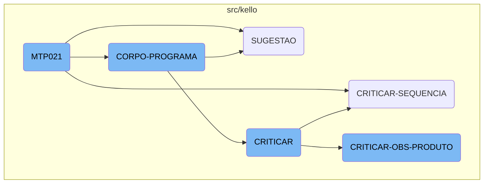
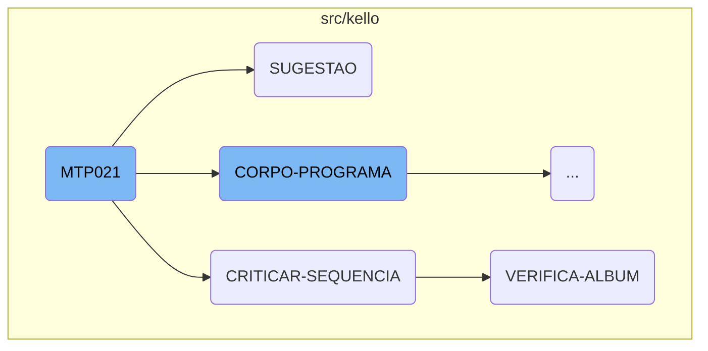
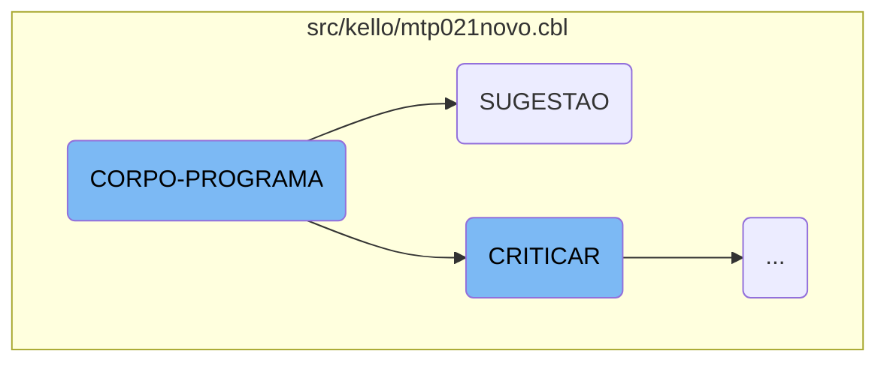
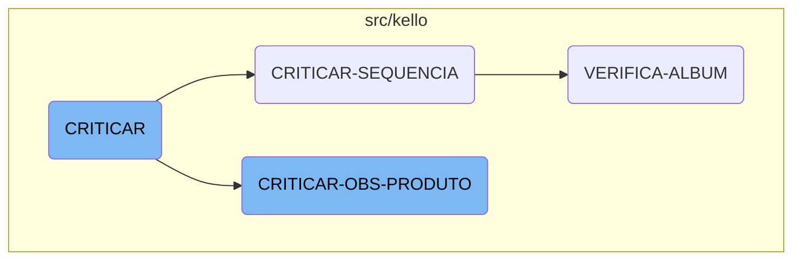

<SwmToken path="src/kello/mtp021novo.cbl" pos="3:6:6" line-data="       PROGRAM-ID. MTP021.">`MTP021`</SwmToken> is a central function in the Kello Imagens system, responsible for initializing the program, processing core logic, and managing various sections such as CRITICAR, SUGESTAO, and <SwmToken path="src/kello/mtp021novo.cbl" pos="399:5:7" line-data="               WHEN GS-VERIFICAR-EVENTO-TRUE">`VERIFICAR-EVENTO`</SwmToken>. This function orchestrates the overall business logic by calling different sections to validate and process product data.

<SwmToken path="src/kello/mtp021novo.cbl" pos="3:6:6" line-data="       PROGRAM-ID. MTP021.">`MTP021`</SwmToken> starts by initializing the program and setting up necessary parameters. It then enters the main processing loop, where it repeatedly performs the core program logic until a specific exit flag is set. Within this loop, it handles various tasks such as making suggestions, critiquing sequences, and verifying albums. Each of these tasks is managed by dedicated sections that perform specific operations, like evaluating fields, updating records, and displaying messages to the user. Finally, the program concludes by finalizing any remaining tasks and closing the program.

Here is a high level diagram of the flow, showing only the most important functions:



# Flow drill down

First, we'll zoom into this section of the flow:



<SwmSnippet path="/src/kello/mtp021novo.cbl" line="208">

---

## <SwmToken path="src/kello/mtp021novo.cbl" pos="3:6:6" line-data="       PROGRAM-ID. MTP021.">`MTP021`</SwmToken>

The <SwmToken path="src/kello/mtp021novo.cbl" pos="3:6:6" line-data="       PROGRAM-ID. MTP021.">`MTP021`</SwmToken> function is the main driver of the flow. It initializes the program, processes the core logic, and handles various sections such as <SwmToken path="src/kello/mtp021novo.cbl" pos="402:5:5" line-data="               WHEN GS-CRITICAR-FLG-TRUE">`CRITICAR`</SwmToken>, <SwmToken path="src/kello/mtp021novo.cbl" pos="404:5:5" line-data="               WHEN GS-SUGESTAO-FLG-TRUE">`SUGESTAO`</SwmToken>, and <SwmToken path="src/kello/mtp021novo.cbl" pos="399:5:7" line-data="               WHEN GS-VERIFICAR-EVENTO-TRUE">`VERIFICAR-EVENTO`</SwmToken>. This function orchestrates the overall business logic by calling different sections to validate and process product data.

```cobol
       MAIN-PROCESS SECTION.
           PERFORM INICIALIZA-PROGRAMA.
           PERFORM CORPO-PROGRAMA UNTIL GS-EXIT-FLG-TRUE.
           GO FINALIZAR-PROGRAMA.
       INICIALIZA-PROGRAMA SECTION.
           ACCEPT PARAMETROS-W FROM COMMAND-LINE.
           COPY "CBDATA1.CPY".
           MOVE DATA-INV TO DATA-MOVTO-W DATA-MOVTO-REL.
           CALL "GRIDAT2"  USING DATA-INV.
           MOVE DATA-INV       TO DATA-DIA-I.
           MOVE ZEROS TO PAGE-COUNT ERRO-W.
           INITIALIZE GS-DATA-BLOCK
           INITIALIZE DS-CONTROL-BLOCK
           MOVE GS-DATA-BLOCK-VERSION-NO TO DS-DATA-BLOCK-VERSION-NO.
           MOVE GS-VERSION-NO            TO DS-VERSION-NO
           MOVE EMPRESA-W                TO EMP-REC
           MOVE NOME-EMPRESA-W           TO EMPRESA-REL
           MOVE "\PROGRAMA\KELLO\*"      TO LNK-PATH-SIS
           MOVE EMPRESA-W                TO LNK-EMPRESA
           MOVE USUARIO-W                TO LNK-USUARIO
           MOVE "CAD004"  TO ARQ-REC.  MOVE EMPRESA-REF TO PATH-CAD004
```

---

</SwmSnippet>

<SwmSnippet path="/src/kello/mtp021novo.cbl" line="903">

---

## SUGESTAO

The <SwmToken path="src/kello/mtp021novo.cbl" pos="903:1:1" line-data="       SUGESTAO SECTION.">`SUGESTAO`</SwmToken> function evaluates the field <SwmToken path="src/kello/mtp021novo.cbl" pos="904:3:7" line-data="           EVALUATE GS-CAMPO-CRITICA">`GS-CAMPO-CRITICA`</SwmToken> and performs specific suggestion routines based on its value. This function helps in providing suggestions for different fields like contract, album, product, and supplier.

```cobol
       SUGESTAO SECTION.
           EVALUATE GS-CAMPO-CRITICA
               WHEN "EF-CONTRATO"      PERFORM SUGESTAO-CONTRATO
               WHEN "EF-ALBUM"         PERFORM SUGESTAO-ALBUM
               WHEN "EF-PRODUTO"       PERFORM SUGESTAO-PRODUTO
               WHEN "EF-MODELO"        PERFORM SUGESTAO-PRODUTO
               WHEN "EF-FORNECEDOR"    PERFORM SUGESTAO-FORNECEDOR
           END-EVALUATE.
```

---

</SwmSnippet>

<SwmSnippet path="/src/kello/rcp100prod.cbl" line="999">

---

## <SwmToken path="src/kello/rcp100prod.cbl" pos="999:1:3" line-data="       CRITICAR-SEQUENCIA SECTION.">`CRITICAR-SEQUENCIA`</SwmToken>

The <SwmToken path="src/kello/rcp100prod.cbl" pos="999:1:3" line-data="       CRITICAR-SEQUENCIA SECTION.">`CRITICAR-SEQUENCIA`</SwmToken> function performs the <SwmToken path="src/kello/rcp100prod.cbl" pos="1000:3:5" line-data="           PERFORM VERIFICA-ALBUM.">`VERIFICA-ALBUM`</SwmToken> operation. This function is responsible for validating the sequence of operations related to the album.

```cobol
       CRITICAR-SEQUENCIA SECTION.
           PERFORM VERIFICA-ALBUM.
```

---

</SwmSnippet>

<SwmSnippet path="/src/kello/rcp100prod.cbl" line="1646">

---

## <SwmToken path="src/kello/rcp100prod.cbl" pos="1646:1:3" line-data="       VERIFICA-ALBUM SECTION.">`VERIFICA-ALBUM`</SwmToken>

The <SwmToken path="src/kello/rcp100prod.cbl" pos="1646:1:3" line-data="       VERIFICA-ALBUM SECTION.">`VERIFICA-ALBUM`</SwmToken> function performs a series of operations to validate and process album data. It opens and closes files, reads records, and checks user permissions. This function ensures that the album data is correctly validated and any necessary messages are displayed to the user.

```cobol
       VERIFICA-ALBUM SECTION.
           CLOSE       WORK
           OPEN OUTPUT WORK
           CLOSE       WORK
           OPEN I-O    WORK

           MOVE ZEROS                      TO TOT-PARCELA
                                              GS-FLAG-CRITICA
           MOVE GS-NR-ALBUM                TO ALBUM-REC(1: 4)
           MOVE GS-NR-FORM                 TO ALBUM-REC(5: 4)
           MOVE GS-SEQ                     TO SEQ-REC
           READ RCD100 INVALID KEY
                MOVE GS-NR-ALBUM           TO NR-ALBUM-W
                MOVE GS-NR-FORM            TO NR-FORM-W
                MOVE GS-SEQ                TO SEQ-W
                MOVE GS-VENDEDOR           TO VENDEDOR-W
                PERFORM LIMPAR-DADOS
                MOVE NR-ALBUM-W            TO GS-NR-ALBUM
                                              ALBUM-REC(1: 4)
                MOVE NR-FORM-W             TO GS-NR-FORM
                                              ALBUM-REC(5: 4)
```

---

</SwmSnippet>

Now, lets zoom into this section of the flow:



<SwmSnippet path="/src/kello/mtp021novo.cbl" line="356">

---

## Handling Different Flags

The <SwmToken path="src/kello/mtp021novo.cbl" pos="210:3:5" line-data="           PERFORM CORPO-PROGRAMA UNTIL GS-EXIT-FLG-TRUE.">`CORPO-PROGRAMA`</SwmToken> section evaluates various flags and performs corresponding actions. This includes centralizing data, saving data, clearing fields, printing reports, calling pop-ups, loading and saving annotations, verifying events, and handling suggestions.

```cobol
           EVALUATE TRUE
               WHEN GS-CENTRALIZA-TRUE
                   PERFORM CENTRALIZAR
                   PERFORM CRIAR-LISTVIEW
                   PERFORM DESABILITAR-CAMPOS
               WHEN GS-SAVE-FLG-TRUE
                   PERFORM SALVAR-DADOS
                   IF GS-TIPO-GRAVACAO = 1
                      PERFORM REGRAVA-DADOS
                   ELSE
                      PERFORM GRAVA-DADOS
                      MOVE CAMPANHA-CO40 TO CAMPANHA-MT24
                      READ MTD024 INVALID KEY
                          MOVE GS-ORDEM TO PRIORIDADE-MT24
                          WRITE REG-MTD024
                          END-WRITE
                      NOT INVALID KEY
                          MOVE GS-ORDEM TO PRIORIDADE-MT24
                          REWRITE REG-MTD024
                          END-REWRITE
                      END-READ
```

---

</SwmSnippet>

<SwmSnippet path="/src/kello/mtp021novo.cbl" line="357">

---

### Centralizing Data

When <SwmToken path="src/kello/mtp021novo.cbl" pos="357:3:7" line-data="               WHEN GS-CENTRALIZA-TRUE">`GS-CENTRALIZA-TRUE`</SwmToken> is set, the program centralizes data by performing <SwmToken path="src/kello/mtp021novo.cbl" pos="358:3:3" line-data="                   PERFORM CENTRALIZAR">`CENTRALIZAR`</SwmToken>, creating a list view with <SwmToken path="src/kello/mtp021novo.cbl" pos="359:3:5" line-data="                   PERFORM CRIAR-LISTVIEW">`CRIAR-LISTVIEW`</SwmToken>, and disabling fields with <SwmToken path="src/kello/mtp021novo.cbl" pos="360:3:5" line-data="                   PERFORM DESABILITAR-CAMPOS">`DESABILITAR-CAMPOS`</SwmToken>.

```cobol
               WHEN GS-CENTRALIZA-TRUE
                   PERFORM CENTRALIZAR
                   PERFORM CRIAR-LISTVIEW
                   PERFORM DESABILITAR-CAMPOS
```

---

</SwmSnippet>

<SwmSnippet path="/src/kello/mtp021novo.cbl" line="361">

---

### Saving Data

When <SwmToken path="src/kello/mtp021novo.cbl" pos="361:3:9" line-data="               WHEN GS-SAVE-FLG-TRUE">`GS-SAVE-FLG-TRUE`</SwmToken> is set, the program saves data by performing <SwmToken path="src/kello/mtp021novo.cbl" pos="362:3:5" line-data="                   PERFORM SALVAR-DADOS">`SALVAR-DADOS`</SwmToken>. Depending on the value of <SwmToken path="src/kello/mtp021novo.cbl" pos="363:3:7" line-data="                   IF GS-TIPO-GRAVACAO = 1">`GS-TIPO-GRAVACAO`</SwmToken>, it either re-records data with <SwmToken path="src/kello/mtp021novo.cbl" pos="364:3:5" line-data="                      PERFORM REGRAVA-DADOS">`REGRAVA-DADOS`</SwmToken> or records new data with <SwmToken path="src/kello/mtp021novo.cbl" pos="366:3:5" line-data="                      PERFORM GRAVA-DADOS">`GRAVA-DADOS`</SwmToken>. It then updates the campaign and writes or rewrites records in <SwmToken path="src/kello/mtp021novo.cbl" pos="368:3:3" line-data="                      READ MTD024 INVALID KEY">`MTD024`</SwmToken>.

```cobol
               WHEN GS-SAVE-FLG-TRUE
                   PERFORM SALVAR-DADOS
                   IF GS-TIPO-GRAVACAO = 1
                      PERFORM REGRAVA-DADOS
                   ELSE
                      PERFORM GRAVA-DADOS
                      MOVE CAMPANHA-CO40 TO CAMPANHA-MT24
                      READ MTD024 INVALID KEY
                          MOVE GS-ORDEM TO PRIORIDADE-MT24
                          WRITE REG-MTD024
                          END-WRITE
                      NOT INVALID KEY
                          MOVE GS-ORDEM TO PRIORIDADE-MT24
                          REWRITE REG-MTD024
                          END-REWRITE
                      END-READ
                   END-IF
```

---

</SwmSnippet>

<SwmSnippet path="/src/kello/mtp021novo.cbl" line="378">

---

### Clearing Fields and Verifying Permissions

The program clears fields and verifies permissions multiple times, especially after saving or excluding data. This ensures that the data is consistent and that the user has the necessary permissions to perform actions.

```cobol
                   PERFORM LIMPAR-DADOS
                   PERFORM VERIFICAR-PERMISSOES
               WHEN GS-EXCLUI-FLG-TRUE
                   PERFORM EXCLUI
                   PERFORM LIMPAR-DADOS
                   PERFORM VERIFICAR-PERMISSOES
               WHEN GS-CLR-FLG-TRUE
                   PERFORM LIMPAR-DADOS
                   PERFORM VERIFICAR-PERMISSOES
```

---

</SwmSnippet>

<SwmSnippet path="/src/kello/mtp021novo.cbl" line="387">

---

### Printing Reports

When <SwmToken path="src/kello/mtp021novo.cbl" pos="387:3:9" line-data="               WHEN GS-PRINTER-FLG-TRUE">`GS-PRINTER-FLG-TRUE`</SwmToken> is set, the program prints reports by copying <SwmToken path="src/kello/mtp021novo.cbl" pos="388:3:5" line-data="                    COPY IMPRESSORA.CHAMA.">`IMPRESSORA.CHAMA`</SwmToken> and performing <SwmToken path="src/kello/mtp021novo.cbl" pos="390:3:5" line-data="                       PERFORM IMPRIME-RELATORIO">`IMPRIME-RELATORIO`</SwmToken> if <SwmToken path="src/kello/mtp021novo.cbl" pos="389:3:5" line-data="                    IF LNK-MAPEAMENTO &lt;&gt; SPACES">`LNK-MAPEAMENTO`</SwmToken> is not empty.

```cobol
               WHEN GS-PRINTER-FLG-TRUE
                    COPY IMPRESSORA.CHAMA.
                    IF LNK-MAPEAMENTO <> SPACES
                       PERFORM IMPRIME-RELATORIO
                    END-IF
```

---

</SwmSnippet>

<SwmSnippet path="/src/kello/mtp021novo.cbl" line="392">

---

### Handling Pop-ups and Annotations

The program handles pop-ups and annotations by performing <SwmToken path="src/kello/mtp021novo.cbl" pos="392:5:9" line-data="               WHEN GS-CHAMAR-POP-UP-TRUE">`CHAMAR-POP-UP`</SwmToken>, <SwmToken path="src/kello/mtp021novo.cbl" pos="395:3:5" line-data="                   PERFORM CARREGAR-ANOTACOES">`CARREGAR-ANOTACOES`</SwmToken>, and <SwmToken path="src/kello/mtp021novo.cbl" pos="397:3:5" line-data="                   PERFORM SALVAR-ANOTACOES">`SALVAR-ANOTACOES`</SwmToken> based on the respective flags.

```cobol
               WHEN GS-CHAMAR-POP-UP-TRUE
                   PERFORM CHAMAR-POP-UP
               WHEN GS-CARREGA-ANOTACAO-TRUE
                   PERFORM CARREGAR-ANOTACOES
               WHEN GS-SALVAR-ANOTACAO-TRUE
                   PERFORM SALVAR-ANOTACOES
                   PERFORM CARREGAR-ANOTACOES
```

---

</SwmSnippet>

<SwmSnippet path="/src/kello/mtp021novo.cbl" line="399">

---

### Verifying Events and Permissions

When <SwmToken path="src/kello/mtp021novo.cbl" pos="399:3:9" line-data="               WHEN GS-VERIFICAR-EVENTO-TRUE">`GS-VERIFICAR-EVENTO-TRUE`</SwmToken> is set, the program verifies events by performing <SwmToken path="src/kello/mtp021novo.cbl" pos="399:5:7" line-data="               WHEN GS-VERIFICAR-EVENTO-TRUE">`VERIFICAR-EVENTO`</SwmToken> and then checks permissions with <SwmToken path="src/kello/mtp021novo.cbl" pos="401:3:5" line-data="                   PERFORM VERIFICAR-PERMISSOES">`VERIFICAR-PERMISSOES`</SwmToken>.

```cobol
               WHEN GS-VERIFICAR-EVENTO-TRUE
                   PERFORM VERIFICAR-EVENTO
                   PERFORM VERIFICAR-PERMISSOES
```

---

</SwmSnippet>

<SwmSnippet path="/src/kello/mtp021novo.cbl" line="402">

---

### Handling Critiques and Suggestions

The program handles critiques and suggestions by performing <SwmToken path="src/kello/mtp021novo.cbl" pos="402:5:5" line-data="               WHEN GS-CRITICAR-FLG-TRUE">`CRITICAR`</SwmToken> and <SwmToken path="src/kello/mtp021novo.cbl" pos="404:5:5" line-data="               WHEN GS-SUGESTAO-FLG-TRUE">`SUGESTAO`</SwmToken> when the respective flags are set.

```cobol
               WHEN GS-CRITICAR-FLG-TRUE
                   PERFORM CRITICAR
               WHEN GS-SUGESTAO-FLG-TRUE
                   PERFORM SUGESTAO
```

---

</SwmSnippet>

Now, lets zoom into this section of the flow:



<SwmSnippet path="/src/kello/mtp021novo.cbl" line="413">

---

## CRITICAR Function

The <SwmToken path="src/kello/mtp021novo.cbl" pos="415:11:11" line-data="               WHEN &quot;EF-CONTRATO&quot;      PERFORM CRITICAR-CONTRATO">`CRITICAR`</SwmToken> function is responsible for evaluating the field <SwmToken path="src/kello/mtp021novo.cbl" pos="414:3:7" line-data="           EVALUATE GS-CAMPO-CRITICA">`GS-CAMPO-CRITICA`</SwmToken> and performing the corresponding critique operation based on its value. It handles various cases such as <SwmToken path="src/kello/mtp021novo.cbl" pos="415:4:6" line-data="               WHEN &quot;EF-CONTRATO&quot;      PERFORM CRITICAR-CONTRATO">`EF-CONTRATO`</SwmToken>, <SwmToken path="src/kello/mtp021novo.cbl" pos="416:4:6" line-data="               WHEN &quot;EF-ALBUM&quot;         PERFORM CRITICAR-ALBUM">`EF-ALBUM`</SwmToken>, <SwmToken path="src/kello/mtp021novo.cbl" pos="417:4:6" line-data="               WHEN &quot;EF-SEQUENCIA&quot;     PERFORM CRITICAR-SEQUENCIA">`EF-SEQUENCIA`</SwmToken>, and more, each triggering a specific critique subroutine. Additionally, it includes operations for updating and clearing product data, as well as handling product deletion and message display.

```cobol
           MOVE SPACES TO MENSAGEM
           EVALUATE GS-CAMPO-CRITICA
               WHEN "EF-CONTRATO"      PERFORM CRITICAR-CONTRATO
               WHEN "EF-ALBUM"         PERFORM CRITICAR-ALBUM
               WHEN "EF-SEQUENCIA"     PERFORM CRITICAR-SEQUENCIA
               WHEN "EF-ORDEM"         PERFORM CRITICAR-ORDEM
               WHEN "EF-OBSERVACAO"    PERFORM CRITICAR-OBSERVACAO
               WHEN "SB-PRIORIDADE"    PERFORM CRITICAR-PRIORIDADE
               WHEN "EF-PRODUTO"       PERFORM CRITICAR-PRODUTO
               WHEN "EF-MODELO"        PERFORM CRITICAR-MODELO
               WHEN "EF-QTDE-PLANILHA" PERFORM CRITICAR-QTDE-PLANILHA
               WHEN "EF-FORNECEDOR"    PERFORM CRITICAR-FORNECEDOR
               WHEN "SB-STATUS"        PERFORM CRITICAR-STATUS
               WHEN "EF-DTPREVISTA"    PERFORM CRITICAR-DTPREVISTA
               WHEN "EF-DTENTREGA"     PERFORM CRITICAR-DTENTREGA
               WHEN "MLE-OBSERVACAO"   PERFORM CRITICAR-OBS-PRODUTO

               WHEN "OK-PRODUTO"       PERFORM CRITICAR-PRODUTO
                                          THRU CRITICAR-OBS-PRODUTO
                                       IF GS-FLAG-CRITICA = 0
                                          PERFORM ATUALIZAR-MTD021P
```

---

</SwmSnippet>

<SwmSnippet path="/src/kello/mtp021novo.cbl" line="901">

---

## <SwmToken path="src/kello/mtp021novo.cbl" pos="901:1:5" line-data="       CRITICAR-OBS-PRODUTO SECTION.">`CRITICAR-OBS-PRODUTO`</SwmToken> Function

The <SwmToken path="src/kello/mtp021novo.cbl" pos="901:1:5" line-data="       CRITICAR-OBS-PRODUTO SECTION.">`CRITICAR-OBS-PRODUTO`</SwmToken> function evaluates the field <SwmToken path="src/kello/mtp021novo.cbl" pos="904:3:7" line-data="           EVALUATE GS-CAMPO-CRITICA">`GS-CAMPO-CRITICA`</SwmToken> and performs suggestion operations based on its value. It handles cases such as <SwmToken path="src/kello/mtp021novo.cbl" pos="905:4:6" line-data="               WHEN &quot;EF-CONTRATO&quot;      PERFORM SUGESTAO-CONTRATO">`EF-CONTRATO`</SwmToken>, <SwmToken path="src/kello/mtp021novo.cbl" pos="906:4:6" line-data="               WHEN &quot;EF-ALBUM&quot;         PERFORM SUGESTAO-ALBUM">`EF-ALBUM`</SwmToken>, <SwmToken path="src/kello/mtp021novo.cbl" pos="907:4:6" line-data="               WHEN &quot;EF-PRODUTO&quot;       PERFORM SUGESTAO-PRODUTO">`EF-PRODUTO`</SwmToken>, <SwmToken path="src/kello/mtp021novo.cbl" pos="908:4:6" line-data="               WHEN &quot;EF-MODELO&quot;        PERFORM SUGESTAO-PRODUTO">`EF-MODELO`</SwmToken>, and <SwmToken path="src/kello/mtp021novo.cbl" pos="909:4:6" line-data="               WHEN &quot;EF-FORNECEDOR&quot;    PERFORM SUGESTAO-FORNECEDOR">`EF-FORNECEDOR`</SwmToken>, each triggering a specific suggestion subroutine.

```cobol
       CRITICAR-OBS-PRODUTO SECTION.

       SUGESTAO SECTION.
           EVALUATE GS-CAMPO-CRITICA
               WHEN "EF-CONTRATO"      PERFORM SUGESTAO-CONTRATO
               WHEN "EF-ALBUM"         PERFORM SUGESTAO-ALBUM
               WHEN "EF-PRODUTO"       PERFORM SUGESTAO-PRODUTO
               WHEN "EF-MODELO"        PERFORM SUGESTAO-PRODUTO
               WHEN "EF-FORNECEDOR"    PERFORM SUGESTAO-FORNECEDOR
           END-EVALUATE.
```

---

</SwmSnippet>

&nbsp;

*This is an auto-generated document by Swimm AI 🌊 and has not yet been verified by a human*

<SwmMeta version="3.0.0" repo-id="Z2l0aHViJTNBJTNBa2VsbG8lM0ElM0Fzd2ltbWlv" repo-name="kello"><sup>Powered by [Swimm](/)</sup></SwmMeta>
