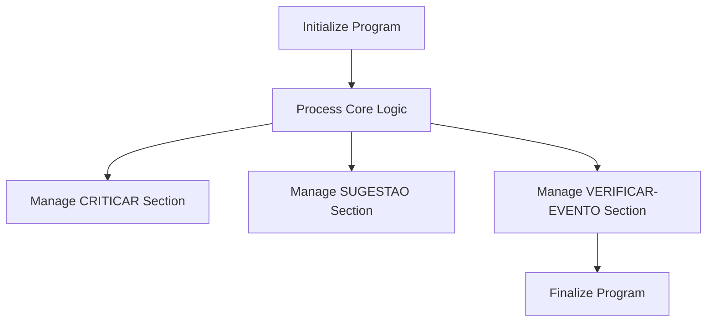

This document will cover the MTP021 function in the Kello Imagens system, which includes:

1. Initializing the program
2. Processing core logic
3. Managing various sections such as CRITICAR, SUGESTAO, and VERIFICAR-EVENTO.

Technical document: <SwmLink doc-title="Overview of MTP021 Function">[Overview of MTP021 Function](/.swm/overview-of-mtp021-function.h7ztfa7i.sw.md)</SwmLink>

# Initializing the Program

The MTP021 function begins by initializing the program. This involves setting up necessary parameters and preparing the system for the main processing loop. The initialization ensures that all required data and configurations are in place before any core logic is executed. This step is crucial as it lays the foundation for the subsequent operations.

# Processing Core Logic

Once the program is initialized, MTP021 enters the main processing loop. This loop repeatedly performs the core program logic until a specific exit flag is set. The core logic includes various tasks such as making suggestions, critiquing sequences, and verifying albums. Each task is managed by dedicated sections that perform specific operations. This ensures that the program can handle multiple tasks efficiently and in a structured manner.

# Managing CRITICAR Section

The CRITICAR section is responsible for evaluating and critiquing different fields. For example, it can critique contracts, albums, sequences, and more. Each critique operation involves evaluating specific criteria and performing corresponding actions. This section helps in maintaining the quality and consistency of the data by identifying and addressing any issues.

# Managing SUGESTAO Section

The SUGESTAO section provides suggestions based on the value of the field being evaluated. For instance, it can suggest contracts, albums, products, and suppliers. This section enhances the user experience by offering relevant suggestions, making it easier for users to complete their tasks efficiently.

# Managing VERIFICAR-EVENTO Section

The VERIFICAR-EVENTO section is responsible for verifying events. This involves checking user permissions, validating data, and ensuring that all necessary conditions are met. This section plays a critical role in maintaining the integrity and security of the system by ensuring that only authorized actions are performed.

# Finalizing the Program

After all core logic and section-specific tasks are completed, the MTP021 function finalizes the program. This involves closing any open files, saving any remaining data, and performing any necessary cleanup operations. Finalizing the program ensures that the system is left in a stable and consistent state, ready for the next execution.

&nbsp;

*This is an auto-generated document by Swimm AI 🌊 and has not yet been verified by a human*

<SwmMeta version="3.0.0" repo-id="Z2l0aHViJTNBJTNBa2VsbG8lM0ElM0Fzd2ltbWlv" repo-name="kello">Powered by [Swimm](/)</SwmMeta>
