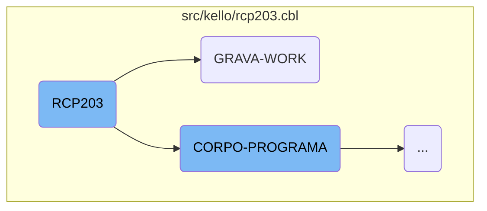
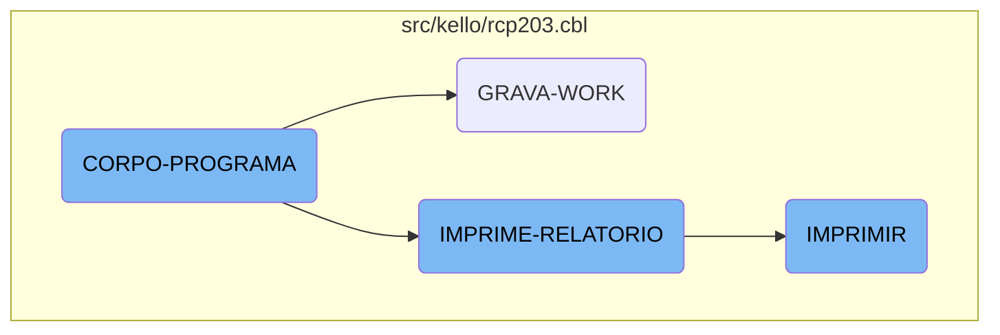

This document provides an overview of the <SwmToken path="src/kello/rcp203.cbl" pos="3:6:6" line-data="       PROGRAM-ID. RCP203.">`RCP203`</SwmToken> program, which is a key component of the Kello Imagens business operations management system. The program is responsible for initializing the system, processing core logic, handling work files, and generating reports.

The <SwmToken path="src/kello/rcp203.cbl" pos="3:6:6" line-data="       PROGRAM-ID. RCP203.">`RCP203`</SwmToken> program starts by initializing the system and then moves on to the main processing section, where it evaluates various conditions and performs corresponding actions. It handles work files by opening and closing them in different modes and initializes fields for data manipulation. The program also evaluates the type of report to be generated and performs specific actions based on the report type. Finally, it prints the reports by repeatedly performing the printing section until the desired number of copies is reached.

Here is a high level diagram of the flow, showing only the most important functions:

```mermaid
graph TD;
      subgraph src/kello/rcp203.cbl
c5c0f14108a6716833f011586d8f8633c8901e6acb53936bc7f66a0d862d0aa8(RCP203):::mainFlowStyle --> 5640642dcb31c1ba971d1b4ebaf14a80e866b059dd752f2f63fc299b9717d400(GRAVA-WORK)
end

subgraph src/kello/rcp203.cbl
c5c0f14108a6716833f011586d8f8633c8901e6acb53936bc7f66a0d862d0aa8(RCP203):::mainFlowStyle --> ba320c334d840e7af5ba6e1226e7361ed12157bb45348ef3ad9ad4f65608a4a9(CORPO-PROGRAMA):::mainFlowStyle
end

subgraph src/kello/rcp203.cbl
ba320c334d840e7af5ba6e1226e7361ed12157bb45348ef3ad9ad4f65608a4a9(CORPO-PROGRAMA):::mainFlowStyle --> 5640642dcb31c1ba971d1b4ebaf14a80e866b059dd752f2f63fc299b9717d400(GRAVA-WORK)
end

subgraph src/kello/rcp203.cbl
ba320c334d840e7af5ba6e1226e7361ed12157bb45348ef3ad9ad4f65608a4a9(CORPO-PROGRAMA):::mainFlowStyle --> 5dfd58ed70ec2b367902bfbc6b8efc73f9ac7371fe71e1fde3f2d39448396c88(IMPRIME-RELATORIO):::mainFlowStyle
end

subgraph src/kello/rcp203.cbl
5dfd58ed70ec2b367902bfbc6b8efc73f9ac7371fe71e1fde3f2d39448396c88(IMPRIME-RELATORIO):::mainFlowStyle --> 80b7b4ae9906f0ee7fc684a37e0392ebf68c8d79fa971752c3b33148ed364579(IMPRIMIR):::mainFlowStyle
end


      classDef mainFlowStyle color:#000000,fill:#7CB9F4
classDef rootsStyle color:#000000,fill:#00FFF4
classDef Style1 color:#000000,fill:#00FFAA
classDef Style2 color:#000000,fill:#FFFF00
classDef Style3 color:#000000,fill:#AA7CB9

%% Swimm:
%% graph TD;
%%       subgraph <SwmPath>[src/kello/rcp203.cbl](src/kello/rcp203.cbl)</SwmPath>
%% c5c0f14108a6716833f011586d8f8633c8901e6acb53936bc7f66a0d862d0aa8(RCP203):::mainFlowStyle --> 5640642dcb31c1ba971d1b4ebaf14a80e866b059dd752f2f63fc299b9717d400(GRAVA-WORK)
%% end
%% 
%% subgraph <SwmPath>[src/kello/rcp203.cbl](src/kello/rcp203.cbl)</SwmPath>
%% c5c0f14108a6716833f011586d8f8633c8901e6acb53936bc7f66a0d862d0aa8(RCP203):::mainFlowStyle --> ba320c334d840e7af5ba6e1226e7361ed12157bb45348ef3ad9ad4f65608a4a9(CORPO-PROGRAMA):::mainFlowStyle
%% end
%% 
%% subgraph <SwmPath>[src/kello/rcp203.cbl](src/kello/rcp203.cbl)</SwmPath>
%% ba320c334d840e7af5ba6e1226e7361ed12157bb45348ef3ad9ad4f65608a4a9(CORPO-PROGRAMA):::mainFlowStyle --> 5640642dcb31c1ba971d1b4ebaf14a80e866b059dd752f2f63fc299b9717d400(GRAVA-WORK)
%% end
%% 
%% subgraph <SwmPath>[src/kello/rcp203.cbl](src/kello/rcp203.cbl)</SwmPath>
%% ba320c334d840e7af5ba6e1226e7361ed12157bb45348ef3ad9ad4f65608a4a9(CORPO-PROGRAMA):::mainFlowStyle --> 5dfd58ed70ec2b367902bfbc6b8efc73f9ac7371fe71e1fde3f2d39448396c88(IMPRIME-RELATORIO):::mainFlowStyle
%% end
%% 
%% subgraph <SwmPath>[src/kello/rcp203.cbl](src/kello/rcp203.cbl)</SwmPath>
%% 5dfd58ed70ec2b367902bfbc6b8efc73f9ac7371fe71e1fde3f2d39448396c88(IMPRIME-RELATORIO):::mainFlowStyle --> 80b7b4ae9906f0ee7fc684a37e0392ebf68c8d79fa971752c3b33148ed364579(IMPRIMIR):::mainFlowStyle
%% end
%% 
%% 
%%       classDef mainFlowStyle color:#000000,fill:#7CB9F4
%% classDef rootsStyle color:#000000,fill:#00FFF4
%% classDef Style1 color:#000000,fill:#00FFAA
%% classDef Style2 color:#000000,fill:#FFFF00
%% classDef Style3 color:#000000,fill:#AA7CB9
```



# Flow drill down

First, we'll zoom into this section of the flow:



<SwmSnippet path="/src/kello/rcp203.cbl" line="539">

---

## <SwmToken path="src/kello/rcp203.cbl" pos="3:6:6" line-data="       PROGRAM-ID. RCP203.">`RCP203`</SwmToken>

The <SwmToken path="src/kello/rcp203.cbl" pos="3:6:6" line-data="       PROGRAM-ID. RCP203.">`RCP203`</SwmToken> function is the main entry point of the program. It initializes the program by performing the <SwmToken path="src/kello/rcp203.cbl" pos="540:3:5" line-data="           PERFORM INICIALIZA-PROGRAMA.">`INICIALIZA-PROGRAMA`</SwmToken> section, which accepts parameters from the command line.

```cobol
       MAIN-PROCESS SECTION.
           PERFORM INICIALIZA-PROGRAMA.
           PERFORM CORPO-PROGRAMA UNTIL GS-EXIT-FLG-TRUE.
           GO FINALIZAR-PROGRAMA.

       INICIALIZA-PROGRAMA SECTION.
```

---

</SwmSnippet>

<SwmSnippet path="/src/kello/rcp203.cbl" line="650">

---

### <SwmToken path="src/kello/rcp203.cbl" pos="650:1:3" line-data="       CORPO-PROGRAMA SECTION.">`CORPO-PROGRAMA`</SwmToken>

The <SwmToken path="src/kello/rcp203.cbl" pos="650:1:3" line-data="       CORPO-PROGRAMA SECTION.">`CORPO-PROGRAMA`</SwmToken> section is evaluated as part of the main process. This section contains the core logic of the program.

```cobol
       CORPO-PROGRAMA SECTION.
           EVALUATE TRUE
```

---

</SwmSnippet>

<SwmSnippet path="/src/kello/rcp203.cbl" line="1119">

---

## <SwmToken path="src/kello/rcp203.cbl" pos="1119:1:3" line-data="       GRAVA-WORK SECTION.">`GRAVA-WORK`</SwmToken>

The <SwmToken path="src/kello/rcp203.cbl" pos="1119:1:3" line-data="       GRAVA-WORK SECTION.">`GRAVA-WORK`</SwmToken> function handles the closing and opening of various work files in different modes (OUTPUT, <SwmToken path="src/kello/rcp203.cbl" pos="1120:17:19" line-data="           CLOSE WORK  OPEN OUTPUT WORK  CLOSE WORK   OPEN I-O WORK.">`I-O`</SwmToken>). It also initializes several fields to zero and performs data manipulation based on the type of report (<SwmToken path="src/kello/rcp203.cbl" pos="1144:3:7" line-data="           EVALUATE GS-TIPO-REL">`GS-TIPO-REL`</SwmToken>). This function is crucial for preparing the data for subsequent processing and reporting.

```cobol
       GRAVA-WORK SECTION.
           CLOSE WORK  OPEN OUTPUT WORK  CLOSE WORK   OPEN I-O WORK.
           CLOSE WORK1 OPEN OUTPUT WORK1 CLOSE WORK1  OPEN I-O WORK1.
           CLOSE WORK2 OPEN OUTPUT WORK2 CLOSE WORK2  OPEN I-O WORK2.
           CLOSE WORK3 OPEN OUTPUT WORK3 CLOSE WORK3  OPEN I-O WORK3.
           CLOSE WORK5 OPEN OUTPUT WORK5 CLOSE WORK5  OPEN I-O WORK5.

           MOVE ZEROS TO PRAZO-W1 PRAZO-W2.

           MOVE ZEROS TO TOT2-FORM-PROD TOT2-FORM-VEND TOT2-FORM-SALD
                         TOT2-FOTO-DISP TOT2-FOTO-COMI TOT2-FOTO-VEND
                         TOT2-FOTO-SALD TOT2-FITA-VEND TOT2-PERC-VEND
                         TOT2-DVD-VEND  TOT2-FOTO-FOGO TOT2-PERC-COMIS
                         TOT2-PERC-FOGO
                         TOT2-PERC-DEVL TOT2-PERC-SALD TOT2-VENDA-BR
                         TOT2-VENDA-LIQ TOT2-PRECO-FOT TOT2-VENDA-CLI
                         TOT2-MONTADA TOT2-AVULSA  TOT2-PERDIDA
                         TOT2-PRODUZIDA TOT2-FOTOS-MTG TOT2-PM-ACUM
                         TOT2-AVULSA-VEND.

           MOVE "TELA-AGUARDA" TO DS-PROCEDURE.
```

---

</SwmSnippet>

<SwmSnippet path="/src/kello/rcp203.cbl" line="1126">

---

### Data Initialization and Manipulation

This part of the <SwmToken path="src/kello/rcp203.cbl" pos="660:5:7" line-data="               WHEN GS-GRAVA-WORK-FLG-TRUE">`GRAVA-WORK`</SwmToken> function initializes various fields to zero, preparing them for data manipulation.

```cobol
           MOVE ZEROS TO PRAZO-W1 PRAZO-W2.

           MOVE ZEROS TO TOT2-FORM-PROD TOT2-FORM-VEND TOT2-FORM-SALD
                         TOT2-FOTO-DISP TOT2-FOTO-COMI TOT2-FOTO-VEND
                         TOT2-FOTO-SALD TOT2-FITA-VEND TOT2-PERC-VEND
                         TOT2-DVD-VEND  TOT2-FOTO-FOGO TOT2-PERC-COMIS
                         TOT2-PERC-FOGO
                         TOT2-PERC-DEVL TOT2-PERC-SALD TOT2-VENDA-BR
                         TOT2-VENDA-LIQ TOT2-PRECO-FOT TOT2-VENDA-CLI
                         TOT2-MONTADA TOT2-AVULSA  TOT2-PERDIDA
                         TOT2-PRODUZIDA TOT2-FOTOS-MTG TOT2-PM-ACUM
                         TOT2-AVULSA-VEND.
```

---

</SwmSnippet>

<SwmSnippet path="/src/kello/rcp203.cbl" line="1144">

---

### Report Type Evaluation

The function evaluates the type of report (<SwmToken path="src/kello/rcp203.cbl" pos="1144:3:7" line-data="           EVALUATE GS-TIPO-REL">`GS-TIPO-REL`</SwmToken>) and performs different actions based on the report type. This includes reading records, manipulating data, and calling other sections like <SwmToken path="src/kello/rcp203.cbl" pos="1173:3:7" line-data="                                    PERFORM MOVER-DADOS-WORK">`MOVER-DADOS-WORK`</SwmToken>.

```cobol
           EVALUATE GS-TIPO-REL
             WHEN 1 PERFORM INVERTE-DATA
                    MOVE VECTO-INI      TO DATA-MOVTO-REC
                    MOVE ZEROS          TO ALBUM-REC CONTADOR
                    START RCD100 KEY IS NOT < ALT-REC INVALID KEY
                          MOVE "10" TO ST-RCD100
                    END-START
                    PERFORM UNTIL ST-RCD100 = "10"
                       READ RCD100 NEXT AT END
                           MOVE "10" TO ST-RCD100
                       NOT AT END
                           ADD 1 TO CONTADOR
                           MOVE CONTADOR TO GS-EXIBE-MOVTO2
                           MOVE DATA-MOVTO-REC  TO GS-EXIBE-MOVTO
                           MOVE "TELA-AGUARDA1" TO DS-PROCEDURE
                           PERFORM CALL-DIALOG-SYSTEM
                           IF DATA-MOVTO-REC > VECTO-FIM
                              MOVE "10" TO ST-RCD100
                           ELSE
                              IF GS-VENDEDOR = ZEROS OR GS-VENDEDOR =
                                 VENDEDOR-REC
```

---

</SwmSnippet>

Now, lets zoom into this section of the flow:



<SwmSnippet path="/src/kello/rcp203.cbl" line="650">

---

## <SwmToken path="src/kello/rcp203.cbl" pos="650:1:3" line-data="       CORPO-PROGRAMA SECTION.">`CORPO-PROGRAMA`</SwmToken>

The <SwmToken path="src/kello/rcp203.cbl" pos="650:1:3" line-data="       CORPO-PROGRAMA SECTION.">`CORPO-PROGRAMA`</SwmToken> section is the main control structure that evaluates various conditions and performs corresponding actions. It uses the <SwmToken path="src/kello/rcp203.cbl" pos="651:1:1" line-data="           EVALUATE TRUE">`EVALUATE`</SwmToken> statement to check different flags and execute specific sections like <SwmToken path="src/kello/rcp203.cbl" pos="653:3:3" line-data="                    PERFORM CENTRALIZAR">`CENTRALIZAR`</SwmToken>, <SwmToken path="src/kello/rcp203.cbl" pos="658:3:5" line-data="                       PERFORM IMPRIME-RELATORIO">`IMPRIME-RELATORIO`</SwmToken>, and <SwmToken path="src/kello/rcp203.cbl" pos="660:5:7" line-data="               WHEN GS-GRAVA-WORK-FLG-TRUE">`GRAVA-WORK`</SwmToken>. This section orchestrates the flow of the program by determining which operations need to be performed based on the current state.

```cobol
       CORPO-PROGRAMA SECTION.
           EVALUATE TRUE
               WHEN GS-CENTRALIZA-TRUE
                    PERFORM CENTRALIZAR
                    PERFORM VERIFICAR-SENHA-STATUS
               WHEN GS-PRINTER-FLG-TRUE
                    COPY IMPRESSORA.CHAMA.
                    IF LNK-MAPEAMENTO <> SPACES
                       PERFORM IMPRIME-RELATORIO
                    END-IF
               WHEN GS-GRAVA-WORK-FLG-TRUE
                    PERFORM GRAVA-WORK
                    PERFORM CARREGA-LISTA
                    PERFORM CARREGA-LISTA1
                    PERFORM CARREGA-LISTA5
               WHEN GS-CARREGA-LISTA-FLG-TRUE
                    PERFORM CARREGA-LISTA
                    PERFORM CARREGA-LISTA1
                    PERFORM CARREGA-LISTA5
               WHEN GS-POPUP-CONTRATO-TRUE
                    PERFORM CHAMAR-POPUP-CONTRATO
```

---

</SwmSnippet>

<SwmSnippet path="/src/kello/rcp203.cbl" line="2786">

---

## <SwmToken path="src/kello/rcp203.cbl" pos="2786:1:3" line-data="       IMPRIME-RELATORIO SECTION.">`IMPRIME-RELATORIO`</SwmToken>

The <SwmToken path="src/kello/rcp203.cbl" pos="2786:1:3" line-data="       IMPRIME-RELATORIO SECTION.">`IMPRIME-RELATORIO`</SwmToken> section is responsible for printing reports. It initializes a counter <SwmToken path="src/kello/rcp203.cbl" pos="2787:7:7" line-data="           MOVE 0 TO QUANTIDADE">`QUANTIDADE`</SwmToken> and performs the <SwmToken path="src/kello/rcp203.cbl" pos="2790:3:3" line-data="               PERFORM IMPRIMIR">`IMPRIMIR`</SwmToken> section repeatedly until the desired number of copies (<SwmToken path="src/kello/rcp203.cbl" pos="2788:9:11" line-data="           PERFORM UNTIL QUANTIDADE = GS-COPIAS">`GS-COPIAS`</SwmToken>) is reached. This ensures that the report is printed the correct number of times.

```cobol
       IMPRIME-RELATORIO SECTION.
           MOVE 0 TO QUANTIDADE
           PERFORM UNTIL QUANTIDADE = GS-COPIAS
               ADD 1 TO QUANTIDADE
               PERFORM IMPRIMIR
           END-PERFORM.
```

---

</SwmSnippet>

<SwmSnippet path="/src/kello/rcp203.cbl" line="2793">

---

## IMPRIMIR

The <SwmToken path="src/kello/rcp203.cbl" pos="2793:1:1" line-data="       IMPRIMIR SECTION.">`IMPRIMIR`</SwmToken> section handles the actual printing logic. It sets up the page counter <SwmToken path="src/kello/rcp203.cbl" pos="2794:7:9" line-data="           MOVE ZEROS TO PAGE-COUNT.">`PAGE-COUNT`</SwmToken> and includes the <SwmToken path="src/kello/rcp203.cbl" pos="2796:3:3" line-data="           COPY CONDENSA.">`CONDENSA`</SwmToken> copybook for condensed printing. Depending on various flags like <SwmToken path="src/kello/rcp203.cbl" pos="2798:3:9" line-data="           IF GS-IMPR-RELATORIO-TRUE">`GS-IMPR-RELATORIO-TRUE`</SwmToken>, it performs different printing tasks such as <SwmToken path="src/kello/rcp203.cbl" pos="2799:3:7" line-data="              PERFORM MOVER-WORK-REL.">`MOVER-WORK-REL`</SwmToken>, <SwmToken path="src/kello/rcp203.cbl" pos="2802:3:5" line-data="              PERFORM IMPRIME-RESUMO.">`IMPRIME-RESUMO`</SwmToken>, <SwmToken path="src/kello/rcp203.cbl" pos="2805:3:5" line-data="              PERFORM IMPRIME-ESTATISTICA.">`IMPRIME-ESTATISTICA`</SwmToken>, <SwmToken path="src/kello/rcp203.cbl" pos="2808:3:5" line-data="              PERFORM IMPRIME-ALBUM.">`IMPRIME-ALBUM`</SwmToken>, and <SwmToken path="src/kello/rcp203.cbl" pos="2811:3:5" line-data="              PERFORM IMPRIME-RATEIO.">`IMPRIME-RATEIO`</SwmToken>. Finally, it includes the <SwmToken path="src/kello/rcp203.cbl" pos="2813:3:3" line-data="           COPY DESCONDENSA.">`DESCONDENSA`</SwmToken> copybook to end the condensed printing.

```cobol
       IMPRIMIR SECTION.
           MOVE ZEROS TO PAGE-COUNT.

           COPY CONDENSA.

           IF GS-IMPR-RELATORIO-TRUE
              PERFORM MOVER-WORK-REL.

           IF GS-IMPR-RESUMO-TRUE
              PERFORM IMPRIME-RESUMO.

           IF GS-IMPR-ESTATISTICA-TRUE
              PERFORM IMPRIME-ESTATISTICA.

           IF GS-IMPR-ALBUM-TRUE
              PERFORM IMPRIME-ALBUM.

           IF GS-IMPR-RATEIO-TRUE
              PERFORM IMPRIME-RATEIO.

           COPY DESCONDENSA.
```

---

</SwmSnippet>

&nbsp;

*This is an auto-generated document by Swimm AI 🌊 and has not yet been verified by a human*

<SwmMeta version="3.0.0" repo-id="Z2l0aHViJTNBJTNBa2VsbG8lM0ElM0Fzd2ltbWlv" repo-name="kello"><sup>Powered by [Swimm](/)</sup></SwmMeta>
