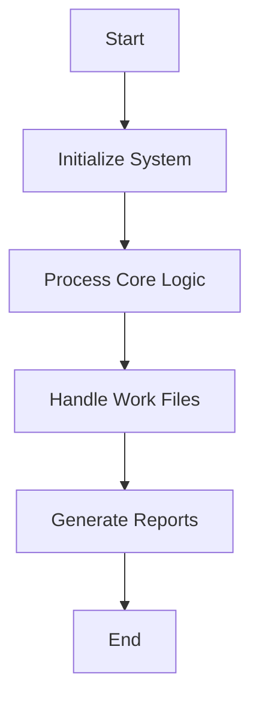

This document will cover the RCP203 program, which includes:

1. Initializing the system
2. Processing core logic
3. Handling work files
4. Generating reports.

Technical document: <SwmLink doc-title="Overview of RCP203 Program">[Overview of RCP203 Program](/.swm/overview-of-rcp203-program.5gdnfize.sw.md)</SwmLink>

# Initializing the System

The RCP203 program begins by initializing the system. This involves setting up the initial state and preparing the environment for the subsequent operations. The initialization process ensures that all necessary parameters are correctly set and that the system is ready to handle the core logic processing.

# Processing Core Logic

The core logic processing is the main section of the RCP203 program. It evaluates various conditions and performs corresponding actions based on the current state of the system. This section orchestrates the flow of the program by determining which operations need to be performed. For example, it checks if certain flags are set and then executes specific sections like centralizing data, verifying status, or handling work files.

# Handling Work Files

Handling work files involves opening and closing various files in different modes (e.g., output, input-output). This step is crucial for preparing the data for subsequent processing and reporting. The program initializes several fields to zero and performs data manipulation based on the type of report being generated. This ensures that the data is correctly formatted and ready for use in the report generation process.

# Generating Reports

The report generation section evaluates the type of report to be generated and performs specific actions based on the report type. This includes reading records, manipulating data, and calling other sections to move data into the appropriate format. The program then prints the reports by repeatedly performing the printing section until the desired number of copies is reached. This ensures that the reports are generated accurately and in the required quantity.

&nbsp;

*This is an auto-generated document by Swimm AI 🌊 and has not yet been verified by a human*

<SwmMeta version="3.0.0" repo-id="Z2l0aHViJTNBJTNBa2VsbG8lM0ElM0Fzd2ltbWlv" repo-name="kello">Powered by [Swimm](/)</SwmMeta>
