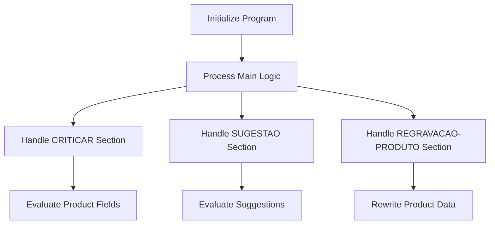

This document will cover the MTP021 flow, which deals with suggestions for various entities such as albums, contracts and products. The flow includes:

1. Initializing the program
2. Processing the main logic
3. Evaluating suggestions and perform specific suggestion routines
4. Rewriting product data

Technical document: <SwmLink doc-title="Overview of MTP021 Flow">[Overview of MTP021 Flow](/.swm/overview-of-mtp021-flow.jax9e3yv.sw.md)</SwmLink>

# Initializing the Program

The MTP021 flow begins by initializing the program. This involves setting up necessary parameters and preparing the system for the main operations. This step ensures that all required data and configurations are in place before any business logic is executed. For example, it sets the date and initializes data blocks, ensuring the system is ready for processing.

# Processing the Main Logic

Once the program is initialized, the main logic is processed. This involves evaluating various conditions and performing corresponding actions. These actions include centralizing data, saving and rewriting records, clearing data, verifying permissions, printing reports, and handling annotations. Each condition triggers specific operations that contribute to the overall business logic. For instance, if the centralization flag is set, the system will centralize data, create a list view, and disable certain fields.

# Handling CRITICAR Section

The CRITICAR section is responsible for evaluating different product-related fields and performing specific validation routines based on the field being evaluated. This ensures that each field is validated according to its type and updates the product data accordingly. For example, if the field is related to a contract, the system will perform contract-specific validations.

# Handling SUGESTAO Section

The SUGESTAO section evaluates the field and performs the corresponding suggestion logic based on the field value. This section handles different types of suggestions, such as contract, album, product, and supplier suggestions. For instance, if the field value indicates a product, the system will perform product-specific suggestion routines.

# Handling REGRAVACAO-PRODUTO Section

The REGRAVACAO-PRODUTO section is responsible for rewriting product data. This involves saving new data or re-saving existing data, updating campaign information, and writing or rewriting records in the system. This ensures that the product data is accurately maintained and updated as needed.

&nbsp;

*This is an auto-generated document by Swimm AI 🌊 and has not yet been verified by a human*

<SwmMeta version="3.0.0" repo-id="Z2l0aHViJTNBJTNBa2VsbG8lM0ElM0Fzd2ltbWlv" repo-name="kello">Powered by [Swimm](https://app.swimm.io/)</SwmMeta>
