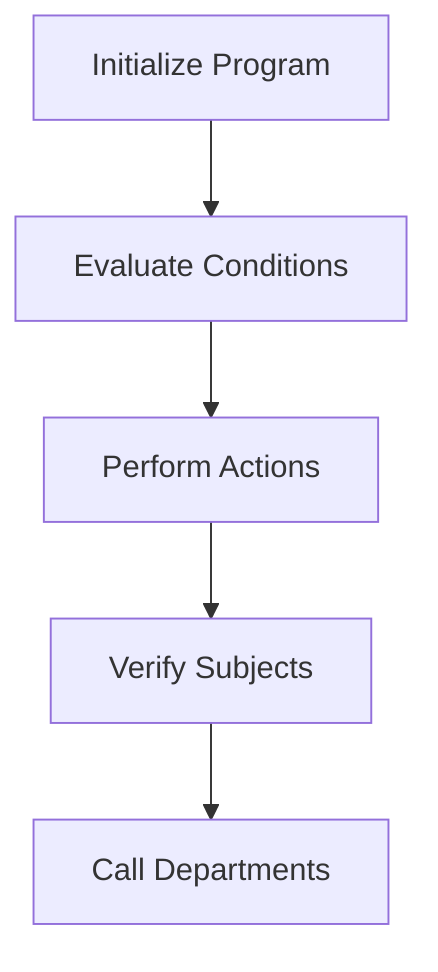

This document will cover the ACP100 process, which includes:

1. Initializing the program
2. Evaluating conditions and performing actions
3. Verifying subjects and taking appropriate actions
4. Calling departments for further processing.

Technical document: <SwmLink doc-title="Overview of ACP100 Process">[Overview of ACP100 Process](/.swm/overview-of-acp100-process.jpikl895.sw.md)</SwmLink>

# Initializing the Program

The ACP100 process begins by initializing the program. This involves setting up the necessary environment by accepting parameters from the command line. These parameters are essential for configuring the program's initial state and ensuring that it has all the information it needs to proceed with its tasks.

# Evaluating Conditions and Performing Actions

Once the program is initialized, it evaluates various conditions to determine the next steps. This evaluation is crucial as it dictates the flow of the program based on the given inputs and states. For example, if the condition to centralize data is met, the program will perform the centralization task. Similarly, it can load sequences, save data, or verify subjects based on the conditions evaluated. This ensures that the program operates smoothly and efficiently, handling each task as required.

# Verifying Subjects and Taking Appropriate Actions

In the ACP100 process, verifying subjects is a critical step. The program evaluates the value of the subject and determines the appropriate action to take. Depending on the subject's value, the program may call different routines such as contacting a department or displaying an error message. This step ensures that each subject is handled correctly, and any issues are promptly addressed.

# Calling Departments for Further Processing

If the subject verification step determines that a department needs to be contacted, the program prepares and calls the relevant department. This involves setting up the necessary data and constructing a string that is used to call another program (ACP140) for further processing. This step ensures that any additional tasks required by the department are handled efficiently, maintaining the overall workflow of the program.

&nbsp;

*This is an auto-generated document by Swimm AI 🌊 and has not yet been verified by a human*

<SwmMeta version="3.0.0" repo-id="Z2l0aHViJTNBJTNBa2VsbG8lM0ElM0Fzd2ltbWlv" repo-name="kello">Powered by [Swimm](/)</SwmMeta>
