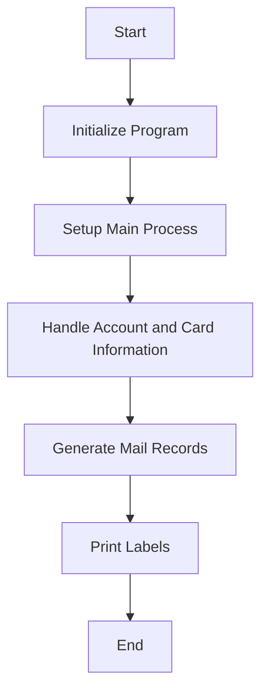

This document will cover the CGP010 flow, which includes:

1. Initializing the program
2. Setting up the main process
3. Handling account and card information
4. Generating mail records
5. Printing labels.

Technical document: <SwmLink doc-title="Overview of the CGP010 Flow">[Overview of the CGP010 Flow](/.swm/overview-of-the-cgp010-flow.nttxywrj.sw.md)</SwmLink>

# Initializing the Program

The initialization step is crucial as it sets up the necessary environment for the program to run. This includes loading essential data blocks, setting initial values, and preparing paths for various files. This step ensures that the program has all the required information and resources to proceed with the main process.

# Setting up the Main Process

Setting up the main process involves defining the core workflow of the program. This includes specifying the sequence of operations and conditions that need to be evaluated. The main process acts as the backbone of the program, guiding it through various tasks and ensuring that each step is executed in the correct order.

# Handling Account and Card Information

This step involves reading and processing account and card information. The program retrieves data from predefined sources, validates it, and then uses it to perform necessary operations. This ensures that the program has accurate and up-to-date information about accounts and cards, which is essential for subsequent steps like generating mail records and printing labels.

# Generating Mail Records

Generating mail records is a critical step where the program processes customer information and formats it into mail records. These records are then written to an output file. This step ensures that all customer communications are correctly formatted and stored, which is vital for automatic report generation and EDI transactions.

# Printing Labels

The final step involves printing labels based on the processed data. The program evaluates various conditions to determine the type of label to print and then writes the formatted labels to an output file. This step ensures that all labels are correctly formatted and printed, which is essential for the physical mailing process.

&nbsp;

*This is an auto-generated document by Swimm AI 🌊 and has not yet been verified by a human*

<SwmMeta version="3.0.0" repo-id="Z2l0aHViJTNBJTNBa2VsbG8lM0ElM0Fzd2ltbWlv" repo-name="kello">Powered by [Swimm](/)</SwmMeta>
