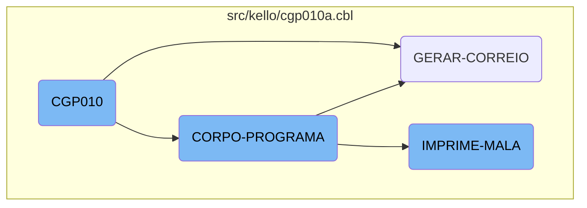
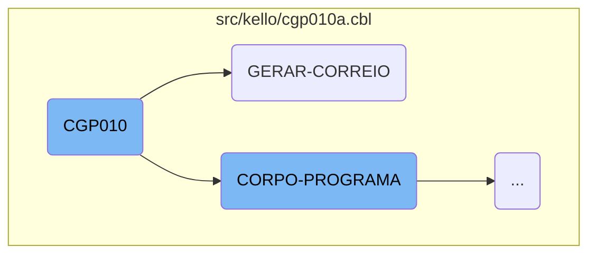
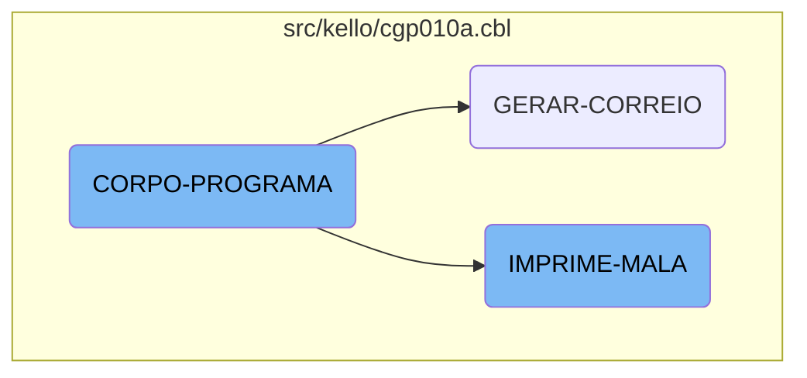

The <SwmToken path="src/kello/cgp010a.cbl" pos="3:6:6" line-data="       PROGRAM-ID. CGP010.">`CGP010`</SwmToken> flow is a crucial part of the Kello Imagens system, responsible for initializing the program, setting up the main process flow, and handling various tasks such as reading account and card information, generating mail records, and printing labels. This document provides a high-level overview of the <SwmToken path="src/kello/cgp010a.cbl" pos="3:6:6" line-data="       PROGRAM-ID. CGP010.">`CGP010`</SwmToken> flow, breaking down its main sections and their roles in the overall process.

The <SwmToken path="src/kello/cgp010a.cbl" pos="3:6:6" line-data="       PROGRAM-ID. CGP010.">`CGP010`</SwmToken> flow starts by initializing the program and setting up the main process. It reads account and card information, calls pop-up windows for user input, and inserts bank and card data. The flow then moves to generating mail records, where it processes customer information and writes formatted mail data to an output file. Finally, it handles printing labels by evaluating conditions and writing the formatted labels to an output file. Each section of the flow has specific tasks that contribute to the overall functionality of the system.

Here is a high level diagram of the flow, showing only the most important functions:



# Flow drill down

First, we'll zoom into this section of the flow:



<SwmSnippet path="/src/kello/cgp010a.cbl" line="356">

---

## <SwmToken path="src/kello/cgp010a.cbl" pos="3:6:6" line-data="       PROGRAM-ID. CGP010.">`CGP010`</SwmToken>

The <SwmToken path="src/kello/cgp010a.cbl" pos="3:6:6" line-data="       PROGRAM-ID. CGP010.">`CGP010`</SwmToken> function is responsible for initializing the program and setting up the main process flow. It performs various tasks such as reading account and card information, calling pop-up windows for user input, and inserting bank and card data. This function is crucial for preparing the necessary data and user interactions required for the subsequent steps in the flow.

```cobol
       MAIN-PROCESS SECTION.
           PERFORM INICIALIZA-PROGRAMA.
           PERFORM CORPO-PROGRAMA UNTIL GS-EXIT-FLG-TRUE.
           GO FINALIZAR-PROGRAMA.

       INICIALIZA-PROGRAMA SECTION.
           COPY "CBDATA1.CPY".
           MOVE ZEROS TO PAGE-COUNT ERRO-W.
           INITIALIZE GS-DATA-BLOCK
           INITIALIZE DS-CONTROL-BLOCK
           MOVE GS-DATA-BLOCK-VERSION-NO
                                   TO DS-DATA-BLOCK-VERSION-NO
           MOVE GS-VERSION-NO  TO DS-VERSION-NO
           MOVE EMPRESA-W          TO EMP-REC
           MOVE NOME-EMPRESA-W     TO EMPRESA-REL
           MOVE "CAD004"  TO ARQ-REC. MOVE EMPRESA-REF TO PATH-CAD004.
           MOVE "CGD010" TO ARQ-REC.  MOVE EMPRESA-REF TO PATH-CGD010.
           MOVE "CGD011" TO ARQ-REC.  MOVE EMPRESA-REF TO PATH-CGD011.
           MOVE "CGD012" TO ARQ-REC.  MOVE EMPRESA-REF TO PATH-CGD012.
           MOVE "CGD013" TO ARQ-REC.  MOVE EMPRESA-REF TO PATH-CGD013.
           MOVE "CGD014" TO ARQ-REC.  MOVE EMPRESA-REF TO PATH-CGD014.
```

---

</SwmSnippet>

<SwmSnippet path="/src/kello/cgp010a.cbl" line="2036">

---

## <SwmToken path="src/kello/cgp010a.cbl" pos="647:3:5" line-data="                    PERFORM GERAR-CORREIO">`GERAR-CORREIO`</SwmToken>

The <SwmToken path="src/kello/cgp010a.cbl" pos="647:3:5" line-data="                    PERFORM GERAR-CORREIO">`GERAR-CORREIO`</SwmToken> function handles the generation of mail records. It opens the output file for mail, processes each record by reading and validating customer information, and writes the formatted mail data to the output file. This function ensures that the mail records are correctly generated and stored, which is essential for the automatic report generation and EDI transactions.

```cobol
           OPEN OUTPUT CORREIO

           MOVE ZEROS TO AUX-QTDE

           MOVE DET-CORREIO-1 TO REG-CORREIO
           WRITE REG-CORREIO

           EVALUATE GS-ORDEM-ESCOLHA
            WHEN 1 MOVE 1 TO GS-POSICAO
                   MOVE SPACES TO GS-LINNOME
                   MOVE "LER-LIST2" TO DS-PROCEDURE
                   PERFORM CALL-DIALOG-SYSTEM
                   PERFORM UNTIL GS-LINNOME = SPACES
                       ADD 1 TO AUX-QTDE
                       INITIALIZE DET-CNPJ-CPF
                                  DET-NOME
                                  DET-EMAIL
                                  DET-AOS-CUIDADOS
                                  DET-CONTATO
                                  DET-CEP-CORREIO
                                  DET-LOGRADOURO
```

---

</SwmSnippet>

Now, lets zoom into this section of the flow:



<SwmSnippet path="/src/kello/cgp010a.cbl" line="550">

---

## <SwmToken path="src/kello/cgp010a.cbl" pos="550:1:3" line-data="       CORPO-PROGRAMA SECTION.">`CORPO-PROGRAMA`</SwmToken>

The <SwmToken path="src/kello/cgp010a.cbl" pos="550:1:3" line-data="       CORPO-PROGRAMA SECTION.">`CORPO-PROGRAMA`</SwmToken> section is a central part of the <SwmToken path="src/kello/cgp010a.cbl" pos="3:6:6" line-data="       PROGRAM-ID. CGP010.">`CGP010`</SwmToken> flow. It evaluates various conditions and performs corresponding actions. For example, it centralizes data, saves data, inserts items, clears data, and handles user authentication by moving specific values to <SwmToken path="src/kello/cgp010a.cbl" pos="559:9:11" line-data="                    MOVE &quot;SENHA24&quot;       TO PROGRAMA-CA004">`PROGRAMA-CA004`</SwmToken> and <SwmToken path="src/kello/cgp010a.cbl" pos="560:11:15" line-data="                    MOVE COD-USUARIO-W   TO COD-USUARIO-CA004">`COD-USUARIO-CA004`</SwmToken>. It also reads records from <SwmToken path="src/kello/cgp010a.cbl" pos="562:3:3" line-data="                    READ CAD004 INVALID KEY">`CAD004`</SwmToken> and performs actions based on the validity of the read operation. Additionally, it manages cursor positions, loads data, excludes records, and handles various flags to perform specific tasks like reading codes, cities, senders, accounts, and cards. The section also includes logic for handling popups, printing reports, and generating mail.

```cobol
       CORPO-PROGRAMA SECTION.
               EVALUATE TRUE
               WHEN GS-CENTRALIZA-TRUE
                   PERFORM CENTRALIZAR
               WHEN GS-SAVE-FLG-TRUE
                    PERFORM SALVAR-DADOS
                    PERFORM INSERE-ITEM
                    PERFORM LIMPAR-DADOS
      *             PERFORM INCREMENTA-CODIGO
                    MOVE "SENHA24"       TO PROGRAMA-CA004
                    MOVE COD-USUARIO-W   TO COD-USUARIO-CA004

                    READ CAD004 INVALID KEY
                        MOVE "DESABILITA-RECIBO" TO DS-PROCEDURE
                    NOT INVALID KEY
                        MOVE "HABILITA-RECIBO" TO DS-PROCEDURE
                    END-READ
                    PERFORM CALL-DIALOG-SYSTEM

                    MOVE "SET-POSICAO-CURSOR" TO DS-PROCEDURE
               WHEN GS-ACHAR-CODIGO-TRUE
```

---

</SwmSnippet>

<SwmSnippet path="/src/kello/cgp010a.cbl" line="2220">

---

## <SwmToken path="src/kello/cgp010a.cbl" pos="635:3:5" line-data="                       PERFORM IMPRIME-MALA">`IMPRIME-MALA`</SwmToken>

The <SwmToken path="src/kello/cgp010a.cbl" pos="635:3:5" line-data="                       PERFORM IMPRIME-MALA">`IMPRIME-MALA`</SwmToken> function is responsible for printing labels and handling the output to a file named <SwmToken path="src/kello/cgp010a.cbl" pos="2220:5:5" line-data="           OPEN OUTPUT RELAT.">`RELAT`</SwmToken>. It initializes various counters and positions, then evaluates conditions to determine the type of label to print. Depending on the value of <SwmToken path="src/kello/cgp010a.cbl" pos="2227:3:7" line-data="              EVALUATE GS-OP-ETIQUETA">`GS-OP-ETIQUETA`</SwmToken>, it moves data to auxiliary variables and performs the <SwmToken path="src/kello/cgp010a.cbl" pos="2234:3:5" line-data="                          PERFORM ETIQUETA-PADRAO">`ETIQUETA-PADRAO`</SwmToken> routine. The function writes multiple lines to the output file, ensuring proper formatting and spacing. It also handles different cases for printing labels, including reading additional data from <SwmToken path="src/kello/cgp010a.cbl" pos="107:5:5" line-data="           05  ST-CAD010             PIC XX       VALUE SPACES.">`CAD010`</SwmToken> and performing specific routines based on the evaluated conditions. The function concludes by closing the output file and handling any remaining cases for label printing.

```cobol
           OPEN OUTPUT RELAT.

           MOVE 0  TO ETIQUETA QTDE-ETIQ
           MOVE 0  TO CONTADOR POSICAO


           IF GS-SO-REMETENTE = 1
              EVALUATE GS-OP-ETIQUETA
                   WHEN 1 MOVE NOME-CG30     TO AUX-NOME
                          MOVE ENDERECO-CG30 TO ENDERECO1-CG11
                          MOVE SPACES        TO BAIRRO1-CG11
                          MOVE CIDADE-CG30   TO CIDADE1-CG11
                          MOVE CEP-CG30      TO CEP1-CG11
                          MOVE ZEROS         TO CX-POSTAL1-CG11
                          PERFORM ETIQUETA-PADRAO

                          IF ETIQUETA = 1
                             WRITE REG-RELAT FROM DET-ETIQUETA1 AFTER 0
                             WRITE REG-RELAT FROM DET-ETIQUETA2
                             WRITE REG-RELAT FROM DET-ETIQUETA3
                             WRITE REG-RELAT FROM DET-ETIQUETA4
```

---

</SwmSnippet>

&nbsp;

*This is an auto-generated document by Swimm AI 🌊 and has not yet been verified by a human*

<SwmMeta version="3.0.0" repo-id="Z2l0aHViJTNBJTNBa2VsbG8lM0ElM0Fzd2ltbWlv" repo-name="kello"><sup>Powered by [Swimm](/)</sup></SwmMeta>
