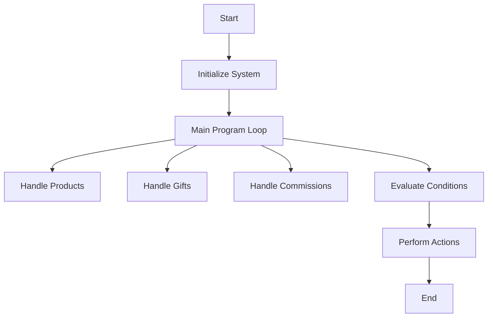

This document will cover the COP040 Program, which includes:

1. Initializing the system
2. Handling products, gifts, and commissions
3. Managing data operations and evaluating conditions.

Technical document: <SwmLink doc-title="Overview of COP040 Program">[Overview of COP040 Program](/.swm/overview-of-cop040-program.v1pjw2gb.sw.md)</SwmLink>

# Initializing the System

The COP040 program begins by initializing the system. This involves setting up necessary configurations and preparing the environment for the main operations. This step ensures that all required resources are available and the system is ready to perform its tasks efficiently.

# Handling Products

The COP040 program handles product-related operations by calling the COP045 program. This involves preparing the necessary data and invoking the COP045 program to process product information. This step ensures that all product data is accurately managed and updated within the system.

# Handling Gifts

The COP040 program also manages gift-related operations by calling the COP050X program. Similar to product handling, this involves preparing data and invoking the COP050X program to process gift information. This step ensures that all gift data is correctly handled and recorded.

# Handling Commissions

Commission-related operations are managed by the COP040 program through the CHAMAR-COMISSAO section, which calls the CGP010X program. This step involves passing the necessary data to the CGP010X program to handle commission calculations and updates. This ensures that all commission data is processed accurately.

# Managing Data Operations

The COP040 program performs various data operations such as opening, reading, writing, and closing files. It moves data between global storage and files to ensure that contract information is correctly updated and saved. This step is crucial for maintaining data integrity and consistency within the system.

# Evaluating Conditions

The COP040 program evaluates different conditions to decide what actions to take. This involves checking various flags and performing corresponding actions such as centralizing data, saving records, loading data, and handling different flags. This step ensures that the appropriate operations are executed based on the state of the system.

&nbsp;

*This is an auto-generated document by Swimm AI 🌊 and has not yet been verified by a human*

<SwmMeta version="3.0.0" repo-id="Z2l0aHViJTNBJTNBa2VsbG8lM0ElM0Fzd2ltbWlv" repo-name="kello">Powered by [Swimm](/)</SwmMeta>
