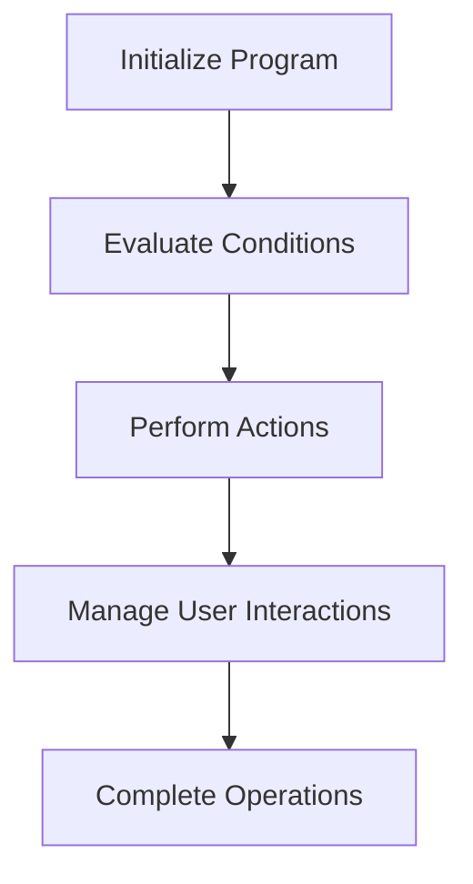

This document will cover the CPP020 Process, which includes:

1. Initializing the program
2. Evaluating conditions and performing actions
3. Managing user interactions through pop-ups.

Technical document: <SwmLink doc-title="Overview of CPP020 Process">[Overview of CPP020 Process](/.swm/overview-of-cpp020-process.qa3pxja4.sw.md)</SwmLink>

# Initializing the Program

The CPP020 process begins with initializing the program. This involves setting up initial parameters and configurations necessary for the program to run smoothly. This step ensures that all required resources and settings are in place before any business logic is executed.

# Evaluating Conditions and Performing Actions

In the main logic section, various conditions are evaluated to determine the appropriate actions. For example, if a flag indicating data needs to be saved is set, the program will check the type of data and perform the corresponding save operation. This step is crucial for ensuring that the program responds correctly to different states and inputs, maintaining data integrity and consistency.

# Managing User Interactions Through Pop-Ups

The CPP020 process also handles user interactions through pop-ups. Depending on the user's actions, different pop-ups are displayed, and the program performs specific actions based on the user's input. For instance, if a user selects a particular option, the program might call another sub-program to fetch additional data or update existing information. This step is essential for providing a responsive and interactive user experience.

# Completing Operations

Finally, the CPP020 process ensures that all necessary steps are performed in sequence to complete the operations. This includes finalizing any pending actions, saving data, and cleaning up resources. This step is vital for ensuring that the program concludes its operations correctly and prepares for the next execution cycle.

&nbsp;

*This is an auto-generated document by Swimm AI 🌊 and has not yet been verified by a human*

<SwmMeta version="3.0.0" repo-id="Z2l0aHViJTNBJTNBa2VsbG8lM0ElM0Fzd2ltbWlv" repo-name="kello">Powered by [Swimm](/)</SwmMeta>
