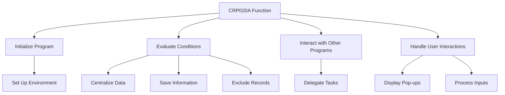

This document will cover the CRP020A function, which includes:

1. Initializing the program
2. Evaluating conditions and performing actions
3. Interacting with other programs
4. Handling user interactions

Technical document: <SwmLink doc-title="Overview of CRP020A Function">[Overview of CRP020A Function](/.swm/overview-of-crp020a-function.g8bt10d7.sw.md)</SwmLink>

# Initializing the Program

The CRP020A function begins by setting up the necessary environment and variables. This step ensures that the program has all the required resources and configurations to operate correctly. It prepares the system for subsequent operations by initializing key parameters and setting up the initial state.

# Evaluating Conditions and Performing Actions

The function evaluates various conditions based on the current state and user inputs. Depending on these conditions, it performs specific actions such as centralizing data, saving information, or excluding records. For example, if the centralization flag is true, the function will centralize the relevant data. Similarly, if the save flag is true, it will save the current information. This step ensures that the appropriate business logic is executed based on the current context.

# Interacting with Other Programs

The CRP020A function interacts with other programs to delegate specific tasks. For instance, it may call another program to perform a detailed operation and then cancel it once the task is completed. This modular approach allows the system to handle complex operations by breaking them down into smaller, manageable tasks. It ensures that each program performs its designated function efficiently.

# Handling User Interactions

The function handles user interactions by displaying pop-up windows and processing their inputs. Depending on the user's actions, it may load different pop-ups, call external programs, and process the returned data. This step is crucial for facilitating user interactions and ensuring that the system responds appropriately to user inputs. For example, if a user selects a specific option, the function will display the corresponding pop-up and handle the input accordingly.

&nbsp;

*This is an auto-generated document by Swimm AI 🌊 and has not yet been verified by a human*

<SwmMeta version="3.0.0" repo-id="Z2l0aHViJTNBJTNBa2VsbG8lM0ElM0Fzd2ltbWlv" repo-name="kello">Powered by [Swimm](/)</SwmMeta>
