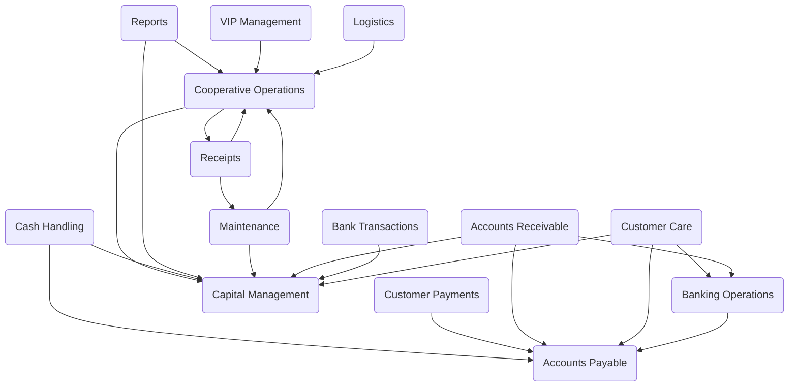

Kello is a CRM-like application that manages business operations, generates automatic reports, handles bank-specific EDI transactions, and creates standard SBP payment slips.

## Main Components

### VIP Management

VIP Management refers to the suite of COBOL programs designed to handle various aspects of video management, including planning, reporting, receiving raw tapes, listing existing tapes, inserting video copies, and maintaining tape locations. These programs facilitate the organization, processing, and reporting of video-related data within the system.

- <SwmLink doc-title="VIP Management Overview">[VIP Management Overview](/.swm/vip-management-overview.hfq4dqx6.sw.md)</SwmLink>
- <SwmLink doc-title="How VIP301A Manages and Queries the Tape Inventory">[How VIP301A Manages and Queries the Tape Inventory](/.swm/how-vip301a-manages-and-queries-the-tape-inventory.tb3flkdp.sw.md)</SwmLink>
- &nbsp;

### Accounts Payable

Accounts Payable refers to the management of a company's short-term debt obligations to its creditors or suppliers. It involves tracking invoices, ensuring timely payments, and maintaining accurate records of amounts owed. This function is crucial for maintaining good supplier relationships and managing cash flow effectively.

- <SwmLink doc-title="Accounts Payable Overview">[Accounts Payable Overview](/.swm/accounts-payable-overview.u0ryz9cf.sw.md)</SwmLink>
- <SwmLink doc-title="Implementation of automatic report generation in Accounts Payable">[Implementation of automatic report generation in Accounts Payable](/.swm/implementation-of-automatic-report-generation-in-accounts-payable.4k42omnd.sw.md)</SwmLink>
- <SwmLink doc-title="Mechanisms behind bank-specific EDI transactions">[Mechanisms behind bank-specific EDI transactions](/.swm/mechanisms-behind-bank-specific-edi-transactions.a2plres4.sw.md)</SwmLink>
- <SwmLink doc-title="Generation of standard SBP payment slips">[Generation of standard SBP payment slips](/.swm/generation-of-standard-sbp-payment-slips.eogbxiyz.sw.md)</SwmLink>
- **Flows**
  - <SwmLink doc-title="Overview of CXP100 Program">[Overview of CXP100 Program](/.swm/overview-of-cxp100-program.3mirityd.sw.md)</SwmLink>
  - <SwmLink doc-title="CXP100 Program Flow">[CXP100 Program Flow](/.swm/cxp100-program-flow.c9ryj2u3.sw.md)</SwmLink>
  - <SwmLink doc-title="CXP100 Program Flow">[CXP100 Program Flow](/.swm/cxp100-program-flow.tzu95nm2.sw.md)</SwmLink>
  - <SwmLink doc-title="PAR001 Program Flow">[PAR001 Program Flow](/.swm/par001-program-flow.tyf370dq.sw.md)</SwmLink>
  - <SwmLink doc-title="Overview of CGP001 Program">[Overview of CGP001 Program](/.swm/overview-of-cgp001-program.2spkjcq4.sw.md)</SwmLink>

### Accounts Receivable

Accounts Receivable refers to the outstanding invoices a company has or the money clients owe the company. It represents a line of credit extended by a company and is treated as a current asset on the balance sheet. The primary function of Accounts Receivable is to manage and track the money that is due to the company from its customers, ensuring timely collection and accurate financial reporting.

- <SwmLink doc-title="Accounts Receivable Overview">[Accounts Receivable Overview](/.swm/accounts-receivable-overview.8csxmtth.sw.md)</SwmLink>
- <SwmLink doc-title="Implementation of Bank-Specific EDI Transactions in Accounts Receivable">[Implementation of Bank-Specific EDI Transactions in Accounts Receivable](/.swm/implementation-of-bank-specific-edi-transactions-in-accounts-receivable.n673wjes.sw.md)</SwmLink>
- <SwmLink doc-title="Mechanisms for Generating Standard SBP Payment Slips">[Mechanisms for Generating Standard SBP Payment Slips](/.swm/mechanisms-for-generating-standard-sbp-payment-slips.1v2uy516.sw.md)</SwmLink>
- <SwmLink doc-title="Roles of Key Programs like crp062.cbl and crp100.cbl in Accounts Receivable">[Roles of Key Programs like crp062.cbl and crp100.cbl in Accounts Receivable](/.swm/roles-of-key-programs-like-crp062cbl-and-crp100cbl-in-accounts-receivable.59h631ib.sw.md)</SwmLink>
- <SwmLink doc-title="Error-Handling Strategies in COBOL Programs for Accounts Receivable">[Error-Handling Strategies in COBOL Programs for Accounts Receivable](/.swm/error-handling-strategies-in-cobol-programs-for-accounts-receivable.vq3cmxjp.sw.md)</SwmLink>
- <SwmLink doc-title="Performance Optimization in Accounts Receivable COBOL Programs">[Performance Optimization in Accounts Receivable COBOL Programs](/.swm/performance-optimization-in-accounts-receivable-cobol-programs.pn2a12ty.sw.md)</SwmLink>

### Reports

Reports are automatically generated documents that provide detailed information about various business operations. They are created using specific COBOL functions and sections, such as REP206 and GRAVAR-DADOS-REPORTAGEM, which handle data initialization, processing, and error handling. These reports are essential for tracking and analyzing business activities, ensuring accurate and efficient management.

- <SwmLink doc-title="Reports Overview">[Reports Overview](/.swm/reports-overview.xfv779hv.sw.md)</SwmLink>
- <SwmLink doc-title="How the CORPO-PROGRAMA section processes data and handles conditions">[How the CORPO-PROGRAMA section processes data and handles conditions](/.swm/how-the-corpo-programa-section-processes-data-and-handles-conditions.4mxmfgir.sw.md)</SwmLink>
- <SwmLink doc-title="How the IMPRIME-RELATORIO section formats and executes report printing">[How the IMPRIME-RELATORIO section formats and executes report printing](/.swm/how-the-imprime-relatorio-section-formats-and-executes-report-printing.u5vkt0ie.sw.md)</SwmLink>

### Branch Operations

Branch operations refer to the various functionalities and processes related to managing different branches within the Kello Imagens system. These operations include handling transactions, generating reports, and managing branch-specific data. The source files in the <SwmPath>[src/galho/](src/galho/)</SwmPath> directory contain COBOL programs that implement these functionalities, ensuring smooth and efficient branch management.

- <SwmLink doc-title="Branch Operations Overview">[Branch Operations Overview](/.swm/branch-operations-overview.8wnf3v90.sw.md)</SwmLink>
- <SwmLink doc-title="Implementation of CRUD Operations in Branch-Related COBOL Programs">[Implementation of CRUD Operations in Branch-Related COBOL Programs](/.swm/implementation-of-crud-operations-in-branch-related-cobol-programs.g3i123dv.sw.md)</SwmLink>
- <SwmLink doc-title="Conditions and Criteria for CRUD Operations in Branch Management">[Conditions and Criteria for CRUD Operations in Branch Management](/.swm/conditions-and-criteria-for-crud-operations-in-branch-management.16rhatnv.sw.md)</SwmLink>
- <SwmLink doc-title="Batch Processing in Branch Operations Using COBOL">[Batch Processing in Branch Operations Using COBOL](/.swm/batch-processing-in-branch-operations-using-cobol.7qns6myb.sw.md)</SwmLink>
- <SwmLink doc-title="Steps for Generating Reports in Branch Operations">[Steps for Generating Reports in Branch Operations](/.swm/steps-for-generating-reports-in-branch-operations.sh9ro2oy.sw.md)</SwmLink>
- **Bank Transactions**
  - <SwmLink doc-title="Overview of Bank Transactions in Branch Operations">[Overview of Bank Transactions in Branch Operations](/.swm/overview-of-bank-transactions-in-branch-operations.f9hvryw8.sw.md)</SwmLink>
  - <SwmLink doc-title="How Data Validation Works in GALHO90">[How Data Validation Works in GALHO90](/.swm/how-data-validation-works-in-galho90.jc87m9bw.sw.md)</SwmLink>
  - <SwmLink doc-title="Managing Bank-Specific EDI Transactions in GALHO90">[Managing Bank-Specific EDI Transactions in GALHO90](/.swm/managing-bank-specific-edi-transactions-in-galho90.xb1pzlh1.sw.md)</SwmLink>
  - <SwmLink doc-title="Ensuring Data Integrity in GALHO90">[Ensuring Data Integrity in GALHO90](/.swm/ensuring-data-integrity-in-galho90.r16wgr0g.sw.md)</SwmLink>
  - <SwmLink doc-title="Error Handling Techniques in GALHO90">[Error Handling Techniques in GALHO90](/.swm/error-handling-techniques-in-galho90.4mya3kfq.sw.md)</SwmLink>
- **Customer Management**
  - <SwmLink doc-title="What is Customer Management in Branch Operations">[What is Customer Management in Branch Operations](/.swm/what-is-customer-management-in-branch-operations.wqv6omex.sw.md)</SwmLink>
  - <SwmLink doc-title="How the system ensures data integrity and accessibility">[How the system ensures data integrity and accessibility](.swm/how-the-system-ensures-data-integrity-and-accessibility.jyq33a7m.sw.md)</SwmLink>
  - <SwmLink doc-title="Structure and purpose of fields within CGD999 and CRD999 files">[Structure and purpose of fields within CGD999 and CRD999 files](/.swm/structure-and-purpose-of-fields-within-cgd999-and-crd999-files.r244xz02.sw.md)</SwmLink>
  - <SwmLink doc-title="How the application interacts with customer data sets in CGD999 and CRD999 files">[How the application interacts with customer data sets in CGD999 and CRD999 files](/.swm/how-the-application-interacts-with-customer-data-sets-in-cgd999-and-crd999-files.thzlx9hq.sw.md)</SwmLink>
  - <SwmLink doc-title="Business logic implemented in GALHO35.cbl">[Business logic implemented in GALHO35.cbl](/.swm/business-logic-implemented-in-galho35cbl.80i2intw.sw.md)</SwmLink>

### Banking Operations

Banking operations refer to the functionalities that handle financial transactions and processes within the system. This includes generating bank-specific EDI transactions and standard SBP payment slips, which are essential for automating and managing financial workflows efficiently.

- <SwmLink doc-title="Banking Operations Overview">[Banking Operations Overview](/.swm/banking-operations-overview.nxi9ze1h.sw.md)</SwmLink>

### Maintenance

Maintenance refers to the ongoing process of updating, fixing, and improving the system to ensure its optimal performance and reliability. This includes tasks such as bug fixes, code refactoring, updating dependencies, and implementing new features or enhancements.

- <SwmLink doc-title="Maintenance Overview">[Maintenance Overview](/.swm/maintenance-overview.eikqaekn.sw.md)</SwmLink>
- <SwmLink doc-title="Implementation of bank-specific EDI transactions in maintenance programs">[Implementation of bank-specific EDI transactions in maintenance programs](/.swm/implementation-of-bank-specific-edi-transactions-in-maintenance-programs.vdkbm0zh.sw.md)</SwmLink>
- <SwmLink doc-title="Handling of SBP payment slip generation in maintenance tasks">[Handling of SBP payment slip generation in maintenance tasks](/.swm/handling-of-sbp-payment-slip-generation-in-maintenance-tasks.jgzyo50b.sw.md)</SwmLink>
- <SwmLink doc-title="Overview of MTP001 Program">[Overview of MTP001 Program](/.swm/overview-of-mtp001-program.i1vc8xor.sw.md)</SwmLink>

### Kello Core

Kello Core refers to the fundamental components and functionalities of the Kello Imagens system. It includes the essential modules and routines written in COBOL-85 that handle the core business operations, such as customer relationship management, report generation, and financial transactions. These core components are crucial for the system's overall performance and reliability, ensuring that the primary business processes are executed efficiently and accurately.

- <SwmLink doc-title="Kello Core Overview">[Kello Core Overview](/.swm/kello-core-overview.u2vbz2j1.sw.md)</SwmLink>
- <SwmLink doc-title="How the KELLO1 and KELLO2 data structures are used in core functionalities">[How the KELLO1 and KELLO2 data structures are used in core functionalities](/.swm/how-the-kello1-and-kello2-data-structures-are-used-in-core-functionalities.qk9lx4h4.sw.md)</SwmLink>
- **Reports**
  - <SwmLink doc-title="Introduction to Reports in Kello Core">[Introduction to Reports in Kello Core](/.swm/introduction-to-reports-in-kello-core.a8esc3bm.sw.md)</SwmLink>
  - <SwmLink doc-title="Interaction between .LST and .CBL files in report generation">[Interaction between .LST and .CBL files in report generation](/.swm/interaction-between-lst-and-cbl-files-in-report-generation.cpctgm42.sw.md)</SwmLink>
  - <SwmLink doc-title="Key algorithms in COBOL-85 for transaction summaries">[Key algorithms in COBOL-85 for transaction summaries](/.swm/key-algorithms-in-cobol-85-for-transaction-summaries.fd9xgxkb.sw.md)</SwmLink>
  - <SwmLink doc-title="Role of .GS and .OBJ files in report generation">[Role of .GS and .OBJ files in report generation](/.swm/role-of-gs-and-obj-files-in-report-generation.ry1mivqg.sw.md)</SwmLink>
  - **Report Generation**
    - <SwmLink doc-title="Understanding Report Generation">[Understanding Report Generation](/.swm/understanding-report-generation.2mpd7nul.sw.md)</SwmLink>
    - <SwmLink doc-title="How Automatic Report Generation is Implemented">[How Automatic Report Generation is Implemented](/.swm/how-automatic-report-generation-is-implemented.tao70ayc.sw.md)</SwmLink>
    - <SwmLink doc-title="How Bank-Specific EDI Transactions are Integrated and Processed">[How Bank-Specific EDI Transactions are Integrated and Processed](/.swm/how-bank-specific-edi-transactions-are-integrated-and-processed.eu1dwi6x.sw.md)</SwmLink>
    - <SwmLink doc-title="Mechanisms for Exporting Reports to PDF and Excel">[Mechanisms for Exporting Reports to PDF and Excel](/.swm/mechanisms-for-exporting-reports-to-pdf-and-excel.z3s9zzh8.sw.md)</SwmLink>
  - **Report Templates**
    - <SwmLink doc-title="Exploring Report Templates in Reports">[Exploring Report Templates in Reports](/.swm/exploring-report-templates-in-reports.z5858fyw.sw.md)</SwmLink>
    - <SwmLink doc-title="The structure of report templates in COBOL">[The structure of report templates in COBOL](/.swm/the-structure-of-report-templates-in-cobol.l7zwzwwz.sw.md)</SwmLink>
    - <SwmLink doc-title="Understanding EDI transactions in Kello Imagens">[Understanding EDI transactions in Kello Imagens](/.swm/understanding-edi-transactions-in-kello-imagens.4kprtyn0.sw.md)</SwmLink>
    - <SwmLink doc-title="Integration of SBP payment slips in Kello Imagens">[Integration of SBP payment slips in Kello Imagens](/.swm/integration-of-sbp-payment-slips-in-kello-imagens.oivlul7v.sw.md)</SwmLink>
  - **Report Listings**
    - <SwmLink doc-title="Getting started with Report Listings in Reports">[Getting started with Report Listings in Reports](/.swm/getting-started-with-report-listings-in-reports.wlh7thdx.sw.md)</SwmLink>
    - <SwmLink doc-title="Process of Report Generation">[Process of Report Generation](/.swm/process-of-report-generation.iixy11bq.sw.md)</SwmLink>
    - <SwmLink doc-title="Business Rules in Report Listings">[Business Rules in Report Listings](/.swm/business-rules-in-report-listings.tux82yys.sw.md)</SwmLink>
    - <SwmLink doc-title="Integrations with External Systems">[Integrations with External Systems](/.swm/integrations-with-external-systems.e19m7iub.sw.md)</SwmLink>
    - <SwmLink doc-title="Automation Tools and Scripts for Report Generation">[Automation Tools and Scripts for Report Generation](/.swm/automation-tools-and-scripts-for-report-generation.tsux1zmy.sw.md)</SwmLink>
- **Bank Transactions**
  - <SwmLink doc-title="Overview of Bank Transactions">[Overview of Bank Transactions](/.swm/overview-of-bank-transactions.562cttr2.sw.md)</SwmLink>
  - <SwmLink doc-title="Error Handling in Bank Transactions">[Error Handling in Bank Transactions](/.swm/error-handling-in-bank-transactions.0h3wwe6q.sw.md)</SwmLink>
  - <SwmLink doc-title="Logging Practices in Bank Transactions">[Logging Practices in Bank Transactions](/.swm/logging-practices-in-bank-transactions.sob79gck.sw.md)</SwmLink>
  - <SwmLink doc-title="Data Validation Mechanisms in Kello Imagens">[Data Validation Mechanisms in Kello Imagens](/.swm/data-validation-mechanisms-in-kello-imagens.ddc0ku3y.sw.md)</SwmLink>
  - <SwmLink doc-title="Automatic Report Generation in Kello Imagens">[Automatic Report Generation in Kello Imagens](/.swm/automatic-report-generation-in-kello-imagens.003mj7sb.sw.md)</SwmLink>
  - <SwmLink doc-title="Configuration Management Practices in Kello Imagens">[Configuration Management Practices in Kello Imagens](/.swm/configuration-management-practices-in-kello-imagens.r51tpcov.sw.md)</SwmLink>
  - **RITAU**
    - <SwmLink doc-title="Overview of RITAU">[Overview of RITAU](/.swm/overview-of-ritau.swivmhg0.sw.md)</SwmLink>
    - <SwmLink doc-title="Error Logging in RITAU">[Error Logging in RITAU](/.swm/error-logging-in-ritau.1iv27hpx.sw.md)</SwmLink>
    - <SwmLink doc-title="How IMPRIME-RELATORIO Works">[How IMPRIME-RELATORIO Works](/.swm/how-imprime-relatorio-works.8pe35mrj.sw.md)</SwmLink>
    - <SwmLink doc-title="Initialization in INICIALIZA-PROGRAMA">[Initialization in INICIALIZA-PROGRAMA](/.swm/initialization-in-inicializa-programa.94o2e3io.sw.md)</SwmLink>
  - **HSBC**
    - <SwmLink doc-title="Understanding HSBC Bank Transactions">[Understanding HSBC Bank Transactions](/.swm/understanding-hsbc-bank-transactions.6ezcwkuh.sw.md)</SwmLink>
    - <SwmLink doc-title="Technical implementation of specialized bank transactions like HSBC">[Technical implementation of specialized bank transactions like HSBC](/.swm/technical-implementation-of-specialized-bank-transactions-like-hsbc.c3rg7usi.sw.md)</SwmLink>
    - <SwmLink doc-title="Handling EDI transactions and key integrations">[Handling EDI transactions and key integrations](/.swm/handling-edi-transactions-and-key-integrations.1vqq03x2.sw.md)</SwmLink>
    - <SwmLink doc-title="Roles of different data files and structures in financial processing">[Roles of different data files and structures in financial processing](.swm/roles-of-different-data-files-and-structures-in-financial-processing.mtxm2ccj.sw.md)</SwmLink>
- **Payment Slips**
  - <SwmLink doc-title="Exploring Payment Slips in Kello Core">[Exploring Payment Slips in Kello Core](/.swm/exploring-payment-slips-in-kello-core.n0s892o6.sw.md)</SwmLink>
  - <SwmLink doc-title="How automated payment slip generation complies with SBP standards">[How automated payment slip generation complies with SBP standards](/.swm/how-automated-payment-slip-generation-complies-with-sbp-standards.84gxmrc5.sw.md)</SwmLink>
  - <SwmLink doc-title="What the .GS scripts do in the system">[What the .GS scripts do in the system](/.swm/what-the-gs-scripts-do-in-the-system.zr306cec.sw.md)</SwmLink>
  - <SwmLink doc-title="Purpose of primary financial operation COBOL files">[Purpose of primary financial operation COBOL files](/.swm/purpose-of-primary-financial-operation-cobol-files.2vwwowm3.sw.md)</SwmLink>
  - <SwmLink doc-title="Generation and usage of reports in the Kello system">[Generation and usage of reports in the Kello system](/.swm/generation-and-usage-of-reports-in-the-kello-system.qv6d62ut.sw.md)</SwmLink>
- **Customer Management**
  - <SwmLink doc-title="Introduction to Customer Management in Kello Core">[Introduction to Customer Management in Kello Core](/.swm/introduction-to-customer-management-in-kello-core.maz93t9o.sw.md)</SwmLink>
  - <SwmLink doc-title="Explaining the acronyms and prefixes in file names">[Explaining the acronyms and prefixes in file names](.swm/explaining-the-acronyms-and-prefixes-in-file-names.p175chct.sw.md)</SwmLink>
  - <SwmLink doc-title="Understanding report generation with rep files">[Understanding report generation with rep files](.swm/understanding-report-generation-with-rep-files.ubv54rw4.sw.md)</SwmLink>
  - <SwmLink doc-title="Integration of Customer Management with billing and communication modules">[Integration of Customer Management with billing and communication modules](/.swm/integration-of-customer-management-with-billing-and-communication-modules.8avx60o1.sw.md)</SwmLink>
  - **Customer Data**
    - <SwmLink doc-title="Introduction to Customer Data in Customer Management">[Introduction to Customer Data in Customer Management](/.swm/introduction-to-customer-data-in-customer-management.x76p1ngy.sw.md)</SwmLink>
    - <SwmLink doc-title="How data validation for customer records is implemented">[How data validation for customer records is implemented](.swm/how-data-validation-for-customer-records-is-implemented.eihi7ipv.sw.md)</SwmLink>
    - <SwmLink doc-title="Methods used for securely storing customer data">[Methods used for securely storing customer data](.swm/methods-used-for-securely-storing-customer-data.5uh0l0fg.sw.md)</SwmLink>
    - <SwmLink doc-title="Integration of transaction histories with customer records">[Integration of transaction histories with customer records](.swm/integration-of-transaction-histories-with-customer-records.2cjcwjj7.sw.md)</SwmLink>
    - <SwmLink doc-title="Generation of reports and payment slips and their data utilization">[Generation of reports and payment slips and their data utilization](.swm/generation-of-reports-and-payment-slips-and-their-data-utilization.rwzshcp1.sw.md)</SwmLink>
  - **Customer Segments**
    - <SwmLink doc-title="Understanding Customer Segments in Customer Management">[Understanding Customer Segments in Customer Management](/.swm/understanding-customer-segments-in-customer-management.i1ra0tc2.sw.md)</SwmLink>
    - <SwmLink doc-title="Integration and Processing of Customer Segments in COBOL Programs">[Integration and Processing of Customer Segments in COBOL Programs](/.swm/integration-and-processing-of-customer-segments-in-cobol-programs.iba4x3c4.sw.md)</SwmLink>
    - <SwmLink doc-title="Roles of Listing and Intermediate Files in Development and Deployment Lifecycle">[Roles of Listing and Intermediate Files in Development and Deployment Lifecycle](/.swm/roles-of-listing-and-intermediate-files-in-development-and-deployment-lifecycle.h0ruy9lf.sw.md)</SwmLink>
  - **Customer Attributes**
    - <SwmLink doc-title="Getting started with Customer Data Attributes">[Getting started with Customer Data Attributes](/.swm/getting-started-with-customer-data-attributes.ognvl0fo.sw.md)</SwmLink>
    - <SwmLink doc-title="Management and Organization of Customer Attributes">[Management and Organization of Customer Attributes](/.swm/management-and-organization-of-customer-attributes.hgs8fmh2.sw.md)</SwmLink>
    - <SwmLink doc-title="Function of galho Files">[Function of galho Files](/.swm/function-of-galho-files.4de8uwz0.sw.md)</SwmLink>
    - <SwmLink doc-title="Compilation Process for Source and Object Files">[Compilation Process for Source and Object Files](/.swm/compilation-process-for-source-and-object-files.f1ld84qx.sw.md)</SwmLink>
    - <SwmLink doc-title="Interaction Between Components: mtp020, crp053, and rep201">[Interaction Between Components: mtp020, crp053, and rep201](/.swm/interaction-between-components-mtp020-crp053-and-rep201.ikzt9n5m.sw.md)</SwmLink>
- **Financial Operations**
  - <SwmLink doc-title="Overview of Financial Operations in Kello Core">[Overview of Financial Operations in Kello Core](/.swm/overview-of-financial-operations-in-kello-core.fwh82zb4.sw.md)</SwmLink>
  - <SwmLink doc-title="Automatic Report Generation Orchestration">[Automatic Report Generation Orchestration](/.swm/automatic-report-generation-orchestration.0q51h8s1.sw.md)</SwmLink>
  - <SwmLink doc-title="Handling Bank-Specific EDI Transactions Securely and Efficiently">[Handling Bank-Specific EDI Transactions Securely and Efficiently](/.swm/handling-bank-specific-edi-transactions-securely-and-efficiently.8h78parh.sw.md)</SwmLink>
  - <SwmLink doc-title="Process and Compliance in Generating SBP Payment Slips">[Process and Compliance in Generating SBP Payment Slips](/.swm/process-and-compliance-in-generating-sbp-payment-slips.jp5irmz0.sw.md)</SwmLink>
  - <SwmLink doc-title="Introduction to Financial Transactions">[Introduction to Financial Transactions](/.swm/introduction-to-financial-transactions.uayn6k3p.sw.md)</SwmLink>
  - **Reports**
    - <SwmLink doc-title="Overview of Financial Reports">[Overview of Financial Reports](/.swm/overview-of-financial-reports.r3qbca0l.sw.md)</SwmLink>
    - <SwmLink doc-title="How data is securely loaded into reports">[How data is securely loaded into reports](.swm/how-data-is-securely-loaded-into-reports.vvpcd7nn.sw.md)</SwmLink>
    - <SwmLink doc-title="Understanding conditional flow in CORPO-PROGRAMA for seamless report generation">[Understanding conditional flow in CORPO-PROGRAMA for seamless report generation](/.swm/understanding-conditional-flow-in-corpo-programa-for-seamless-report-generation.gpuze65t.sw.md)</SwmLink>
    - <SwmLink doc-title="How errors are managed in financial transaction processing">[How errors are managed in financial transaction processing](.swm/how-errors-are-managed-in-financial-transaction-processing.lrp7u4um.sw.md)</SwmLink>
    - <SwmLink doc-title="Integration of different financial standards in the system">[Integration of different financial standards in the system](.swm/integration-of-different-financial-standards-in-the-system.frb3n1qo.sw.md)</SwmLink>
  - **Payments**
    - <SwmLink doc-title="Getting started with Payment Processing">[Getting started with Payment Processing](/.swm/getting-started-with-payment-processing.q6qsyorm.sw.md)</SwmLink>
    - <SwmLink doc-title="Interaction with Different Banks for EDI Transactions">[Interaction with Different Banks for EDI Transactions](/.swm/interaction-with-different-banks-for-edi-transactions.qipoiu0u.sw.md)</SwmLink>
    - <SwmLink doc-title="Implementations for Automatic Report Generation">[Implementations for Automatic Report Generation](/.swm/implementations-for-automatic-report-generation.1ijd20cp.sw.md)</SwmLink>
    - <SwmLink doc-title="Compliance of SBP Payment Slips with Banking Standards">[Compliance of SBP Payment Slips with Banking Standards](/.swm/compliance-of-sbp-payment-slips-with-banking-standards.3hlnsf05.sw.md)</SwmLink>
- **Inventory Management**
  - <SwmLink doc-title="Getting started with Inventory Management in Kello Core">[Getting started with Inventory Management in Kello Core](/.swm/getting-started-with-inventory-management-in-kello-core.b0z9t6ks.sw.md)</SwmLink>
  - <SwmLink doc-title="How automatic inventory updates work">[How automatic inventory updates work](.swm/how-automatic-inventory-updates-work.rdhfed9f.sw.md)</SwmLink>
  - <SwmLink doc-title="Roles of .cpy, .gs, and .lst files in the Kello system">[Roles of .cpy, .gs, and .lst files in the Kello system](/.swm/roles-of-cpy-gs-and-lst-files-in-the-kello-system.56udxngs.sw.md)</SwmLink>
  - <SwmLink doc-title="Introduction to Stock Management in Inventory Management">[Introduction to Stock Management in Inventory Management](/.swm/introduction-to-stock-management-in-inventory-management.30uw2qau.sw.md)</SwmLink>
  - **Inventory Control**
    - <SwmLink doc-title="Introduction to Inventory Control in Inventory Management">[Introduction to Inventory Control in Inventory Management](/.swm/introduction-to-inventory-control-in-inventory-management.gkzsw32k.sw.md)</SwmLink>
    - <SwmLink doc-title="Error handling and logging implementation">[Error handling and logging implementation](.swm/error-handling-and-logging-implementation.ig8qrkhg.sw.md)</SwmLink>
    - <SwmLink doc-title="Integration points and implementation of bank-specific EDI transactions">[Integration points and implementation of bank-specific EDI transactions](/.swm/integration-points-and-implementation-of-bank-specific-edi-transactions.yh5g71at.sw.md)</SwmLink>
    - <SwmLink doc-title="Report generation in Kello Imagens system">[Report generation in Kello Imagens system](/.swm/report-generation-in-kello-imagens-system.7vd3uwkw.sw.md)</SwmLink>
  - **Product Tracking**
    - <SwmLink doc-title="Basic concepts of Product Tracking in Inventory Management">[Basic concepts of Product Tracking in Inventory Management](/.swm/basic-concepts-of-product-tracking-in-inventory-management.bjquy5s0.sw.md)</SwmLink>
    - <SwmLink doc-title="How automatic report generation works">[How automatic report generation works](.swm/how-automatic-report-generation-works.vxj4etto.sw.md)</SwmLink>
    - <SwmLink doc-title="How product status updates are managed">[How product status updates are managed](.swm/how-product-status-updates-are-managed.f5wxzmm9.sw.md)</SwmLink>
    - <SwmLink doc-title="Procedures for data consistency with external bank systems">[Procedures for data consistency with external bank systems](.swm/procedures-for-data-consistency-with-external-bank-systems.dg4eyeck.sw.md)</SwmLink>
    - <SwmLink doc-title="Integration of EDI transactions and SBP payment slip generation within the system">[Integration of EDI transactions and SBP payment slip generation within the system](/.swm/integration-of-edi-transactions-and-sbp-payment-slip-generation-within-the-system.1eynoz06.sw.md)</SwmLink>
- **Flows**
  - <SwmLink doc-title="Overview of CHP010A Program">[Overview of CHP010A Program](/.swm/overview-of-chp010a-program.o0r3zcbu.sw.md)</SwmLink>
  - <SwmLink doc-title="Flow and Functionality of CPP020B">[Flow and Functionality of CPP020B](/.swm/flow-and-functionality-of-cpp020b.ghxztj8u.sw.md)</SwmLink>
  - <SwmLink doc-title="CRP020B Function Overview">[CRP020B Function Overview](/.swm/crp020b-function-overview.ym81rgq4.sw.md)</SwmLink>
  - <SwmLink doc-title="Overview of CPP020A">[Overview of CPP020A](/.swm/overview-of-cpp020a.d0qbjq6h.sw.md)</SwmLink>
  - <SwmLink doc-title="Overview of CRP020A Function">[Overview of CRP020A Function](/.swm/overview-of-crp020a-function.j6r7y911.sw.md)</SwmLink>
  - <SwmLink doc-title="Overview of CORPO-PROGRAMA">[Overview of CORPO-PROGRAMA](/.swm/overview-of-corpo-programa.t1j6kj2v.sw.md)</SwmLink>
  - <SwmLink doc-title="Overview of ACP100 Process">[Overview of ACP100 Process](/.swm/overview-of-acp100-process.jpikl895.sw.md)</SwmLink>
  - <SwmLink doc-title="Overview of COP040 Program">[Overview of COP040 Program](/.swm/overview-of-cop040-program.v1pjw2gb.sw.md)</SwmLink>
  - <SwmLink doc-title="CXP100 Program Flow">[CXP100 Program Flow](/.swm/cxp100-program-flow.310vyggg.sw.md)</SwmLink>
  - <SwmLink doc-title="CXP100 Program Flow">[CXP100 Program Flow](/.swm/cxp100-program-flow.hhwdx8t2.sw.md)</SwmLink>
  - <SwmLink doc-title="CXP100 Program Flow">[CXP100 Program Flow](/.swm/cxp100-program-flow.74yxhr2c.sw.md)</SwmLink>
  - <SwmLink doc-title="PAR001 Program Flow">[PAR001 Program Flow](/.swm/par001-program-flow.8e8vkquq.sw.md)</SwmLink>
  - <SwmLink doc-title="MTP001 Program Flow">[MTP001 Program Flow](/.swm/mtp001-program-flow.gstk0piw.sw.md)</SwmLink>
  - <SwmLink doc-title="Overview of MTP021 Function">[Overview of MTP021 Function](/.swm/overview-of-mtp021-function.h7ztfa7i.sw.md)</SwmLink>
  - <SwmLink doc-title="Overview of CPP020 Program">[Overview of CPP020 Program](/.swm/overview-of-cpp020-program.mvdqkxso.sw.md)</SwmLink>
  - <SwmLink doc-title="Overview of CGP001 Program Flow">[Overview of CGP001 Program Flow](/.swm/overview-of-cgp001-program-flow.1mpw4x97.sw.md)</SwmLink>
  - <SwmLink doc-title="CPP022a Program Flow">[CPP022a Program Flow](/.swm/cpp022a-program-flow.2dalfs47.sw.md)</SwmLink>
  - <SwmLink doc-title="Flow of CDCP110 Program">[Flow of CDCP110 Program](/.swm/flow-of-cdcp110-program.cmerbknb.sw.md)</SwmLink>
  - <SwmLink doc-title="PRP101 Program Flow">[PRP101 Program Flow](/.swm/prp101-program-flow.1yr9bcws.sw.md)</SwmLink>
  - <SwmLink doc-title="Overview of COP104 Program Flow">[Overview of COP104 Program Flow](/.swm/overview-of-cop104-program-flow.cbakl3td.sw.md)</SwmLink>
  - <SwmLink doc-title="Overview of COP104 Section">[Overview of COP104 Section](/.swm/overview-of-cop104-section.kb047ry1.sw.md)</SwmLink>
  - <SwmLink doc-title="Overview of COP104 Flow">[Overview of COP104 Flow](/.swm/overview-of-cop104-flow.0260kbeb.sw.md)</SwmLink>
  - <SwmLink doc-title="Overview of COP104 Program">[Overview of COP104 Program](/.swm/overview-of-cop104-program.scqkqm9m.sw.md)</SwmLink>
  - <SwmLink doc-title="Overview of COP104 Program">[Overview of COP104 Program](/.swm/overview-of-cop104-program.256cr9d0.sw.md)</SwmLink>
  - <SwmLink doc-title="RCP100 Program Flow">[RCP100 Program Flow](/.swm/rcp100-program-flow.r9u93i6f.sw.md)</SwmLink>
  - <SwmLink doc-title="Overview of MAIN-PROCESS">[Overview of MAIN-PROCESS](/.swm/overview-of-main-process.5q3zunrc.sw.md)</SwmLink>
  - <SwmLink doc-title="Overview of the CGP010 Flow">[Overview of the CGP010 Flow](/.swm/overview-of-the-cgp010-flow.nttxywrj.sw.md)</SwmLink>
  - <SwmLink doc-title="Overview of RCP203 Program">[Overview of RCP203 Program](/.swm/overview-of-rcp203-program.5gdnfize.sw.md)</SwmLink>
  - <SwmLink doc-title="Overview of CGP010">[Overview of CGP010](/.swm/overview-of-cgp010.9iealp29.sw.md)</SwmLink>

### Alterations

Alterations refer to modifications or updates made to the system's functionality or data processing. These changes are implemented in various COBOL source files located in the <SwmPath>[src/alt/](src/alt/)</SwmPath> directory, ensuring the system remains up-to-date and meets evolving business requirements.

- <SwmLink doc-title="Alterations Overview">[Alterations Overview](/.swm/alterations-overview.x2a14pq7.sw.md)</SwmLink>

### Logistics

Logistics refers to the detailed coordination and implementation of complex operations involving the movement, storage, and flow of goods, services, and information from the point of origin to the point of consumption. It encompasses activities such as transportation, warehousing, inventory management, order fulfillment, and supply chain management to ensure that resources are efficiently and effectively distributed.

- <SwmLink doc-title="Logistics Overview">[Logistics Overview](/.swm/logistics-overview.n1hd0lwg.sw.md)</SwmLink>
- <SwmLink doc-title="Integration with External Banks for EDI Transactions">[Integration with External Banks for EDI Transactions](/.swm/integration-with-external-banks-for-edi-transactions.elhs6ajk.sw.md)</SwmLink>
- <SwmLink doc-title="Automatic Report Generation and Triggers">[Automatic Report Generation and Triggers](/.swm/automatic-report-generation-and-triggers.92angrqd.sw.md)</SwmLink>
- <SwmLink doc-title="Management and Structure of Standard SBP Payment Slips">[Management and Structure of Standard SBP Payment Slips](/.swm/management-and-structure-of-standard-sbp-payment-slips.fcs7ywfm.sw.md)</SwmLink>

### Cooperative Operations

Cooperative Operations refer to the collaborative processes and functionalities within the Kello Imagens system that enable different parts of the application to work together seamlessly. These operations are essential for ensuring that various business processes, such as report generation, EDI transactions, and payment slip generation, are executed efficiently and accurately. The <SwmPath>[src/cop/](src/cop/)</SwmPath> directory contains numerous COBOL source files that implement these cooperative operations, highlighting their importance in the overall system architecture.

- <SwmLink doc-title="Cooperative Operations Overview">[Cooperative Operations Overview](/.swm/cooperative-operations-overview.749tx5d8.sw.md)</SwmLink>
- <SwmLink doc-title="Implementation of EDI transactions">[Implementation of EDI transactions](/.swm/implementation-of-edi-transactions.s3ch8q6h.sw.md)</SwmLink>
- <SwmLink doc-title="Ensuring data consistency in report generation">[Ensuring data consistency in report generation](.swm/ensuring-data-consistency-in-report-generation.kxig0bj5.sw.md)</SwmLink>
- <SwmLink doc-title="Error handling methods in COBOL programs">[Error handling methods in COBOL programs](/.swm/error-handling-methods-in-cobol-programs.nwva7u0u.sw.md)</SwmLink>
- <SwmLink doc-title="Overview of COP040 Process">[Overview of COP040 Process](/.swm/overview-of-cop040-process.odahywrk.sw.md)</SwmLink>
- **Backup COBOL**
  - <SwmLink doc-title="Introduction to Backup COBOL in Cooperative Operations">[Introduction to Backup COBOL in Cooperative Operations](/.swm/introduction-to-backup-cobol-in-cooperative-operations.xzr0iiqd.sw.md)</SwmLink>
  - <SwmLink doc-title="Methods for ensuring data consistency during backup">[Methods for ensuring data consistency during backup](.swm/methods-for-ensuring-data-consistency-during-backup.joco5b6r.sw.md)</SwmLink>
  - <SwmLink doc-title="Handling different data file types in backup">[Handling different data file types in backup](.swm/handling-different-data-file-types-in-backup.zdah319p.sw.md)</SwmLink>
  - <SwmLink doc-title="Error handling and recovery mechanisms in the backup process">[Error handling and recovery mechanisms in the backup process](.swm/error-handling-and-recovery-mechanisms-in-the-backup-process.bduqc6xb.sw.md)</SwmLink>
  - <SwmLink doc-title="Integration of the backup process with system components and external storage">[Integration of the backup process with system components and external storage](.swm/integration-of-the-backup-process-with-system-components-and-external-storage.kllmyu7j.sw.md)</SwmLink>
  - <SwmLink doc-title="Overview of COP104 Program">[Overview of COP104 Program](/.swm/overview-of-cop104-program.uhyklu9x.sw.md)</SwmLink>
- **Extended COBOL**
  - <SwmLink doc-title="Basic concepts of Extended COBOL in Cooperative Operations">[Basic concepts of Extended COBOL in Cooperative Operations](/.swm/basic-concepts-of-extended-cobol-in-cooperative-operations.hwdxebr6.sw.md)</SwmLink>
  - <SwmLink doc-title="Integration of GUI components with the Window class in COBOL programs">[Integration of GUI components with the Window class in COBOL programs](/.swm/integration-of-gui-components-with-the-window-class-in-cobol-programs.dzafsrad.sw.md)</SwmLink>
  - <SwmLink doc-title="Understanding external modules included via COPY statements in COBOL">[Understanding external modules included via COPY statements in COBOL](/.swm/understanding-external-modules-included-via-copy-statements-in-cobol.r0cteve0.sw.md)</SwmLink>
  - <SwmLink doc-title="System-specific configurations defined in SPECIAL-NAMES and their usage">[System-specific configurations defined in SPECIAL-NAMES and their usage](/.swm/system-specific-configurations-defined-in-special-names-and-their-usage.03565ra1.sw.md)</SwmLink>
  - <SwmLink doc-title="Utilization of object-oriented programming with invoke statements in Extended COBOL">[Utilization of object-oriented programming with invoke statements in Extended COBOL](/.swm/utilization-of-object-oriented-programming-with-invoke-statements-in-extended-cobol.b82pfeed.sw.md)</SwmLink>
- **Copy COBOL 2**
  - <SwmLink doc-title="Basic concepts of Copy of COBOL Program 2">[Basic concepts of Copy of COBOL Program 2](/.swm/basic-concepts-of-copy-of-cobol-program-2.2530j6bl.sw.md)</SwmLink>
  - <SwmLink doc-title="Understanding Imported Data Structures in the Data Division">[Understanding Imported Data Structures in the Data Division](/.swm/understanding-imported-data-structures-in-the-data-division.xgnx8bsv.sw.md)</SwmLink>
  - <SwmLink doc-title="Contract Data Calculations in the Procedure Division">[Contract Data Calculations in the Procedure Division](/.swm/contract-data-calculations-in-the-procedure-division.yemt36m7.sw.md)</SwmLink>
  - <SwmLink doc-title="Reason for and Differences in the Copy of cop104.cbl">[Reason for and Differences in the Copy of cop104.cbl](/.swm/reason-for-and-differences-in-the-copy-of-cop104cbl.kfrmrd3p.sw.md)</SwmLink>
  - <SwmLink doc-title="Report Generation and Criteria in the Procedure Division">[Report Generation and Criteria in the Procedure Division](/.swm/report-generation-and-criteria-in-the-procedure-division.fhz7r8ks.sw.md)</SwmLink>
  - <SwmLink doc-title="Overview of COP104 Program">[Overview of COP104 Program](/.swm/overview-of-cop104-program.s1jz25e8.sw.md)</SwmLink>
- **COBOL Version 2**
  - <SwmLink doc-title="Overview of COBOL Version 2 in Cooperative Operations">[Overview of COBOL Version 2 in Cooperative Operations](/.swm/overview-of-cobol-version-2-in-cooperative-operations.0y7hb6e5.sw.md)</SwmLink>
  - <SwmLink doc-title="Handling Bank-Specific EDI Transactions in COBOL">[Handling Bank-Specific EDI Transactions in COBOL](/.swm/handling-bank-specific-edi-transactions-in-cobol.gvxq3lmu.sw.md)</SwmLink>
  - <SwmLink doc-title="The Role of the Data Division in cop104-2.cbl">[The Role of the Data Division in cop104-2.cbl](/.swm/the-role-of-the-data-division-in-cop104-2cbl.f619hbqt.sw.md)</SwmLink>
  - <SwmLink doc-title="Implementing Business Logic in the Procedure Division of cop104-2.cbl">[Implementing Business Logic in the Procedure Division of cop104-2.cbl](/.swm/implementing-business-logic-in-the-procedure-division-of-cop104-2cbl.lllv6ri7.sw.md)</SwmLink>
  - <SwmLink doc-title="Integration of cop104-2.cbl with Other Components in Kello Imagens">[Integration of cop104-2.cbl with Other Components in Kello Imagens](/.swm/integration-of-cop104-2cbl-with-other-components-in-kello-imagens.0f06ywu7.sw.md)</SwmLink>
  - <SwmLink doc-title="Overview of COP104 Program Flow">[Overview of COP104 Program Flow](/.swm/overview-of-cop104-program-flow.e19qgrra.sw.md)</SwmLink>
- **Copy COBOL**
  - <SwmLink doc-title="Introduction to Copy COBOL in Cooperative Operations">[Introduction to Copy COBOL in Cooperative Operations](/.swm/introduction-to-copy-cobol-in-cooperative-operations.183ux5gw.sw.md)</SwmLink>
  - <SwmLink doc-title="Implementation of Automatic Report Generation in Cooperative Operations">[Implementation of Automatic Report Generation in Cooperative Operations](/.swm/implementation-of-automatic-report-generation-in-cooperative-operations.gj1y76tq.sw.md)</SwmLink>
  - <SwmLink doc-title="EDI Transactions in Cooperative Operations">[EDI Transactions in Cooperative Operations](/.swm/edi-transactions-in-cooperative-operations.4cveznd7.sw.md)</SwmLink>
  - <SwmLink doc-title="Structure and Management of SBP Payment Slip">[Structure and Management of SBP Payment Slip](/.swm/structure-and-management-of-sbp-payment-slip.t8mxw9fp.sw.md)</SwmLink>
  - <SwmLink doc-title="Role and Significance of COPY Files in Cooperative Operations">[Role and Significance of COPY Files in Cooperative Operations](/.swm/role-and-significance-of-copy-files-in-cooperative-operations.h69rrrh2.sw.md)</SwmLink>
  - <SwmLink doc-title="Overview of COP104 Program">[Overview of COP104 Program](/.swm/overview-of-cop104-program.2s18g8m8.sw.md)</SwmLink>
- **Main COBOL**
  - <SwmLink doc-title="Exploring Main COBOL Program">[Exploring Main COBOL Program](/.swm/exploring-main-cobol-program.w3c5kjrd.sw.md)</SwmLink>
  - <SwmLink doc-title="Overview of COP104 Program">[Overview of COP104 Program](/.swm/overview-of-cop104-program.jdy7nxxs.sw.md)</SwmLink>

### Customer Care

Customer Care refers to the set of functionalities and processes designed to manage and support customer interactions and relationships. It includes handling customer inquiries, resolving issues, and ensuring customer satisfaction through effective communication and service.

- <SwmLink doc-title="Customer Care Overview">[Customer Care Overview](/.swm/customer-care-overview.wou1w3t3.sw.md)</SwmLink>
- <SwmLink doc-title="Integrating Salary Payment Processing in Customer Care">[Integrating Salary Payment Processing in Customer Care](/.swm/integrating-salary-payment-processing-in-customer-care.ra4xujms.sw.md)</SwmLink>
- <SwmLink doc-title="Error Management Methods in Customer Care">[Error Management Methods in Customer Care](/.swm/error-management-methods-in-customer-care.bjp706us.sw.md)</SwmLink>
- <SwmLink doc-title="Ensuring Timely and Accurate Responses to Customer Inquiries">[Ensuring Timely and Accurate Responses to Customer Inquiries](/.swm/ensuring-timely-and-accurate-responses-to-customer-inquiries.qt0ymltq.sw.md)</SwmLink>
- <SwmLink doc-title="Design Patterns and COBOL-Specific Features for Handling Customer Inquiries">[Design Patterns and COBOL-Specific Features for Handling Customer Inquiries](/.swm/design-patterns-and-cobol-specific-features-for-handling-customer-inquiries.pg0g2bnk.sw.md)</SwmLink>

### Customer Payments

Customer Payments refer to the functionality that handles the processing of payments made by customers. This includes generating payment slips, managing electronic data interchange (EDI) transactions with banks, and ensuring that payments are recorded and processed accurately within the system.

- <SwmLink doc-title="Customer Payments Overview">[Customer Payments Overview](/.swm/customer-payments-overview.3bi5e6q5.sw.md)</SwmLink>
- <SwmLink doc-title="Implementation of Bank-Specific EDI Transactions">[Implementation of Bank-Specific EDI Transactions](/.swm/implementation-of-bank-specific-edi-transactions.9d7ektti.sw.md)</SwmLink>
- <SwmLink doc-title="Generation of SBP Payment Slips">[Generation of SBP Payment Slips](/.swm/generation-of-sbp-payment-slips.tcmbivmx.sw.md)</SwmLink>
- <SwmLink doc-title="Structure and Flow of Automatic Report Generation">[Structure and Flow of Automatic Report Generation](/.swm/structure-and-flow-of-automatic-report-generation.5kqyz3dp.sw.md)</SwmLink>
- <SwmLink doc-title="Roles of Files from cpp020a.cbl to cpp020c.cbl">[Roles of Files from cpp020a.cbl to cpp020c.cbl](/.swm/roles-of-files-from-cpp020acbl-to-cpp020ccbl.47bpcvfm.sw.md)</SwmLink>
- <SwmLink doc-title="Functionalities Implemented in cpp051.cbl to cpp063.cbl">[Functionalities Implemented in cpp051.cbl to cpp063.cbl](/.swm/functionalities-implemented-in-cpp051cbl-to-cpp063cbl.pu8ms873.sw.md)</SwmLink>

### Receipts

Receipts are documents generated to acknowledge the receipt of payment. They serve as proof of transaction and are essential for record-keeping and financial tracking within the system.

- <SwmLink doc-title="Receipts Overview">[Receipts Overview](/.swm/receipts-overview.fy9ia54u.sw.md)</SwmLink>
- <SwmLink doc-title="RCP203 Program Flow">[RCP203 Program Flow](/.swm/rcp203-program-flow.ch8u4exc.sw.md)</SwmLink>

### Capital Management

Capital Management refers to the processes and strategies that a business uses to manage its financial resources effectively. This includes planning, controlling, and monitoring financial resources to achieve organizational goals, ensure liquidity, and maximize profitability. It involves activities such as budgeting, forecasting, investment analysis, and risk management.

- <SwmLink doc-title="Capital Management Overview">[Capital Management Overview](/.swm/capital-management-overview.8b4y843l.sw.md)</SwmLink>
- <SwmLink doc-title="Structure of Automatic Report Generation">[Structure of Automatic Report Generation](/.swm/structure-of-automatic-report-generation.vmyrz6vl.sw.md)</SwmLink>
- <SwmLink doc-title="Data Fetching and Formatting in Automatic Report Generation">[Data Fetching and Formatting in Automatic Report Generation](/.swm/data-fetching-and-formatting-in-automatic-report-generation.tj3kzexo.sw.md)</SwmLink>
- <SwmLink doc-title="Implementation of EDI Transaction Handling">[Implementation of EDI Transaction Handling](/.swm/implementation-of-edi-transaction-handling.xari8dkp.sw.md)</SwmLink>
- <SwmLink doc-title="Steps in SBP Payment Slip Generation">[Steps in SBP Payment Slip Generation](/.swm/steps-in-sbp-payment-slip-generation.xhvh6th0.sw.md)</SwmLink>

### Accounts Control

Accounts Control refers to the management and oversight of financial accounts within the Kello Imagens system. It involves handling various operations such as account creation, modification, and deletion, as well as ensuring the accuracy and integrity of account data. This functionality is crucial for maintaining organized and accurate financial records, facilitating transactions, and generating financial reports.

- <SwmLink doc-title="Accounts Control Overview">[Accounts Control Overview](/.swm/accounts-control-overview.1vfnk24m.sw.md)</SwmLink>
- <SwmLink doc-title="Integration of Dialog System Functions into COBOL Programs">[Integration of Dialog System Functions into COBOL Programs](/.swm/integration-of-dialog-system-functions-into-cobol-programs.2wwpvl81.sw.md)</SwmLink>
- <SwmLink doc-title="Operation of the Dialog System Control Block for Initializing Errors and Managing Control Flows">[Operation of the Dialog System Control Block for Initializing Errors and Managing Control Flows](/.swm/operation-of-the-dialog-system-control-block-for-initializing-errors-and-managing-control-flows.maakold8.sw.md)</SwmLink>
- <SwmLink doc-title="Roles of acp100.cbl and acp900.cbl in Accounts Control">[Roles of acp100.cbl and acp900.cbl in Accounts Control](/.swm/roles-of-acp100cbl-and-acp900cbl-in-accounts-control.iuj2szbi.sw.md)</SwmLink>
- **Flows**
  - <SwmLink doc-title="Overview of CORPO-PROGRAMA">[Overview of CORPO-PROGRAMA](/.swm/overview-of-corpo-programa.q1qoh4iu.sw.md)</SwmLink>
  - <SwmLink doc-title="Overview of ACP100 Process">[Overview of ACP100 Process](/.swm/overview-of-acp100-process.7n9shiiy.sw.md)</SwmLink>

### Cash Handling

Cash handling refers to the processes involved in receiving, counting, recording, and safeguarding cash transactions. It includes activities such as cash collection, cash disbursement, and ensuring the accuracy and security of cash operations.

- <SwmLink doc-title="Cash Handling Overview">[Cash Handling Overview](/.swm/cash-handling-overview.zyb27mcx.sw.md)</SwmLink>
- <SwmLink doc-title="CDCP110 Program Flow">[CDCP110 Program Flow](/.swm/cdcp110-program-flow.zik4x06w.sw.md)</SwmLink>

### Bank Transactions

Bank transactions refer to the electronic exchange of money between banks and their customers. These transactions include various operations such as deposits, withdrawals, transfers, and payments. In Kello Imagens, bank transactions are managed through specific COBOL programs that handle the communication and data exchange with different banks, ensuring accurate and efficient processing of financial operations.

- <SwmLink doc-title="Bank Transactions Overview">[Bank Transactions Overview](/.swm/bank-transactions-overview.lfxgn3y1.sw.md)</SwmLink>
- <SwmLink doc-title="Ensuring Compliance with Different Banking Standards">[Ensuring Compliance with Different Banking Standards](/.swm/ensuring-compliance-with-different-banking-standards.je6yibwm.sw.md)</SwmLink>
- <SwmLink doc-title="Transaction Formats Used in Bank-Specific Files">[Transaction Formats Used in Bank-Specific Files](/.swm/transaction-formats-used-in-bank-specific-files.q2yvow4w.sw.md)</SwmLink>
- <SwmLink doc-title="Error Handling and Recovery Mechanisms in Bank Transactions">[Error Handling and Recovery Mechanisms in Bank Transactions](/.swm/error-handling-and-recovery-mechanisms-in-bank-transactions.iavg3hfx.sw.md)</SwmLink>
- <SwmLink doc-title="Testing and Integration Processes for COBOL Programs in Bank Transactions">[Testing and Integration Processes for COBOL Programs in Bank Transactions](/.swm/testing-and-integration-processes-for-cobol-programs-in-bank-transactions.m946lkk7.sw.md)</SwmLink>

### Flows

- <SwmLink doc-title="Overview of CHP010A Function">[Overview of CHP010A Function](/.swm/overview-of-chp010a-function.jifth7mv.sw.md)</SwmLink>
- <SwmLink doc-title="Overview of CPP020B Program">[Overview of CPP020B Program](/.swm/overview-of-cpp020b-program.wvpppes3.sw.md)</SwmLink>
- <SwmLink doc-title="Flow and Functionality of CPP020A">[Flow and Functionality of CPP020A](/.swm/flow-and-functionality-of-cpp020a.qdyn3uco.sw.md)</SwmLink>
- <SwmLink doc-title="Overview of CRP020B">[Overview of CRP020B](/.swm/overview-of-crp020b.g1xf3gy2.sw.md)</SwmLink>
- <SwmLink doc-title="Overview of CRP020A Function">[Overview of CRP020A Function](/.swm/overview-of-crp020a-function.g8bt10d7.sw.md)</SwmLink>
- <SwmLink doc-title="Overview of MTP021 Flow">[Overview of MTP021 Flow](/.swm/overview-of-mtp021-flow.jax9e3yv.sw.md)</SwmLink>
- <SwmLink doc-title="Overview of CPP020 Process">[Overview of CPP020 Process](/.swm/overview-of-cpp020-process.qa3pxja4.sw.md)</SwmLink>
- <SwmLink doc-title="Overview of CPP022a Program">[Overview of CPP022a Program](/.swm/overview-of-cpp022a-program.w63oytkv.sw.md)</SwmLink>
- <SwmLink doc-title="MAIN-PROCESS Flow">[MAIN-PROCESS Flow](/.swm/main-process-flow.7ymp4gec.sw.md)</SwmLink>
- <SwmLink doc-title="RCP100 Program Overview">[RCP100 Program Overview](/.swm/rcp100-program-overview.v58hhtzt.sw.md)</SwmLink>

&nbsp;

*This is an auto-generated document by Swimm AI 🌊 and has not yet been verified by a human*

<SwmMeta version="3.0.0" repo-id="Z2l0aHViJTNBJTNBa2VsbG8lM0ElM0Fzd2ltbWlv" repo-name="kello">Powered by [Swimm](https://app.swimm.io/)</SwmMeta>
