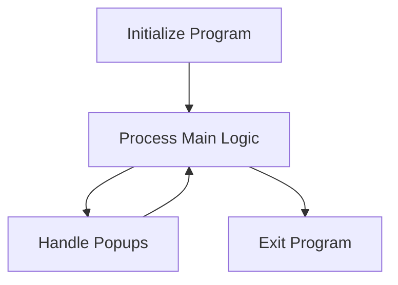

This document will cover the flow of the PAR001 program, which includes:

1. Initializing the program
2. Processing the main logic
3. Handling popups based on user input.

Technical document: <SwmLink doc-title="PAR001 Program Flow">[PAR001 Program Flow](/.swm/par001-program-flow.8e8vkquq.sw.md)</SwmLink>

# Initializing the Program

The initialization phase of the PAR001 program involves setting up the necessary parameters from the command line. This step ensures that the program has all the required inputs to start processing. The parameters might include user-specific settings, operational flags, or other configuration details that dictate how the program should run.

# Processing the Main Logic

Once the program is initialized, it enters the main processing loop. This loop continues to run until an exit condition is met. During this phase, the program evaluates various conditions and performs corresponding actions. These actions include:

- **Centralizing Data**: This step involves aggregating and organizing data from different sources to ensure consistency and accessibility.
- **Reading Input**: The program reads user inputs or data from other systems to proceed with the next steps.
- **Handling Popups**: Based on certain conditions, the program may need to display popups to the user for additional input or information.
- **Saving Parameters**: Any changes or updates to the parameters are saved to ensure they are available for future operations.
- **Clearing Flags**: After processing, the program clears any operational flags to reset the state for the next iteration.
- **Calling Dialog System**: This involves interacting with other systems or modules to perform specific tasks or retrieve information.

# Handling Popups

When a popup needs to be handled, the program evaluates the type of popup based on a specific field (`GS-CAMPO`). Each type of popup corresponds to a different user interaction or data entry requirement. For example:

- **Popup Type 1**: Might require the user to enter specific data related to their profile.
- **Popup Type 2**: Could be a confirmation dialog for a critical operation.
- **Popup Type 3**: Might involve selecting options from a list.

The program performs specific actions for each type of popup to ensure that the user input is correctly processed and the program can continue its operation.

&nbsp;

*This is an auto-generated document by Swimm AI 🌊 and has not yet been verified by a human*

<SwmMeta version="3.0.0" repo-id="Z2l0aHViJTNBJTNBa2VsbG8lM0ElM0Fzd2ltbWlv" repo-name="kello">Powered by [Swimm](/)</SwmMeta>
