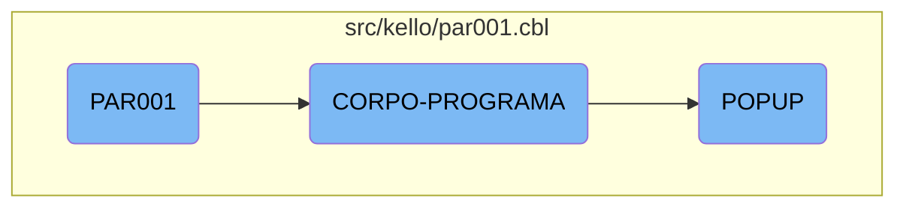

This document explains the flow of the <SwmToken path="src/kello/par001.cbl" pos="3:6:6" line-data="       PROGRAM-ID. PAR001.">`PAR001`</SwmToken> program, which is responsible for initializing the program, processing the main logic, and handling popups based on user input.

The flow starts with the initialization of the program where it accepts parameters from the command line. It then enters a loop where it continuously processes the main logic until an exit flag is set. During this loop, it evaluates different conditions and performs corresponding actions such as centralizing data, reading input, handling popups, saving parameters, and clearing flags. When a popup needs to be handled, it evaluates the type of popup and performs specific actions for each type.

# Flow drill down



<SwmSnippet path="/src/kello/par001.cbl" line="94">

---

## <SwmToken path="src/kello/par001.cbl" pos="3:6:6" line-data="       PROGRAM-ID. PAR001.">`PAR001`</SwmToken> Initialization and Main Processing Loop

The <SwmToken path="src/kello/par001.cbl" pos="3:6:6" line-data="       PROGRAM-ID. PAR001.">`PAR001`</SwmToken> function initializes the program by accepting parameters from the command line and then enters the main processing loop. The loop continues to execute <SwmToken path="src/kello/par001.cbl" pos="96:3:5" line-data="           PERFORM CORPO-PROGRAMA UNTIL GS-EXIT-FLG-TRUE.">`CORPO-PROGRAMA`</SwmToken> until the exit flag <SwmToken path="src/kello/par001.cbl" pos="96:9:15" line-data="           PERFORM CORPO-PROGRAMA UNTIL GS-EXIT-FLG-TRUE.">`GS-EXIT-FLG-TRUE`</SwmToken> is set.

```cobol
       MAIN-PROCESS SECTION.
           PERFORM INICIALIZA-PROGRAMA.
           PERFORM CORPO-PROGRAMA UNTIL GS-EXIT-FLG-TRUE.
           GO FINALIZAR-PROGRAMA.

       INICIALIZA-PROGRAMA SECTION.
           ACCEPT PARAMETROS-W FROM COMMAND-LINE.
```

---

</SwmSnippet>

<SwmSnippet path="/src/kello/par001.cbl" line="340">

---

## <SwmToken path="src/kello/par001.cbl" pos="340:1:3" line-data="       CORPO-PROGRAMA SECTION.">`CORPO-PROGRAMA`</SwmToken> Evaluation

The <SwmToken path="src/kello/par001.cbl" pos="340:1:3" line-data="       CORPO-PROGRAMA SECTION.">`CORPO-PROGRAMA`</SwmToken> function evaluates different conditions and performs corresponding actions. It centralizes data, reads input, handles popups, saves parameters, clears flags, and calls the dialog system based on the evaluation of various flags.

```cobol
       CORPO-PROGRAMA SECTION.
           EVALUATE TRUE
               WHEN GS-CENTRALIZA-TRUE
                   PERFORM CENTRALIZAR
               WHEN GS-LER-TRUE
                    PERFORM LER
               WHEN GS-POPUP-TRUE
                    PERFORM POPUP
               WHEN GS-SALVAR-TRUE
                    PERFORM SALVAR-PARAMETRIZACAO
           END-EVALUATE
           PERFORM CLEAR-FLAGS
           PERFORM CALL-DIALOG-SYSTEM.
```

---

</SwmSnippet>

<SwmSnippet path="/src/kello/par001.cbl" line="483">

---

### Handling Popups

The <SwmToken path="src/kello/par001.cbl" pos="483:1:1" line-data="       POPUP SECTION.">`POPUP`</SwmToken> function handles different popup scenarios based on the value of <SwmToken path="src/kello/par001.cbl" pos="484:3:5" line-data="           EVALUATE GS-CAMPO">`GS-CAMPO`</SwmToken>. It performs specific actions for each popup type, such as calling different subprograms to handle various data fields.

```cobol
       POPUP SECTION.
           EVALUATE GS-CAMPO
               WHEN "1"  PERFORM POPUP-CAMPO1
               WHEN "2"  PERFORM POPUP-CAMPO2
               WHEN "3"  PERFORM POPUP-CAMPO3
               WHEN "4"  PERFORM POPUP-CAMPO4
               WHEN "5"  PERFORM POPUP-CAMPO5
               WHEN "6"  PERFORM POPUP-CAMPO6
               WHEN "8"  PERFORM POPUP-CAMPO8
               WHEN "9"  PERFORM POPUP-CAMPO9
               WHEN "10" PERFORM POPUP-CAMPO10
               WHEN "11" PERFORM POPUP-CAMPO11
               WHEN "12" PERFORM POPUP-CAMPO12
           END-EVALUATE.
```

---

</SwmSnippet>

&nbsp;

*This is an auto-generated document by Swimm AI 🌊 and has not yet been verified by a human*

<SwmMeta version="3.0.0" repo-id="Z2l0aHViJTNBJTNBa2VsbG8lM0ElM0Fzd2ltbWlv" repo-name="kello"><sup>Powered by [Swimm](/)</sup></SwmMeta>
