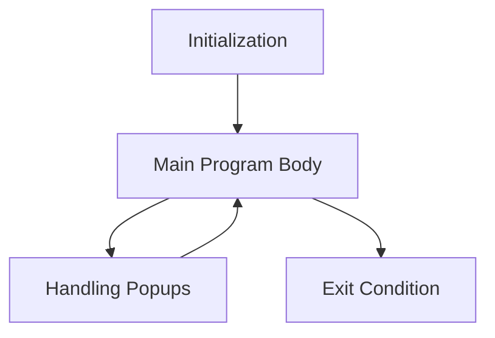

This document will cover the main processing flow of the PAR001 program, which includes:

1. Initialization of the program
2. Execution of the main program body
3. Handling of popups.

Technical document: <SwmLink doc-title="PAR001 Program Flow">[PAR001 Program Flow](/.swm/par001-program-flow.tyf370dq.sw.md)</SwmLink>

# Initialization of the Program

The initialization phase is the first step in the PAR001 program flow. During this phase, the program sets up all necessary parameters and configurations required for its operation. This includes loading initial data, setting default values, and preparing the environment for the main program body to execute. This step ensures that the program starts with a clean state and all necessary resources are available.

# Execution of the Main Program Body

The main program body is the core of the PAR001 program. It repeatedly executes a series of actions until an exit condition is met. These actions include:

1. **Centralizing Data**: This step involves aggregating and organizing data from various sources to ensure it is ready for processing.
2. **Reading Fields**: The program reads input fields to gather necessary information for further processing.
3. **Handling Popups**: If a popup condition is triggered, the program handles it by displaying the appropriate popup and performing the necessary actions based on user input.
4. **Saving Parameters**: The program saves any parameters or settings that need to be retained for future use.
5. **Clearing Flags**: After processing, the program clears any flags that were set during the execution to ensure a clean state for the next iteration.
6. **Calling the Dialog System**: The program interacts with the dialog system to manage user interactions and inputs.

# Handling of Popups

When a popup condition is triggered, the program evaluates the field value and performs the corresponding popup action. Each field value corresponds to a specific popup action, such as displaying a particular message or form. The program calls specific sections for each field value to handle the popup appropriately. This ensures that users receive the correct information or input form based on their actions, enhancing the user experience and ensuring accurate data collection.

&nbsp;

*This is an auto-generated document by Swimm AI 🌊 and has not yet been verified by a human*

<SwmMeta version="3.0.0" repo-id="Z2l0aHViJTNBJTNBa2VsbG8lM0ElM0Fzd2ltbWlv" repo-name="kello">Powered by [Swimm](/)</SwmMeta>
