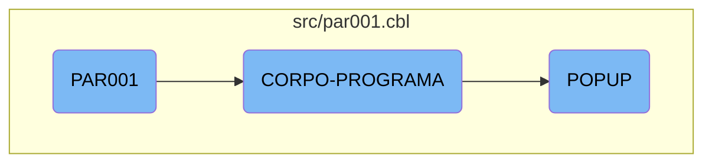

This document explains the main processing flow of the <SwmToken path="src/par001.cbl" pos="3:6:6" line-data="       PROGRAM-ID. PAR001.">`PAR001`</SwmToken> program. It covers the initialization, the main program body, and the handling of popups.

The flow starts with the initialization of the program, followed by repeatedly executing the main program body until an exit condition is met. The main program body evaluates different conditions and performs corresponding actions such as centralizing data, reading fields, handling popups, saving parameters, clearing flags, and calling the dialog system. When handling popups, the program evaluates the field value and performs the corresponding popup action by calling specific sections for each field value.

# Flow drill down



<SwmSnippet path="/src/par001.cbl" line="94">

---

## Main Processing Flow

The main processing flow starts with the <SwmToken path="src/par001.cbl" pos="94:1:3" line-data="       MAIN-PROCESS SECTION.">`MAIN-PROCESS`</SwmToken> section, which initializes the program and then repeatedly performs the <SwmToken path="src/par001.cbl" pos="96:3:5" line-data="           PERFORM CORPO-PROGRAMA UNTIL GS-EXIT-FLG-TRUE.">`CORPO-PROGRAMA`</SwmToken> section until the exit flag is set.

```cobol
       MAIN-PROCESS SECTION.
           PERFORM INICIALIZA-PROGRAMA.
           PERFORM CORPO-PROGRAMA UNTIL GS-EXIT-FLG-TRUE.
```

---

</SwmSnippet>

<SwmSnippet path="/src/par001.cbl" line="340">

---

## <SwmToken path="src/par001.cbl" pos="340:1:3" line-data="       CORPO-PROGRAMA SECTION.">`CORPO-PROGRAMA`</SwmToken> Section

The <SwmToken path="src/par001.cbl" pos="340:1:3" line-data="       CORPO-PROGRAMA SECTION.">`CORPO-PROGRAMA`</SwmToken> section evaluates different conditions and performs corresponding actions such as centralizing data, reading fields, handling popups, saving parameters, clearing flags, and calling the dialog system.

```cobol
       CORPO-PROGRAMA SECTION.
           EVALUATE TRUE
               WHEN GS-CENTRALIZA-TRUE
                   PERFORM CENTRALIZAR
               WHEN GS-LER-TRUE
                    PERFORM LER
               WHEN GS-POPUP-TRUE
                    PERFORM POPUP
               WHEN GS-SALVAR-TRUE
                    PERFORM SALVAR-PARAMETRIZACAO
           END-EVALUATE
           PERFORM CLEAR-FLAGS
           PERFORM CALL-DIALOG-SYSTEM.
```

---

</SwmSnippet>

<SwmSnippet path="/src/par001.cbl" line="483">

---

### Handling Popups

The <SwmToken path="src/par001.cbl" pos="483:1:1" line-data="       POPUP SECTION.">`POPUP`</SwmToken> section evaluates the field value and performs the corresponding popup action by calling specific sections like <SwmToken path="src/par001.cbl" pos="485:9:11" line-data="               WHEN &quot;1&quot;  PERFORM POPUP-CAMPO1">`POPUP-CAMPO1`</SwmToken>, <SwmToken path="src/par001.cbl" pos="486:9:11" line-data="               WHEN &quot;2&quot;  PERFORM POPUP-CAMPO2">`POPUP-CAMPO2`</SwmToken>, etc.

```cobol
       POPUP SECTION.
           EVALUATE GS-CAMPO
               WHEN "1"  PERFORM POPUP-CAMPO1
               WHEN "2"  PERFORM POPUP-CAMPO2
               WHEN "3"  PERFORM POPUP-CAMPO3
               WHEN "4"  PERFORM POPUP-CAMPO4
               WHEN "5"  PERFORM POPUP-CAMPO5
               WHEN "6"  PERFORM POPUP-CAMPO6
               WHEN "8"  PERFORM POPUP-CAMPO8
               WHEN "9"  PERFORM POPUP-CAMPO9
               WHEN "10" PERFORM POPUP-CAMPO10
               WHEN "11" PERFORM POPUP-CAMPO11
               WHEN "12" PERFORM POPUP-CAMPO12
           END-EVALUATE.
```

---

</SwmSnippet>

&nbsp;

*This is an auto-generated document by Swimm AI 🌊 and has not yet been verified by a human*

<SwmMeta version="3.0.0" repo-id="Z2l0aHViJTNBJTNBa2VsbG8lM0ElM0Fzd2ltbWlv" repo-name="kello"><sup>Powered by [Swimm](/)</sup></SwmMeta>
