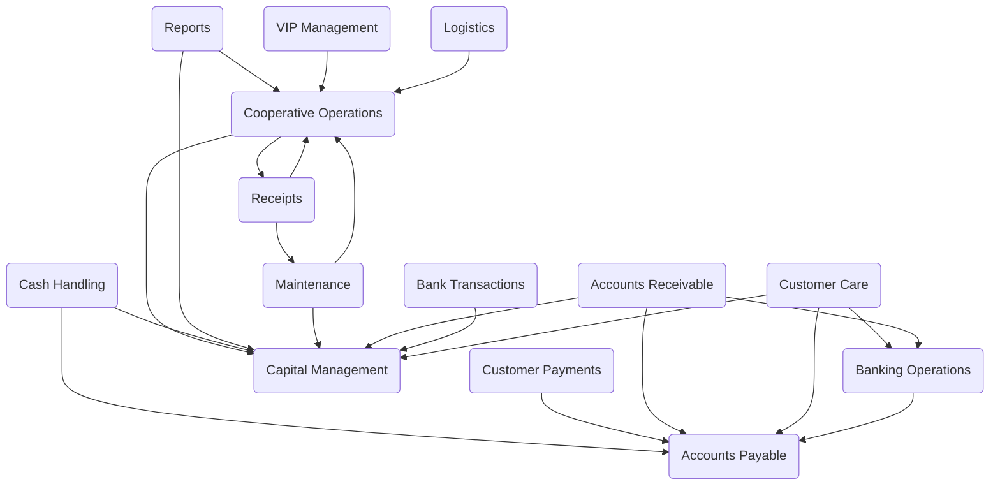

Kello is a CRM-like application that manages business operations, generates automatic reports, handles bank-specific EDI transactions, and creates standard SBP payment slips.

## Main Components

### VIP Management

VIP Management refers to the suite of COBOL programs designed to handle various aspects of video management, including planning, reporting, receiving raw tapes, listing existing tapes, inserting video copies, and maintaining tape locations. These programs facilitate the organization, processing, and reporting of video-related data within the system.

### Accounts Payable

Accounts Payable refers to the management of a company's short-term debt obligations to its creditors or suppliers. It involves tracking invoices, ensuring timely payments, and maintaining accurate records of amounts owed. This function is crucial for maintaining good supplier relationships and managing cash flow effectively.

- **Flows**
  - <SwmLink doc-title="Overview of the cxp100 program">[Overview of the cxp100 program](.swm/overview-of-the-cxp100-program.3z8gmyah.sw.md)</SwmLink>
  - <SwmLink doc-title="Cxp100 program flow">[Cxp100 program flow](.swm/cxp100-program-flow.iul7hivo.sw.md)</SwmLink>
  - <SwmLink doc-title="Cxp100 program flow">[Cxp100 program flow](.swm/cxp100-program-flow.6brv6pcf.sw.md)</SwmLink>
  - <SwmLink doc-title="Par001 program flow">[Par001 program flow](.swm/par001-program-flow.oui2g4fp.sw.md)</SwmLink>
  - <SwmLink doc-title="Overview of cgp001 program">[Overview of cgp001 program](.swm/overview-of-cgp001-program.fhs4sa1h.sw.md)</SwmLink>

### Accounts Receivable

Accounts Receivable refers to the outstanding invoices a company has or the money clients owe the company. It represents a line of credit extended by a company and is treated as a current asset on the balance sheet. The primary function of Accounts Receivable is to manage and track the money that is due to the company from its customers, ensuring timely collection and accurate financial reporting.

### Reports

Reports are automatically generated documents that provide detailed information about various business operations. They are created using specific COBOL functions and sections, such as REP206 and GRAVAR-DADOS-REPORTAGEM, which handle data initialization, processing, and error handling. These reports are essential for tracking and analyzing business activities, ensuring accurate and efficient management.

### Branch Operations

Branch operations refer to the various functionalities and processes related to managing different branches within the Kello Imagens system. These operations include handling transactions, generating reports, and managing branch-specific data. The source files in the 'src/galho' directory contain COBOL programs that implement these functionalities, ensuring smooth and efficient branch management.

### Banking Operations

Banking operations refer to the functionalities that handle financial transactions and processes within the system. This includes generating bank-specific EDI transactions and standard SBP payment slips, which are essential for automating and managing financial workflows efficiently.

### Maintenance

Maintenance refers to the ongoing process of updating, fixing, and improving the system to ensure its optimal performance and reliability. This includes tasks such as bug fixes, code refactoring, updating dependencies, and implementing new features or enhancements.

- <SwmLink doc-title="Overview of mtp001 program">[Overview of mtp001 program](.swm/overview-of-mtp001-program.b0u6cd7p.sw.md)</SwmLink>

### Kello Core

Kello Core refers to the fundamental components and functionalities of the Kello Imagens system. It includes the essential modules and routines written in COBOL-85 that handle the core business operations, such as customer relationship management, report generation, and financial transactions. These core components are crucial for the system's overall performance and reliability, ensuring that the primary business processes are executed efficiently and accurately.

- **Flows**
  - <SwmLink doc-title="Overview of chp010a program">[Overview of chp010a program](.swm/overview-of-chp010a-program.33lys0a2.sw.md)</SwmLink>
  - <SwmLink doc-title="Flow and functionality of cpp020b">[Flow and functionality of cpp020b](.swm/flow-and-functionality-of-cpp020b.wm0yvmq7.sw.md)</SwmLink>
  - <SwmLink doc-title="Crp020b function overview">[Crp020b function overview](.swm/crp020b-function-overview.mdr8f3kv.sw.md)</SwmLink>
  - <SwmLink doc-title="Managing accounts payable">[Managing accounts payable](.swm/managing-accounts-payable.onjojita.sw.md)</SwmLink>
  - <SwmLink doc-title="Overview of the crp020a function">[Overview of the crp020a function](.swm/overview-of-the-crp020a-function.6e46fgb6.sw.md)</SwmLink>
  - <SwmLink doc-title="Overview of corpo programa flow">[Overview of corpo programa flow](.swm/overview-of-corpo-programa-flow.4pa4d4lf.sw.md)</SwmLink>
  - <SwmLink doc-title="Overview of the acp100 process">[Overview of the acp100 process](.swm/overview-of-the-acp100-process.yl189tgu.sw.md)</SwmLink>
  - <SwmLink doc-title="Overview of the cop040 program">[Overview of the cop040 program](.swm/overview-of-the-cop040-program.v9cpi9t3.sw.md)</SwmLink>
  - <SwmLink doc-title="Cxp100 program flow">[Cxp100 program flow](.swm/cxp100-program-flow.833vwp7h.sw.md)</SwmLink>
  - <SwmLink doc-title="Cxp100 program flow">[Cxp100 program flow](.swm/cxp100-program-flow.btsgw9hd.sw.md)</SwmLink>
  - <SwmLink doc-title="Cxp100 program flow">[Cxp100 program flow](.swm/cxp100-program-flow.cn8njmpo.sw.md)</SwmLink>
  - <SwmLink doc-title="Par001 program flow">[Par001 program flow](.swm/par001-program-flow.0qh0x08m.sw.md)</SwmLink>
  - <SwmLink doc-title="Mtp001 program flow">[Mtp001 program flow](.swm/mtp001-program-flow.awv9eekv.sw.md)</SwmLink>
  - <SwmLink doc-title="Overview of mtp021 function">[Overview of mtp021 function](.swm/overview-of-mtp021-function.wo7xx2yg.sw.md)</SwmLink>
  - <SwmLink doc-title="Overview of cpp020 program">[Overview of cpp020 program](.swm/overview-of-cpp020-program.2pbsulv2.sw.md)</SwmLink>
  - <SwmLink doc-title="Overview of cgp001 program flow">[Overview of cgp001 program flow](.swm/overview-of-cgp001-program-flow.2el760o7.sw.md)</SwmLink>
  - <SwmLink doc-title="Cpp022a program flow">[Cpp022a program flow](.swm/cpp022a-program-flow.dwpewfkt.sw.md)</SwmLink>
  - <SwmLink doc-title="Flow of the cdcp110 program">[Flow of the cdcp110 program](.swm/flow-of-the-cdcp110-program.fxq6oczn.sw.md)</SwmLink>
  - <SwmLink doc-title="Prp101 program flow">[Prp101 program flow](.swm/prp101-program-flow.8yszcosu.sw.md)</SwmLink>
  - <SwmLink doc-title="Cop104 program flow">[Cop104 program flow](.swm/cop104-program-flow.718gl2b0.sw.md)</SwmLink>
  - <SwmLink doc-title="Overview of cop104 section">[Overview of cop104 section](.swm/overview-of-cop104-section.avtpyjke.sw.md)</SwmLink>
  - <SwmLink doc-title="Cop104 flow overview">[Cop104 flow overview](.swm/cop104-flow-overview.gin8r2rr.sw.md)</SwmLink>
  - <SwmLink doc-title="Overview of cop104 program">[Overview of cop104 program](.swm/overview-of-cop104-program.xibcwz7y.sw.md)</SwmLink>
  - <SwmLink doc-title="Overview of cop104 program">[Overview of cop104 program](.swm/overview-of-cop104-program.rrvlwtbi.sw.md)</SwmLink>
  - <SwmLink doc-title="Rcp100 program flow overview">[Rcp100 program flow overview](.swm/rcp100-program-flow-overview.ldqv2hc3.sw.md)</SwmLink>
  - <SwmLink doc-title="Overview of main process">[Overview of main process](.swm/overview-of-main-process.qpfyhxrm.sw.md)</SwmLink>
  - <SwmLink doc-title="Overview of the cgp010 flow">[Overview of the cgp010 flow](.swm/overview-of-the-cgp010-flow.eieiqj82.sw.md)</SwmLink>
  - <SwmLink doc-title="Overview of rcp203 program">[Overview of rcp203 program](.swm/overview-of-rcp203-program.by2kcin4.sw.md)</SwmLink>
  - <SwmLink doc-title="Overview of cgp010">[Overview of cgp010](.swm/overview-of-cgp010.pz8hmucs.sw.md)</SwmLink>

### Alterations

Alterations refer to modifications or updates made to the system's functionality or data processing. These changes are implemented in various COBOL source files located in the 'src/alt' directory, ensuring the system remains up-to-date and meets evolving business requirements.

### Logistics

Logistics refers to the detailed coordination and implementation of complex operations involving the movement, storage, and flow of goods, services, and information from the point of origin to the point of consumption. It encompasses activities such as transportation, warehousing, inventory management, order fulfillment, and supply chain management to ensure that resources are efficiently and effectively distributed.

### Cooperative Operations

Cooperative Operations refer to the collaborative processes and functionalities within the Kello Imagens system that enable different parts of the application to work together seamlessly. These operations are essential for ensuring that various business processes, such as report generation, EDI transactions, and payment slip generation, are executed efficiently and accurately. The src/cop directory contains numerous COBOL source files that implement these cooperative operations, highlighting their importance in the overall system architecture.

- <SwmLink doc-title="Overview of cop104 program">[Overview of cop104 program](.swm/overview-of-cop104-program.ku3m4szn.sw.md)</SwmLink>
- <SwmLink doc-title="Overview of cop104 program">[Overview of cop104 program](.swm/overview-of-cop104-program.mv1domyk.sw.md)</SwmLink>
- <SwmLink doc-title="Cop104 program flow">[Cop104 program flow](.swm/cop104-program-flow.vxgqx9nb.sw.md)</SwmLink>
- <SwmLink doc-title="Overview of cop104 program">[Overview of cop104 program](.swm/overview-of-cop104-program.ebjx7sbg.sw.md)</SwmLink>
- <SwmLink doc-title="Overview of cop104 program">[Overview of cop104 program](.swm/overview-of-cop104-program.mj2ojohz.sw.md)</SwmLink>
- <SwmLink doc-title="Cop040 process overview">[Cop040 process overview](.swm/cop040-process-overview.bbw5icym.sw.md)</SwmLink>

### Customer Care

Customer Care refers to the set of functionalities and processes designed to manage and support customer interactions and relationships. It includes handling customer inquiries, resolving issues, and ensuring customer satisfaction through effective communication and service.

### Customer Payments

Customer Payments refer to the functionality that handles the processing of payments made by customers. This includes generating payment slips, managing electronic data interchange (EDI) transactions with banks, and ensuring that payments are recorded and processed accurately within the system.

### Receipts

Receipts are documents generated to acknowledge the receipt of payment. They serve as proof of transaction and are essential for record-keeping and financial tracking within the system.

- <SwmLink doc-title="Rcp203 program flow">[Rcp203 program flow](.swm/rcp203-program-flow.mlm4lqu3.sw.md)</SwmLink>

### Capital Management

Capital Management refers to the processes and strategies that a business uses to manage its financial resources effectively. This includes planning, controlling, and monitoring financial resources to achieve organizational goals, ensure liquidity, and maximize profitability. It involves activities such as budgeting, forecasting, investment analysis, and risk management.

### Accounts Control

Accounts Control refers to the management and oversight of financial accounts within the Kello Imagens system. It involves handling various operations such as account creation, modification, and deletion, as well as ensuring the accuracy and integrity of account data. This functionality is crucial for maintaining organized and accurate financial records, facilitating transactions, and generating financial reports.

- **Flows**
  - <SwmLink doc-title="Overview of corpo programa">[Overview of corpo programa](.swm/overview-of-corpo-programa.hil87nm7.sw.md)</SwmLink>
  - <SwmLink doc-title="Overview of acp100 process">[Overview of acp100 process](.swm/overview-of-acp100-process.739358n8.sw.md)</SwmLink>

### Cash Handling

Cash handling refers to the processes involved in receiving, counting, recording, and safeguarding cash transactions. It includes activities such as cash collection, cash disbursement, and ensuring the accuracy and security of cash operations.

- <SwmLink doc-title="Cdcp110 program flow">[Cdcp110 program flow](.swm/cdcp110-program-flow.kmy69wwv.sw.md)</SwmLink>

### Bank Transactions

Bank transactions refer to the electronic exchange of money between banks and their customers. These transactions include various operations such as deposits, withdrawals, transfers, and payments. In Kello Imagens, bank transactions are managed through specific COBOL programs that handle the communication and data exchange with different banks, ensuring accurate and efficient processing of financial operations.

### Flows

- <SwmLink doc-title="Overview of chp010a function">[Overview of chp010a function](.swm/overview-of-chp010a-function.9ax0b29a.sw.md)</SwmLink>
- <SwmLink doc-title="Cpp020b program overview">[Cpp020b program overview](.swm/cpp020b-program-overview.rzzy4jyq.sw.md)</SwmLink>
- <SwmLink doc-title="Flow and functionality of cpp020a">[Flow and functionality of cpp020a](.swm/flow-and-functionality-of-cpp020a.lsk5ppq7.sw.md)</SwmLink>
- <SwmLink doc-title="Overview of crp020b">[Overview of crp020b](.swm/overview-of-crp020b.17k7yud1.sw.md)</SwmLink>
- <SwmLink doc-title="Overview of the crp020a function">[Overview of the crp020a function](.swm/overview-of-the-crp020a-function.zi7uxcrl.sw.md)</SwmLink>
- <SwmLink doc-title="Overview of mtp021 flow">[Overview of mtp021 flow](.swm/overview-of-mtp021-flow.wi5vohcb.sw.md)</SwmLink>
- <SwmLink doc-title="Overview of the cpp020 process">[Overview of the cpp020 process](.swm/overview-of-the-cpp020-process.jbx57cia.sw.md)</SwmLink>
- <SwmLink doc-title="Overview of the cpp022a program">[Overview of the cpp022a program](.swm/overview-of-the-cpp022a-program.tlx65j9p.sw.md)</SwmLink>
- <SwmLink doc-title="Main process flow">[Main process flow](.swm/main-process-flow.bt4fv9d7.sw.md)</SwmLink>
- <SwmLink doc-title="Rcp100 program overview">[Rcp100 program overview](.swm/rcp100-program-overview.7skk3k18.sw.md)</SwmLink>

&nbsp;

*This is an auto-generated document by Swimm AI 🌊 and has not yet been verified by a human*

<SwmMeta version="3.0.0" repo-id="Z2l0aHViJTNBJTNBa2VsbG8lM0ElM0Fzd2ltbWlv" repo-name="kello" doc-type="other">Powered by [Swimm](/)</SwmMeta>
