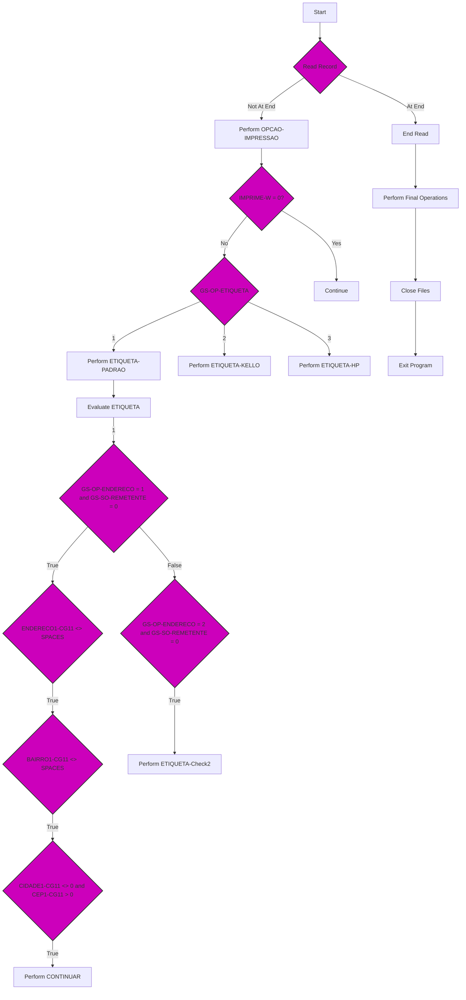

This document will cover the program defined in <SwmPath>[src/cgp020t.CBL](/src/cgp020t.CBL)</SwmPath>. We'll cover:

1. What the Program Does
2. Program Flow
3. Program Sections

# What the Program Does

The program <SwmToken path="/src/cgp020t.CBL" pos="3:6:6" line-data="       PROGRAM-ID. CGP020T.">`CGP020T`</SwmToken> is designed to provide a pop-up consultation for credit card registration. It initializes necessary data structures, handles user interactions through a graphical interface, and processes data related to credit card registrations. The program reads from a file, processes the data, and displays the results in a user-friendly manner.

# Visualizing the flow



# Breakdown of the Program

<SwmSnippet path="/src/cgp020t.CBL" line="41">

---

## Initialization

The program starts by performing the <SwmToken path="/src/cgp020t.CBL" pos="53:3:5" line-data="           PERFORM INICIALIZA-PROGRAMA.">`INICIALIZA-PROGRAMA`</SwmToken> section, which initializes various data blocks and opens the input file <SwmToken path="/src/cgp020t.CBL" pos="29:5:5" line-data="           05  ST-CGD020             PIC XX       VALUE SPACES.">`CGD020`</SwmToken>. If the file cannot be opened, an error message is displayed.

```cobol
       77 janelaPrincipal              object reference.
       77 handle8                      pic 9(08) comp-x value zeros.
       77 wHandle                      pic 9(09) comp-5 value zeros.

       LINKAGE SECTION.
       01  STRING-1               PIC X(65) VALUE SPACES.

           COPY "PARAMETR".

       PROCEDURE DIVISION USING PARAMETROS-W STRING-1.

       MAIN-PROCESS SECTION.
           PERFORM INICIALIZA-PROGRAMA.
           PERFORM CORPO-PROGRAMA UNTIL GS-EXIT-FLG-TRUE.
           GO FINALIZAR-PROGRAMA.

       INICIALIZA-PROGRAMA SECTION.
           MOVE "00" TO STRING-1(33: 2).
           INITIALIZE GS-DATA-BLOCK
           INITIALIZE DS-CONTROL-BLOCK
           MOVE GS-DATA-BLOCK-VERSION-NO
```

---

</SwmSnippet>

<SwmSnippet path="src/cgp020t.CBL" line="74">

---

## Main Loop&nbsp;

The main loop of the program is controlled by the <SwmToken path="/src/cgp020t.CBL" pos="74:1:3" line-data="       CORPO-PROGRAMA SECTION.">`CORPO-PROGRAMA`</SwmToken> section, which continues to execute until the <SwmToken path="/src/cgp020t.CBL" pos="54:9:15" line-data="           PERFORM CORPO-PROGRAMA UNTIL GS-EXIT-FLG-TRUE.">`GS-EXIT-FLG-TRUE`</SwmToken> flag is set.

```
       CORPO-PROGRAMA SECTION.
           EVALUATE TRUE
               WHEN GS-CENTRALIZA-TRUE
                    PERFORM CENTRALIZAR
               WHEN GS-CARREGA-LIST-BOX-TRUE
                    PERFORM CARREGA-ULTIMOS
               WHEN GS-ITEM-SELECIONADO-TRUE
                    PERFORM ITEM-SELECIONADO
           END-EVALUATE.
           PERFORM CLEAR-FLAGS.
           PERFORM CALL-DIALOG-SYSTEM.
```

---

</SwmSnippet>

<SwmSnippet path="/src/cgp020t.CBL" line="63">

---

### Processing User Actions

Within the main loop, the program evaluates various conditions and performs corresponding actions such as centralizing the window, loading the latest data, or handling item selection.

```cobol
           MOVE GS-VERSION-NO  TO DS-VERSION-NO
           MOVE EMPRESA-W          TO EMP-REC
           MOVE "CGD020"  TO ARQ-REC. MOVE EMPRESA-REF TO PATH-CGD020.
           OPEN INPUT CGD020
           IF ST-CGD020 <> "00"
              MOVE "ERRO ABERTURA CGD020: "  TO GS-MENSAGEM-ERRO
              MOVE ST-CGD020 TO GS-MENSAGEM-ERRO(23: 02)
              PERFORM LOAD-SCREENSET
              PERFORM CARREGA-MENSAGEM-ERRO
           ELSE PERFORM LOAD-SCREENSET.

```

---

</SwmSnippet>

<SwmSnippet path="/src/cgp020t.CBL" line="119">

---

### Finalization

The program concludes by performing the <SwmToken path="/src/cgp020t.CBL" pos="55:3:5" line-data="           GO FINALIZAR-PROGRAMA.">`FINALIZAR-PROGRAMA`</SwmToken> section, which closes the input file and performs any necessary cleanup operations.

```cobol
           IF CODIGO-W = SPACES MOVE ZEROS TO STRING-1(33: 2).
       CLEAR-FLAGS SECTION.
           INITIALIZE GS-FLAG-GROUP.

```

---

</SwmSnippet>

<SwmSnippet path="/src/cgp020t.CBL" line="1">

---

## Identification Division

This section provides metadata about the program, including the program ID (<SwmToken path="/src/cgp020t.CBL" pos="3:6:6" line-data="       PROGRAM-ID. CGP020T.">`CGP020T`</SwmToken>), author, date, and a brief description of the program's function.

```cobol
       COPY DSLANG.CPY.
       IDENTIFICATION DIVISION.
       PROGRAM-ID. CGP020T.
      * AUTORA: ALFREDO SAVIOLLI NETO
      * DATA: 28/03/2005
      * FUNCAO: CONSULTA POP-UP CADASTRO DE CARTÃO DE CRÉDITOS
       ENVIRONMENT DIVISION.
```

---

</SwmSnippet>

<SwmSnippet path="/src/cgp020t.CBL" line="8">

---

## Environment Division

This section specifies the environment in which the program runs, including special names and class controls.

```cobol
       SPECIAL-NAMES.
       DECIMAL-POINT IS COMMA.
       class-control.
           Window             is class "wclass".

```

---

</SwmSnippet>

<SwmSnippet path="/src/cgp020t.CBL" line="13">

---

## <SwmToken path="/src/cgp020t.CBL" pos="13:1:3" line-data="       INPUT-OUTPUT SECTION.">`INPUT-OUTPUT`</SwmToken> Section

This section includes file control entries, specifying the files used by the program.

```cobol
       INPUT-OUTPUT SECTION.
       FILE-CONTROL.
           COPY CGPX020.
```

---

</SwmSnippet>

<SwmSnippet path="/src/cgp020t.CBL" line="16">

---

## Data Division

This section defines the data structures used in the program, including file sections, <SwmToken path="/src/cgp020t.CBL" pos="20:1:3" line-data="       WORKING-STORAGE SECTION.">`WORKING-STORAGE`</SwmToken> sections, and linkage sections.

```cobol

       DATA DIVISION.
       FILE SECTION.
       COPY CGPW020.
       WORKING-STORAGE SECTION.
           COPY "CGP020T.CPB".
           COPY "CGP020T.CPY".
           COPY "DS-CNTRL.MF".
           COPY "DSSYSINF.CPY".
           05  DEVOLVE-HISTORICO   PIC X(30)  VALUE SPACES.
       78  REFRESH-TEXT-AND-DATA-PROC VALUE 255.
       77  DISPLAY-ERROR-NO          PIC 9(4).
       01  VARIAVEIS.
           05  ST-CGD020             PIC XX       VALUE SPACES.
           05  LIN-DETALHE-W         PIC X(30)    VALUE SPACES.
           05  EMP-REFERENCIA.
               10  FILLER            PIC X(15)
                   VALUE "\PROGRAMA\KELLO".
               10  VAR1              PIC X VALUE "\".
               10  EMP-REC           PIC XXX.
               10  VAR2              PIC X VALUE "\".
```

---

</SwmSnippet>

<SwmSnippet path="/src/cgp020t.CBL" line="39">

---

## Procedure Division&nbsp;

This section contains the executable code of the program, organized into various sections such as <SwmToken path="/src/cgp020t.CBL" pos="52:1:3" line-data="       MAIN-PROCESS SECTION.">`MAIN-PROCESS`</SwmToken>, <SwmToken path="/src/cgp020t.CBL" pos="57:1:3" line-data="       INICIALIZA-PROGRAMA SECTION.">`INICIALIZA-PROGRAMA`</SwmToken>, <SwmToken path="/src/cgp020t.CBL" pos="74:1:3" line-data="       CORPO-PROGRAMA SECTION.">`CORPO-PROGRAMA`</SwmToken>, and <SwmToken path="/src/cgp020t.CBL" pos="138:1:3" line-data="       FINALIZAR-PROGRAMA SECTION.">`FINALIZAR-PROGRAMA`</SwmToken>.

```cobol
           05  CODIGO-W              PIC X(2)   VALUE SPACES.

       77 janelaPrincipal              object reference.
       77 handle8                      pic 9(08) comp-x value zeros.
       77 wHandle                      pic 9(09) comp-5 value zeros.

       LINKAGE SECTION.
       01  STRING-1               PIC X(65) VALUE SPACES.

           COPY "PARAMETR".

       PROCEDURE DIVISION USING PARAMETROS-W STRING-1.

       MAIN-PROCESS SECTION.
           PERFORM INICIALIZA-PROGRAMA.
           PERFORM CORPO-PROGRAMA UNTIL GS-EXIT-FLG-TRUE.
           GO FINALIZAR-PROGRAMA.

       INICIALIZA-PROGRAMA SECTION.
           MOVE "00" TO STRING-1(33: 2).
           INITIALIZE GS-DATA-BLOCK
```

---

</SwmSnippet>

&nbsp;

*This is an auto-generated document by Swimm AI 🌊 and has not yet been verified by a human*

<SwmMeta version="3.0.0" repo-id="Z2l0aHViJTNBJTNBa2VsbG8lM0ElM0Fzd2ltbWlv" repo-name="kello"><sup>Powered by [Swimm](https://app.swimm.io/)</sup></SwmMeta>
