In this document, we will explain the flow of the <SwmToken path="src/kello/prp101.cbl" pos="3:6:6" line-data="       PROGRAM-ID. PRP101.">`PRP101`</SwmToken> program. The <SwmToken path="src/kello/prp101.cbl" pos="3:6:6" line-data="       PROGRAM-ID. PRP101.">`PRP101`</SwmToken> program is responsible for initializing the system, verifying codes and dates, and printing planning and instruction data.

The flow starts with the initialization of the program. Once initialized, the main program loop is executed, which evaluates different conditions and performs corresponding actions such as verifying codes and dates. If the codes and dates are valid, the program proceeds to print the planning data. Finally, it prints the instruction data, completing the flow.

# Flow drill down

```mermaid
graph TD;
      subgraph src/kello/prp101.cbl
0240270b4dd8bb19cfe988bb2f591bce9f4e984165e2e60d8ca66a344fcd90df(PRP101):::mainFlowStyle --> 8bdb8e79371f1cdce2ff6f80ccb22113026a15074e6c46ded9ef6f1c88efba40(CORPO-PROGRAMA):::mainFlowStyle
end

subgraph src/kello/prp101.cbl
8bdb8e79371f1cdce2ff6f80ccb22113026a15074e6c46ded9ef6f1c88efba40(CORPO-PROGRAMA):::mainFlowStyle --> 6c720462ea5d25f6b2371fd7fc2b7d81676f9967e48efa26500044acbc0493f4(VERIFICA-CODIGO):::mainFlowStyle
end

subgraph src/kello/prp101.cbl
6c720462ea5d25f6b2371fd7fc2b7d81676f9967e48efa26500044acbc0493f4(VERIFICA-CODIGO):::mainFlowStyle --> f3e6877892e68571334d39e73ebffcf96b2ebb1214530770028a4f6e8371fd22(VERIFICA-DATA):::mainFlowStyle
end

subgraph src/kello/prp101.cbl
f3e6877892e68571334d39e73ebffcf96b2ebb1214530770028a4f6e8371fd22(VERIFICA-DATA):::mainFlowStyle --> a9c5d5cffb5a52071ce35bf7fe14ab2c209e83167eba19cdd5fc0959ab8311d1(IMPRIME-PLANEJAMENTO):::mainFlowStyle
end

subgraph src/kello/prp101.cbl
a9c5d5cffb5a52071ce35bf7fe14ab2c209e83167eba19cdd5fc0959ab8311d1(IMPRIME-PLANEJAMENTO):::mainFlowStyle --> 8b114e37d89f7c525b84d1e3d023ddc3395a9e6ed8c1a737db38e8ca3dd58f04(IMPRIME-DADOS-INSTRUCOES):::mainFlowStyle
end


      classDef mainFlowStyle color:#000000,fill:#7CB9F4
classDef rootsStyle color:#000000,fill:#00FFF4
classDef Style1 color:#000000,fill:#00FFAA
classDef Style2 color:#000000,fill:#FFFF00
classDef Style3 color:#000000,fill:#AA7CB9

%% Swimm:
%% graph TD;
%%       subgraph <SwmPath>[src/kello/prp101.cbl](src/kello/prp101.cbl)</SwmPath>
%% 0240270b4dd8bb19cfe988bb2f591bce9f4e984165e2e60d8ca66a344fcd90df(PRP101):::mainFlowStyle --> 8bdb8e79371f1cdce2ff6f80ccb22113026a15074e6c46ded9ef6f1c88efba40(CORPO-PROGRAMA):::mainFlowStyle
%% end
%% 
%% subgraph <SwmPath>[src/kello/prp101.cbl](src/kello/prp101.cbl)</SwmPath>
%% 8bdb8e79371f1cdce2ff6f80ccb22113026a15074e6c46ded9ef6f1c88efba40(CORPO-PROGRAMA):::mainFlowStyle --> 6c720462ea5d25f6b2371fd7fc2b7d81676f9967e48efa26500044acbc0493f4(VERIFICA-CODIGO):::mainFlowStyle
%% end
%% 
%% subgraph <SwmPath>[src/kello/prp101.cbl](src/kello/prp101.cbl)</SwmPath>
%% 6c720462ea5d25f6b2371fd7fc2b7d81676f9967e48efa26500044acbc0493f4(VERIFICA-CODIGO):::mainFlowStyle --> f3e6877892e68571334d39e73ebffcf96b2ebb1214530770028a4f6e8371fd22(VERIFICA-DATA):::mainFlowStyle
%% end
%% 
%% subgraph <SwmPath>[src/kello/prp101.cbl](src/kello/prp101.cbl)</SwmPath>
%% f3e6877892e68571334d39e73ebffcf96b2ebb1214530770028a4f6e8371fd22(VERIFICA-DATA):::mainFlowStyle --> a9c5d5cffb5a52071ce35bf7fe14ab2c209e83167eba19cdd5fc0959ab8311d1(IMPRIME-PLANEJAMENTO):::mainFlowStyle
%% end
%% 
%% subgraph <SwmPath>[src/kello/prp101.cbl](src/kello/prp101.cbl)</SwmPath>
%% a9c5d5cffb5a52071ce35bf7fe14ab2c209e83167eba19cdd5fc0959ab8311d1(IMPRIME-PLANEJAMENTO):::mainFlowStyle --> 8b114e37d89f7c525b84d1e3d023ddc3395a9e6ed8c1a737db38e8ca3dd58f04(IMPRIME-DADOS-INSTRUCOES):::mainFlowStyle
%% end
%% 
%% 
%%       classDef mainFlowStyle color:#000000,fill:#7CB9F4
%% classDef rootsStyle color:#000000,fill:#00FFF4
%% classDef Style1 color:#000000,fill:#00FFAA
%% classDef Style2 color:#000000,fill:#FFFF00
%% classDef Style3 color:#000000,fill:#AA7CB9
```



<SwmSnippet path="/src/kello/prp101.cbl" line="558">

---

## <SwmToken path="src/kello/prp101.cbl" pos="3:6:6" line-data="       PROGRAM-ID. PRP101.">`PRP101`</SwmToken>

The <SwmToken path="src/kello/prp101.cbl" pos="3:6:6" line-data="       PROGRAM-ID. PRP101.">`PRP101`</SwmToken> function initializes the program and then performs the main program loop by calling <SwmToken path="src/kello/prp101.cbl" pos="560:3:5" line-data="           PERFORM CORPO-PROGRAMA UNTIL GS-EXIT-FLG-TRUE.">`CORPO-PROGRAMA`</SwmToken> until a specific exit flag is set.

```cobol
       MAIN-PROCESS SECTION.
           PERFORM INICIALIZA-PROGRAMA.
           PERFORM CORPO-PROGRAMA UNTIL GS-EXIT-FLG-TRUE.
```

---

</SwmSnippet>

<SwmSnippet path="/src/kello/prp101.cbl" line="665">

---

## <SwmToken path="src/kello/prp101.cbl" pos="665:1:3" line-data="       CORPO-PROGRAMA SECTION.">`CORPO-PROGRAMA`</SwmToken>

The <SwmToken path="src/kello/prp101.cbl" pos="665:1:3" line-data="       CORPO-PROGRAMA SECTION.">`CORPO-PROGRAMA`</SwmToken> function evaluates different conditions and performs corresponding sections such as <SwmToken path="src/kello/prp101.cbl" pos="668:3:3" line-data="                    PERFORM CENTRALIZAR">`CENTRALIZAR`</SwmToken>, <SwmToken path="src/kello/prp101.cbl" pos="670:3:5" line-data="                    PERFORM VERIFICA-CODIGO">`VERIFICA-CODIGO`</SwmToken>, and <SwmToken path="src/kello/prp101.cbl" pos="671:5:5" line-data="               WHEN GS-VALIDA-TRUE">`VALIDA`</SwmToken>. It then clears flags and calls the dialog system.

```cobol
       CORPO-PROGRAMA SECTION.
           EVALUATE TRUE
               WHEN GS-CENTRALIZA-TRUE
                    PERFORM CENTRALIZAR
               WHEN GS-IMPRIME-RELATORIO-TRUE
                    PERFORM VERIFICA-CODIGO
               WHEN GS-VALIDA-TRUE
                    PERFORM VALIDA
           END-EVALUATE
           PERFORM CLEAR-FLAGS.
           PERFORM CALL-DIALOG-SYSTEM.
```

---

</SwmSnippet>

<SwmSnippet path="/src/kello/prp101.cbl" line="733">

---

### <SwmToken path="src/kello/prp101.cbl" pos="733:1:3" line-data="       VERIFICA-CODIGO SECTION.">`VERIFICA-CODIGO`</SwmToken>

The <SwmToken path="src/kello/prp101.cbl" pos="733:1:3" line-data="       VERIFICA-CODIGO SECTION.">`VERIFICA-CODIGO`</SwmToken> function processes and validates the plan number and date. It constructs a file path, reads data, and checks for valid month and day values. If valid, it proceeds to <SwmToken path="src/kello/prp101.cbl" pos="769:1:3" line-data="       VERIFICA-DATA SECTION.">`VERIFICA-DATA`</SwmToken>.

```cobol
       VERIFICA-CODIGO SECTION.

           MOVE GS-NR-PLAN         TO NR-PLAN-W(1: 8)
           MOVE GS-ANO             TO NR-PLAN-W(9: 4)
           MOVE GS-SEQ             TO NR-PLAN-W(13: 2)
           MOVE NR-PLAN-W(1: 8)    TO GS-NR-PLAN
           MOVE NR-PLAN-W(9: 4)    TO GS-ANO
           MOVE NR-PLAN-W(13: 2)   TO GS-SEQ
           MOVE NR-PLAN-W          TO NR-REL

           MOVE SPACES TO ARQUIVO-IMPRESSAO

           STRING "\ARQUIVOS\" NR-REL INTO ARQUIVO-IMPRESSAO

           MOVE GS-NR-PLAN(1: 4)   TO CIDADE
           READ CAD010 INVALID KEY MOVE SPACES TO NOME-CID.
           MOVE NOME-CID           TO CIDADE-REL
           MOVE GS-NR-PLAN(5: 4)   TO GRTIME-DATE(5: 4)
           MOVE GS-ANO             TO GRTIME-DATE(1: 4).


```

---

</SwmSnippet>

<SwmSnippet path="/src/kello/prp101.cbl" line="769">

---

### <SwmToken path="src/kello/prp101.cbl" pos="769:1:3" line-data="       VERIFICA-DATA SECTION.">`VERIFICA-DATA`</SwmToken>

The <SwmToken path="src/kello/prp101.cbl" pos="769:1:3" line-data="       VERIFICA-DATA SECTION.">`VERIFICA-DATA`</SwmToken> function calls an external routine to verify the date and week number. If the week number is valid, it proceeds to <SwmToken path="src/kello/prp101.cbl" pos="778:3:7" line-data="             PERFORM VERIFICA-DIA-SEMANA">`VERIFICA-DIA-SEMANA`</SwmToken> and then to <SwmToken path="src/kello/prp101.cbl" pos="779:3:5" line-data="             PERFORM IMPRIME-PLANEJAMENTO.">`IMPRIME-PLANEJAMENTO`</SwmToken>.

```cobol
       VERIFICA-DATA SECTION.
           MOVE 2         TO GRTIME-TYPE.
           MOVE 8         TO GRTIME-FUNCTION.
           CALL "GRTIME" USING PARAMETROS-GRTIME.
           CANCEL "GRTIME".
           IF GRTIME-WEEK-NUM <> 2
              MOVE "ERRO-DATA-SEMANA" TO DS-PROCEDURE
              PERFORM CALL-DIALOG-SYSTEM
           ELSE
             PERFORM VERIFICA-DIA-SEMANA
             PERFORM IMPRIME-PLANEJAMENTO.
      *      verifica se o planejamento já está cadastrado
```

---

</SwmSnippet>

<SwmSnippet path="/src/kello/prp101.cbl" line="834">

---

## <SwmToken path="src/kello/prp101.cbl" pos="834:1:3" line-data="       IMPRIME-PLANEJAMENTO SECTION.">`IMPRIME-PLANEJAMENTO`</SwmToken>

The <SwmToken path="src/kello/prp101.cbl" pos="834:1:3" line-data="       IMPRIME-PLANEJAMENTO SECTION.">`IMPRIME-PLANEJAMENTO`</SwmToken> function handles the printing of the planning data. It checks if printing is enabled, opens the appropriate output, and performs various printing tasks such as headers, event data, and team data.

```cobol
       IMPRIME-PLANEJAMENTO SECTION.

           IF GS-IMPRIMIR = "S"
              COPY IMPRESSORA.CHAMA.
              IF LNK-MAPEAMENTO <> SPACES
                 OPEN OUTPUT IMPRESSORA
                 IF LNK-TIPO = 01
                    WRITE REG-IMPRE FROM COND-HP BEFORE 0
                 ELSE
                    WRITE REG-IMPRE FROM COND-EP BEFORE 0
                 END-IF
              END-IF
           ELSE
              OPEN OUTPUT RELAT
           END-IF

           MOVE ZEROS TO PAG-W.
           MOVE "PARTE-1" TO PARTE-REL.
           IF GS-PARTE1 = 1
              PERFORM CABECALHO
              PERFORM IMPRIME-DADOS-EVENTO
```

---

</SwmSnippet>

<SwmSnippet path="/src/kello/prp101.cbl" line="1660">

---

## <SwmToken path="src/kello/prp101.cbl" pos="1660:1:5" line-data="       IMPRIME-DADOS-INSTRUCOES SECTION.">`IMPRIME-DADOS-INSTRUCOES`</SwmToken>

The <SwmToken path="src/kello/prp101.cbl" pos="1660:1:5" line-data="       IMPRIME-DADOS-INSTRUCOES SECTION.">`IMPRIME-DADOS-INSTRUCOES`</SwmToken> function prints instruction data. It writes data to the output, processes records, and performs additional printing tasks such as observations and course data.

```cobol
       IMPRIME-DADOS-INSTRUCOES SECTION.
           IF GS-IMPRIMIR = "S"
              IF LNK-MAPEAMENTO <> SPACES
                 WRITE REG-IMPRE FROM LINHA-46 AFTER 2
                 WRITE REG-IMPRE FROM LINHA-03
              END-IF
           ELSE
              MOVE SPACES TO REG-RELAT
              WRITE REG-RELAT
              WRITE REG-RELAT FROM LINHA-46
              WRITE REG-RELAT FROM LINHA-03.

           ADD 3 TO LIN.
           MOVE NR-PLAN-W    TO NR-PLAN-PR101
           MOVE ZEROS        TO CONTRATO-PR101 CONTRATO-ANT
           START PRD101 KEY IS NOT < ALT-PR101 INVALID KEY
                 MOVE "10" TO ST-PRD101.

           PERFORM UNTIL ST-PRD101 = "10"
            READ PRD101 NEXT RECORD AT END
                 MOVE "10"  TO ST-PRD101
```

---

</SwmSnippet>

&nbsp;

*This is an auto-generated document by Swimm AI 🌊 and has not yet been verified by a human*

<SwmMeta version="3.0.0" repo-id="Z2l0aHViJTNBJTNBa2VsbG8lM0ElM0Fzd2ltbWlv" repo-name="kello"><sup>Powered by [Swimm](/)</sup></SwmMeta>
