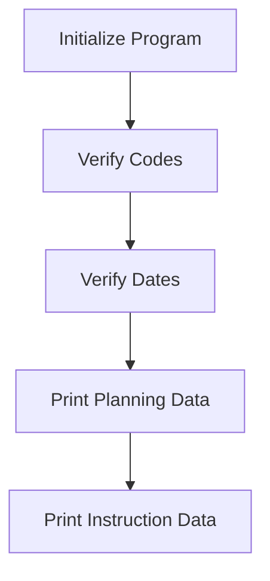

This document will cover the PRP101 Program Flow, which includes:

1. Initializing the program
2. Verifying codes and dates
3. Printing planning data
4. Printing instruction data.

Technical document: <SwmLink doc-title="PRP101 Program Flow">[PRP101 Program Flow](/.swm/prp101-program-flow.1yr9bcws.sw.md)</SwmLink>

# Initializing the program

The PRP101 program begins by initializing the system. This step sets up the necessary environment and prepares the system for the main operations. Initialization ensures that all required resources are available and that the system is in a ready state to process further actions.

# Verifying codes

The next step involves verifying the codes. This process checks the validity of the plan number and date. The system constructs a file path, reads the relevant data, and ensures that the month and day values are correct. If the codes are valid, the system proceeds to the next step.

# Verifying dates

After verifying the codes, the system verifies the dates. This involves calling an external routine to check the date and week number. If the week number is valid, the system proceeds to verify the day of the week and then moves on to printing the planning data.

# Printing planning data

Once the dates are verified, the system prints the planning data. This step involves checking if printing is enabled, opening the appropriate output, and performing various printing tasks such as headers, event data, and team data. This ensures that all necessary planning information is documented and available for review.

# Printing instruction data

The final step in the PRP101 program flow is printing the instruction data. This involves writing data to the output, processing records, and performing additional printing tasks such as observations and course data. This step ensures that all instructions are clearly documented and accessible.

&nbsp;

*This is an auto-generated document by Swimm AI 🌊 and has not yet been verified by a human*

<SwmMeta version="3.0.0" repo-id="Z2l0aHViJTNBJTNBa2VsbG8lM0ElM0Fzd2ltbWlv" repo-name="kello">Powered by [Swimm](/)</SwmMeta>
