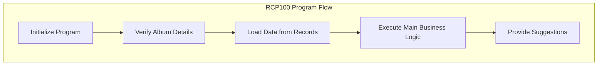

This document will cover the RCP100 Program Flow, which includes:

1. Initializing the program and setting up parameters
2. Verifying album details
3. Loading data from records
4. Executing the main business logic
5. Providing suggestions based on critical fields.

Technical document: <SwmLink doc-title="RCP100 Program Flow">[RCP100 Program Flow](/.swm/rcp100-program-flow.r9u93i6f.sw.md)</SwmLink>

# Initializing the program and setting up parameters

The RCP100 program begins by initializing the system and setting up necessary parameters. This step ensures that the environment is correctly configured and all required settings are in place before any further processing occurs. This initialization is crucial as it prepares the system to handle subsequent tasks efficiently and without errors.

# Verifying album details

In this step, the program verifies the details of the album to ensure that the data is correctly loaded and validated. This involves checking various fields such as album number, form number, and sequence. The program performs read operations and sets up necessary flags for further processing. This verification is essential to ensure data integrity and accuracy before moving on to the next steps.

# Loading data from records

Once the album details are verified, the program proceeds to load data from records into working storage. This step ensures that all relevant data fields are populated and ready for further processing. The data includes information such as movement dates, tax rates, visit records, and vendor details. Properly loading this data is critical for the accurate execution of the main business logic.

# Executing the main business logic

The core section of the RCP100 program is where the main business logic is executed. This involves evaluating various conditions and performing corresponding actions. For example, the program may centralize data, create list views, handle receipts, and manage other business-related tasks. This step is the heart of the program, where the primary operations that drive business processes are carried out.

# Providing suggestions based on critical fields

In the final step, the program provides suggestions based on the type of critical field being evaluated. Depending on the field, such as contract, album, product, model, or supplier, the program performs specific actions to generate relevant suggestions. These suggestions help users make informed decisions and improve the overall efficiency of business operations.

&nbsp;

*This is an auto-generated document by Swimm AI 🌊 and has not yet been verified by a human*

<SwmMeta version="3.0.0" repo-id="Z2l0aHViJTNBJTNBa2VsbG8lM0ElM0Fzd2ltbWlv" repo-name="kello">Powered by [Swimm](/)</SwmMeta>
