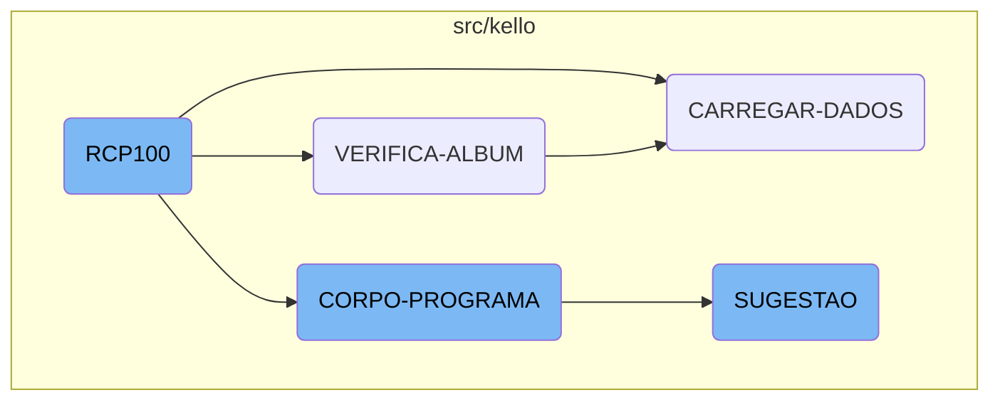

<SwmToken path="src/kello/rcp100prod.cbl" pos="3:6:6" line-data="       PROGRAM-ID. RCP100.">`RCP100`</SwmToken> is a crucial component of the Kello Imagens system. It initializes the program, sets up necessary parameters, and ensures that all required data is available before proceeding to the main processing sections. The flow involves verifying album details, loading data, executing the main business logic, and providing suggestions based on critical fields.

The flow starts with initializing the program and setting up parameters. It then verifies album details to ensure data is correctly loaded and validated. Next, it loads data from records into working storage, making sure all relevant fields are populated. The core section executes the main business logic, evaluating conditions and performing actions like centralizing data and handling receipts. Finally, it provides suggestions based on the type of critical field being evaluated.

# Flow drill down



<SwmSnippet path="/src/kello/rcp100prod.cbl" line="313">

---

## <SwmToken path="src/kello/rcp100prod.cbl" pos="3:6:6" line-data="       PROGRAM-ID. RCP100.">`RCP100`</SwmToken>

<SwmToken path="src/kello/rcp100prod.cbl" pos="3:6:6" line-data="       PROGRAM-ID. RCP100.">`RCP100`</SwmToken> initializes the program and sets up the necessary parameters for execution. It ensures that all required data is available before proceeding to the main processing sections.

```cobol
       MAIN-PROCESS SECTION.
           PERFORM INICIALIZA-PROGRAMA.
```

---

</SwmSnippet>

<SwmSnippet path="/src/kello/rcp100prod.cbl" line="1646">

---

## <SwmToken path="src/kello/rcp100prod.cbl" pos="1646:1:3" line-data="       VERIFICA-ALBUM SECTION.">`VERIFICA-ALBUM`</SwmToken>

<SwmToken path="src/kello/rcp100prod.cbl" pos="1646:1:3" line-data="       VERIFICA-ALBUM SECTION.">`VERIFICA-ALBUM`</SwmToken> checks the album details and ensures that the album data is correctly loaded and validated. It performs various read operations and sets up the necessary flags for further processing.

```cobol
       VERIFICA-ALBUM SECTION.
           CLOSE       WORK
           OPEN OUTPUT WORK
           CLOSE       WORK
           OPEN I-O    WORK

           MOVE ZEROS                      TO TOT-PARCELA
                                              GS-FLAG-CRITICA
           MOVE GS-NR-ALBUM                TO ALBUM-REC(1: 4)
           MOVE GS-NR-FORM                 TO ALBUM-REC(5: 4)
           MOVE GS-SEQ                     TO SEQ-REC
           READ RCD100 INVALID KEY
                MOVE GS-NR-ALBUM           TO NR-ALBUM-W
                MOVE GS-NR-FORM            TO NR-FORM-W
                MOVE GS-SEQ                TO SEQ-W
                MOVE GS-VENDEDOR           TO VENDEDOR-W
                PERFORM LIMPAR-DADOS
                MOVE NR-ALBUM-W            TO GS-NR-ALBUM
                                              ALBUM-REC(1: 4)
                MOVE NR-FORM-W             TO GS-NR-FORM
                                              ALBUM-REC(5: 4)
```

---

</SwmSnippet>

<SwmSnippet path="/src/kello/rcp100prod.cbl" line="1753">

---

## <SwmToken path="src/kello/rcp100prod.cbl" pos="1753:1:3" line-data="       CARREGAR-DADOS SECTION.">`CARREGAR-DADOS`</SwmToken>

<SwmToken path="src/kello/rcp100prod.cbl" pos="1753:1:3" line-data="       CARREGAR-DADOS SECTION.">`CARREGAR-DADOS`</SwmToken> loads the data from the records into the working storage. It ensures that all relevant data fields are populated and ready for further processing.

```cobol
       CARREGAR-DADOS SECTION.
           MOVE DATA-MOVTO-REC       TO DATA-INV.
           CALL "GRIDAT1" USING DATA-INV
           MOVE DATA-INV             TO GS-DATA-MOVTO
           MOVE TAXA-REC             TO GS-TAXA
           MOVE DATAVEN-REC          TO DATA-INV
           CALL "GRIDAT1" USING DATA-INV
           MOVE DATA-INV             TO GS-DATA-VENDA
           MOVE VISITA-REC           TO GS-VISITA
           MOVE CHAVE-ALBUM-REC      TO ALBUM-MTG
           READ MTD020 INVALID KEY
                MOVE ZEROS           TO VISITA-MTG
           END-READ
           MOVE VISITA-MTG           TO GS-COD-COMISS
           IF FOGO-MTG = 9
              MOVE 8 TO FOGO-MTG
           ELSE
              MOVE 1 TO FOGO-MTG
           END-IF
           MOVE VENDEDOR-REC         TO GS-VENDEDOR
                                        CODIGO-CG01
```

---

</SwmSnippet>

<SwmSnippet path="/src/kello/rcp100prod.cbl" line="582">

---

## <SwmToken path="src/kello/rcp100prod.cbl" pos="582:1:3" line-data="       CORPO-PROGRAMA SECTION.">`CORPO-PROGRAMA`</SwmToken>

<SwmToken path="src/kello/rcp100prod.cbl" pos="582:1:3" line-data="       CORPO-PROGRAMA SECTION.">`CORPO-PROGRAMA`</SwmToken> is the core section where the main business logic is executed. It evaluates various conditions and performs the corresponding actions, such as centralizing data, creating list views, and handling receipts.

```cobol
       CORPO-PROGRAMA SECTION.
           EVALUATE TRUE
               WHEN GS-CENTRALIZA-TRUE
                    PERFORM CENTRALIZAR
                    PERFORM CRIAR-LISTVIEW-PRODUTOS
                    PERFORM CRIAR-LISTVIEW-PAGTO
               WHEN GS-CONFERE-RECIBO-TRUE
                    PERFORM CONFERE-RECIBO
               WHEN GS-SAVE-FLG-TRUE
                    PERFORM GRAVA-RECIBO
                    PERFORM LIMPAR-DADOS
               WHEN GS-EXCLUI-FLG-TRUE
                    PERFORM EXCLUI
                    PERFORM LIMPAR-DADOS
               WHEN GS-INCLUI-CHEQUE-TRUE
                    PERFORM GRAVAR-CHEQUE-WORK
                    PERFORM MOSTRAR-COLUNAS-FAVOPAGTO
                    PERFORM MOSTRAR-FONTE-FAVOPAGTO
                    PERFORM ZEBRAR-ITENSPAGTO
               WHEN GS-ADICIONA-CHEQUE-TRUE
                    PERFORM GRAVAR-CHEQUE-WORK
```

---

</SwmSnippet>

<SwmSnippet path="/src/kello/mtp021novo.cbl" line="903">

---

## SUGESTAO

SUGESTAO provides suggestions based on the critical field being evaluated. It performs specific actions depending on the type of field, such as contract, album, product, model, or supplier.

```cobol
       SUGESTAO SECTION.
           EVALUATE GS-CAMPO-CRITICA
               WHEN "EF-CONTRATO"      PERFORM SUGESTAO-CONTRATO
               WHEN "EF-ALBUM"         PERFORM SUGESTAO-ALBUM
               WHEN "EF-PRODUTO"       PERFORM SUGESTAO-PRODUTO
               WHEN "EF-MODELO"        PERFORM SUGESTAO-PRODUTO
               WHEN "EF-FORNECEDOR"    PERFORM SUGESTAO-FORNECEDOR
           END-EVALUATE.
```

---

</SwmSnippet>

&nbsp;

*This is an auto-generated document by Swimm AI 🌊 and has not yet been verified by a human*

<SwmMeta version="3.0.0" repo-id="Z2l0aHViJTNBJTNBa2VsbG8lM0ElM0Fzd2ltbWlv" repo-name="kello"><sup>Powered by [Swimm](/)</sup></SwmMeta>
