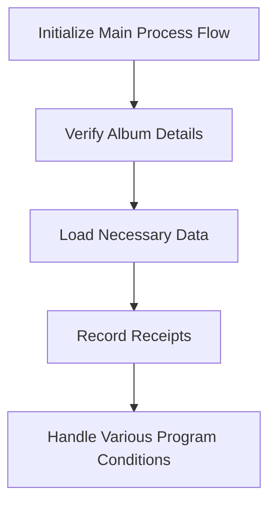

This document will cover the RCP100 Program Overview, which includes:

1. Initializing the main process flow
2. Verifying album details
3. Loading necessary data
4. Recording receipts
5. Handling various program conditions.

Technical document: <SwmLink doc-title="RCP100 Program Overview">[RCP100 Program Overview](/.swm/rcp100-program-overview.v58hhtzt.sw.md)</SwmLink>

# Initializing the Main Process Flow

The RCP100 program begins by initializing the main process flow. This step sets up the necessary environment and prepares the system for subsequent operations. It ensures that all required resources are available and ready for use.

# Verifying Album Details

In this step, the program verifies the details of the album. It checks if the album exists in the system and whether the user has the necessary permissions to access it. This is crucial to ensure that only authorized users can proceed with the operations related to the album.

# Loading Necessary Data

Once the album details are verified, the program loads the necessary data related to the album. This includes information such as the movement date, tax details, and vendor information. The data is essential for processing the album and ensuring that all relevant details are available for subsequent steps.

# Recording Receipts

In this step, the program records the receipt data into the database. This involves writing the receipt information to ensure data integrity and handling any errors that may occur during the write operation. Accurate recording of receipts is vital for maintaining the financial records and ensuring that all transactions are properly documented.

# Handling Various Program Conditions

Throughout the process, the program evaluates various conditions and performs corresponding actions. This includes tasks such as centralizing data, creating list views, saving receipts, and providing suggestions based on different criteria. Each condition is checked, and specific actions are performed to ensure that the program operates smoothly and efficiently.

&nbsp;

*This is an auto-generated document by Swimm AI 🌊 and has not yet been verified by a human*

<SwmMeta version="3.0.0" repo-id="Z2l0aHViJTNBJTNBa2VsbG8lM0ElM0Fzd2ltbWlv" repo-name="kello">Powered by [Swimm](/)</SwmMeta>
